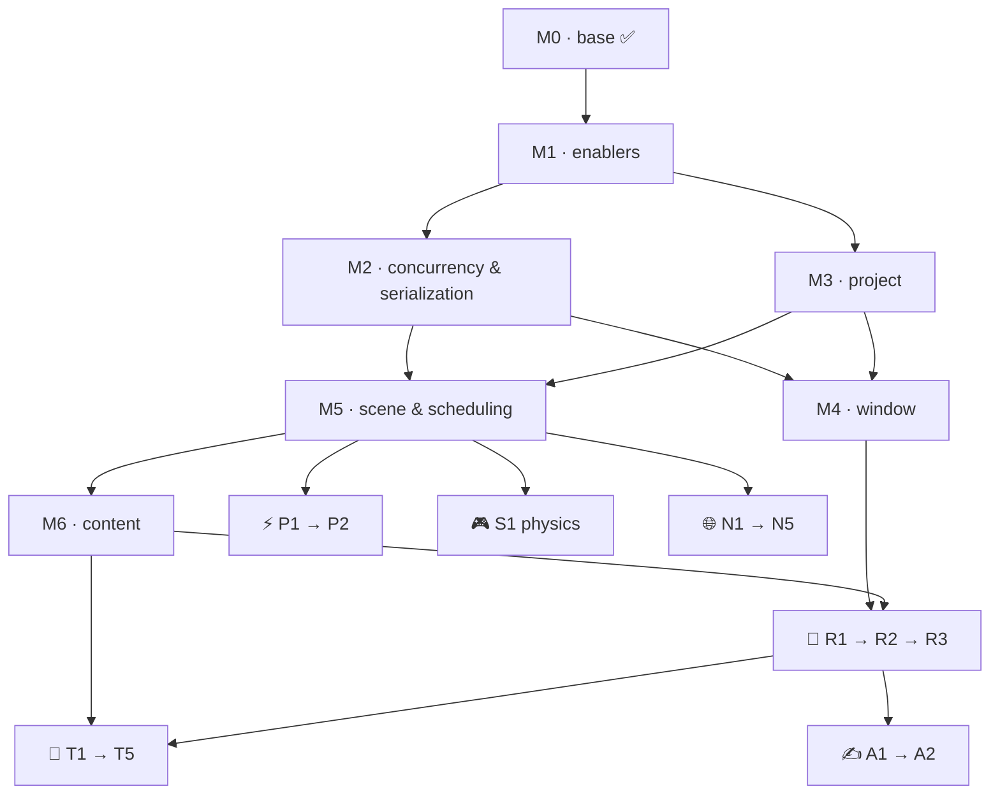

# 🗺️ Roadmap

**The order, not the dates.** Sequence is knowable; timing is not. [[Sprint Board|Sprints]]
execute. Reviewed at each sprint-boundary planning session.

Two halves, and they work differently:

- **The chain (M0–M6)** — ordered by **irreversibility**: what later code is written *against*
  goes first, even where a later rung could technically be built sooner. This order is a
  commitment.
- **The lanes (after M6)** — order **within** a lane is real; order **across** lanes is a
  sprint-planning call, not a roadmap one. Lanes are `P` perf · `T` tools · `R` render ·
  `N` net · `A` authoring · `S` sim · `C` content.

Cadence — sprint length, week shape, ceremony anchor → [[Dashboard]] § Rhythm. Not repeated here.

## Shape

## The chain

| #      | Rung                   | Contents                                                                                                                                  | Gate                                                                                              |
| ------ | ---------------------- | ----------------------------------------------------------------------------------------------------------------------------------------- | ------------------------------------------------------------------------------------------------- |
| **M0** | `base`                 | Logger · Assert · Clock · headless fixed-timestep loop                                                                                    | [[ADR-011 — Diagnostics (Logger & Assert)]] 🟢                                                    |
| **M1** | enablers               | math · **file access** `IFileAccess` (F30) · Events (F28) · **Profiler hooks + memory tracking** · StringId/interning · deterministic RNG · crash handler | Profiler ADR · Events redesign                                                                    |
| **M2** | concurrency + serialization | thread topology · **GL context ownership** · pool **interface** + a minimal pool · **binary serialization + ADR-005's trait seam**                                                          | **threading ADR** — gated on M1's Profiler · **serialization ADR**                                                        |
| **M3** | project ‖ M2           | root + `project.toml` (toml++) · path/mount resolution · **`IFileWriteAccess`** — M1 ships the read half only · shader + asset dirs · **`projects/dev/` testbed**                                | none: toml, not the binary format                                                                 |
| **M4** | window                 | GLFW window · GL 4.5 context **on its owning thread** · raw input · clear + triangle                                                      | M2's context-ownership call                                                                       |
| **M5** | Scene & scheduling     | SlotMap/HandleMap · `Scene`/ECS + `Schedule` + executor · FrameAllocator + command buffer · transform hierarchy · input action mapping    | **task-graph ADR** — the System interface ([[ADR-006 — v2 core architecture & module layout]] §5) |
| **M6** | content                | Resources (CPU/UUID) · project↔scene binding                                                | **none** — its seam closed at M2. ⚠️ the only gateless rung; revisit whether Resources owes one |

## The lanes

Listed in a suggested default order. The only hard edges are shown in *needs*.

| ID | Rung | Contents | Needs / gate |
|---|------|----------|--------------|
| **P1** | parallel executor on | workers > 1, levels running concurrently, **TSan leg green** | M5 · M2 |
| **T1** | editor — panels | dock · hierarchy · inspector · console/cvars · Profiler panel · scene save | M6 — ImGui only, no engine renderer |
| **T2** | export slice | editor saves → `runtime` loads the project and runs it, **no importers linked** | T1 · M6 |
| **R1** | renderer v0 | device seam (F22) · mesh + shader + material · camera · frustum culling · one forward pass | M6 · **renderer ADR** |
| **T3** | editor — viewport | 3D scene view · picking (F21) · gizmos | R1 |
| **N1** | transport | ENet/GNS/yojimbo pick · connect/disconnect · reliable + unreliable channels | **netcode transport ADR** |
| **A1** | scripting SDK | user Systems + Scripts over `te_sdk` · game-DLL load + hot-reload | M5 · [[ADR-010 — User authoring model (Systems & Scripts)]] + scripting ADR |
| **A2** | game UI | 2D pass · font/text · layout · input routing · script-drivable | R1 · **own ADR** |
| **S1** | physics | Jolt — authoritative, fixed phase | M5 |
| **N2** | replication slice | 2 processes, 1 replicated `Transform` | N1 · M5 |
| **R2** | render graph | passes · shadows · depth prepass · post · GPU zones per pass | R1 |
| **T4** | import + bake | assimp/stb in the editor · baked binary out | T1 · M6 |
| **N3** | snapshot/delta replication | real encoder · dirty sets · per-component byte counters | N2 |
| **C1** | animation & skinning | skeleton/clip assets · sampling System · GPU skinning | T4 · R1 |
| **P2** | job system — tuning | work-stealing · Jolt pool integration (F15) | P1 + measurement |
| **N4** | prediction + reconciliation | client prediction · rollback · server correction | N3 |
| **R3** | signature rendering | scattering · volumetric fog · god rays · auto-exposure + bloom | R2 |
| **N5** | interest management | relevance sets over R2's culling | N3 · R2 |
| **T5** | packaging | distributable build · launcher args · no dev deps | T2 · T4 |
| **C2** | audio | miniaudio | — |

**A rung closes when its gate is Accepted and its unlock is demonstrable** — not when every
listed item is polished. Rungs overlap; the chain order is the commitment, the lane interleave
is not.

## Guardrails

Three places where the split costs nothing only if a rule holds.

- **R1 goes behind ADR-005's device seam (F22)** — or R2 is a rewrite instead of a wrapper.
  That rule is the whole reason splitting the renderer is safe.
- **A2 is not ImGui.** ImGui is an editor dep ([[ADR-006 — v2 core architecture & module
  layout]] §1); game UI is shipped, skinnable and script-driven, needs its own ADR
  (retained vs immediate, layout, styling, input routing), and drags in a font rasterizer —
  `stb` would go from editor-only to shared.
- **N1 is independent of everything** — it needs sockets, nothing more. The cheapest lane head
  to start when a sprint has odd capacity left over.

### M2 — what the concurrency ADR must settle

> M2 carries a **second, independent** ADR since 2026-08-02 — serialization, which shares the
> rung but not the subject. Why it sits here: § *Why this shape*. The two are unrelated and
> can be written in either order.

OpenGL is why this is early, not the job system. GLFW pins **window creation and
`glfwPollEvents` to the main thread**, while a GL context is current on **exactly one thread at
a time** — so if a render thread exists it owns the context and the main thread never issues a
GL call. Input polling and drawing therefore sit on different threads from the first line of
M4. Retrofitting that across a written renderer is a rewrite, which is why the decision
outranks its own implementation.

The ADR settles: **thread topology** (main / sim / render / workers) · **who owns the GL
context** and how work reaches it · **pool shape** · how [[Task Graph — Execution Flow]]'s
levels map onto it. It ships a **minimal pool** so M5's executor is written against the real
interface; **P1 turns real workers on** and **P2** tunes them.

### M3 — the dev testbed

`projects/dev/` at repo root, beside `apps/` — **data, not a CMake target**. The project the
`runtime` (and later the `editor`) loads by default, and the home for dev shaders, test scenes
and throwaway assets. From M3 on, "does this work" is answered by running the testbed rather
than by a throwaway `main.cpp`.

**Keep the M3 manifest minimal** — root, name, shader dir, asset dirs. Scene binding and the
asset registry are M6 work; writing the full schema at M3 designs it against a `Scene` and a
resource model that do not exist yet, which is the mistake M3 exists to avoid.

## Deliberately absent

Recorded so they read as decisions, not oversights: particles · terrain · navmesh/AI ·
LOD & streaming · save games · localization.

## Dated horizon

Only the current and next sprint carry dates. Everything past that is the ladder, undated.

| Dates | Sprint | Rung |
|-------|--------|------|
| Jul 25 – Jul 31 | [[2026-08 Sprint 02 — Base Foundation]] | **M0 ✅** — goal met Jul 30; sprint **closed 4 weeks early** |
| Aug 1 – Aug 28 | [[2026-08 Sprint 03 — M1 Enablers]] | **M1** — both gates (Profiler ADR · Events redesign) + math + **file access**. RNG · crash handler · memory tracking **carry** |
| Aug 29 – Sep 25 | Sprint 04 — planned on the Aug 29–30 boundary | **M2** — **two** ADRs now (threading, unblocked by M1's Profiler · **serialization**) ‖ **M3**, plus M1's carried items. ⚠️ **Scope call at the boundary**: Sprint 03 fit two ADRs *and* three stories, but M3 is a third lane — one of the three may have to wait |

## Quarters

- **2026 Q3 (Jul–Sep)** — *Foundation & Direction* → [[2026-Q3]]
- **Q4 and beyond** — a theme is written **at the boundary planning session that opens it**,
  never earlier. A quarter gets a direction, not a feature list.

## Why this shape — 2026-07-31

- **Horizontal build order, not the C2 vertical slice.** Sprint 01's retro re-sequenced C2
  into Sprint 03; that is **reversed here** — the engine is built module by module instead.
  [[Dashboard]] and [[2026-Q3]] still say C2 (→ S2-P3).
- **The chain is ordered by irreversibility.** Every M-rung is a decision later code is written
  *against*: threading and the serialization seam (M2), paths (M3), the System interface
  (M5). Each is cheap now and a sweep later. Past M6 that stops being true, which is why the
  tail is lanes and not more numbers.
- **Serialization moved M6 → M2 — 2026-08-02.** It was at M6 by **association with
  *content*, not by dependency**: the serializer needs `base` and a trait/registration seam,
  not a `Scene`, a window or a resource cache. Nothing upstream of M6 was holding it there.
  Meanwhile it fails the chain's own irreversibility test the hardest — ADR-005 reserved the
  trait seam and already calls binary serialization *"on the critical path"*; ADR-007 §7
  makes **serializable** one of the three facts every component registers. So at M6 the
  ordering was inverted: **M5 declares every component type and M6 every resource against a
  seam that does not exist yet**, then both get swept when it does — plus T2/T4 (bake +
  export) and N3's snapshot encoder, which share the format. Moving it costs nothing now
  and removes the largest remaining retrofit. **M6 keeps Resources + scene binding and is
  left gateless** — the one rung without a gate, which is its own question for a planning
  session.
- **Concurrency decided at M2, run at P1, tuned at P2.** The GL context-ownership question
  cannot wait for the window. A pool with one worker never *runs* concurrently, so races and
  hidden global state stay invisible until workers are turned on — cheap to find across three
  systems, expensive across thirty, and `linux-tsan` is already a CI leg. Only *tuning* waits
  for measurement.
- **Editor panels (T1) before the renderer (R1).** ImGui draws through its own GL backend, so
  hierarchy + inspector + console need no engine renderer — and being able to *see* the
  `Scene` makes everything after it cheaper to debug. Only the 3D viewport needs R1, so it
  splits out as T3.
- **Thin slices ahead of full systems, three times.** T2 proves the editor→runtime bake
  boundary, N2 proves ADR-007, R1 proves the device seam — each before the full version
  (T4/T5, N3–N5, R2/R3) is built on an untested assumption. ADR-006 § Context is explicit that
  replication cannot be retrofitted; the same logic applies to the other two.
- **`Scene`/ECS at M5, not after Resources.** Components hold resource handles and the renderer
  *is* a System (ADR-006 §5), so building Resources first designs its handle/lifetime model
  against an imaginary ECS, then wires it twice.
- **Project at M3, ahead of the window.** The manifest is toml++ (already a `core` dep), *not*
  the binary asset format, so nothing about it waits on the serialization ADR. Early it buys a
  known home for shaders before the first GL work, and a standing testbed.
- **cvars + dev console left M1 for the T1 editor lane — 2026-08-02.** T1 already carries
  `console/cvars`, and cvars without a console panel to drive them is a config parser with no
  consumer. Recorded because the row was dropped out of M1's contents inside a table reflow,
  where it read as formatting rather than a decision.
- **Profiler hooks at M1, panel at T1.** A system born with zones is free; adding zones to
  twenty systems later is a sweep. **Settled 2026-08-02** in
  [[ADR-013 — Profiler (Tracy-backed instrumentation)]]: hooks at M1 against the Tracy
  desktop app; the in-editor panel is a T1 decision with three routes still open (§3).
- **Reflection is not a gap.** [[ADR-005 — v2 tech stack & toolchain]] already decided C++20
  with **no reflection** and a hand-rolled trait seam, with a re-litigation trigger. The seam
  belongs to M2's serialization ADR.
- **Q4/Q1 renderer features kept, demoted.** Scattering, volumetrics and god rays were written
  as dated quarter goals before a v2 renderer ADR existed; they survive as **R3**, behind the
  render graph that has to carry them.
