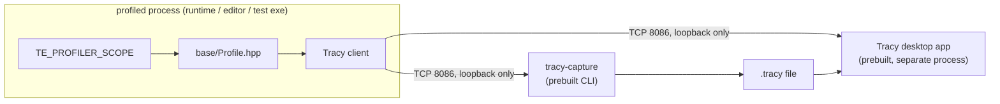

# ADR-013 — Profiler (Tracy-backed instrumentation)

- **Status:** Accepted
- **Date:** 2026-08 (Accepted 2026-08-02)
- **Deciders:** Miguel (Lead Engineer), with AI as technical lead
- **Related:** [[ADR-005 — v2 tech stack & toolchain]] (dep policy) ·
  [[ADR-006 — v2 core architecture & module layout]] §3 §5 ·
  [[ADR-008 — v2 build & testing baseline]] §3 §4 §5 §7 §9 ·
  [[ADR-011 — Diagnostics (Logger & Assert)]] §1 §2 §8 (the façade precedent — and where
  this one departs from it) · living *how*: [[Profiler — Design]]
- **Task:** S3-D1 ([[2026-08 Sprint 03 — M1 Enablers]]) — **gates Story D and M2's
  threading ADR.**
- **Amended 2026-08-20 — decision:** §6's compiled-in bar is the **absolute per-frame
  cost**, was **"< 5% frame-time delta"**. The ratio is not evaluable at M1: measured on the
  headless loop the delta is **+669%**, because the baseline is a 0.02 µs empty loop, so the
  figure describes the loop rather than the profiler. The checkable form until M2/R1 gives
  the frame real content is **+0.1377 µs, or 0.0008% of a 16.6 ms frame**
  ([[B3 — Build & Testing Notes]] § *Overhead*). The budget's purpose, the zero-when-OFF
  fact, the no-`ZoneTransient` rule and "not a CI gate" are all unchanged. Found at S3-T6.
- **Supersedes:** **ADR-006 §5's `Profiler` classification row only** (`:233` — helper
  *service*, "owned + injected via `EngineContext`"). See §9. Every other clause of §5 —
  including "profiler wraps the executor" and the F19 fix — **remains in force** and is
  restated here unchanged. ADR-006's body is not edited.

## Context

M1's job is the vocabulary later modules are written *against*, and the Profiler is the
half of it that cannot be retrofitted cheaply: a system born with zones is free, adding
zones to twenty written systems is a sweep ([[Roadmap]] § *Why this shape*). It is also
CLAUDE.md's own precondition — "measure before optimizing" has no instrument until this
exists, and **M2's threading ADR is explicitly gated on it** ([[Roadmap]] M2), because
landing a work-stealing pool without a profiler is optimizing blind.

[[Profiler — Design]] arrived at this session with a **decided direction** (thin `base`
façade → Tracy; editor embeds `Worker`; snapshot → desktop app; GPU zones per render-graph
pass; memory tracking routed through it) and **five parked questions**. Three of the
direction's rows do not survive contact with Tracy's actual source. That is what this ADR
is for.

**Grounding — checked against Tracy `master` and this tree, not assumed:**

- **`ZoneScoped` emits a `static constexpr tracy::SourceLocationData` at the call site**
  (`public/tracy/Tracy.hpp`) and hands the `ScopedZone` a pointer to it. The ~2.25 ns/zone
  figure is a property of *that*: no strings move at runtime. `ZoneTransientN` is the
  escape hatch for runtime names and pays `strlen` + a string copy per zone — **which is
  F19's exact failure mode**. So "third-party hidden behind a non-template function in one
  `.cpp`" — ADR-011 §1's shape — **is not reproducible here** without either taking the
  transient path or asserting layout-compatibility against a third-party struct.
- **Embedding Tracy's `Worker` is three new dependencies, not one.** `TracyServer` links
  **`TracyCapstone` (a disassembly engine), `libzstd` and `PPQSort` PUBLIC**
  (`cmake/server.cmake`), all vendored inside Tracy's tree (`cmake/vendor.cmake`) — built
  on both CI legs, under every sanitizer, for a panel with no editor to live in.
- **Tracy already ships the headless consumer.** `tracy-capture` and
  `tracy-capture-daemon` (`capture/CMakeLists.txt`) connect to a client and write a
  `.tracy` file. Neither is something we build or link.
- **Tracy carries its own clock.** The client timestamps with `rdtsc` on x86-64
  (`TRACY_TIMER_FALLBACK` swaps in QPC/`steady_clock`), so it never reads `Clock`.
- **The wire protocol is a compiled-in integer** — `constexpr uint32_t ProtocolVersion`
  (`public/common/TracyProtocol.hpp`; **82** on `master`), bumped across releases and
  compiled into *both* sides. A version pin is a lock, not a dependency bump.
- **Tracy's client headers pull no OS header** — the ADR-005 constraint on `base`, checked
  rather than assumed. `TracyProfiler.hpp` includes only C/C++ standard headers plus
  `<intrin.h>` on Windows; `TracyCallstack.hpp` declares an `extern "C"`
  `___tracy_RtlWalkFrameChain()` **instead of** including `windows.h`/`dbghelp.h`;
  `TracyMutex.hpp` is `std::shared_mutex`, not `SRWLOCK`; `TracySysTime.hpp` and
  `TracyKCore.hpp` are `<stdint.h>` only (and `KCore` is Linux-only). Tracy keeps its OS
  calls in its `.cpp` files — the same discipline ADR-006 §3 imposes on us. **Five headers
  checked, not the whole transitive set** — see *Consequences*.
- **GPU zones need GL at the call site.** `public/tracy/TracyOpenGL.hpp` calls
  `glGenQueries`/`glQueryCounter`/`glGetInteger64v` directly and wants
  `GL_ARB_timer_query`. It cannot live in `base`, which has no GL.
- **The client is one CMake target, `Tracy::TracyClient`**, with `TRACY_ENABLE`,
  `TRACY_ON_DEMAND`, `TRACY_ONLY_LOCALHOST`, `TRACY_NO_BROADCAST` as options (root
  `CMakeLists.txt`) — a normal ADR-008 §4 case-1 fetched dep.
- Our side: `engine/base/CMakeLists.txt:1-4` is the module declaration this extends;
  `cmake/deps.cmake:115-120` is the precedent for an **option-guarded** fetch (Catch2 behind
  `TE_BUILD_TESTS`); `engine/app/src/App.cpp:27-49` is the loop that gets the frame mark.

## Decision

### 1. Backend — Tracy, fetched and pinned; no in-house profiler

`Tracy::TracyClient` enters `cmake/deps.cmake` as a normal case-1 dep, `GIT_TAG` pinned to
**`v0.13.1`** (BSD-3). Writing a frame profiler is a project, not a task, and Tracy is
best-in-class for exactly the shape this engine needs (frame marks, nested zones, lock
contention, memory plots, GPU timestamps).

**The pin is a protocol lock, not a version preference.** Client and consumer compile the
same `ProtocolVersion` in; a mismatched pair does not connect. Consequence with teeth:
**the pinned tag and the Tracy desktop binary in use must be the same release** — bumping
`deps.cmake` means re-downloading the app, and the bump is a deliberate act, not
housekeeping. Record the version in [[B3 — Build & Testing Notes]] where the toolchain
versions already live.

### 2. The seam is the **macro set**, not a function boundary

`engine/base/include/TechEngine/base/Profile.hpp` defines our names —
`TE_PROFILER_SCOPE(name)`, `TE_PROFILER_FUNCTION()`, `TE_PROFILER_FRAME()`,
`TE_PROFILER_ALLOC(p, n)`, `TE_PROFILER_FREE(p)` — and nothing else.

- **When `TE_PROFILE_ENABLED`**: the header includes `<tracy/Tracy.hpp>` and each macro
  forwards to its Tracy counterpart (`ZoneScopedN`, `ZoneScoped`, `FrameMark`,
  `TracyAlloc`, `TracyFree`).
- **Otherwise**: the macros expand to nothing and the header includes **no third-party
  header at all** — the ADR-011 §1 property, preserved in every configuration that ships.
- `Tracy::TracyClient` is **PUBLIC** on `TechEngineBase`, and **only linked when the option
  is on** (§4). ADR-008 §8's visibility rule is satisfied, not bent: it *is* in the public
  header, so it *is* PUBLIC.

**Why not ADR-011 §1's shape.** That seam works for the Logger because logging is a runtime
call with type-erased arguments — the format work was always going to happen at runtime, so
moving it behind a non-template function costs nothing. A zone is the opposite: its entire
cost model *is* the static `SourceLocationData` the macro emits at the call site. Hiding
Tracy behind `profilerBeginZone(...)` buys back the zero-third-party header at a price of
either (a) `ZoneTransient` — a `strlen` and a string copy per zone, on a per-frame path,
**re-committing F19**, or (b) declaring a layout-compatible clone of
`tracy::SourceLocationData` in our header and `reinterpret_cast`ing — a silent-corruption
tripwire on every Tracy bump, guarded by `static_assert`s that can check sizes and offsets
but not lifetime assumptions. Both are worse than the thing they buy.

**What the macro seam still buys.** Every call site in the engine spells *our* name, so
replacing Tracy is a one-header edit and zero call-site edits — which is the swappability
that actually matters. What is given up is narrower than it looks: a third-party header in
`base`'s public surface **in profiled builds only**.

**`te_sdk` is untouched.** It is an `INTERFACE` target over `sdk/include/` alone and does
not link `TechEngineBase`, so a PUBLIC Tracy edge cannot redden `TechEngineSDKSmoke`
(ADR-008 §7). The day a profiling macro lands in `sdk/include/` it will — same gate,
same shape as ADR-011 §10, and that is the gate working.

### 3. Topology — in-process client, out-of-process consumer. **No `TracyServer` in our build.**

The Tracy client lives in whichever process runs the sim (`runtime`, `editor`, or a test
exe). The consumer is the **prebuilt Tracy desktop application**, connecting over loopback
to the running process, or `tracy-capture` writing a `.tracy` file for later.

- **This answers [[Profiler — Design]]'s *in-proc vs separate runtime process*** — and
  dissolves it. The client is always in-proc with the code being measured; the consumer is
  always another process. Whether the editor eventually hosts the sim in-proc or out is
  now an **M2/T1 question the profiler does not constrain**, which is the point.
- **`Worker`-in-the-editor is deferred to T1, not rejected.** [[Roadmap]] already places
  the profiler panel at T1; taking `TracyServer` — and Capstone, zstd and PPQSort with it —
  at M1 pays three pinned deps and their CI build time for a panel with no editor. When T1
  arrives, the choice is still open, and it is a **third** option that this ADR keeps
  cheap: a small native panel fed by *our own* ring of frame times, with Tracy remaining the
  deep-dive path. The design note's "no Tracy ImGui — context clash" reasoning stands and
  is untouched; it is an argument about embedding Tracy's *UI*, which a separate process
  makes moot.

### 4. Enablement — a build option, default **OFF**, never a shipping runtime flag

| Knob                        | Value                              | Effect                                                                                            |
| --------------------------- | ---------------------------------- | ------------------------------------------------------------------------------------------------- |
| `TE_PROFILE` (CMake option) | **OFF** by default                 | ON ⇒ fetch + link `Tracy::TracyClient`, define `TRACY_ENABLE` and `TE_PROFILE_ENABLED`            |
| `TRACY_ON_DEMAND`           | ON                                 | no data collected, no memory held, until a consumer connects                                      |
| `TRACY_ONLY_LOCALHOST`      | ON                                 | loopback connections only — never the LAN                                                         |
| `TRACY_NO_BROADCAST`        | ON                                 | no UDP presence announcement                                                                      |
| **Presets**                 | `windows-profile`, `linux-profile` | RelWithDebInfo + `TE_PROFILE=ON`; the profiled build is a **preset**, so local == CI (ADR-008 §3) |

**A shipping build cannot ship the listening socket, because it never compiles the client.**
That is the whole reason this is a build option rather than a runtime toggle: a runtime flag
still links the client, still opens port 8086 the moment someone flips it, and reduces a
shipped-attack-surface question to trust in a config value. `TRACY_ON_DEMAND` and
`TRACY_ONLY_LOCALHOST` are defence in depth for *dev* builds, not the primary control.

**Sanitizer legs stay `TE_PROFILE=OFF`.** Tracy's client is built on a lock-free concurrent
queue; putting it under TSan means owning suppressions for third-party internals we did not
write, and the sanitizer legs are already the largest line in a CI budget that is a standing
watch item (ADR-008 §9). Profiling is a thing you *do*, deliberately, on a profile preset —
not a thing every CI leg carries.

### 5. Clock — the question is **dissolved**, not answered

[[Clock — Design]] parked "is `steady_clock` profiler-grade, or is a raw `platform` timer
needed?" for this ADR. The answer is that **the profiler does not use our `Clock` at all** —
Tracy timestamps with `rdtsc` and owns its own calibration. `Clock` is unchanged: no
`platform` seam, no raw timer, no work.

The residual question was never really the profiler's. If `steady_clock` resolution ever
proves too coarse, it will show up in **frame pacing** — which is already a [[Backlog]] →
`app` item with its own Windows-15.6 ms evidence on [[Game Loop — Frame Flow]]. The profiler
is now the instrument that measures *that*, which is the correct relationship between the
two and the reverse of how the question was parked.

### 6. Overhead budget — one number that is checkable, one rule that is enforceable

- **Compiled out: exactly zero.** Not "negligible" — the macros expand to nothing, no header
  is included, no symbol is emitted. The check is a fact, not a measurement: a
  `TE_PROFILE=OFF` binary contains no Tracy symbol.
- **Compiled in: < 5% frame-time delta**, measured on the headless loop,
  `windows-release` + `TE_PROFILE=ON` against the same build with it OFF, at M1's zone
  count. Tracy's own ~2.25 ns/zone puts 1000 zones/frame at ~2.25 µs — ~0.13% of a 16.6 ms
  frame. **The budget is deliberately loose because it is not there to police Tracy; it is
  there to catch us** — a zone inside an inner loop, or a runtime-named zone on a per-frame
  path.
> **Amended 2026-08-20:** the bar above is the **absolute** per-frame cost, not the ratio.
> At M1 the measured delta is **+0.1377 µs (0.0008% of a 16.6 ms frame)**; expressed as a
> ratio against a 0.02 µs empty loop the same measurement reads **+669%**, which measures
> the loop. Revisit the ratio form once M2/R1 give the frame real content. See the header
> entry and [[B3 — Build & Testing Notes]] § *Overhead*.

- **The rule with teeth: no `ZoneTransient` / runtime-named zones on any per-frame path.**
  Zone names are string literals. This is F19 restated as a reviewable invariant, and it is
  the thing to reject in review.
- The measurement is **not** a CI gate. It is run when the zone count materially changes
  (each of Story D's cards, and R1's GPU pass) and the number recorded in
  [[B3 — Build & Testing Notes]].

### 7. Memory tracking rides the profiler — and lands as a real card

`TE_PROFILER_ALLOC/FREE` forward to `TracyAlloc`/`TracyFree`, and the engine gets a memory
plot in the same panel as its zones. No second surface, no second tool.

- **The instrumented surface at M1 is a global `operator new` / `operator delete`
  replacement**, which needs no allocator of ours to exist and covers every allocation the
  engine makes today. Custom allocators (the Pool primitive, [[Backlog]] → `base`) call the
  same macro pair when they arrive.
- **The replacement lives in the composition root's TU (`app`), never in a `base` static-lib
  TU.** Same mechanism ADR-011 §2 named for channel registration: everything is a static lib
  (`cmake/techengine_module.cmake:38`), so a TU whose only purpose is a definition is
  stripped unless something else in it is referenced — and a *silently stripped*
  `operator new` replacement is a memory profile that is quietly, partially wrong.
- **Deps that expose an allocator hook are fully measurable, by choice rather than by
  accident** — and most of ours do. **Jolt** declares `Allocate` / `Free` /
  `AlignedAllocate` / `AlignedFree` / `Reallocate` as assignable function pointers
  (`Jolt/Core/Memory.h`, v5.2.0), and `JPH_OVERRIDE_NEW_DELETE` routes its *classes'*
  `new`/`delete` through the same ones — so Jolt is not a `malloc` blind spot, it is a seam.
  **miniaudio** takes `ma_allocation_callbacks`; **GLFW 3.4** takes `glfwInitAllocator`.
  Point each at `TE_PROFILER_ALLOC/FREE` and that memory arrives **named**, attributable to
  the library instead of merged into one process total. This is the better half of the
  design, and it is the half that **survives the exit below** — it does not depend on the
  global replacement at all.
- **What is genuinely out of reach is a `new` inside a hook-less library** (spdlog, toml++).
  It is caught today only because the global replacement is process-wide, and it goes dark
  the moment that replacement does. Nothing to do about it and nothing worth doing — it is
  not our memory and not a number we can act on.
- **The one real failure is an asymmetric `delete`** — `operator delete` on a pointer that
  never went through our `operator new`. Tracy treats that as a client error and **drops the
  connection**, so the symptom is a dead profiling session, not a wrong number. Two sources
  are documented and both are ours eventually: **GPU drivers** (from M4 on) and a **module
  boundary that does not share the replacement** — which is precisely the script-DLL seam
  ADR-008 §3 already builds for. `TRACY_ON_DEMAND` does not help; the mismatch accumulates
  client-side regardless of when a consumer connects.
- **Exit, if it bites:** drop the global replacement. What remains is **our own allocators
  plus every hooked dep** — which is memory we chose to measure, labelled by source. The
  loss is hook-less libraries' `new` and nothing else.
- This closes [[2026-08 Sprint 03 — M1 Enablers]]'s scope call — memory tracking is a Story
  D card, sized off this ADR, **not** a carried M1 item.

### 8. GPU zones — the seam is named now, the code lands with the renderer

GPU zones use `TracyGpuContext` / `TracyGpuZone` / `TracyGpuCollect`, one pair per
**render-graph pass** — the graph's boundaries are already declared, so the seam is free.

**They live in `client`, not `base`.** `TracyOpenGL.hpp` calls GL entry points directly and
requires `GL_ARB_timer_query`; `base` has no GL and never will (ADR-006 §1). So `client`
gets its own `TE_PROFILER_GPU_*` macros behind the same `TE_PROFILE_ENABLED`, and they land
with the render graph (R1/R2), **not at M1**. This is the one place [[Profiler — Design]]'s
plan needed splitting rather than deciding: CPU zones are `base` vocabulary, GPU zones are
`client` machinery.

### 9. Classification — the Profiler is a **utility**, not a service (supersedes ADR-006 §5's row)

ADR-006 §5 (`:233`) classifies the Profiler as a helper **service** — "stateful, lifecycle
… owned + **injected** via `EngineContext`, never globally located". A macro-driven,
process-global Tracy client is a **utility**: global macros, no injection, no
`EngineContext` field. That row is reversed here; **only** that row.

The grounds are ADR-011 §8's, and they hold identically: profiler state **stores no systems
and no services**, **vends no pointers** to a subsystem, and **hides no dependency edge**
(every module already links `base` unconditionally). It is not the F5 service locator §4
exists to kill. The rest of §5 stands, including the amended "profiler wraps the executor" —
zones are RAII scopes at call sites, which is F19's fix and is unaffected by whether the
profiler is injected.

**Guardrail, same as ADR-011 §8:** if profiler state ever grows a field that is a service or
a system, this argument is void.

## Consequences

**Positive**

- **F19 is closed by construction** — literal zone names, static source-location data, no
  `shared_ptr` registry, no per-frame string work, and the transient path banned by §6.
- **M2's threading ADR is unblocked**, which was this card's reason to exist: the pool ADR
  can be written against an instrument that exists.
- **Zero new deps for the consumer side.** The Tracy desktop app and `tracy-capture` are
  downloads, not build inputs. `deps.cmake` gains exactly one entry.
- **Nothing ships the socket** — not by policy, by compilation (§4).
- **The editor panel question stays fully open** and got *cheaper*, not more expensive:
  three routes remain (embed `Worker`, our own ring-fed panel, or nothing beyond the desktop
  app), and none is foreclosed at T1.
- **`Clock` needs no work** and `platform` gains no timer (§5).

**Negative / open**

- **A third-party header is in `base`'s public surface in profiled builds** — a real
  departure from ADR-011 §1's property, argued in §2 rather than avoided. Shipping and
  default builds are unaffected.
- **The ADR-005 no-OS-headers question is checked and clean, not closed by proof** — see
  *Context*. Five headers were read; the rest of the transitive set was not, so the residual
  is "no known offender", which the first `TE_PROFILE=ON` build settles for good.
- **A second build configuration to keep green.** `TE_PROFILE=ON` is a code path CI does not
  compile by default, so it can rot silently. Cheapest antidote, deliberately *not* taken
  now: one profile leg on the nightly schedule ADR-008 §9 already contemplates for
  sanitizers. Revisit when the first rot happens.
- **The version pin is a two-sided lock.** Bumping Tracy without re-downloading the desktop
  app produces a connection that silently refuses. This will bite at least once.
- **Profiling is opt-in, so it will be forgotten.** Nobody profiles a build they have to
  reconfigure for. The mitigation is the preset (§4) — one command, not a cache edit.
- **The global `operator new` replacement has a shelf life** (§7). It is the right M1 move —
  no allocator of ours exists yet — but the first GPU driver in the process is likely to end
  it. The fallback is already named and is not a big step down: our own allocators plus every
  hooked dep. Treat the whole-process plot as a temporary luxury, not the design.
- **Tracy stores captures in RAM in the consumer process.** A long session on a busy frame
  is gigabytes. Not our problem at M1 — named so it is not a surprise at R2.

## Alternatives considered

**On the backend (§1)**

- **Write our own** — rejected: a project, not a task. The v1 lesson (F19) is that a
  hand-rolled profiler bolted on under time pressure is what produces per-frame string work
  in the timing path.
- **Optick / Remotery / microprofile** — Optick is the closest competitor and is
  lighter-weight, but it is far less actively maintained and its GPU support is
  D3D12/Vulkan-first. Remotery's browser UI was explicitly not wanted ([[Profiler — Design]]).
  Tracy wins on sampling, lock contention, memory plots and GPU timestamps in one tool.
- **`std::chrono` scopes into the Logger** — the zero-dependency path. Rejected: it produces
  a text log, not a timeline, and answering "which of these 40 zones regressed" from a log
  is the reason profilers exist.

**On the seam (§2)**

- **Non-inline façade, transient zones** — the honest version of "hide Tracy completely".
  Rejected: `strlen` + a string copy per zone on a per-frame path is F19 with a nicer name.
- **Non-inline façade + a layout-compatible `SourceLocationData` clone** — technically
  viable, `static_assert`-guardable on size and offsets, and it *would* keep the header
  clean. Rejected as clever-fragile: it is an undocumented ABI assumption about a
  third-party type, re-validated on every bump, in exchange for a purity property that costs
  nothing to give up in dev-only builds.
- **Tracy PUBLIC unconditionally, use `ZoneScoped` directly at call sites** — the genuinely
  cheapest option, and the swappability argument against it is partly theoretical (we are
  unlikely to replace Tracy). Rejected on the cost that is not theoretical: every call site
  in the engine would spell a vendor's macro, so *evaluating* a replacement becomes an
  engine-wide sed rather than a header edit — and the header would be included in every TU
  in every configuration, including shipping.

**On topology (§3)**

- **Embed `TracyServer`/`Worker` in the editor now** — [[Profiler — Design]]'s call.
  Rejected **for M1** on cost that the note did not have: Capstone + libzstd + PPQSort,
  pinned and built on both legs under every sanitizer, for a panel that has no editor to
  live in until T1. Not rejected on principle — it is one of three live options at T1.
- **Ship `tracy-capture` as a build target** — rejected: same `TracyServer` dependency, and
  the prebuilt binary is a download.

**On enablement (§4)**

- **Always compiled in, `TRACY_ON_DEMAND` as the only gate** — zero-friction profiling of
  any build, which is genuinely attractive. Rejected: it puts a listening socket in every
  binary and makes "did we ship the profiler?" a question about a runtime value instead of
  about which files were compiled.
- **A Debug-only profiler** — rejected: Debug frame times are not the frame times anyone
  needs to profile. The profile preset is RelWithDebInfo for that reason.

**On classification (§9)**

- **Keep ADR-006 §5's "service" row and inject a `Profiler&` through `EngineContext`** —
  rejected: the macros are global by necessity (a zone macro cannot take a context any more
  than a log macro can — ADR-011 §9), so an injected handle would be a second, unused access
  path beside them. That is more locator-shaped than the global, not less.

## What would move this decision

So it is **Accepted deliberately, not by default** — the evidence that should change an
axis, as a number or an event:

- **An unchecked Tracy header turns out to pull `windows.h`** → `base/Profile.hpp` becomes
  the isolation point: `NOMINMAX` + `WIN32_LEAN_AND_MEAN` before the include, `#undef`
  after. Only if that fails does the §2 seam itself reopen. **Trigger: the first
  `TE_PROFILE=ON` build** — a `min`/`max` breakage in an unrelated module is the tell.
- **The < 5% overhead budget is missed** (§6) → the cause is ours, not Tracy's, and the fix
  is the zone placement, not the backend. If it is missed with *no* zone in an inner loop
  and no transient names, that is a Tracy finding and the backend choice reopens.
- **`TE_PROFILE=ON` rots undetected** — a profile build found broken by someone trying to
  use it, rather than by CI → add one profile leg to the nightly schedule (ADR-008 §9).
  A dated amendment, not a new ADR.
- **The version lock bites more than once** (a bump that silently refuses to connect, twice)
  → pin the desktop-app version in [[B3 — Build & Testing Notes]] and treat the bump as a
  two-line checklist item, not an ADR change.
- **T1 finds the desktop app insufficient for day-to-day work** — specifically, if
  alt-tabbing to another process is what stops frame times being watched at all → the
  in-editor panel gets built, and §3's deferral has done its job. Which of the three routes
  is a T1 decision with T1's information.
- **An asymmetric `delete` drops the profiling session** (§7) — a GL driver from M4, or the
  script-DLL boundary → drop the global `operator new` replacement; keep our own allocators
  and the hooked deps (Jolt, miniaudio, GLFW). The macro pair is unaffected and the plot
  stays labelled. This is the *expected* end state once a driver is in the process, not a
  failure.
- **A second sim in one process makes the profile ambiguous** — Tracy's zones are per-thread,
  not per-sim, so an editor hosting client + server shows two interleaved sims with no way
  to tell them apart. **Not** solved here. If it becomes a real debugging obstacle → fiber
  or per-sim zone naming, which is a §2-level change and earns an amendment. Note the shape
  is the same one ADR-011 §9 named for the frame stamp.

> Add to [[ADR Index]]. Once Accepted, change it only per [[ADR Index]] § *Amending an Accepted ADR*: a dated header entry for what fits one, a superseding ADR for what needs its own argument.
