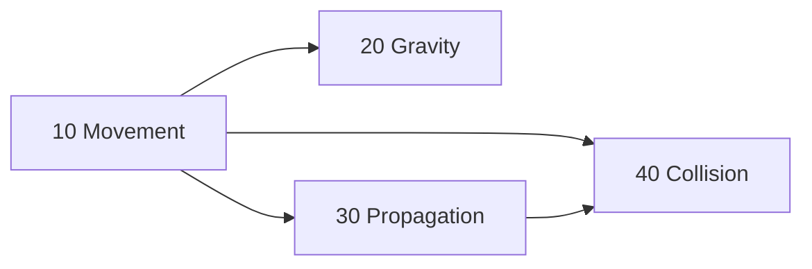

# ADR-020 — System scheduling and task-graph execution

- **Status:** Proposed
- **Date:** 2026-09
- **Deciders:** Miguel (Lead Engineer), with AI as technical lead
- **Task:** S6-D2
- **Related:** settles the open items ADR-007 §6 deferred to "the task-graph ADR" ·
  builds on ADR-019's fixed-only simulation model · provides ADR-010 §4's terminal slot ·
  design hub: [[Task Graph — Execution Flow]]
- **Partial supersessions:** ADR-007 §6's five-phase pipeline (`Input → FixedUpdate →
  Update → PostUpdate → Present`) and the `Input` phase as a separate concept. ADR-019
  already removed the variable tail; this ADR collapses `Input` into the single `Tick`
  phase and retires the `FixedUpdate` name.

## Context

ADR-007 §6 decided the system interface (`ISystem`, `SystemAccess`, conflict DAG,
structural command buffer) and a five-phase pipeline. ADR-019 §1–2 superseded the
variable tail: simulation runs fixed ticks only; presentation uses snapshots on the
render thread. Three items were explicitly deferred to this ADR: the terminal slot
mechanism, level granularity and legal schedule mutation boundaries
([[Task Graph — Execution Flow]], *Owned by the task-graph ADR*). Scene — Design
defers barrier placement, structural command ordering and column write-stamping points
to S6-D2.

No scheduling or executor code exists in the engine.

## Decision

### 1. One simulation phase per tick: Tick

Each fixed tick runs one phase followed by a barrier:

```
Tick → barrier
```

The accumulator repeats this sequence N times per wake. After the last tick a
publication hook extracts completed state to the snapshot mailbox (ADR-019 §1).
No variable-rate simulation phase exists; presentation is render-thread work on
snapshot data (ADR-019 §2).

ADR-007 §6's `Input` phase is retired. Input conversion (raw state to game commands)
is a regular system in the Tick phase with declared access on input-related types.
The graph orders it before consumers by conflict detection or `.before<>()`.

**Barrier operations**, applied single-threaded in deterministic order: apply
structural commands (spawn/despawn/add/remove), validate hierarchy constraints at
commit time (Scene — Design), assign NetIds for newly replicated entities, flush
event streams (ADR-014 §3). Structural commands enqueued during the tick are invisible
until its barrier. Hierarchy changes take effect at the barrier and are propagated
on the next tick.

### 2. Access declarations cover components and resources

`DeclareAccess<Write<Transform>, Read<Velocity, PhysicsWorld>>` declares read
and write intent over components and shared resources. Both use the same dense-ID
bitmask space (ADR-007 §1). `Write<T>` implies read. Resources are shared singletons
with no archetype column; they participate only in scheduling masks and debug
validation.

### 3. Graph build: conflicts, ordering and cycles

**Conflict detection.** Two systems conflict when one writes a type that the other
touches (reads or writes): `A.writes ∩ B.touches ≠ ∅` (ADR-007 §6). Two readers
never conflict. Each conflict produces an edge: one system must run before the other.

**Priority decides direction.** Every system carries an integer priority (default 0).
When two systems conflict, the one with the lower number runs first. Equal priority on
a conflicting pair is a build error: fix it with `.priority()`, `.before<>()` or
`.after<>()`. Engine systems ship with spaced priorities (10, 20, 30...) so user systems
can slot between them without renumbering.

```cpp
schedule.add<MovementSystem>(...).priority(10);
schedule.add<TransformPropagation>(...).priority(20);
// Both write Transform. Movement has lower priority. Movement runs first.
```

**Pairwise overrides.** Two tools override the priority-derived direction between a
specific pair:
- `.after<A>()` means "run me after A" (ADR-007 §6).
- `.before<A>()` means "run me before A." Same edge, other end.

An explicit edge wins over priority between that pair.

**Levels.** The graph builder sorts all systems into layers. Systems in the same layer
have no conflicts, so they can run in parallel later. Systems in different layers run
in order.

**Cycles.** If the edges form a loop (A before B, B before C, C before A), the build
fails with `TE_CHECK` naming every system in the loop. The graph builder logs every
conflict-derived edge so the ordering is visible during development.

### 4. Terminal slot

`Slot::Terminal` on a schedule entry pins it after all regular levels in its phase.
Terminal entries run in registration order, serially, after the last regular level
and before the phase barrier. A terminal entry may omit its access declaration
(ADR-010 §5). One terminal entry per phase; a second is a build error. The slot is a
graph concept available to any system, not a ScriptSystem privilege.

### 5. Worked example

Four systems in the Tick phase:

| System | Priority | Declared access |
|---|---|---|
| MovementSystem | 10 | `Write<Transform>, Read<Velocity>` |
| GravitySystem | 20 | `Write<Velocity>` |
| TransformPropagation | 30 | `Read<Hierarchy>, Write<Transform>` |
| CollisionSystem | 40 | `Read<Transform>, Write<RigidBody>` |

Conflict edges (lower priority runs first):
Movement → Gravity (Velocity), Movement → Propagation (Transform),
Movement → Collision (Transform), Propagation → Collision (Transform).
Gravity and Propagation have no overlap.



Levels: L0 Movement · L1 Gravity ∥ Propagation · L2 Collision.
A custom user system writing local transforms uses `.priority(25)` to slot between
Gravity and Propagation, or `.before<TransformPropagation>()` for a direct edge.

### 6. Node granularity: whole-system

Each system is one node assigned to one worker. Intra-system parallelism (splitting
iteration across workers) is a measured upgrade at P1/P2. The level structure feeds
a parallel executor unchanged.

### 7. Immutable schedule

The graph is built once at simulation start and never changes. No enable/disable, no
mid-tick mutation, no between-tick mutation. A system that should sometimes skip work
checks its own flag internally and early-outs. The graph stays identical on client and
server, which is required for deterministic prediction and reconciliation (ADR-007 §3).
Rollback (re-simulating past ticks with corrected state) replays the exact same graph
every time.

A future expansion could make enable/disable a deterministic command processed through
the command buffer at a specific tick, so both sides apply it at the same point. That
adds graph rebuild cost on every rollback and is not needed until a concrete consumer
appears.

### 8. Serial executor and worker seam

The first executor walks levels serially: one system at a time, in level order. It
exists to prove the graph before threading is added. The parallel executor (P1) is
a near-term follow-up, not a distant upgrade. Both consume the same level structure.
Moving to workers changes the runner, not the graph or the system interface.

Debug validation (actual ⊆ declared, ADR-007 §6) and coarse column write-stamping
(changeTick per system/archetype/component, ADR-007 §2) are executor responsibilities
applied as each system runs.

## Consequences

**Positive**
- F19 dead: graph built once, no per-frame allocation or string work.
- F15 enabled: levels are the future job pool's task graph.
- Fixed-only phases align with ADR-019. No variable-rate ambiguity.
- Numeric priority is explicit: the ordering is visible in the declaration, not buried
  in registration order. Engine defaults ship spaced so user systems slot between them.
- Terminal slot is generic. Any system can use it, not just ScriptSystem.

**Negative / open**
- **Equal-priority build errors.** Two conflicting systems at the same priority fail the
  build. Intentional: forces the author to pick an order rather than getting a silent default.
- **One terminal entry per phase** limits future runners.
- **Hierarchy propagation lag.** Hierarchy changes are visible to propagation only
  on the next tick. Same rule as all structural changes; acceptable.
- **Coarse write-stamping.** Per-instance upgrade seam reserved (ADR-007 §2).

## Alternatives considered

- **Mandatory explicit ordering for all conflicts** — safe but too strict for a
  solo dev; numeric priority gives a default without pairwise edges everywhere.
- **Registration-order direction** — implicit; reordering `schedule.add<>()` calls
  silently changes execution order. Priority makes the choice visible in the declaration.
- **Intra-system chunking now** — premature without profiling. The whole-system
  structure supports it later unchanged.
- **Mutable schedule (enable/disable between ticks)** — breaks client/server
  determinism unless mutations are synced as commands. No consumer yet; the
  deterministic-command path is noted in §7 for future expansion.
- **Multiple terminal slots per phase** — no second consumer today.
- **Input as a separate phase** (ADR-007 §6) — input conversion is a value write,
  not structural, so no barrier is needed before gameplay systems. A regular system
  in the Tick phase ordered by the graph is simpler.

## What would move this

- Equal-priority errors too noisy in practice → fallback to registration-order tiebreak.
- Measured single-threaded bottleneck → intra-system chunking (P1/P2).
- A second terminal-slot consumer → ordered terminal entries.
- A concrete consumer for runtime enable/disable → deterministic-command mutation (§7).

> Add to [[ADR Index]]. Once Accepted, change it only per [[ADR Index]] § *Amending an Accepted ADR*: a dated header entry for what fits one, a superseding ADR for what needs its own argument.
