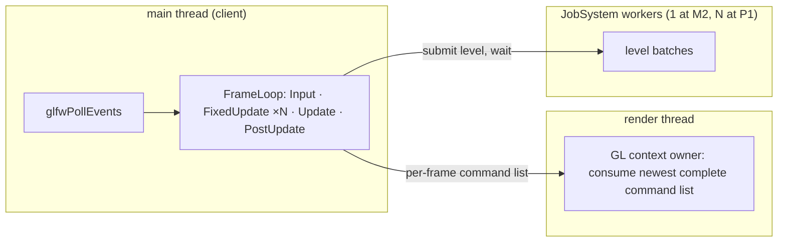

# Concurrency — Design

> Living design doc. **Status: active.** The decisions live in
> [[ADR-015 — Threading (sim on main, render thread owns GL)]]; this note is the working
> shape. Created with the ADR at S4-D1 (2026-08-22), mechanism pinned ahead of the
> implementation cards.

**Module:** `core` (JobSystem) · `app` hosts the loop · **Kind:** system · **Status:** active
**ADRs:** [[ADR-015 — Threading (sim on main, render thread owns GL)]] ·
[[ADR-006 — v2 core architecture & module layout]] §1 §4 ·
[[ADR-007 — v2 networking & ECS replication foundation]] §6
**Roadmap:** M2 builds the pool · M4 exercises the render thread · **P1** turns workers on ·
**P2** tunes (stealing, Jolt pool, F15)

## Decided

| Fact | Where |
|---|---|
| Client topology: main thread pumps and runs the loop, a render thread owns GL, pool workers run levels. | ADR-015 §1 |
| Dedicated server: the same loop on main, headless, no render thread. | ADR-015 §1, ADR-006 §2 |
| The GL context is current on the render thread once, forever; main issues no GL call after handoff. Work arrives as complete per-frame command lists, newest complete list wins. | ADR-015 §2 |
| `JobSystem` lives in `core`, engine-lifetime, injected via `EngineContext`. | ADR-006 §1 §4, ADR-015 §3 |
| Interface at M2: submit a batch, wait for that batch. Nothing else. | ADR-015 §3 |
| The minimal pool is one worker thread with a real queue, watched by `linux-tsan`. | ADR-015 §3 |
| One task-graph level submits as one batch; join before the next level; barriers never run on workers. | ADR-015 §4, ADR-007 §6 |
| Event `publish` is sim-thread-only until P1; lane layout is designed at P1. | ADR-015 §5, [[Events — Design]] § *Open* |
| The drag-stall wart is accepted; the reversal (sim thread) is bounded and trigger-named. | ADR-015 § *What would move* |

## Design

### Topology

On the dedicated server only `main` exists, plus the pool.

### Surface (pinned 2026-08-22)

- `JobSystem` owns the workers; constructed at the composition root, before `EngineContext`.
- `submit(span<Task>) -> BatchId` and `wait(BatchId)`. A `Task` is a plain callable with no
  return value; results travel through the data the task was given.
- `workerCount()` exists for diagnostics and tests. At M2 it returns 1.
- Worker threads are named at creation (`te-worker-0`, ...) so Tracy's per-thread zones read.
- Shutdown joins the workers; submitting after shutdown is a `TE_CHECK` with a defined path,
  the registry's check-then-defined-path shape.

Names beyond `JobSystem` (kept from ADR-006 §4) are this note's to refine; header placement
follows `CONVENTIONS.md`'s subject-area folder rule when Story B lands.

## Open questions

- **Per-worker event staging lanes and the merge.** Semantics fixed in
  [[Events — Design]]; layout designed at **P1** when concurrent publishers exist.
- **Render-thread handoff detail** (list memory, swap timing, pacing against vsync).
  Owner: **R1**'s renderer ADR; M4 only proves the seam.
- **Editor ImGui thread.** Owner: **T1**.
- **Jolt pool integration** onto the JobSystem. Owner: **P2** (F15).
- **Beyond fork-join**: task-level edges across level boundaries, caller-runs in `wait`.
  Owner: **P2**, only if P1's captures show the per-level join bubble actually costs.
- **Frame pacing** stays open on [[Game Loop — Frame Flow]]; nothing here decides it.

## References

- [[ADR-015 — Threading (sim on main, render thread owns GL)]]: the decisions
- [[Task Graph — Execution Flow]]: the levels this pool runs
- [[Game Loop — Frame Flow]]: the loop the topology hosts
- [[v1 Code Audit]]: F15 · F31
- Code: none yet. S4-T4 lands the first `JobSystem` files in `core`.
