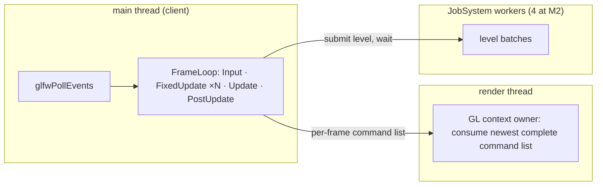

# Concurrency — Design

> Living design doc. **Status: active.** The decisions live in
> [[ADR-015 — Threading (sim on main, render thread owns GL)]]; this note is the working
> shape. Created with the ADR at S4-D1 (2026-08-22), mechanism pinned ahead of the
> implementation cards.

**Module:** `core` (JobSystem) · `app` hosts the loop · **Kind:** system · **Status:** active
**ADRs:** [[ADR-015 — Threading (sim on main, render thread owns GL)]] ·
[[ADR-006 — v2 core architecture & module layout]] §1 §4 ·
[[ADR-007 — v2 networking & ECS replication foundation]] §6
**Roadmap:** M2 builds the pool and runs it four wide · M4 exercises the render thread ·
**P1** opens `publish` to workers · **P2** tunes (stealing, Jolt pool, F15)

## Decided

| Fact | Where |
|---|---|
| Client topology: main thread pumps and runs the loop, a render thread owns GL, pool workers run levels. | ADR-015 §1 |
| Dedicated server: the same loop on main, headless, no render thread. | ADR-015 §1, ADR-006 §2 |
| The GL context is current on the render thread once, forever; main issues no GL call after handoff. Work arrives as complete per-frame command lists, newest complete list wins. | ADR-015 §2 |
| `JobSystem` lives in `core`, engine-lifetime, injected via `EngineContext`. | ADR-006 §1 §4, ADR-015 §3 |
| Interface at M2: submit a batch, wait for that batch. Nothing else. | ADR-015 §3 |
| The pool ships with four workers and a real queue, watched by `linux-tsan`. | ADR-015 §3 + its 2026-08-24 amendment |
| One task-graph level submits as one batch; join before the next level; barriers never run on workers. | ADR-015 §4, ADR-007 §6 |
| Event `publish` is sim-thread-only until P1; lane layout is designed at P1. | ADR-015 §5, [[Events — Design]] § *Open* |
| The drag-stall wart is accepted; the reversal (sim thread) is bounded and trigger-named. | ADR-015 § *What would move* |

## Design

### Topology

On the dedicated server only `main` exists, plus the pool.

### Surface (pinned 2026-08-22)

- `JobSystem` owns the workers; constructed at the composition root, before `EngineContext`.
- `submit(span<Task>) -> BatchId` and `wait(BatchId)`. A `Task` is a plain callable with no
  return value; results travel through the data the task was given.
- `workerCount()` exists for diagnostics and tests. At M2 it returns 4, which is the
  constructor's default (`JobSystem::DEFAULT_WORKER_COUNT`). A caller may still ask for a
  different width; the tests use a one-worker pool where a single worker is the point.
- Worker threads are named at creation (`TEWorker0`, `TEWorker1`, ...) so Tracy's per-thread
  zones read. Pascal, not `te-`, because `CONVENTIONS.md` § *Target naming scheme* keeps `te_`
  for build-only names and this one is shipped diagnostics. Re-pinned 2026-08-24 at S4-T4,
  was `te-worker-0`; ADR-015 §5 leaves the format to this note.
- Shutdown joins the workers; submitting after shutdown is a `TE_CHECK` with a defined path,
  the registry's check-then-defined-path shape.

Names beyond `JobSystem` (kept from ADR-006 §4) are this note's to refine; header placement
follows `CONVENTIONS.md`'s subject-area folder rule when Story B lands.

### Mechanism (decided in code at S4-T4)

These are not in the ADR. They were settled writing the pool, and each one changes how a
caller has to behave, so they belong here rather than in a comment. The functions named are
all in `engine/core/src/jobs/JobSystem.cpp`.

| Decision | Consequence for the caller |
|---|---|
| **`submit` moves the callables out of the span.** This is why the parameter is `span<Task>` and not `span<const Task>`: a `std::function` copy per task per frame is an allocation the executor would pay every level. | The caller's array holds empty `Task`s once `submit` returns. Rebuild the tasks each frame. Resubmitting the same array runs nothing the second time. |
| **An empty batch is not an error.** `submit` on an empty span returns an invalid `BatchId`, and `wait` on an invalid or already-finished id returns immediately. | A task-graph level with no tasks needs no special case, and `wait` is safe to call twice on the same batch. |
| **A task that throws does not kill the pool** (in `workerMain`). The worker catches, reports through `TE_CHECK` naming the batch and the worker, then decrements the batch as if the task had finished. Decided 2026-08-24 at S4-T4. | `wait` still returns instead of parking forever, and one bad job does not terminate the process. The cost is that a task which failed halfway leaves partial results behind, so the diagnostic is the only signal that a level's output is incomplete. |
| **`wait` from a pool worker is checked, not honoured.** ADR-015 §4 keeps barriers off workers; the code now enforces it instead of assuming it. | A nested `wait` returns immediately with a `TE_CHECK` rather than consuming a worker and hanging the pool. |
| **Shutdown drains the queue, it does not drop it** (in `workerMain`). Workers keep taking queued tasks while stopping and exit only once the queue is empty. | Every outstanding `wait` completes rather than parking forever. The cost is that a long-running queued task delays shutdown, and everything a queued task captured must outlive the pool. |

## Open questions

- **Per-worker event staging lanes and the merge.** Semantics fixed in
  [[Events — Design]]; layout designed at **P1** when concurrent publishers exist.
- **Render-thread handoff detail** (list memory, swap timing, pacing against vsync).
  Owner: **R1**'s renderer ADR; M4 only proves the seam.
- **Editor ImGui thread.** Owner: **T1**.
- **Jolt pool integration** onto the JobSystem. Owner: **P2** (F15).
- **Beyond fork-join**: task-level edges across level boundaries, caller-runs in `wait`.
  Owner: **P2**, only if P1's captures show the per-level join bubble actually costs.
- **Frame pacing** stays open on [[Game Loop — Frame Flow]]; nothing here decides it.
- **`JobSystem.hpp`'s weight in public `core`.** The pool's state is in the header, so
  `<mutex>`, `<condition_variable>`, `<deque>` and `<unordered_map>` now reach every consumer
  of `EngineContext`. A pimpl would cost an indirection and an allocation. Surfaced at S4-T4,
  unmeasured; S4-T1 is measuring header weight already and is the natural place to judge it.

## References

- [[ADR-015 — Threading (sim on main, render thread owns GL)]]: the decisions
- [[Task Graph — Execution Flow]]: the levels this pool runs
- [[Game Loop — Frame Flow]]: the loop the topology hosts
- [[v1 Code Audit]]: F15 · F31
- Code: `engine/core/include/TechEngine/core/jobs/JobSystem.hpp` ·
  `engine/core/src/jobs/JobSystem.cpp` · `engine/core/tests/jobs/JobSystemTests.cpp` ·
  wired into `EngineContext` and driven per frame from `engine/app/src/App.cpp` (S4-T4, S4-T5)
