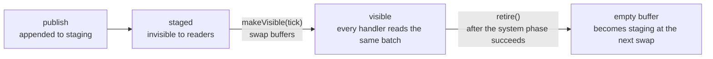

# Events: Design

> Living design doc. **Status: active.** This is the hub for the *how*. The decision is
> [[ADR-014 - Events (buffered streams) & StringId]], accepted 2026-08-02,
> and [[ADR-022 - Project system composition and self-description]], accepted 2026-09-26.

**Module:** `core` (the streams live on `Scene`) · **Kind:** engine mechanism, not a System
**ADRs:** [[ADR-014 - Events (buffered streams) & StringId]] ·
[[ADR-022 - Project system composition and self-description]] ·
[[ADR-007 - v2 networking & ECS replication foundation]] §4 §6 ·
[[ADR-006 - v2 core architecture & module layout]] §1 §4
**Id primitive:** [[StringId - Design]]

**Execution status:** the registry shipped at M1. S7-T5 (#97 `1f5dda4d`, Sep 27) replaced
M1's frame marks and per-reader cursors with a two-buffer stream that holds one Tick batch.
S7-T6 (#98 `745f067a`, Sep 27) put the streams on `Scene` (*Scene residence*). S7-T4 (#99
`0218571e`, Sep 27) added handler declaration and its resolution at graph build
(*Handler declaration*). Scheduled
handler delivery remains Sprint 07 work.

## Purpose

Discrete notifications that cross systems and reach scripts. "Collision entered", "entity
damaged", and so on.

Per-type buffered streams stage writes until a Tick barrier. Each selected system's
registered handler receives the visible batch during the next Tick, never on publish.

That fixes **F28** structurally, rather than by convention.

## Decided

| Fact | Where |
|---|---|
| Buffered per-type streams. No subscriptions or immediate callbacks; scheduled system-local handlers drain visible events before `tick`. | ADR-014 §2, partially superseded by ADR-022; ADR-022 *Decision* |
| An event is a trivially-copyable struct plus a stable tag, which becomes an `EventTypeId` over a `StringId`. | ADR-014 §2 §1 |
| Events become visible at each Tick barrier. ADR-020 replaced the earlier phase names. | ADR-014 §3; ADR-020 §1 |
| Merge order is the publisher's schedule position, then FIFO within a publisher. A replay is identical. | ADR-014 §3 |
| Tick N's events reach every selected scheduled handler in Tick N+1, then retire after that system phase. No next Tick means no retirement. No per-reader cursor or frame anchor governs scheduled delivery. | ADR-014 §2-4, Sep 26 amendments; ADR-022 Sep 26 amendment |
| Within one system, handlers run in their startup declaration order. Each handler receives its event type's complete visible batch in publisher schedule order, then FIFO within a publisher. There is no merged order across event types. | S7-D1, Sep 26 design resolution |
| Event access is a third `SystemAccess` category, and it creates no conflict edges. Selected systems declare handlers and access at startup. | ADR-014 §4; ADR-022 *Decision* |
| Streams are per-`Scene`. There is no `EventBus` service and no `EngineContext` field. | ADR-014 §5 |
| Type registration is process-global, invoked from the composition root. Never through file-scope statics. | ADR-014 §6 |
| No Pool primitive is needed. | ADR-014 §7 |
| Out of scope: OS and input events · editor notifications · the wire RPC channel · the script façade API. | ADR-014 §7 |

## Consumers, from v1's event taxonomy at `v1-reference`

| v1 events | What happens to them in v2 |
|---|---|
| Physics `OnCollision*` and `OnTrigger*` (`core/src/events/physics/`) | Streams, in the fixed domain. This is the first real consumer, at M5 or later. |
| Scene lifecycle: `EntityCreated`, `EntityDeleted`, `ComponentAdded`, `ComponentRemoved` | Maybe **not events at all**. Structural changes already flow through the barrier's command buffer (ADR-007 §6). Decide when a consumer appears. |
| Input events (`client/events/input/`) | **Not Scene event streams.** [[Input - Design]] delivers engine-coded input from the current Tick's ingress batch to selected systems. |
| Resource created and deleted | Editor-side notifications, not Scene streams. Their delivery waits for an editor consumer. |
| UI widget events | Client-side, in the frame domain. Later. |
| The `editorWatchDog` catch-all callback | No host-frame Scene-stream reader is promised. Editor UI and stopped-simulation editing need their own design. |

## Mechanism

Pinned 2026-08-02, before Story E.

### Stream anatomy

There is one stream per event type, living on the `Scene`.

A stream is two contiguous buffers: the **visible** batch that handlers read, and the
**staging** buffer that publishers append to. This is ADR-014's "double-buffered" taken
literally. M1 had used one compacted buffer with sequence numbers instead; S7-T5 replaced it
(see *Stream storage*).

### Staging, at M1

The executor is serial until P1, because the task graph runs level by level on one thread. So
there is **one staging buffer per stream**.

That is enough, because the append order already *equals* ADR-014 §3's merge key: schedule
position, then FIFO within a publisher.

P1's workers layer per-thread lanes and a real merge on top, under the **same key**. The
semantics do not change. [[ADR-015 - Threading (sim on main, render thread owns GL)]] §5
made `publish` **sim-thread-only until P1** and left the lane layout to P1. (Updated
2026-08-22; this section previously said "until M2" and named the threading ADR as the
layout's owner.)

### Making events visible

ADR-020 requires the staged batch to become visible at each Tick barrier.
`makeVisible(tick)` swaps the two buffers and records the Tick, so no payload is copied
(`engine/core/src/events/EventStream.cpp:18`). The recorded Tick is only the batch's identity,
readable through `visibleTick()`; nothing about its lifetime depends on it. `Clock::tick()`
is a process-wide diagnostic counter, not that anchor. S7-T3 (#94) renamed its advancing
method to `advanceTick()` and dropped the frame argument from
`TickBarrierServices::flushEvents`.

`retire()` empties the visible batch and leaves staging alone. A handler's publications
during Tick N+1 therefore survive the retirement of Tick N's batch.

**Only one batch is ever visible.** A `makeVisible` before the previous batch was retired is
a caller bug: it fires a `TE_VERIFY` and changes nothing, so the old batch, the staged events
and the recorded Tick all stay as they were. The executor cannot reach this path, because a
failed phase throws before the barrier and ends the simulation.

### Scene residence: shipped Sep 27

S7-T6 made these calls; no artifact had decided them.

| Call | Shape |
|---|---|
| **When streams are built** | `Scene` keeps its constructor and holds an optional `EventStreamManager`. `App::finalizeSimulation()` calls `buildEventStreams(m_eventRegistry)` after `configureSimulation()`, because `App` constructs its Scene before any registration runs (`engine/app/src/App.cpp:113`). A second build is a `TE_VERIFY` reject that keeps the existing streams and their events. |
| **Simulation-only** | `publish<T>` and `read<T>` work only while a system of **that** Scene is executing. Outside one, a `TE_CHECK` fires, `publish` drops and `read` returns empty (`engine/core/src/scene/Scene.cpp:528`). |
| **Barrier calls** | `makeEventsVisible(tick)` and `retireEvents()` are the inverse: a `TE_CHECK` rejects them while a system is executing (`engine/core/src/scene/Scene.cpp:536`). |
| **A Scene without streams** | `publish` and `read` inside a system fire a `TE_VERIFY`, because an event would be lost. The barrier calls are a silent no-op, because nothing can be lost; every Scene in the executor tests is in this state. |

Until S7-T7 lands, `read` is also callable from `tick`. S7-T7's card makes handlers the only
read path. The clause moved there from S7-T4 on Sep 27, because S7-T7 is the first card
that runs a handler.

### Handler declaration: shipped Sep 27

S7-T4 made these calls; no artifact had decided them.

| Call | Shape |
|---|---|
| **Declaration** | `registration.on<Event>(handler)` inside `ISystem::init`, where the handler is a lambda taking `(Scene&, std::span<const Event>)`. It gets no `SimulationContext`. The handler is stored type-erased, and the entry keeps its handlers in declaration order, duplicate types included (`engine/core/include/TechEngine/core/systems/ScheduleRegistration.hpp:76`). |
| **Same instance** | Binding to the persistent instance is a convention: the lambda captures `this`. Nothing stops a lambda from capturing something else. |
| **When the type resolves** | At graph build, not at declaration, because `configureSimulation()` can add a system before it registers the event type. The declaration keeps a pointer to `eventTypeId<Event>` and calls it then. |
| **Which registry** | `TaskGraph` takes the `EventRegistry` as a constructor argument (`engine/core/src/systems/TaskGraph.cpp:170`). A type counts as registered only if that registry's `find` knows it, because `eventTypeId<T>()` is one process-wide slot that any registry writes. |
| **An unregistered type** | A `TE_CHECK` that names the system, and the schedule stays unfrozen, like an order constraint on an unregistered system. If the check is allowed to continue, that handler is skipped. |
| **A late declaration** | A handler declared through a registration handle kept past `freeze()` is a `TE_CHECK`, like the other setters. Before the freeze, a handle declaration is appended after the `init` handlers. |
| **Conflict edges** | None. Handlers live outside `ScheduleAccess`, so two systems handling one type at equal priority share a level. |

### Scheduled Tick delivery: accepted Sep 26, unbuilt

Tick N's publishers append to staging. Its barrier makes that batch visible. In Tick
N+1, the executor presents it once to every selected registered handler at its
system's slot, before `tick` and under the same component access declaration. The
batch stays intact through all graph levels, including the terminal slot. After a
successful system phase it retires Tick N's batch, then the barrier makes Tick N+1's
staged events visible. A failed phase does not retire the old batch.

The visible batch must remain valid while a handler publishes, including another
event of the same type. The two-buffer stream guarantees this by construction: growth only
ever reallocates staging, so a span into the visible batch cannot move until `retire`.

An advance with zero ticks performs no delivery or retirement. Several catch-up ticks
repeat the same rule independently, even if no render frame occurs between them. A
system that early-outs in `tick` still receives its registered handlers; role-specific
readers are selected before the immutable graph is built. No per-reader acknowledgment
or cursor is needed for scheduled delivery.

Within each selected system, the executor runs handlers in their startup declaration
order. It drains the complete visible batch for one handler before invoking the next,
even when the two handlers read different event types. Each type's batch retains
publisher schedule order and FIFO within each publisher; no global publication order
across event types is promised. A handler's new publications stay staged for the
following Tick.

The selected persistent instance describes its own entry before graph build using a
constrained, entry-scoped declaration surface. The existing `ScheduleRegistration`
was extended for this; S7-T4 shipped the handler half (*Handler declaration*). The app still
chooses which systems enter the schedule. Component schemas and event types are
registered separately before declarations resolve; graph build creates no temporary
system just to read a diagnostic name (ADR-022).

### The registration record

A record holds the tag mapped to its `EventTypeId`, the dense stream index, `sizeof` and
`alignof`, a compile-time trivially-copyable check, and a reserved wire flag.

The tag arrives as a call argument from the composition root (ADR-014 §6).

### Editor boundary

Scene streams serve scheduled simulation work. They do not carry editor actions while
simulation is stopped. Editor UI and edit-mode Scene ownership remain outside S7-D1.

### Profiler zones

`TE_PROFILER_SCOPE` goes on `makeVisible` and `retire`, with literal names (ADR-013 §6). It
lands with the cards, since Story D's macros exist by then.

## Registry

Pinned 2026-08-06, with S3-T8.

It lives in `core/events/`, one folder per design note (`CONVENTIONS.md` → *Headers*).

`EventTypeId` is a struct over a **private** `StringId`, which is the [[StringId - Design]]
shape. `ComponentTypeId` will want the same shape. *That* is when a shared wrapper earns its
place, not now.

| Call | Shape |
|---|---|
| **Residence** | An app-owned `EventRegistry` object, **not a singleton**. §5's multi-sim argument applies here unchanged, and ADR-014 §6's "process-global" describes identity scope rather than storage. Tests build one per case, so no test-only reset hook exists. |
| **Type to id** | An `internal` inline variable per `T`, written by `registerEvent<T>` and read by `eventTypeId<T>()`. It holds the **id only**. The id is a pure function of the tag, so two registries agree on it. The dense index is registry state, resolved by lookup. It is not a self-registering static, so §6 still holds. |
| **Tag storage** | An owning `std::string`. A `string_view` would dangle the moment a game DLL unloads. |
| **Wire flag** | `EventWire{Local, Replicated}`, defaulting to `Local`. Nothing reads it at M1. A bare `bool` at the call site would read as nothing at all. |

**Four rejections, each an always-on `TE_CHECK`:** an empty tag, a tag that hashes to 0, a
duplicate id with a different tag (ADR-007 §1's collision), and a tag that is already
registered.

The last one is a bug either way. The composition root is a single ordered list, and two types
cannot share a tag.

**Only two of the four are reachable from a test.**

The collision and the zero-hash both need an FNV-1a/64 preimage to trigger. So they are field
guards, verified by reading the code rather than by Catch2.

That is *why* the empty tag earns a guard of its own (2026-08-06, with S3-T8). It is the
mistake a human actually makes. And an empty tag hashes to the offset basis, which is a valid
id, so it cannot ride on the zero check.

**A rejected registration leaves the registry unchanged and returns the invalid id.**
`TE_CHECK` is fatal by default. But a test handler can return `{false, false}`, and execution
then **continues** past the check. So the code after the check is real code that runs, not
theory.

## Stream storage

Pinned 2026-08-06, with S3-T9. Rewritten 2026-09-27 for S7-T5's two-buffer stream.

**Storage.** One **type-erased** `EventStream` over two byte buffers, sized from the registry
record (`engine/core/include/TechEngine/core/events/EventStream.hpp:14`). `EventStreamManager`
holds a `std::vector<EventStream>`, indexed by the dense stream index. `publish<T>` memcpys,
because registration already guaranteed the type is trivially copyable. `read<T>` asserts
that the stream's id is `eventTypeId<T>()`, so type safety here is a runtime check rather
than one the compiler makes.

**Overflow.** A capacity hint is given at construction, and growth is **geometric**. Only the
staging buffer ever grows. The two buffers swap every Tick, so each one grows on its own, and
a burst can cost two regrowths before the stream settles. Once both have settled, nothing
allocates. This is bounded in practice, not by construction. `capacity()` reports the
staging buffer only.

**Reads.** The visible batch is always the whole of one buffer, so `read<T>` returns a single
`std::span` with no compaction step.

**Shipped spelling.** ADR-014 §3's *flip* is spelled **`makeVisible(tick)`** in code. The name
predates the two buffers and is kept: it says what the caller gets, while "flip" says how the
stream happens to do it. Same refinement precedent as `dt` becoming `deltaTime`
(`CONVENTIONS.md` → *Names are spelled out*).

### Why two buffers replaced M1's compacted buffer

M1 kept every event in one linear buffer and memmoved the survivors to the front on each
retire. Under the Sep 26 contract a handler publishes while it reads the visible batch, and
a publish that grew that buffer reallocated it, leaving the handler's span dangling.

Two options were weighed on 2026-09-27:

| Option | Why it lost or won |
|---|---|
| **One buffer, old allocations kept alive until `retire`** | Keeping only the previous allocation is not enough: a `read` after one growth points into the second allocation, which a second growth in the same Tick frees. So every allocation from the Tick must be held, peak memory grows with each burst, and the per-Tick memmove stays. Rejected. |
| **Two buffers, swapped at the barrier** | Stability is structural: nothing writes to or reallocates the visible buffer between `makeVisible` and `retire`. `retire` becomes O(1) and the memmove disappears. The cost is a second allocation per stream. **Chosen.** |

The M1 sequence numbers went with the compacted buffer. The rewind work in *Open* may want
absolute sequences again; a counter can be added back then.

ADR-014 §7 asks for something contiguous, double-buffered and amortized, with no fixed-size
node churn. This satisfies it more literally than M1 did, so nothing here reaches the ADR.

## How one stream works

Two `Buffer`s carry everything. Each holds its own storage, capacity and count, and the stream
also records the Tick that made the visible batch visible.

| Member | Holds |
|---|---|
| `m_visible` | Tick N's batch while Tick N+1 runs. Nothing writes to it until `retire`. |
| `m_staging` | Everything published since the last barrier. Appends and growth happen only here. |
| `m_visibleTick` | The Tick passed to the last successful `makeVisible`. |

| Call | What moves |
|---|---|
| `publish<T>` | Appends one element to staging, growing staging if it is full. **Readers observe no change.** |
| `makeVisible(tick)` | Swaps the two buffers and records the Tick. **No bytes move.** A quiet Tick swaps too, so the visible batch is empty rather than a replay. It refuses with a `TE_VERIFY` if the visible batch was never retired. |
| `retire()` | Sets the visible count to 0. Staging is untouched. |

There is no cursor. Every reader gets the whole visible batch, as often as it asks, until
`retire`. Exactly-once delivery is the executor's job: it presents the batch once per handler.

## Container and loop wiring: historical M1 driver

Pinned 2026-08-08, with S3-T10. The `FrameLoop` wiring below is historical; #81 removed
that shared driver. ADR-020's Tick barrier governs the pending Scene integration.

`EventStreamManager` (`core/events/`) owns the `std::vector<EventStream>`, indexed by the
registry's dense stream index.

It was driver-owned at M1. S7-T6 moved it onto `Scene` (ADR-014 §5; *Scene residence*).
S7-T5 removed its frame marks and cursor API; it now forwards `makeVisible(tick)` and
`retire()` to every stream.

| Call | Shape |
|---|---|
| **Construction** | `EventStreamManager{registry}` builds one stream per record, so **every `registerEvent` must precede it**. That is enforced rather than documented: the constructor takes a non-const `EventRegistry&` and **seals** it, and a later registration is a `TE_CHECK` naming the tag. The failure then lands on the registration that caused it, instead of on the first publish. |
| **Lookup** | `getStream(id)` returns a **pointer**, gated by `TE_VERIFY` on both "record found" and "index in range". On a miss, `publish` drops and `read` returns an empty span. An always-on check **plus** a defined path is the same shape as a rejected registration, and it is what makes the miss reachable from a test. |
| **Capacity** | One `initialCapacity` for every stream. The per-type hint that *Stream storage* assumes has no home yet, because `EventTypeRecord` carries no capacity field. Open below. |
| **Profiler** | Zones go on the **container's** `makeVisible` and `retire`, not on `EventStream`'s. That is one zone per barrier, rather than one per stream per sub-step (ADR-013 §6). |

**The loop stays ignorant of events.**

`FrameLoop::advance(deltaTime, onFixedStep)` calls the hook once per fixed sub-step, after
`tick++`. The driver's hook is what publishes and calls `makeVisible`.

Everything else is driver-side: the frame-tail `makeVisible`, the cursor read, and then
`retire` **last**.

That hook is what becomes `FixedUpdate`'s slot at M5.

Three ordering facts, each of which is a silent bug if reversed.

- `frameIndex` and `deltaTime` are set **before** the sub-step loop, so the hook stamps its
  marks with the current frame. `alpha` cannot be set there, because it is not known until the
  accumulator settles.
- `retire` at the frame **tail** is ADR-014 §3's "frame start" in a rotated loop. Putting it
  there is what stops it dropping a batch that the tail read never saw.
- A frame that runs zero ticks runs no hook at all. Nothing is published, and nothing retires
  either, because the tick did not advance.

## Open (deliberately, and each has an owner)

- **The script façade surface.** Something `onEvent<T>`-shaped, drained by the runner, with
  publishes routed through the façade. **Owner:** the scripting ADR.
- **Per-thread staging lanes and their merge.** The semantics are fixed above. **Owner:**
  **P1**, re-scoped by [[ADR-015 - Threading (sim on main, render thread owns GL)]] §5:
  `publish` is sim-thread-only until then.
- **Rewind truncation for client reconciliation.** ADR-014 §3 asserts that a replayed tick
  reproduces an identical stream, but nothing says how the mispredicted run's events leave.
  `retire` only drops from the front, so a rewind needs a **tail** truncation: drop back to a
  sequence and erase those marks. Tick-batch visibility and delivery are rewind state too;
  replay must not skip or duplicate a batch. Replayed side effects such as sound and VFX
  are a separate problem,
  which the ADR already names against the v1 shape. It is bounded in practice: ADR-007 §4
  replays unacked commands only, and its *Confirmed forks* section is snapshot plus
  interpolation, not rollback. **Owner:** the netcode transport ADR at M4. Raised 2026-08-06
  during S3-T9.
- **Editor watchdog UX**, meaning what the editor shows and how it filters. No direct
  host-frame Scene-stream read is part of the Tick contract. **Owner:** later editor design.
- **API spelling**, covering `publish<T>` and the header layout. The declaration method
  shipped as `on<Event>` and the batch view as `std::span<const Event>` (S7-T4). This is a
  naming pass rather than a decision. **Owner:** implementation plus
  `CONVENTIONS.md`.
- **Re-registration on DLL reload.** The registry rejects a second `registerEvent<T>`, so a
  reloaded game DLL cannot re-register its types. **The seal added at S3-T10 closes the door
  further:** once the streams are built, *no* registration is accepted, reload or not. Both are
  the same constraint made explicit rather than a new one, and no reload exists at M1.
  **Owner:** the module and script reload work, whenever it lands.
- **A per-type capacity hint.** Every stream is built with one shared `initialCapacity`,
  because `EventTypeRecord` has no capacity field. Growth is geometric, so a hot stream costs
  a few early reallocations rather than being wrong. **Owner:** the first event type with a
  known high rate. Add the field then, with a real number behind it.

## References

- [[ADR-014 - Events (buffered streams) & StringId]]: the decision and its alternatives
- [[Game Loop - Frame Flow]]: the barriers, the N fixed ticks, and where the barrier sits
- [[v1 Code Audit]] F28 · `EventManager.hpp` at `v1-reference`: the prior art
- Bevy's `Events<T>` and `EventReader`: prior art for buffered events. The accepted
  scheduled path presents one next-Tick batch without per-reader cursor state.
