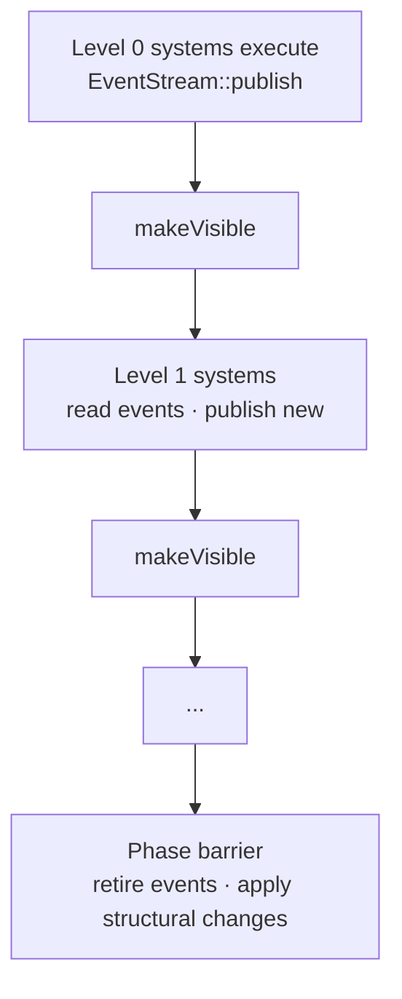

# Game Loop — Frame Flow

> Living design doc. Thread ownership is Accepted under ADR-018. The time model below
> is the ADR-019 target, Accepted by Miguel Sep 10. The current triangle/input stage shipped
> Sep 11 as `7d2546fc` (#81); see [[2026-09-11 Threaded Engine Validation]] for evidence.

**Module:** `app` coordinates simulation; `client` owns presentation.
**ADRs:** [[ADR-019 — Fixed simulation ticks, render interpolation and shared clock]] ·
[[ADR-018 — Main and simulation threads, render-owned GL]] ·
[[ADR-007 — v2 networking & ECS replication foundation]] §5 §6

## Decided

| Policy | Source and status |
|---|---|
| Main, simulation and render have independent loops; only simulation mutates live Scene state. | ADR-018 §1 §2, Accepted |
| Keep fixed ticks, catch-up, the configurable 60 Hz default and 0.25 s clamp. | ADR-007 §5; ADR-019 §1 preserves these |
| Replace the simulation's variable tail with a publication hook taking no delta or alpha. | ADR-019 §1, Accepted; Miguel's Sep 10 constraint |
| Input conversion and fixed work run per tick; renderer-specific preparation, drawing and presentation consume snapshots. Vsync can be disabled. | ADR-019 §2, Accepted partial supersession of ADR-007 §5 §6 |
| Fixed context carries tick, fixed step and role; presentation context carries frame delta and per-view alpha. | ADR-019 §2 §3, Accepted |
| Share the EngineContext Clock; render retains two received snapshots and computes alpha. | ADR-019 §3, Accepted |
| Gameplay scripts have only fixed updates; presentation scripting needs a separate restricted API. | ADR-019 §2 and revised Proposed ADR-010 §2–4 |
| Main fans out presentation input without draining simulation ingress. | ADR-019 §4, Accepted |
| Primary simulation advances and pushes the diagnostic stamp once per completed tick. | ADR-019 §5, Accepted; ADR-011 §9 push retained |
| Structural commands and staged events settle at tick phase barriers; task-graph levels retain their dependencies. | ADR-007 §6; ADR-014 §3, Accepted |
| Tracy's unnamed frame stream has one owner: render in graphical compositions, primary simulation when headless. | ADR-019 §6, Accepted |
| Main is event-driven; after a stall it processes delivered events and commands without catch-up. | ADR-019 §5, Accepted |
| App combines copied timing samples; queues preserve individual results and mailboxes publish replaceable state. | ADR-019 §3 §4, Accepted |

ADR-019 supersedes ADR-007's combined pipeline within the scope recorded in [[ADR Index]].
The triangle/raw-input stage implements this model; *Deferred consumers* names the later systems.

## Independent loops

Every phase and cross-thread transfer in the current loop topology. Dotted arrows are
cross-thread; solid arrows are the internal sequence within each thread:

```mermaid
flowchart LR
    subgraph Main["Main thread · event-driven"]
        direction TB
        M1["glfwWaitEvents<br/>(block until wake)"]
        M2["GLFW dispatches callbacks<br/>key · button · motion · focus · resize"]
        M3["publishInput → InputBuffer"]
        M4["Read TimingMetrics"]
        M5["Editor / title work"]
        M6{"stop?"}
        M1 --> M2 --> M3 --> M4 --> M5 --> M6
        M6 -->|no| M1
    end

    subgraph Sim["Simulation thread · fixed tick"]
        direction TB
        S1["Sample Clock<br/>accumulate elapsed"]
        S2{"due ticks?"}
        S3["Drain InputBuffer batch"]
        S4["fixedUpdate(SimulationContext)<br/>(EventStream within)"]
        S5["Advance diagnostic counter"]
        S6["publishSnapshot<br/>→ SnapshotMailbox"]
        S7["Publish TPS to TimingMetrics"]
        S8["Wait for next tick deadline"]
        S1 --> S2
        S2 -->|"per tick"| S3 --> S4 --> S5 --> S2
        S2 -->|"done"| S6 --> S7 --> S8 --> S1
    end

    subgraph Render["Render thread · variable frame"]
        direction TB
        R1["Acquire from SnapshotMailbox"]
        R2["Update SnapshotHistory<br/>(two-snapshot pair)"]
        R3["Read presentationState"]
        R4["Compute alpha · interpolate"]
        R5["Camera · animation · cull"]
        R6["GL draw"]
        R7["swapBuffers"]
        R8["Publish FPS to TimingMetrics<br/>mark Tracy frame"]
        R1 --> R2 --> R3 --> R4 --> R5 --> R6 --> R7 --> R8 --> R1
    end

    M3 -.->|"InputBuffer<br/>ordered · bounded"| S3
    M3 -.->|"InputBuffer<br/>latest state"| R3
    S6 -.->|"SnapshotMailbox<br/>newest wins"| R1
    S7 -.-> M4
    R8 -.-> M4
```

Simulation waits interruptibly for its next deadline. It samples actual elapsed time after
waking, applies the clamp, then executes all due ticks. Ingress precedes every fixed tick;
ScriptSystem's proposed terminal slot follows fixed Systems before the final tick barrier.
The publication hook extracts complete state once after catch-up, only if ticks advanced.
Publish an initial complete state before readiness; no render phase runs on a headless server.

Presentation has its own ordered stages and frame delta. It reads no live Scene, even
through an SDK façade or a script instance. Render-only camera and animation state live in
client. Root motion, gameplay animation events and collision transforms are fixed work.
Transform changes needed by gameplay must settle before publication; render finalization
only prepares visual transforms. A renderer remains a replaceable default on its own lane.

Suggested function vocabulary is `prepareFrame()` (acquire snapshots/input, interpolate,
camera, animation and culling), `renderFrame()` (submit drawing), then `presentFrame()`
(swap and frame accounting). These are renderer operations, not renamed simulation hooks;
the old phases need no one-to-one replacement. Exact API layout remains implementation work.
Vsync is a configurable presentation policy, not a requirement. With it disabled, the loop
may run uncapped; any later frame limiter belongs to render and must not pace simulation.

Framebuffer size is a separate side-channel: the GLFW resize callback updates a
mutex-protected value on Window, and render reads it for viewport setup. It is not shown
as a transfer arrow because it does not flow through the InputBuffer or mailbox path.

### Event system and task-graph phases

The diagram shows `fixedUpdate` as a single call per tick. When the task-graph executor
lands (M5), it expands into ordered levels with the EventStream mediating system-to-system
data within each tick:

EventStream is single-thread staged publishing (ADR-014). It is not a cross-thread
mechanism; InputBuffer, SnapshotMailbox and TimingMetrics handle those. Systems within
a level publish events that become readable only after `makeVisible`, so consumers
always see a consistent set. `retire` clears consumed events at the phase boundary.

## Tick timestamps

The runner owns a mapping from simulation tick boundaries to the shared monotonic Clock.
At normal speed, successive boundaries are separated by the fixed step. Stamp a snapshot
with the boundary represented by its completed tick, not with the end of extraction.
For example, two ticks executed after a late wake still have boundary times one step apart.
Tick zero's initial snapshot establishes the mapping's origin.

The mapping is per simulation. Sampling the Clock does not mutate it. The synchronous
advance seam takes synthetic elapsed time and an explicit test origin; interpolation can
be tested with synthetic snapshot times and render-now values without sleeping or faking Clock.
Use double durations or Clock time points for arithmetic, not long-running float timestamps.

If the measured interval exceeds 0.25 s, keep the existing clamp: discard the excess elapsed
wall time without jumping tick numbers. Move the boundary mapping forward by the discarded
amount and increment a timeline generation. Snapshots from different generations must not
be blended. A scene restart or seek also resets history; pause/time scaling needs an explicit
mapping policy before implementation. Neither belongs on Clock itself.

TPS counts completed ticks over actual unclamped elapsed time. Update/publication calls
are not ticks: one call may represent several catch-up ticks. A clamp-sized stall can reduce
one TPS sample; ordinary jitter is recovered, while sustained overload reduces long-term TPS.

## Snapshot acquisition and alpha

The transfer has one shared slot. The two interpolation snapshots belong privately to
render; there is no shared double buffer or producer reuse of consumer-owned history.
Simulation constructs a complete value, briefly locks to copy it into the mailbox, then
continues. Render briefly locks to copy it out and releases the lock before updating its
history or drawing. On a newer snapshot, old current becomes previous and received becomes
current. Neither side holds the transfer lock during simulation work or drawing.

The mailbox still holds one complete value. Render copies it under a short lock and owns
its history outside that lock. It replaces its pair only on a newer tick in the same timeline;
re-reading the same publication does not shift history. A new timeline clears the pair.
A generation is ordered within this handoff; stale generations are ignored.

Let A and B be the last two acquired compatible snapshots, with boundary times tA < tB.
At render time now, use presentationTime = now - fixedStep initially, then compute:

`alpha = clamp((presentationTime - tA) / (tB - tA), 0, 1)`

The denominator is the actual timestamp gap, not a presumed single tick. Example: A is
tick 100 and B is tick 103; midpoint time blends at 0.5 despite two skipped publications.
This local one-step delay is independent of ADR-007 §3's remote-entity interpolation delay.

| Condition | Presentation behavior |
|---|---|
| No initial snapshot yet | Draw the startup fallback; never read uninitialized world data. |
| Only one snapshot, or a timeline reset | Draw that snapshot until a compatible pair arrives. |
| Presentation time is before A | Hold A (alpha 0). |
| Presentation time is between A and B | Interpolate compatible visual fields. |
| Presentation time reaches or exceeds B | Hold B (alpha 1); keep camera/UI work running. |
| Equal or reversed timestamps in an otherwise newer snapshot | Treat as a discontinuity and reset history; report invalid metadata. |
| Entity spawn, despawn, teleport or incompatible pose history | Use explicit presence/discontinuity rules; never blend unrelated identities. |

Initial one-step delay can fail to bracket after skipped publications or long stalls.
The accepted trade-off is a visible hold, never waiting for simulation or implicit
extrapolation. A larger history, guaranteed adjacent pair or adaptive delay needs evidence.

### Payload and lifetime

Snapshots contain tick/time/generation, presentation values, stable entity identity when
entities exist, and the input sequence reflected in controlled-view state. They contain no
pointers into mutable Scene storage. Asset/resource handles need a lifetime protocol before
richer payloads ship; the current clear-color/triangle value needs none of that machinery.
These are local render snapshots, not a replacement for replication's network snapshot ring.

## Presentation input

Main retains the ordered bounded ingress described in [[Simulation Thread — Design]]. It
also publishes copied presentation state with capture sequence/time and a focus generation.
Render reads the latter once per frame. Use cumulative look motion within each generation,
not a replaceable last mouse delta: replacing deltas loses motion when render skips reads.

Snapshot view data includes the cumulative look baseline/sequence consumed by simulation.
Render applies only the motion beyond that baseline to the newest controlled-view orientation;
do not add a newer residual to an older interpolated orientation. World position can still
interpolate. Both paths share look mapping; focus/capture resets establish a fresh baseline.
Simulation alone produces tick-stamped gameplay commands and absolute view angles.
A blocked host cannot supply new physical input to either path.

## Data handoffs between the three threads

| Direction | Data | Delivery |
|---|---|---|
| Main to simulation | Input transitions and editor/CLI commands | Separate bounded ordered queues; preserve accepted order and explicit overflow/admission policy. |
| Main to render | Latest cumulative mouse-look/focus state and framebuffer size | Latest-value publication; replacing older state is allowed. |
| Simulation to render | Complete snapshot, tick and tick time | Single-slot mailbox, copied into render's private two-snapshot history. |
| Simulation/render to main | Timing samples and current status | Coherent copied latest values; timing samples carry their capture times. |
| Simulation to main | Individual command results | Bounded ordered delivery, correlated with accepted commands; never overwrite an unread result with a newer one. |

An accepted command needs room for its eventual result: reserve bounded completion capacity
at admission or retain the result until acknowledged. Capacity exhaustion rejects new
commands visibly rather than losing a completion or blocking simulation on host progress.
This extends the existing explicit admission/cancellation contract; it does not require an
unbounded queue. Raw-input recovery remains in [[Simulation Thread — Design]].

Short transfer locks permit brief contention, not waiting for another thread's frame or
tick to finish. Copy cost should be measured before changing the small-value mailbox into
a shared buffer ownership protocol. Each transfer has its own synchronization boundary.

## Main thread waiting and diagnostics

Main is event-driven. It blocks on `glfwWaitEvents` through the platform window seam and
wakes only when an OS event arrives or another thread posts `glfwPostEmptyEvent()`. It has
no periodic timer or maintenance deadline. Stop sets persistent state before posting an
empty event; callbacks may wake early, and the main thread checks stop/completion before and
after waiting. Completion/failure posts the same wake. Wake registration is removed only
after potential callers join and before GLFW teardown. Headless composition uses its
cancellable control wait and acquires no graphical dependency. These API behaviors are
documented in the [GLFW input guide](https://www.glfw.org/docs/latest/input_guide.html#events).

### Recovery after a main stall

Main has no catch-up accumulator and no periodic deadline. When it resumes, it processes
OS-delivered events and admitted commands in order, performs any per-wake work, and checks
stop/failure before blocking again.

Simulation retains its last known held input and render retains its last delivered look
state while main is stalled. Delayed input enters the next simulation tick under the
existing ingress policy, without inventing a physical event history or retroactive ticks.
Check stop/completion again before waiting. Posting a wake cannot force an arbitrary
callback or native modal operation to return; keep callbacks short and send expensive
editor work to finite background jobs where its ownership permits it.

### Diagnostic and timing publication

The primary simulation is the only Clock diagnostic-counter writer. App advances it after
each completed tick and pushes the stamp to diagnostics, preserving ADR-011 §9's push. Additional
simulations use explicit tick/identity fields. Shared counter reads require synchronization;
Clock's current plain integer must not become a cross-thread data race. Host and render
counters remain local metrics; presentation FPS counts completed swapBuffers calls.

Tracy has separate frame streams, not a shared marker emitted by all loops. Graphical
compositions mark the unnamed stream after each swap; simulation marks a named tick stream.
Headless compositions assign the unnamed stream to their primary simulation instead.
Host work and waits are zones. [[Profiler — Design]] owns the instrumentation details.
Published timings can feed a common display without making Clock own the loops' progress;
see [[Clock — Design]] for the accepted observation boundary.

## Grounding and validation

**Sep 11:** shared Clock, fixed-only SimulationContext, no-delta publication, SnapshotMailbox,
SnapshotHistory, event-driven main waiting, raw-input fan-out and timing samples shipped as
`7d2546fc` (#81). The publication hook receives the fixed SimulationContext for extraction.
Windows, native Tracy and PR CI evidence are in [[2026-09-11 Threaded Engine Validation]].
Older draft observations below are historical.

Inspected Sep 10 at engine `82ac7ed2` plus working changes. SimulationThread has replaced
FrameLoop; SimulationContext still exports deltaTime/alpha, EngineContext has files/jobs
only, and RenderThread still consumes one FrameCommand. See ADR-019 Context for code refs.
Dashboard's `01ed7a30` stamp remains stale against fetched `a60b64bd`; this is no full reconciliation.

Before integration, deterministic checks should prove catch-up tick count, one publication
per batch, clamp discontinuity, skipped/duplicate snapshots, startup/reset behavior and two
independent simulations sharing a Clock. Input checks should prove skipped render reads
retain cumulative motion, focus resets, and no double application when simulation catches up.
Lifecycle checks should prove stop-before-wait, stop-during-wait and worker failure wake main.
Also check that a multi-interval host stall causes one maintenance refresh, metrics copies
remain coherent per producer, and result-capacity exhaustion cannot lose an accepted
command's completion. Headless timing reads must report render metrics as absent.

A Windows trace should correlate title updates, simulation wakes, tick work and publication
separately. Miguel's reported 31 ms update gap is not yet a diagnosed scheduling cause;
timeBeginPeriod(1) did not change it. No build, tests or timing experiment ran for this draft.

## Deferred consumers

FrameAllocator reset granularity, net receive/send placement and the task graph's terminal
slot still need their owning designs. Pause/time scaling needs a timeline mapping and reset
contract. Remote-clock conversion, prediction and interpolation delay tuning belong to the
netcode ADR; one local Clock does not imply a shared clock across machines.
