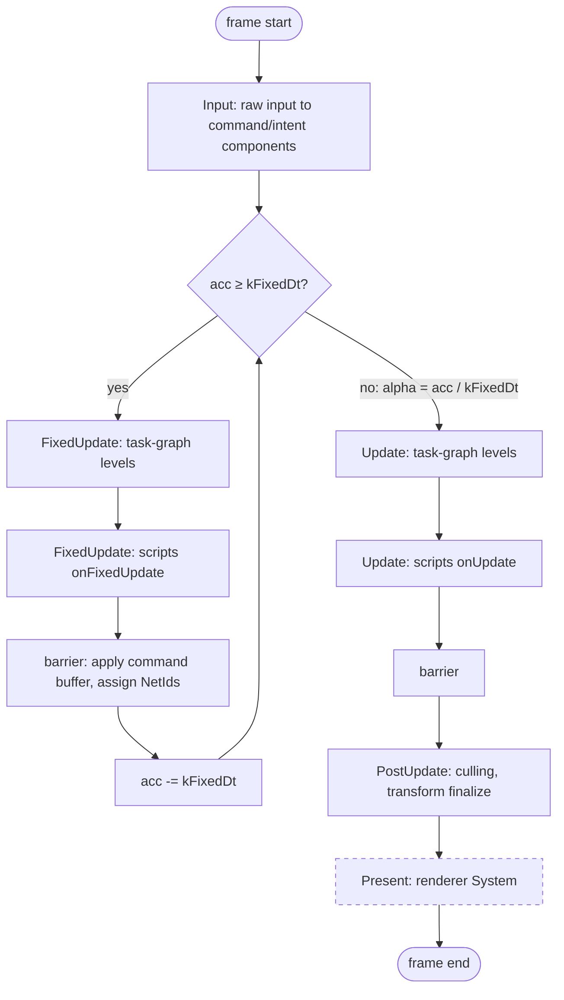

# Game Loop — Frame Flow

> Living design doc. **Status: draft**, not yet accepted.
>
> The ADR holds the decision, this doc holds the *how*. The frame's shape is decided across
> [[ADR-006 — v2 core architecture & module layout]] and
> [[ADR-007 — v2 networking & ECS replication foundation]]. This note is the **assembled
> view**, not a restatement of the rules.

**Module:** `app` · **Kind:** system · **Status:** draft
**ADRs:** [[ADR-006 — v2 core architecture & module layout]] §1 §4 §5 ·
[[ADR-007 — v2 networking & ECS replication foundation]] §5 §6 ·
[[ADR-011 — Diagnostics (Logger & Assert)]] §9 (the frame-stamp push) ·
[[ADR-010 — User authoring model (Systems & Scripts)]] §3 §4 *(Proposed)*
**Backlog:** [[Backlog]] → `app` (loop phases and frame pacing)

## Purpose

One frame, end to end. Where the accumulator sits, which phases run how often, and where the
task graph executes inside it.

The [[Task Graph — Execution Flow|task graph]] is **one stage of one phase**. The loop is
everything around it. That is the split that usually gets flattened, so it is worth stating
first.

This also fixes **F14**. v1 ran the editor *inside* the frame loop, so editor cost was frame
cost. In v2 the loop lives in `app`, and the editor hosts it from outside.

## Decided

| Fact | Where |
|---|---|
| The loop and the composition root both live in `app`. It is presentation-agnostic, and a headless sim-only mode exists. | ADR-006 §1 §4 |
| The authoritative sim runs on a fixed timestep, driven by an accumulator. `kFixedDt` defaults to **60 Hz** and is configurable. | ADR-007 §5 |
| The frame `dt` is clamped, so there is no spiral of death. | ADR-007 §5 |
| The phases are `Input → FixedUpdate → Update → PostUpdate → Present`, with a hard barrier between each. A system belongs to exactly one. | ADR-007 §6 |
| `FixedUpdate` **is** the `while (acc >= kFixedDt)` body, so it runs N times per frame. Everything after it is the once-per-frame tail, using `alpha = acc / kFixedDt`. | ADR-007 §5 |
| `Present` is client-only. On a dedicated server it is simply unregistered, so the phase is empty rather than skipped. | ADR-007 §6, ADR-006 §2 |
| The renderer is a System in the final phase. It is an engine default and the user can replace it. | ADR-006 §5 |
| A dedicated server runs the fixed loop only, headless. | ADR-007 §5 |
| `FrameContext` carries `{ dt, fixedDt, frameIndex, const EngineContext& }` plus `{ tick, alpha, role }`. | ADR-006 §4, ADR-007 §5 |
| Structural change (spawn, despawn, add, remove) applies **at the phase barrier**, single-threaded and in deterministic order. `NetId`s are assigned there. | ADR-007 §6 |
| Within a phase, the executor walks the prebuilt task-graph levels. | ADR-007 §6 → [[Task Graph — Execution Flow]] |
| Scripts run in a **terminal slot** of `FixedUpdate` and `Update`. | ADR-010 §3 §4 *(Proposed)* |
| The editor remains an App subclass; host work and simulation callbacks have distinct loops under one lifecycle. Accepted target, not yet implemented. | ADR-017 § *Decision* 3 as partially superseded by ADR-018 §3 |
| **`FrameContext` owns simulation time. `Clock` is the time source.** See below. | ADR-006 §4, ADR-007 §5 §6 (this note, 2026-07-24) |
| The loop **pushes** the diagnostic frame number into diagnostics once per frame. The Logger never reads the `Clock`. | [[ADR-011 — Diagnostics (Logger & Assert)]] §9 |
| `FrameContext` lives in **`core`**, `FrameLoop` in **`app`**. ADR-007 §6's `update(Scene&, const FrameContext&)` means `core` has to see the type. | S2-T7 (2026-07-30) |
| `Role { Client, ListenServer, DedicatedServer }`. | S2-T7. The names come off ADR-006 §1's executable table, since no prior artifact defined it. |
| The accumulator is `double` seconds. `FrameContext` publishes `float`. | S2-T7 |
| `MAX_FRAME_DELTA_TIME = 0.25 s`, which is ADR-007 §5's clamp. That is at most 15 catch-up ticks per frame. | S2-T7 |
| **The loop holds no `Clock`.** `advance(frameDeltaTime)` is pure. `app`'s driver samples the time, bumps the frame and pushes the stamp. | S2-T7 → [[Clock — Design]] |
| The code spells the fields `deltaTime` and `fixedDeltaTime`. This note's `dt` and `fixedDt` are the illustrative form. | `CONVENTIONS.md` → *Names are spelled out* |
| Events: staged writes flip at phase barriers, and every fixed sub-step ends at one. There is no continuous dispatch. | [[ADR-014 — Events (buffered streams) & StringId]] §3 |

## Design

**Accepted Sep 7:** [[ADR-018 — Host and simulation threads, render-owned GL]] assigns this
loop to a dedicated simulation thread. [[Simulation Thread — Design]] holds the remaining
host/input mechanism. The fixed-step rules remain; the thread split is not implemented yet.

### One frame

### Cadence per phase

| Phase | Runs | Contents |
|---|---|---|
| `Input` | Once per frame | Raw input becomes command and intent components |
| `FixedUpdate` | **N times per frame.** Zero on a fast frame, more than one on a slow frame. | The authoritative sim: physics, movement, gameplay |
| `Update` | Once per frame | Camera, animation, non-authoritative gameplay |
| `PostUpdate` | Once per frame | Culling, transform finalization |
| `Present` | Once per frame, **client only** | The renderer System |

**The N times is the load-bearing detail.** On a slow frame the simulation advances several
ticks while everything after it advances once.

So anything that must stay in lockstep with the simulation belongs in `FixedUpdate`.

That is why scripts get an `onFixedUpdate` slot, rather than a single pass at the end of the
frame (ADR-010 §3). A once-per-frame script would drift out of the authoritative tick, and
reconciliation could not replay it.

### Where time lives: `FrameContext` against `Clock`

Both exist in ADR-006 §4, which sketches `EngineContext` as carrying a `const Clock&`.
`FrameContext` is passed per frame. Each fact has exactly one owner.

> **Not wired yet (checked 2026-08-20).** The shipped `EngineContext` has exactly one field,
> `FileAccess& files`, added at S3-T13. The loop still constructs its own `Clock` locally, at
> `engine/app/src/App.cpp:49`. The split below is the decided shape, not the built one.

| | Owns | Read by |
|---|---|---|
| **`FrameContext`** (a parameter) | `dt`, `fixedDt`, `tick`, `alpha`, `role`, `frameIndex`. This is the authoritative simulation state. | Systems, through `update(Scene&, const FrameContext&)` (ADR-007 §6) |
| **`Clock`** (in `base`; an `EngineContext` service once wired, ADR-006 §4) | Monotonic `now()`, a wall-clock stamp, `totalTime`, and a **diagnostic** frame counter | **The loop only** |

The loop owns the accumulator. It publishes into `FrameContext`, bumps the Clock's diagnostic
counter once per frame, and **pushes that number into diagnostics** so the Logger and profiler
macros can stamp it.

**Why simulation time is not on the Clock.**

A process can run more than one simulation. Tests run several headless sims side by side.

**The v2 editor hosts a client only** (Miguel, 2026-08-02). v1's editor hosted a client *and*
a server in one process, and that was the mistake behind F1 and F2. It is not a v2 scenario,
so it is not what this argument rests on. [[Clock — Design]] carries the same call.

A process-wide Clock can hold only one `tick` and one `alpha`, and `role` has no meaning at all
as a global.

`FrameContext` is passed per call, so each sim carries its own. ADR-007 §6's signature already
delivers it to every system, so reading the Clock instead would be a **second path to the same
fact**.

**Why the Clock keeps a frame counter anyway.**

The Logger and the profiler are global macros. A macro cannot take a `FrameContext`, and
[[Logger — Design]]'s `[f 1043]` stamp needs an ambient number from somewhere.

That counter is for **correlation only**. It is approximate when two sims share a process, and
it is never the simulation's source of truth.

**Diagnostics does not read the Clock. The loop pushes to it**
([[ADR-011 — Diagnostics (Logger & Assert)]] §9).

An ambient global `Clock*` sitting behind a log macro would be a second access path to an
`EngineContext` service, which is the shape ADR-006 §4 exists to remove. So the loop reads
`frame()` and publishes the value, and `base` holds no `Clock` reference.

**This is an obligation on the loop.** Forget the push and every log line stamps `[f 0]`.

**`timeScale`, pause and slow motion are loop policy**, not Clock knobs. The loop scales the
`dt` it feeds the accumulator, so systems read an already-scaled `dt`.

Add an `unscaledDt` to `FrameContext` only when something actually needs it. UI animation
during a pause is the likely first case.

### Two clocks, two interpolations

- A **controlled entity** is predicted, and smoothed by `alpha` near the present.
- **Remote entities** are interpolated roughly 100 ms *behind*, out of the snapshot ring.
- The server tick is the master clock. The client's prediction tick runs **ahead** of it by
  about `RTT/2 + jitter`, while its interpolation view sits **behind** by `interpDelay`. On a
  listen server the offset is 0. See ADR-007 §5.

## Open questions

Each of these goes to an ADR.

### `FrameAllocator` reset granularity

Per frame, or per tick? ADR-007 §2 encodes replication into it *per tick*, and `FixedUpdate`
runs N times, so a per-frame reset accumulates N ticks of scratch.

**Not urgent.** The allocator is architectural, through ADR-006 §4's `EngineContext`, but it is
out of near-term scope. It only becomes live when replication does.

### Where net receive and send sit

The loop **will** need these slots. `net` is a reserved seam (ADR-006 §2) and the transport is
deferred (ADR-007).

Receive before `Input`, and send after `FixedUpdate`, is the obvious shape. It is undecided,
and it goes to the netcode ADR.

### The interpolation phase

Client-side, per ADR-007 §3. It is not pinned to `Update` or to `PostUpdate` yet.

### The terminal-slot mechanism

ADR-010 §4 needs "after everything", and `.after<A>()` is pairwise, so it cannot express that.
This goes to the task-graph ADR, and it is tracked in [[Task Graph — Execution Flow]].

### Frame pacing, vsync and present mode

No ADR touches this yet.

**First evidence, from S2-T7 on 2026-07-30: `sleep_for` alone cannot pace a 60 Hz frame on
Windows.**

The default timer resolution is 15.6 ms, and a shorter sleep rounds **up** to it. So a
120-frame headless run sleeping 16.67 ms took about 31.2 ms per frame, which is **221** ticks.
Sleeping 8.33 ms took about 15.6 ms per frame, which is **111** ticks.

The accumulator was right throughout. It counts elapsed time, not requested sleeps.

Today's stand-in is a spin to an absolute deadline, marked `TODO(S2-T9)`. A real pacer means
either sleeping to the deadline minus a margin and then spinning, or raising the timer
resolution behind a `platform` seam. Neither is decided.

## References

- [[ADR-007 — v2 networking & ECS replication foundation]] §5 (tick and time) · §6 (phases)
- [[ADR-006 — v2 core architecture & module layout]] §1 (`app` owns the loop) · §5 (the
  renderer as a final-phase System)
- [[Task Graph — Execution Flow]]: what runs *inside* a phase
- [[v1 Code Audit]]: F14, the editor inside the frame loop
- Code: `engine/core/include/TechEngine/core/FrameContext.hpp` ·
  `engine/app/include/TechEngine/app/FrameLoop.hpp` and `src/FrameLoop.cpp` (the accumulator) ·
  `engine/app/src/App.cpp` (the headless driver). Phases, the task graph and the ECS are **not**
  there yet. S2-T7 built the accumulator sliver only.
