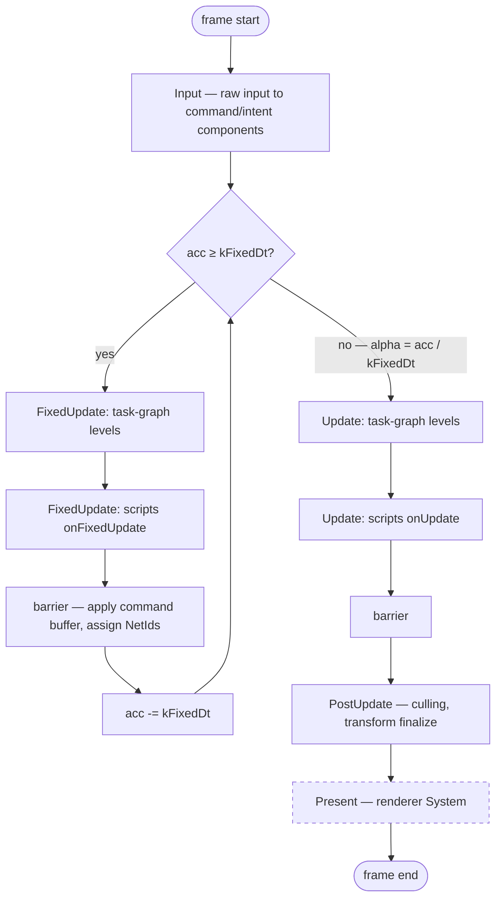

# Game Loop — Frame Flow

> Living design doc. **Status: draft** — not yet accepted.
> **ADR = the decision; this doc = the _how_.** The frame's shape is decided across
> [[ADR-006 — v2 core architecture & module layout]] and
> [[ADR-007 — v2 networking & ECS replication foundation]] — this is the **assembled
> view**, not a restatement of the rules.

**Module:** `app` · **Kind:** system · **Status:** draft
**ADRs:** [[ADR-006 — v2 core architecture & module layout]] §1 §4 §5 ·
[[ADR-007 — v2 networking & ECS replication foundation]] §5 §6 ·
[[ADR-010 — User authoring model (Systems & Scripts)]] §3 §4 *(Proposed)*
**Backlog:** [[Backlog]] → `app` → `systems` → Loop timestep policy

## Purpose

One frame, end to end: where the accumulator sits, which phases run how often, and where
the task graph executes inside it. The [[Task Graph — Execution Flow|task graph]] is **one
stage of one phase**; the loop is everything around it — that's the split that gets
flattened.

Fixes F14 — v1 ran the editor *inside* the frame loop, so editor cost was frame cost.
Here the loop lives in `app` and the editor hosts it from outside.

## Decided

| Fact | Where |
|---|---|
| Loop + composition root live in `app`; presentation-agnostic; headless/sim-only mode exists | ADR-006 §1, §4 |
| Fixed-timestep authoritative sim via accumulator; **60 Hz** default `kFixedDt`, configurable | ADR-007 §5 |
| Frame `dt` is clamped — no spiral of death | ADR-007 §5 |
| Phases `Input → FixedUpdate → Update → PostUpdate → Present`; hard barrier between; a system is in exactly one | ADR-007 §6 |
| `FixedUpdate` **is** the `while (acc >= kFixedDt)` body (×N per frame); the rest is the once-per-frame tail using `alpha = acc / kFixedDt` | ADR-007 §5 |
| `Present` is client-only — unregistered on a dedicated server, so the phase is simply empty | ADR-007 §6, ADR-006 §2 |
| Renderer is a System in the final phase; engine default, user-replaceable | ADR-006 §5 |
| Dedicated server runs the fixed loop only, headless | ADR-007 §5 |
| `FrameContext = { dt, fixedDt, frameIndex, const EngineContext& }` + `{ tick, alpha, role }` | ADR-006 §4, ADR-007 §5 |
| Structural change (spawn/despawn/add/remove) applies **at the phase barrier** — single-threaded, deterministic order; `NetId`s assigned there | ADR-007 §6 |
| Within a phase the executor walks the prebuilt task-graph levels | ADR-007 §6 → [[Task Graph — Execution Flow]] |
| Scripts run in a **terminal slot** of `FixedUpdate` and `Update` | ADR-010 §3, §4 *(Proposed)* |
| Editor hosts `app` from **outside** the frame loop | ADR-006 §1 (F14) |
| **`FrameContext` owns sim time; `Clock` is the time source** — see below | ADR-006 §4, ADR-007 §5/§6 (this note, 2026-07-24) |

## Design

### One frame

### Cadence per phase

| Phase | Runs | Contents |
|---|---|---|
| `Input` | once per frame | raw input → command/intent components |
| `FixedUpdate` | **×N per frame** — 0 on a fast frame, >1 on a slow one | authoritative sim: physics, movement, gameplay |
| `Update` | once per frame | camera, animation, non-authoritative gameplay |
| `PostUpdate` | once per frame | culling, transform finalization |
| `Present` | once per frame, **client only** | renderer System |

The **×N** is the load-bearing detail. On a slow frame the sim advances several ticks while
everything after it advances once. Anything that must stay in lockstep with the simulation
belongs in `FixedUpdate` — which is why scripts get an `onFixedUpdate` slot rather than one
pass at the end of the frame (ADR-010 §3): a once-per-frame script would drift out of the
authoritative tick and reconciliation could not replay it.

### Where time lives — `FrameContext` vs `Clock`

Both exist in ADR-006 §4 (`const Clock&` in `EngineContext`; `FrameContext` per frame). One
owner per fact:

| | Owns | Read by |
|---|---|---|
| **`FrameContext`** (parameter) | `dt`, `fixedDt`, `tick`, `alpha`, `role`, `frameIndex` — the authoritative simulation state | systems, via `update(Scene&, const FrameContext&)` (ADR-007 §6) |
| **`Clock`** (`EngineContext` service, `base`) | monotonic `now()`, wall-clock stamp, `totalTime`, a **diagnostic** frame counter | the loop (to compute `dt`); Logger/Profiler macros |

The loop owns the accumulator, publishes into `FrameContext`, and bumps the Clock's
diagnostic counter once per frame.

**Why sim time is not on the Clock:** a process can run **more than one sim** — the editor
hosts a client *and* a server (v1's F1 trigger), and tests run several headless sims. A
process-wide Clock can hold only one `tick`/`alpha`, and `role` is meaningless as a global.
`FrameContext` is per-call, so each sim carries its own. ADR-007 §6's signature already
delivers it to every system, so a Clock read would be a **second path to the same fact**.

**Why the Clock keeps a frame counter anyway:** Logger/Profiler are global macros (ADR-006
§6) and cannot take a `FrameContext`; [[Logger — Design]]'s `[f 1043]` stamp needs an ambient
number. It is for **correlation only** — approximate when two sims share a process — never
the simulation's source of truth.

**`timeScale` / pause / slow-mo is loop policy**, not a Clock knob: the loop scales the `dt`
it feeds the accumulator, so systems read an already-scaled `dt`. Add `unscaledDt` to
`FrameContext` only if something (UI animation during pause) actually needs it.

### Two clocks, two interpolations

- **Controlled entity** — predicted, smoothed by `alpha` near the present.
- **Remote entities** — interpolated ~100 ms *behind*, out of the snapshot ring.
- Server tick is the master clock. The client's prediction tick runs **ahead** by
  ≈`RTT/2 + jitter`; its interpolation view sits **behind** by `interpDelay`. Listen-server:
  offset 0. (ADR-007 §5)

## Open questions (→ ADR)

- **`FrameAllocator` reset granularity** — per frame or per tick? ADR-007 §2 encodes
  replication into it *per tick* and `FixedUpdate` runs ×N, so a per-frame reset accumulates
  N ticks of scratch. **Not urgent:** the allocator is architectural (ADR-006 §4's
  `EngineContext`) but out of near-term scope — it only becomes live when replication does.
- **Where net receive/send sit** — the loop **will** need these slots; `net` is a reserved
  seam (ADR-006 §2) and transport is deferred (ADR-007). Receive-before-`Input` /
  send-after-`FixedUpdate` is the obvious shape, undecided → netcode ADR.
- **Event dispatch point** — event-system redesign deferred (ADR-006, F28); drain at phase
  barriers or continuously?
- **Interpolation phase** — client-side (ADR-007 §3) but not pinned to `Update` vs `PostUpdate`.
- **Terminal-slot mechanism** — ADR-010 §4 needs "after everything"; `.after<A>()` is
  pairwise → task-graph ADR (tracked in [[Task Graph — Execution Flow]]).
- **Frame pacing / vsync / present mode** — untouched by any ADR.

## References

- [[ADR-007 — v2 networking & ECS replication foundation]] §5 (tick & time) · §6 (phases)
- [[ADR-006 — v2 core architecture & module layout]] §1 (`app` owns the loop) · §5 (renderer
  as final-phase System)
- [[Task Graph — Execution Flow]] — what runs *inside* a phase
- [[v1 Code Audit]] — F14 (editor inside the frame loop)
- Code: *(none yet — `app` is a skeleton)*
