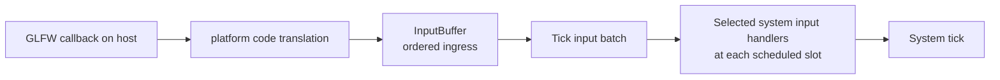

# Input — Design

> Living design doc. S7-D2 settled the local input contract on 2026-09-26.
> The ordered ingress exists; engine codes and scheduled input delivery are unbuilt.

**Module:** `platform` captures and normalizes controls; `app` owns ingress;
`core` schedules simulation readers. **Kind:** engine input mechanism.
**ADRs:** [[ADR-006 — v2 core architecture & module layout]] §1 ·
[[ADR-018 — Main and simulation threads, render-owned GL]] §2 ·
[[ADR-019 — Fixed simulation ticks, render interpolation and shared clock]] §2 (Sep 26 amendment), §4 ·
[[ADR-020 — System scheduling and task-graph execution]] §1 (Sep 26 amendment) ·
[[ADR-022 — Project system composition and self-description]] ·
[[ADR-014 — Events (buffered streams) & StringId]] §7 (Sep 26 amendment)

## Purpose

Give gameplay systems a small v1-like input surface: engine key and button
identifiers, with press, release and held notifications. GLFW and editor UI
callbacks never run simulation code. No action names, binding map or required
command component belongs to this local input slice.

## Decided

| Rule | Source |
|---|---|
| `platform` translates supported GLFW key and mouse-button values into separate engine-owned identifiers before ingress. Unknown controls produce no gameplay notification. | ADR-006 §1; S7-D2 |
| The host publishes value events with capture sequence and monotonic time. `InputBuffer` remains the bounded, ordered cross-thread handoff. | ADR-018 §2; [[Simulation Thread — Design]] |
| Simulation detaches a batch before each fixed Tick. Every interested selected system receives that Tick's input at its scheduled slot before `tick`, under its declared component access. | ADR-020 §1, Sep 26 amendment |
| Press and release retain capture order, even when both occur between ticks. GLFW repeat does not create gameplay presses. | S7-D2; [[Simulation Thread — Design]] |
| Held notifications are generated once per Tick from the resulting held state, after captured events. A press then release in one Tick yields both edges and no held notification. | S7-D2 |
| Focus loss clears held controls; regain starts neutral. Overflow reports a gap and replaces held state without inventing presses or releases. | [[Simulation Thread — Design]]; S7-D2 |
| Input notifications are separate from Scene event streams. They have current-Tick delivery, no Tick-barrier staging, and no Scene `EventTypeId` registration. | ADR-014 §7 and ADR-020 §1, Sep 26 amendments |
| The render-owned presentation input copy remains independent of simulation ingress. Network commands remain ADR-007 §4's separate authority seam. | ADR-019 §4; ADR-007 §4 |

## Delivery

For example, a GLFW W press becomes an engine W-key press in ingress. In the
first Tick that consumes it, a selected movement system sees that press before
its `tick`. That Tick and later Ticks report held while W stays down; the captured release
ends that held state. The names of the C++ types and handler API remain open.

The input batch is read-only for the duration of its Tick. Each selected system
sees the same captured events in sequence order, across key, button, motion and
focus kinds. If one event has several handlers on that system, they run in
declaration order. Held notifications follow captured events in ascending
engine key order, then button order. No Tick means no delivery; catch-up Ticks
each consume and deliver their own batch.

The host callback only normalizes and publishes. Delivery occurs on simulation,
so a handler runs under its own scheduled system's declared access. This does
not recreate v1's global subscription dispatcher or route input through Scene
streams. The future ScriptSystem may expose the same Tick input to scripts at
its scheduled slot; the scripting ADR owns the façade and lifetime details.

## Focus and recovery

A focus transition resets held keys and buttons and the pointer baseline.
While unfocused, key and button events cannot start gameplay input.
[GLFW 3.4](https://www.glfw.org/docs/3.4/group__window.html) generates synthetic
releases after focus loss; these do not become gameplay
release notifications after the reset. Duplicate focus values do not create
another transition. Focus regain begins neutral until new presses arrive.

On overflow, `InputFrame` reports the lost sequence range and latest held/focus
state. Readers receive a recovery notice and resynchronize their own held state.
They receive no invented press or release for the missing events. A transient
edge can therefore be lost visibly under overload. Held notifications reflect
the recovered state from that Tick onward.

## Grounding

At `v1-reference`, `runtime/editor/src/panels/GameView.cpp:65-94` forwards
ImGui input to `Input`; `engine/client/src/input/Input.cpp:37-65` dispatches
key and scroll events through `EventManager`, and `Mouse.cpp:70-95` emits
per-update hold events. The GLFW callback block in `Input.cpp:16-35` is
commented out. The event-facing vocabulary is the prior art; its host-frame
polling and subscription ownership are not the v2 delivery path.

At fetched `origin/master` `742fed7e`, `engine/platform/src/window/Window.cpp:52`
publishes GLFW integers into `InputEvent::code`; `InputState.hpp:10-35` holds
raw code-indexed state; `InputBuffer.cpp:10-57` preserves order and recovery;
`engine/app/src/SimulationThread.cpp:121-130` consumes before each Tick; and
`SimulationContext.hpp:25-32` exposes the frame. No scheduled system input
notification path or script consumer exists. S7-D2 changes design only; no
build, test or demo verified the future delivery.

## Development cards

[[2026-09 Sprint 07 — Scene Events and Input Boundary]] records S7-T9–T12 as
committed Dev cards with done conditions, estimates and ordering. They cover
control translation, scheduled edge delivery, held and focus behavior, and
overflow plus runtime proof. Script delivery awaits the first scripting consumer.

## Open

- Exact type and registration names are implementation choices.
- Scroll and text input need their own consumers; the current `Window` has no
  scroll or character callback. Text must not be inferred from key presses.
- Editor viewport capture needs a reset when ownership leaves gameplay, so
  held state cannot stick. Its routing belongs to the editor UI consumer.
- Configurable bindings and named actions can be designed when a project
  needs them; S7-D2 does not reserve an action mapping layer.
