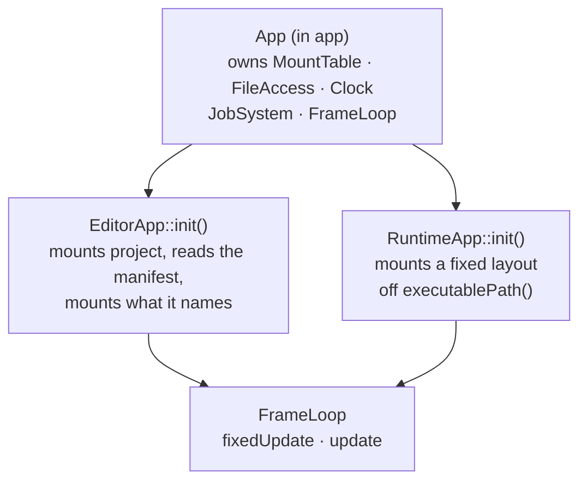

# Project — Design

> Living design doc. The ADR holds the decision that is hard to reverse. This doc holds the *how*.

**Module:** `apps/editor` (exe-local, not a library) · **Kind:** helper service · **Status:** draft, nothing built
**ADRs:** [[ADR-017 — Bootstrapping (editor manifest, fixed runtime layout)]] ·
[[ADR-006 — v2 core architecture & module layout]] §1 §4
**Sibling:** [[File Access — Design]] · **Backlog:** [[Backlog]] → `platform`

## Purpose

A project is a directory with a `project.toml` in it. `Project` is the type that reads that
file and turns it into a mount set. It answers one question: given this root, which physical
directories does the virtual filesystem overlay, and under which aliases.

**It belongs to the editor alone.** A shipped runtime never reads a manifest. It mounts a
fixed layout relative to its own executable, because the editor's export step already
flattened the project into that layout. This is the same seam as ADR-006 §1's "runtime
consumes only baked binary": the manifest is authoring data, and authoring is the editor's job.

### What this fixes from v1

v1 split one logical operation across two types. `Project::loadProject` took a `YAML::Node&`
that `ProjectManager` had already parsed, and `Project::saveProject` returned a node and wrote
nothing. Neither type owned load or save. Both halves lived in the caller.

The rest of the damage followed from that split:

| v1 | Where | Effect |
|---|---|---|
| The project name lived in the `.teproj` **filename**, found by scanning the directory for the extension. It was also a key **inside** the file. | `ProjectManager.cpp:41-46` | Two sources of truth. Renaming the file renamed the project. |
| `loadProject` read `config["Project Name"]` into a local and never stored it. | `ProjectManager.cpp:250-253` | `getProjectConfigs()[ProjectName]` was empty after any normal load. |
| A missing project root silently called `createDefaultProject()`. | `ProjectManager.cpp:37-40` | A typo in the path created a project instead of failing. |
| Every value was a `std::string` in an `unordered_map<ProjectConfig, std::string>`, with an enum-to-string function beside it. | `Project.hpp:31` | No type checking, and a schema change meant editing three places. |
| Paths were keyed by `pathType * 10 + appType` into an `unordered_map<int, path>`. | `Project.cpp:79` | A hand-rolled composite key where the mount table's alias plus priority already does the job. |
| Nothing returned an error. Every failure logged through `TE_LOGGER_ERROR` and carried on with a default. | throughout | The caller could not tell a loaded project from a fabricated one. |

All `path:line` refs above are at the `v1-reference` tag.

## Decided

| What | Call | Ref |
|---|---|---|
| **Audience** | Editor only. The runtime has a fixed bootstrap and never reads a manifest. | ADR-017 § *Decision* 1 |
| **Placement** | `apps/editor/src/project/`, compiled into the editor executable. Not a library. | ADR-017 § *Decision* 2 |
| **Bootstrap seam** | Each executable subclasses `App` and mounts in its `init()`. One `MountTable`, owned by the base. | ADR-017 § *Decision* 3 |
| **Format** | `project.toml`, parsed with toml++ in its non-throwing mode. | [[Roadmap]] § *M3* |
| **Filename** | Fixed. `project.toml`, never a scan for an extension. | Fixes v1's two sources of truth for the name |
| **Schema** | `name`, `shaderDir`, `assetDirs`. Nothing else. | [[Roadmap]] `Roadmap.md:112` |
| **Root** | Derived from the manifest's own location. Never stored inside it. | See *The manifest* |
| **Errors** | A `ProjectResult` enum, returned. No exceptions, no silent defaults. | Mirrors `FileResult`, [[File Access — Design]] § *Resolution* |
| **Load and save** | Both owned by `Project`, both through `FileAccess`. | Fixes v1's split |
| **Toolchain paths** | Not on `Project` and not in the manifest. | See *Why the CMake paths are gone* |
| **Mount authority** | Unchanged. Only the composition root mounts. `Project` returns a list and never calls `mount()`. | [[File Access — Design]] § *Wiring* |
| **New `FileResult` values** | `AlreadyExists` and `NotEmpty`. | See *The five mutating calls* |
| **Missing parents** | `write` does not create them and returns `NotFound`. `createDirectory` does create them. | Answers [[File Access — Design]] § *Open questions* |

## Design

### Where the type lives

`Project` is exe-local editor code, in `apps/editor/src/project/`. The runtime cannot link it
even by mistake, which is the strongest form of "editor only" available.

### Testing an executable

`techengine_test()` links
`TechEngine::<module>` (`cmake/techengine_test.cmake:32`), and no such target exists for an
app. An executable is not linkable either, unless it is given `ENABLE_EXPORTS`, which makes
the shipped game export its symbols to serve a test.

**So each app compiles its sources into an OBJECT library**, and both the exe and its test exe
consume the objects:

```cmake
add_library(editor_obj OBJECT src/project/Project.cpp)
add_executable(editor src/main.cpp $<TARGET_OBJECTS:editor_obj>)
add_executable(TechEngineEditorTests tests/project/ProjectTests.cpp $<TARGET_OBJECTS:editor_obj>)
```

An object library produces no archive and can be nobody's link dependency, so `editor` stays
the leaf executable ADR-006 §1 calls it. A static library would hand out a `.lib` that
something could link against, which is the property §1 wants absent.

The alternative is listing the sources in both executables and compiling them twice. That
duplicates the source list in two places, which is the drift class ADR-008 §2 bans `GLOB` to
prevent (F6).

### `techengine_app()`, as shipped

**S5-T10, 2026-08-31, `76056402`**, in `cmake/techengine_app.cmake`. Arguments: `MAIN` (the
`.cpp` holding `main()`), `SOURCES`, `HEADERS`, `DEPS`, `LIBS` and `TESTS`. It stamps out all
three targets and appends the suite to `TE_TEST_TARGETS`, so app tests reach the coverage
wiring like any module's.

Two calls differ from `techengine_module()`:

- **The exe links the object library target** rather than splicing `$<TARGET_OBJECTS:>` in.
  Linking is what carries the include directories and `DEPS` through as well as the objects.
- **`src/` is PUBLIC** on the object library, where a module keeps it PRIVATE. An app has no
  `include/`, and its only consumers are its own exe and its own suite.

`SOURCES` is required, exactly as on `techengine_module()`. Both apps held nothing but
`main.cpp` when the card was cut, so each was given a placeholder type rather than teaching
the helper to tolerate an empty object library.

**A third tier is the standing alternative.** ADR-006 §1's executable table already composes
the editor as "app + client + core + **tooling**", and `apps/editor/CMakeLists.txt:2` repeats
it, but `tooling` has no row in the library table. The ADR names a tier it never defines. When
M6's asset pipeline needs a home, defining `tooling` and moving `Project` into it is a file
move plus a CMake edit.

### The manifest

```toml
name       = "Sandbox"
shaderDir  = "assets/shaders"
assetDirs  = ["assets/client", "assets/common"]
```

Three keys, and that is the whole schema. Scene binding and the asset registry are M6 work.
Writing them now would design them against a `Scene` and a resource model that do not exist,
which is the mistake [[Roadmap]] § *M3* exists to avoid.

**The root is not in the file.** It is the parent directory of the `project.toml` that was
loaded. A file that stores its own location is wrong the moment the directory is moved or
copied, and v1 stored exactly that as `ProjectConfig::ProjectPath`.

**Every path in the manifest is relative to the root.** It is rejected if it is absolute or
contains a `..` segment. That is the same rule [[File Access — Design]] § *What counts as a
valid path* applies to virtual paths, for the same reason: an absolute path on the right of
`std::filesystem::operator/` discards the left side entirely.

**`assetDirs` is a list because overlay is already the mechanism.** v1 kept three parallel
directory trees, `common`, `client` and `server`, and reached them through a composite integer
key. In v2 they are several physical roots under **one** alias, at descending priority. List
order is priority order, so the first entry wins and later entries are the fallback. The read
path's existence walk then does the shadowing for free.

### Two bootstraps

The editor learns its mounts from a manifest. The runtime is told them at compile time. Both
paths still end at one composition root, so `run()` keeps owning `MountTable` and `FileAccess`.



### The `App` base class

> **Shipped at S5-T11** (2026-08-31, `b6273327`) with **all four virtuals pure**, not just
> `init()`. That contradicts ADR-017 § *Decision* 3 and this section. It is recorded here as a
> live divergence rather than reconciled: an Accepted ADR clause changed value in the code, so
> it owes either a fix or a dated `decision` amendment ([[ADR Index]] § *What is not an
> amendment*, the mirror case). The shape below is what the ADR still decides.


```cpp
// engine/app/include/TechEngine/app/App.hpp
class App {
public:
    virtual ~App() = default;
    int run();                                        // init, loop, shutdown

protected:
    virtual void init() = 0;                          // mounts, systems, resources
    virtual void fixedUpdate(const FrameContext&) {}  // simulation, fixed timestep
    virtual void update(const FrameContext&) {}       // presentation, once per frame
    virtual void shutdown() {}

    MountTable& mounts();
    const EngineContext& engine() const;
};
```

`App` owns the mount table, so `init()` mounts into the one that the loop will use. There is
no second table and no list handed across a boundary. `EditorApp` is the only subclass that
knows what a `Project` is, and it lives in the editor executable beside it.

### The entry point, and what `update()` may not do

**`main()` lives in `<TechEngine/app/EntryPoint.hpp>`**, included exactly once per executable,
and never compiled into the `app` library. `techengine_test(app …)` links
`Catch2::Catch2WithMain`, so a `main()` inside the library gives `TechEngineAppTests` two of
them and it fails to link.

**`update()` never issues a GL call.** It produces a render command list, which the render
thread consumes. The render thread owns the context exclusively (ADR-015 §2), and the name
`update()` is the kind of thing that invites a subclass to draw in it.

**This is what keeps `app` free of `Project`.** The base class never names it. It calls a
virtual, and the editor's override is where the manifest is read.

**`init()` is the only pure virtual.** It is where an executable states its mounts, and no
executable is correct without doing so. `fixedUpdate`, `update` and `shutdown` default to
empty, because a dedicated server genuinely has nothing to put in `update()`.

The two rejected seams, a `std::span<const MountSpec>` parameter and a mount callback, are in
ADR-017 § *Alternatives* with the trade for each.

### The mount set

`EditorApp::init()` runs three steps, because the manifest is itself a file that has to be
read through the VFS.

1. **Bootstrap.** Mount alias `project` at the root taken from `argv`, and `engine` off
   `executablePath()`. The root is known before anything is parsed, so this needs no manifest.
2. **Read.** `Project::load` reads `project://project.toml` through the base class's
   `FileAccess`. No disk path leaves `platform`.
3. **Project mounts.** Add `shaders` and `assets` from what the manifest names, into the same
   table. A mount added after the `EngineContext` is built is still visible through it, which
   [[File Access — Design]] § *Wiring* pins with a Catch2 case.

The v1 set, at `ProjectManager.cpp:262-271` @ `v1-reference`, maps onto this as follows.

| v1 alias | v2 alias | Physical root | Rung |
|---|---|---|---|
| `editorAssets://` | `engine` | `executablePath()/assets` | M3 |
| `editorAssetsClient://` | `assets` | Each entry of `assetDirs`, relative to the root | M3 |
| (none) | `shaders` | `shaderDir`, relative to the root | M3 |
| (none) | `project` | The root itself, for the manifest | M3 |
| `projectResources://` | `resources` | The bake output directory | Deferred to M6 |
| `projectCache://` | `cache` | The build and import cache | Deferred to the scripting rung |

`resources` and `cache` are deferred rather than dropped. Neither has a consumer until baking
and script compilation are real, and mounting a directory nothing reads is how v1 ended up
with a mount set nobody could explain.

### Two v1 defects the port must not inherit

- **The aliases are stored bare, with no `://`.** v1 wrote `mount("editorAssets://", ...)`,
  which stores the separator as part of the key so no virtual path can ever match it. That is
  [[Known Issues]] **D2**, still open, and S5-T2 fixes it with a `TE_CHECK` in `mount()`. The
  fix has to land **before** this port, or the port writes the defect into the design.
- **`executablePath()`, never `current_path()`.** v1 built its runtime paths from
  `std::filesystem::current_path()` (`ProjectManager.hpp:51`), which breaks the moment the
  binary is launched from another working directory. S5-T1's clause bans the fallback outright.

### The five mutating calls

All five land on `FileAccess`, all return `FileResult`, and all resolve through
`MountTable::resolveForCreate`. That is the write path, so the highest-priority mount for the
alias wins and existence is never probed ([[File Access — Design]] § *Resolution*).

| Call | Signature | Destination exists | Missing parent |
|---|---|---|---|
| `createDirectory` | `(virtualPath)` | `AlreadyExists` | Created. This is the call whose job that is. |
| `remove` | `(virtualPath, bool recursive)` | not applicable | `NotFound` |
| `copy` | `(from, to)` | `AlreadyExists` | `NotFound` |
| `move` | `(from, to)` | `AlreadyExists` | `NotFound` |
| `rename` | `(virtualPath, newName)` | `AlreadyExists` | not applicable |

**`move` and `rename` are one syscall and two call sites.** `rename` takes a bare leaf name
with no separator in it, and fails validation if it contains one. `move` takes a full
destination virtual path, which may sit under a different alias. Keeping both means neither
call site has to rebuild a path just to change a name.

**`remove` takes a `recursive` flag, mirroring `list`.** A non-recursive `remove` on a
directory that still has contents returns `NotEmpty`. Recursive delete is not the default,
because in an editor the call is usually reached from a user clicking a folder.

**Two new `FileResult` values, not one.** `AlreadyExists` was agreed. `NotEmpty` follows the
same rule and is flagged here because it was not: the enum exists so a caller can *act* on the
answer, and "retry with `recursive`" is an action a collapsed `IoError` takes away. This is
the same argument that made `NoMount` and `NotFound` separate values.

### Missing parent directories

[[File Access — Design]] § *Open questions* asked whether `write` should create missing parent
directories, and left it to be decided alongside `createDirectory`. It is decided here.

**`write` does not create them, and stops returning `IoError` when they are missing.** It
checks the parent before opening the stream and returns `NotFound`. On the write path
`NotFound` is unambiguous, because `write` creates its target file and so has no other reason
to report something missing.

The reasoning is that a strict `write` fails loudly on a typo'd path instead of quietly
building a directory tree nobody asked for. Once `createDirectory` exists, a caller who does
want the tree has a one-line way to say so, and the intent is visible at the call site.

### Load and save

```cpp
enum class ProjectResult : std::uint8_t { Ok, ReadFailed, ParseFailed, SchemaInvalid };

class Project {
public:
    static ProjectResult load(const FileAccess& files, std::string_view manifestPath, Project& out);
    ProjectResult save(FileAccess& files, std::string_view manifestPath) const;

    const std::string& name() const;
    // shaderDir, assetDirs, and the mount list built from them
};
```

`Project` owns both halves. Neither hands a half-parsed document back to a caller, which is
the v1 shape this replaces.

`load` is `static` and fills an out-param, so a failed load cannot leave a half-populated
`Project` behind. The pattern matches `FileAccess`, which returns a result and fills an
out-param rather than returning a value that has to encode failure.

**toml++ must be used in its non-throwing form**, through `toml::parse_result` rather than the
throwing `toml::parse`. The card's clause is that a malformed file returns a defined error,
and the library's default is an exception.

**The four results are distinguishable on purpose.** `ReadFailed` means `FileAccess` could not
produce bytes. `ParseFailed` means the bytes are not TOML. `SchemaInvalid` means it is valid
TOML with a key missing, of the wrong type, or holding a path that escapes the root. An editor
reports these three very differently.

### Why the CMake paths are gone

v1's `ProjectManager` carried four toolchain fields. Their only consumer was `ScriptsCompiler`
(`ScriptsCompiler.cpp:38-64` @ `v1-reference`), which shelled out to CMake to build the
project's gameplay scripts.

They do not come back, and the state they were in is most of the argument:

- `m_cmakePath` was hardcoded to `"C:/Program Files/CMake/bin/cmake.exe"`, quotes included, at
  `ProjectManager.hpp:35`. That is one machine's install path compiled into the editor.
- `m_techEngineClientLibPath` and `m_techEngineServerLibPath` were declared and **never
  assigned** anywhere in the file.
- `getCmakeListPath()` ignored the field it named and returned `m_assetsPath`
  (`ProjectManager.cpp:190`). The field stayed empty.

Only `getCmakeBuildPath()` did real work, and it derived its answer from the cache directory
rather than storing anything.

**The split that replaces them.** A build directory is derivable from the root, so it is
computed where it is needed. A `cmake.exe` location is per-machine user configuration, not
project data, and it must not ship inside a file that travels with the project. Both belong to
the scripting rung, and neither belongs in `project.toml`, which [[Roadmap]] `Roadmap.md:112`
pins to root, name, shader dir and asset dirs.

## Open questions

- **Where per-user settings live.** The `cmake.exe` path needs a home that is not
  `project.toml` and is not committed. Owner: the scripting rung, when `ScriptsCompiler`'s
  replacement is carded.
- **Creating a project.** v1's `createProject` laid out nine directories and copied a template
  tree. Nothing needs it until the editor has UI, and `projects/dev/` is committed by hand.
- **Exporting a project.** v1's `exportProject` is what produces the fixed layout the runtime
  bootstrap assumes. Owner: M6, with baking.
- **`assetDirs` and the client/server split.** One alias with overlay priority covers the M3
  testbed. Whether a dedicated server wants a separate alias is netcode's question, not M3's.
- **Reloading.** Editing `project.toml` while the editor runs does nothing today. It needs the
  file watching that [[File Access — Design]] § *Open questions* already defers.

## Consequences

- **S5-T5's `done:` clause contradicts this note and needs rewording.** It reads "the runtime
  loads it by default". With the manifest editor-only, `projects/dev/` is the **editor's**
  testbed, and the runtime's leg of that card is the fixed bootstrap instead.
- **S5-T2 becomes a hard prerequisite of the mount port**, not just an ordering preference.
  [[Known Issues]] D2 is the exact defect the v1 alias spelling carries in.
- **`FileResult` gains two values**, so [[File Access — Design]] § *The read surface* needs its
  enum listing updated when S5-T3 lands.
- **`run()` becomes the `App` base class**, so both `main()` files and the whole composition
  root change shape. That is S5-T5's work, and it is the largest single edit in Story B.
- **The editor moves into the frame loop**, which partially supersedes ADR-006 §1's editor
  row. Rowed in [[ADR Index]] § *Partial supersessions*. That row's clause fixes
  [[v1 Code Audit]] **F14**, so ADR-017 § *Consequences* carries why the reversal is safe and
  what it costs.
- **A `techengine_app()` helper is new build work** that every app needs, not just the editor.
  It is a prerequisite of S5-T4's Catch2 cases.

## References

- [[File Access — Design]] — the VFS this sits on. § *Resolution*, § *The write surface*,
  § *What counts as a valid path*.
- [[ADR-017 — Bootstrapping (editor manifest, fixed runtime layout)]] — the three decisions
  this note builds the *how* for, plus the alternatives and the reversal triggers.
- [[ADR-006 — v2 core architecture & module layout]] §1 (module and executable graph, and the
  undefined `tooling` tier) · §4 (composition root and `EngineContext`)
- [[Roadmap]] § *M3 — the dev testbed* (`Roadmap.md:105-114`) for the minimal-manifest rule.
- [[Known Issues]] **D2** (alias validation, blocks the mount port) · **D3** (symlinks)
- v1 prior art at the `v1-reference` tag: `runtime/editor/src/project/Project.cpp` ·
  `runtime/editor/src/project/ProjectManager.cpp` ·
  `runtime/editor/src/scripting/ScriptsCompiler.cpp`
- Code, once it exists: `apps/editor/src/project/`. The composition root is
  `engine/app/src/App.cpp:82`, and the demo mount it replaces is at line 95.
