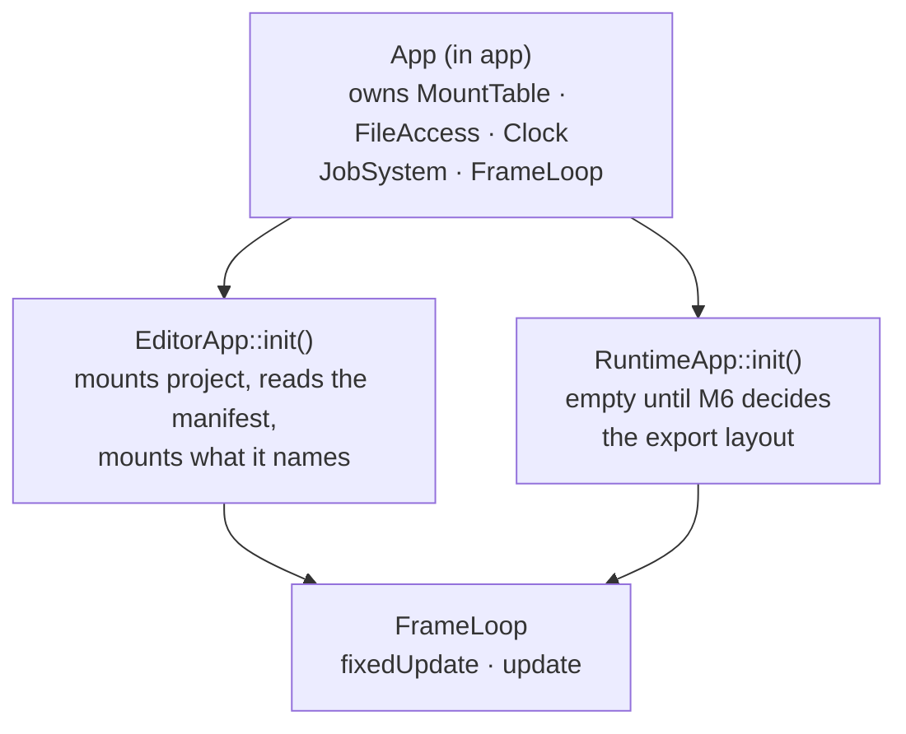

# Project — Design

> Living design doc. The ADR holds the decision that is hard to reverse. This doc holds the *how*.

**Module:** `apps/editor` (exe-local, not a library) · **Kind:** helper service · **Status:** built — `techengine_app()` and the `App` base class at S5-T10 and S5-T11, the `Project` type at S5-T4 (2026-09-04, `e0495146`). The bootstrap that consumes it is S5-T5, open.
**ADRs:** [[ADR-017 — Bootstrapping (editor manifest, fixed runtime layout)]] ·
[[ADR-006 — v2 core architecture & module layout]] §1 §4
**Sibling:** [[File Access — Design]] · **Backlog:** [[Backlog]] → `platform`

## Purpose

A project is a directory with a `project.toml` in it. `Project` is the type that reads and
writes that file, and it answers two questions: what is this project called, and where is its
root. Which physical directories the virtual filesystem overlays follows from that root by
convention, and the editor's bootstrap does that derivation
(§ *The project layout*, § *Why `Project` does not mount*).

**It belongs to the editor alone.** A shipped runtime never reads a manifest. It mounts a
fixed layout relative to its own executable, because the editor's export step already
flattened the project into that layout. This is the same seam as ADR-006 §1's "runtime
consumes only baked binary": the manifest is authoring data, and authoring is the editor's job.

### What this fixes from v1

v1 split one logical operation across two types. `Project::loadProject` took a `YAML::Node&`
that `ProjectManager` had already parsed, and `Project::saveProject` returned a node and wrote
nothing. Neither type owned load or save. Both halves lived in the caller.

The rest of the damage followed from that split:

| v1 | Where | Effect |
|---|---|---|
| The project name lived in the `.teproj` **filename**, found by scanning the directory for the extension. It was also a key **inside** the file. | `ProjectManager.cpp:41-46` | Two sources of truth. Renaming the file renamed the project. |
| `loadProject` read `config["Project Name"]` into a local and never stored it. | `ProjectManager.cpp:250-253` | `getProjectConfigs()[ProjectName]` was empty after any normal load. |
| A missing project root silently called `createDefaultProject()`. | `ProjectManager.cpp:37-40` | A typo in the path created a project instead of failing. |
| Every value was a `std::string` in an `unordered_map<ProjectConfig, std::string>`, with an enum-to-string function beside it. | `Project.hpp:31` | No type checking, and a schema change meant editing three places. |
| Paths were keyed by `pathType * 10 + appType` into an `unordered_map<int, path>`. | `Project.cpp:79` | A hand-rolled composite key where the mount table's alias plus priority already does the job. |
| Nothing returned an error. Every failure logged through `TE_LOGGER_ERROR` and carried on with a default. | throughout | The caller could not tell a loaded project from a fabricated one. |

All `path:line` refs above are at the `v1-reference` tag.

## Decided

| What | Call | Ref |
|---|---|---|
| **Audience** | Editor only. The runtime has a fixed bootstrap and never reads a manifest. | ADR-017 § *Decision* 1 |
| **Placement** | `apps/editor/src/project/`, compiled into the editor executable. Not a library. | ADR-017 § *Decision* 2 |
| **Bootstrap seam** | Each executable subclasses `App` and mounts in its `init()`. One `MountTable`, owned by the base. | ADR-017 § *Decision* 3 |
| **Format** | `project.toml`, parsed with toml++ in its non-throwing mode. | [[Roadmap]] § *M3* |
| **Filename** | Fixed. `project.toml`, never a scan for an extension. | Fixes v1's two sources of truth for the name |
| **Schema** | `name`. Nothing else. Supersedes [[Roadmap]] `Roadmap.md:112`, which still lists four keys. | See *The manifest* |
| **Root** | Derived from the manifest's own location. Never stored inside it. | See *The manifest* |
| **Errors** | A `ProjectResult` enum, returned. No exceptions, no silent defaults. | Mirrors `FileResult`, [[File Access — Design]] § *Resolution* |
| **Load and save** | Both owned by `Project`, both through `FileAccess`. | Fixes v1's split |
| **Toolchain paths** | Not on `Project` and not in the manifest. | See *Why the CMake paths are gone* |
| **Mount authority** | Only the composition root mounts, and `Project` carries no mount knowledge at all. | See *Why `Project` does not mount* |
| **New `FileResult` values** | `AlreadyExists` and `NotEmpty`. | See *The five mutating calls* |
| **Missing parents** | `write` does not create them and returns `NotFound`. `createDirectory` does create them. | Answers [[File Access — Design]] § *Open questions* |
| **Layout** | The root holds `project.toml`, `shaders/` and an `assets/` split into `common`, `client` and `server`. | See *The project layout* |
| **Which roots a role mounts** | Derived from the root, not configured. `shaders/`, then `assets/common` at priority 0 and `assets/<side>` at 100. | See *The project layout* |
| **Creation** | The directories plus the manifest, and nothing else. No template tree is copied. | See *Why no template tree* |

## Design

### Where the type lives

`Project` is exe-local editor code, in `apps/editor/src/project/`. The runtime cannot link it
even by mistake, which is the strongest form of "editor only" available.

### Testing an executable

`techengine_test()` links
`TechEngine::<module>` (`cmake/techengine_test.cmake:32`), and no such target exists for an
app. An executable is not linkable either, unless it is given `ENABLE_EXPORTS`, which makes
the shipped game export its symbols to serve a test.

**So each app compiles its sources into an OBJECT library**, and both the exe and its test exe
consume the objects:

```cmake
add_library(editor_obj OBJECT src/project/Project.cpp)
add_executable(editor src/main.cpp)
target_link_libraries(editor PRIVATE editor_obj)
add_executable(TechEngineEditorTests tests/project/ProjectTests.cpp)
target_link_libraries(TechEngineEditorTests PRIVATE editor_obj Catch2::Catch2WithMain)
```

The consumers **link** the object library rather than splicing `$<TARGET_OBJECTS:>` in, because
linking carries the include directories and the dependencies through as well as the objects.
That is what shipped. See § *`techengine_app()`, as shipped*.

An object library produces no archive and can be nobody's link dependency, so `editor` stays
the leaf executable ADR-006 §1 calls it. A static library would hand out a `.lib` that
something could link against, which is the property §1 wants absent.

The alternative is listing the sources in both executables and compiling them twice. That
duplicates the source list in two places, which is the drift class ADR-008 §2 bans `GLOB` to
prevent (F6).

### `techengine_app()`, as shipped

**S5-T10, 2026-08-31, `76056402`**, in `cmake/techengine_app.cmake`. Arguments: `MAIN` (the
`.cpp` holding `main()`), `SOURCES`, `HEADERS`, `DEPS`, `LIBS` and `TESTS`. It stamps out all
three targets and appends the suite to `TE_TEST_TARGETS`, so app tests reach the coverage
wiring like any module's.

Two calls differ from `techengine_module()`:

- **The exe links the object library target** rather than splicing `$<TARGET_OBJECTS:>` in.
  Linking is what carries the include directories and `DEPS` through as well as the objects.
- **`src/` is PUBLIC** on the object library, where a module keeps it PRIVATE. An app has no
  `include/`, and its only consumers are its own exe and its own suite.

`SOURCES` is required, exactly as on `techengine_module()`. Both apps held nothing but
`main.cpp` when the card was cut, so each was given a placeholder type rather than teaching
the helper to tolerate an empty object library.

**A third tier is the standing alternative.** ADR-006 §1's executable table already composes
the editor as "app + client + core + **tooling**", but `tooling` has no row in the library
table. The ADR names a tier it never defines. `apps/editor/CMakeLists.txt:2` used to repeat the
same composition and no longer does: S5-T10 rewrote it to "app + client + core", recording that
ADR-017 created no `tooling` tier. The argument stands on the ADR alone now. When
M6's asset pipeline needs a home, defining `tooling` and moving `Project` into it is a file
move plus a CMake edit.

### The manifest

```toml
name = "Sandbox"
```

**One key, and that is the whole schema.** Decided 2026-09-04, when § *The project layout*
made the directories a convention. `shaderDir` and `assetDirs` were dropped the same day: once
the bootstrap derives every root from the project root, a manifest key naming those directories
is configuration nothing varies, and half-convention is worse than either extreme. Scene
binding and the asset registry stay M6 work.

**The manifest holds no paths at all**, which removes a whole class of validation. There is no
absolute path to reject and no `..` segment to catch, because the only path the type handles is
the root it derives.

**The root is not in the file.** It is the parent directory of the `project.toml` that was
loaded. A file that stores its own location is wrong the moment the directory is moved or
copied, and v1 stored exactly that as `ProjectConfig::ProjectPath`.

**So why keep a manifest.** Its presence is what marks a directory as a project root, it is
the one home for the name, and it is where M6's scene binding and asset registry land. A
launcher scanning for projects looks for this file.

**The overlay is still what makes the split work.** v1 kept the same three trees but reached
them through a composite integer key, `pathType * 10 + appType` (`Project.cpp:79` @
`v1-reference`). In v2 the two roots a role selects sit under **one** alias at descending
priority, so the read path's existence walk does the shadowing for free and no caller builds a
key.

### The project layout

**A created project is a manifest, a three-way `assets/` split and `shaders/`. Nothing is
copied into it.**

```
MyGame/
  project.toml
  assets/
    common/
    client/
    server/
  shaders/
```

Creation writes those directories and the manifest, then stops. Decided 2026-09-04.

**Why the split lands before the server does.** ADR-006 §2 already decides that a dedicated
server is `app + core` plus `net` and links no `client`, and `FrameContext.hpp:9` already ships
`Role::Client · ListenServer · DedicatedServer`. The layout is where that seam meets the disk.
Deciding it later is cheap in plumbing and expensive in people: `resolveExisting` probes every
entry for an alias in priority order (`engine/platform/src/files/MountTable.cpp:85-103`), so
`assets://meshes/cube.temesh` resolves wherever the file sits, but somebody still has to
classify every existing asset by hand long after its author has moved on. The split buys the
classification, not the plumbing.

**The directories are a convention, not configuration.** Every root is derived from the project
root, so the manifest names none of them: `shaders/`, then `assets/common` at priority 0 and
`assets/<side>` at 100, where the side comes from the role. That is what reduced the schema to
one key (§ *The manifest*). The names live in `EditorApp::init()`, which is the one place to
read for the whole mount set, and `Project` never holds them.

| Executable | Mounts under `assets` |
|---|---|
| `runtime` as a client, and the editor | `assets/common`, then `assets/client` |
| `runtime-server`, when netcode lands (ADR-006 §1) | `assets/common`, then `assets/server` |
| `runtime` as a listen-server | Open. It runs authoritative sim, so it may need both. |

**The editor mounts what a client mounts**, so play-in-editor sees what a shipped client sees.
It needs no view of `assets/server`. Export is a bake and package step run over the server
directory, and it produces the layout the runtime bootstrap reads (§ *Open questions*). A step
that walks a directory to produce a package does not need that directory resolvable through the
`assets` alias.

**`shaders/` is not split.** A dedicated server loads no shaders, so that directory is
client-side by nature and needs no marker.

### Why no template tree

v1's `templates/project/` held **588 files**, and 7 of them were anything like a starter. The
tree fused four unrelated things into one recursive copy, so every created project carried the
engine's own content and could then drift from it.

| v1 template part | Files | Where it goes in v2 |
|---|---|---|
| Vendored GLM, `Find*.cmake` | 538 | The scripting rung's toolchain. See § *Why the CMake paths are gone*. |
| Engine shaders | 36 | Shared through the `engine` alias, never copied. Fixes [[v1 Code Audit]] **F27**. |
| `.idea/` IDE config | 7 | Nowhere. An engine does not author a user's IDE state. |
| Default material, cube mesh | 2 | The `engine` mount, as editor defaults. |
| Script scaffold, UI yaml | 5 | The scripting rung, when it has a card. |

**`resources/` and `cache/` get no directory yet.** Both are deferred mount-set rows
(§ *The mount set*), and neither has a settled definition. See § *Open questions*.

**This is what `projects/dev/` commits at S5-T5**, and what the project launcher later writes
([[Backlog]] → *editor & tooling*).

### Two bootstraps

The editor learns its mounts from a manifest. The runtime will be told them by the export
layout, which M6 decides, and mounts nothing until then (§ *Open questions*). Both paths still
end at one composition root, so `run()` keeps owning `MountTable` and `FileAccess`.



### The `App` base class

> **Shipped at S5-T11** (2026-08-31, `b6273327`) with **all four virtuals pure**, not just
> `init()`. That contradicts ADR-017 § *Decision* 3 and this section. It is recorded here as a
> live divergence rather than reconciled: an Accepted ADR clause changed value in the code, so
> it owes either a fix or a dated `decision` amendment ([[ADR Index]] § *What is not an
> amendment*, the mirror case). The shape below is what the ADR still decides.


```cpp
// engine/app/include/TechEngine/app/App.hpp
class App {
public:
    virtual ~App() = default;
    int run();                                        // init, loop, shutdown

protected:
    virtual void init() = 0;                          // mounts, systems, resources
    virtual void fixedUpdate(const FrameContext&) {}  // simulation, fixed timestep
    virtual void update(const FrameContext&) {}       // presentation, once per frame
    virtual void shutdown() {}

    MountTable& mounts();
    const EngineContext& engine() const;
};
```

`App` owns the mount table, so `init()` mounts into the one that the loop will use. There is
no second table and no list handed across a boundary. `EditorApp` is the only subclass that
knows what a `Project` is, and it lives in the editor executable beside it.

### The entry point, and what `update()` may not do

**`main()` lives in `<TechEngine/app/EntryPoint.hpp>`**, included exactly once per executable,
and never compiled into the `app` library. `techengine_test(app …)` links
`Catch2::Catch2WithMain`, so a `main()` inside the library gives `TechEngineAppTests` two of
them and it fails to link.

**`update()` never issues a GL call.** It produces a render command list, which the render
thread consumes. The render thread owns the context exclusively (ADR-015 §2), and the name
`update()` is the kind of thing that invites a subclass to draw in it.

**This is what keeps `app` free of `Project`.** The base class never names it. It calls a
virtual, and the editor's override is where the manifest is read.

**`init()` is the only pure virtual.** It is where an executable states its mounts, and no
executable is correct without doing so. `fixedUpdate`, `update` and `shutdown` default to
empty, because a dedicated server genuinely has nothing to put in `update()`.

The two rejected seams, a `std::span<const MountSpec>` parameter and a mount callback, are in
ADR-017 § *Alternatives* with the trade for each.

### The mount set

`EditorApp::init()` runs three steps, because the manifest is itself a file that has to be
read through the VFS.

1. **Bootstrap.** Mount alias `project` at the root taken from `argv`, and `engine` off
   `executablePath()`. The root is known before anything is parsed, so this needs no manifest.
   With no argument the editor opens `projects/dev` from the working directory, a development
   default the launcher replaces ([[Backlog]] → *editor & tooling*).
2. **Read.** `Project::load` reads `project://project.toml` through the base class's
   `FileAccess`. No disk path leaves `platform`.
3. **Project mounts.** Derive the three roots from `project.root()` and add them to the same
   table (§ *The project layout*). A mount added after the `EngineContext` is built is still
   visible through it, which [[File Access — Design]] § *Wiring* pins with a Catch2 case.

The v1 set, at `ProjectManager.cpp:262-271` @ `v1-reference`, maps onto this as follows.

| v1 alias | v2 alias | Physical root | Rung |
|---|---|---|---|
| `editorAssets://` | `engine` | `executablePath()/assets` | M3 |
| `editorAssetsClient://` | `assets` | `<root>/assets/common` at priority 0, `<root>/assets/<side>` at 100 | M3 |
| (none) | `shaders` | `<root>/shaders` | M3 |
| (none) | `project` | The root itself, for the manifest | M3 |
| `projectResources://` | `resources` | The bake output directory | Deferred to M6 |
| `projectCache://` | `cache` | The build and import cache | Deferred to the scripting rung |

`resources` and `cache` are deferred rather than dropped, and what they mean is itself open
(§ *Open questions*). Mounting a directory nothing reads is how v1 ended up with a mount set
nobody could explain.

### Why `Project` does not mount

`Project` reaches the mount table for **reading**, through the `const FileAccess&` that
`load` takes. It never writes to it, and it holds no method that produces a mount list either.

**The reason is legibility, not thread safety, and the distinction matters.**
[[File Access — Design]] § *Threading* constrains **when** mounting happens, not **who** does
it: everything mounts before the loop starts, so the table is frozen for every concurrent
reader. A `Project` that mounted during `EditorApp::init()` would satisfy that perfectly well.

What it would cost is the single place to read. `EditorApp::init()` assembles the whole mount
set in a few explicit `mount()` calls, and a reader sees all of it there. A `mountInto()` on
`Project` would hide half the set one level down for one caller's benefit. The alternative
returns if a second bootstrap ever needs the same derivation, and today none does: the runtime
mounts an exported fixed layout and reads no manifest (ADR-017 § *Decision* 1).

### Two v1 defects the port must not inherit

- **The aliases are stored bare, with no `://`.** v1 wrote `mount("editorAssets://", ...)`,
  which stores the separator as part of the key so no virtual path can ever match it. S5-T2
  closed that on 2026-09-01: `mount()` now rejects an empty alias, a `/` and a `:` with three
  fatal `TE_CHECK`s, so the v1 spelling cannot reach the table at all.
- **`executablePath()`, never `current_path()`.** v1 built its runtime paths from
  `std::filesystem::current_path()` (`ProjectManager.hpp:51`), which breaks the moment the
  binary is launched from another working directory. S5-T1 shipped the replacement on
  2026-09-03, and no `current_path()` remains under `engine/` or `apps/`.

### The five mutating calls

All five land on `FileAccess` and all return `FileResult`. **Destinations** resolve through
`MountTable::resolveForCreate`. That is the write path, so the highest-priority mount for the
alias wins and existence is never probed ([[File Access — Design]] § *Resolution*).

**Sources resolve through `resolveExisting` instead, decided 2026-09-03 at S5-T3.** `copy`,
`move` and `rename` each name a path that must already exist. `resolveForCreate` takes the top
mount and stops, so a source held by a lower-priority mount in an overlay would resolve to a
path that is not there and return `NotFound` for a file the caller can read. Probing is the
whole reason the read path exists.

| Call | Signature | Destination exists | Missing parent |
|---|---|---|---|
| `createDirectory` | `(virtualPath)` | `AlreadyExists`, whether what is there is a directory or a file. | Created. This is the call whose job that is. |
| `remove` | `(virtualPath, bool recursive)` | not applicable | `NotFound` |
| `copy` | `(from, to)` | `AlreadyExists` | `NotFound` |
| `move` | `(from, to)` | `AlreadyExists` | `NotFound` |
| `rename` | `(virtualPath, newName)` | `AlreadyExists` | not applicable |

**`newName` is one path component, never a path.** Empty, `.`, `..`, or anything carrying `/`
or `\\` returns `InvalidPath`, checked before the source is resolved. Decided at S5-T3 on
2026-09-03: accepting a separator would turn `rename` into a `move` that skips the
destination's mount resolution.

**`move` and `rename` are one syscall and two call sites.** `rename` takes a bare leaf name
with no separator in it, and fails validation if it contains one. `move` takes a full
destination virtual path, which may sit under a different alias. Keeping both means neither
call site has to rebuild a path just to change a name.

**`remove` takes a `recursive` flag, mirroring `list`.** A non-recursive `remove` on a
directory that still has contents returns `NotEmpty`. Recursive delete is not the default,
because in an editor the call is usually reached from a user clicking a folder.

**Two new `FileResult` values, not one.** `AlreadyExists` was agreed. `NotEmpty` follows the
same rule and is flagged here because it was not: the enum exists so a caller can *act* on the
answer, and "retry with `recursive`" is an action a collapsed `IoError` takes away. This is
the same argument that made `NoMount` and `NotFound` separate values.

### Missing parent directories

[[File Access — Design]] § *Open questions* asked whether `write` should create missing parent
directories, and left it to be decided alongside `createDirectory`. It is decided here.

**`write` does not create them, and stops returning `IoError` when they are missing.** It
checks the parent before opening the stream and returns `NotFound`. On the write path
`NotFound` is unambiguous, because `write` creates its target file and so has no other reason
to report something missing.

The reasoning is that a strict `write` fails loudly on a typo'd path instead of quietly
building a directory tree nobody asked for. Once `createDirectory` exists, a caller who does
want the tree has a one-line way to say so, and the intent is visible at the call site.

### Load and save

```cpp
enum class ProjectResult : std::uint8_t { Ok, ReadFailed, WriteFailed, ParseFailed, SchemaInvalid };

class Project {
public:
    ProjectResult load(const FileAccess& files, std::string_view manifestPath);
    ProjectResult save(FileAccess& files, std::string_view manifestPath) const;

    const std::filesystem::path& root() const;
    const std::string& name() const;
};
```

`Project` owns both halves. Neither hands a half-parsed document back to a caller, which is
the v1 shape this replaces.

`load` writes `m_root` and `m_name` last, on the success path only, so a failed load leaves
the object as it was. It was a `static` with an out-param, matching `FileAccess`'s shape,
until S5-T5 (#71) made it a member so `EditorApp` can hold the loaded `Project` directly.

**toml++ must be used in its non-throwing form**, and that is a build setting rather than a
call choice. `TOML_EXCEPTIONS` defaults to 1 whenever the compiler has exceptions, and in that
mode `toml::parse_result` is a plain **alias for `toml::table`** — so a failure check against
it compiles, never fires, and `parse()` throws instead. Wired at S5-T4 on 2026-09-04 as
`TechEngine::tomlplusplus` in `cmake/deps.cmake`, an INTERFACE wrapper carrying
`TOML_EXCEPTIONS=0`. Consumers link the wrapper, never the upstream target.

**The four failure results are distinguishable on purpose.** `ReadFailed` means `FileAccess`
could not produce bytes, which also covers a `manifestPath` the mount table refuses.
`WriteFailed` is its mirror on `save`, added at S5-T4 because the original four had no value
for a failed write and `save` would otherwise have reported a read error. `ParseFailed` means
the bytes are not TOML. `SchemaInvalid` means it is valid TOML with `name` missing or not a
string. An editor reports these four very differently.

**An empty file is not a parse error.** It is valid TOML and parses to an empty table, so it
lands on `SchemaInvalid` for the missing `name`.

### Why the CMake paths are gone

v1's `ProjectManager` carried four toolchain fields. Their only consumer was `ScriptsCompiler`
(`ScriptsCompiler.cpp:38-64` @ `v1-reference`), which shelled out to CMake to build the
project's gameplay scripts.

They do not come back, and the state they were in is most of the argument:

- `m_cmakePath` was hardcoded to `"C:/Program Files/CMake/bin/cmake.exe"`, quotes included, at
  `ProjectManager.hpp:35`. That is one machine's install path compiled into the editor.
- `m_techEngineClientLibPath` and `m_techEngineServerLibPath` were declared and **never
  assigned** anywhere in the file.
- `getCmakeListPath()` ignored the field it named and returned `m_assetsPath`
  (`ProjectManager.cpp:190`). The field stayed empty.

Only `getCmakeBuildPath()` did real work, and it derived its answer from the cache directory
rather than storing anything.

**The split that replaces them.** A build directory is derivable from the root, so it is
computed where it is needed. A `cmake.exe` location is per-machine user configuration, not
project data, and it must not ship inside a file that travels with the project. Both belong to
the scripting rung, and neither belongs in `project.toml`, which [[Roadmap]] `Roadmap.md:112`
pins to root, name, shader dir and asset dirs.

## Open questions

- **Where per-user settings live.** The `cmake.exe` path needs a home that is not
  `project.toml` and is not committed. Owner: the scripting rung, when `ScriptsCompiler`'s
  replacement is carded.
- **Creating a project.** **What** it writes is decided in § *The project layout*. **Who**
  writes it is the editor's project launcher ([[Backlog]] → *editor & tooling*), and nothing
  has a screen to put it on until the first editor UI card. `projects/dev/` is committed by
  hand until then.
- **Exporting a project.** v1's `exportProject` is what produces the fixed layout the runtime
  bootstrap assumes. Owner: M6, with baking.
- **What the runtime mounts.** Deferred 2026-09-04 until the package format exists, because
  the layout beside the exe is whatever export writes. Until then `RuntimeApp::init()` mounts
  nothing, and the runtime row in § *The project layout* is a placeholder. Owner: M6.
- **What a listen-server mounts.** ADR-006 §2 makes a listen-server the `runtime` client also
  running authoritative sim, so it may need `assets/server` as well as `assets/client`.
  `Role::ListenServer` ships in `FrameContext.hpp:9` and nothing maps it to roots yet. Owner:
  netcode.
- **What `resources/` and `cache/` are, and where they live.** Neither directory is created
  today. Two constraints are already set. Editor content is **not** project data and has a home
  in the `engine` alias, off `executablePath()`. And a cache must hold only regenerable output
  that is safe to delete: v1 broke that by keeping vendored GLM and `Find*.cmake` under
  `cache/`, so emptying it broke the project. Owner: M6 for `resources`, the scripting rung for
  `cache`.
- **Authoring a server-only asset.** The editor mounts no `assets/server`, so nothing in its UI
  can create or edit one. Whether that matters depends on what a server-only asset turns out to
  be, which netcode decides.
- **Reloading.** Editing `project.toml` while the editor runs does nothing today. It needs the
  file watching that [[File Access — Design]] § *Open questions* already defers.

## Consequences

- **S5-T5's `done:` clause was reworded on 2026-08-31**, on [[Sprint Board]] and in the sprint
  note. It had read "the runtime loads it by default". With the manifest editor-only,
  `projects/dev/` is the **editor's** testbed, and the runtime's leg of that card is the fixed
  bootstrap instead.
- **S5-T5 now also commits the layout**, not just the mount set. `projects/dev/` gets the
  three-way `assets/` split and `shaders/`, and `EditorApp::init()` derives its three roots
  from `project.root()` rather than mounting what the manifest names. The card's `done:` clause
  was reworded for both on 2026-09-04.
- **S5-T2 becomes a hard prerequisite of the mount port**, not just an ordering preference.
  The v1 alias spelling carries the defect in. **Closed 2026-09-01.**
- **`FileResult` gained two values** at S5-T3 on 2026-09-03, and [[File Access — Design]]
  § *The read surface* carries them. That note's header and *Decided* table still call the
  mutating half future work, which is carded on [[Backlog]] → `platform`.
- **`run()` becomes the `App` base class**, so both `main()` files and the whole composition
  root change shape. That is S5-T5's work, and it is the largest single edit in Story B.
- **The editor moves into the frame loop**, which partially supersedes ADR-006 §1's editor
  row. Rowed in [[ADR Index]] § *Partial supersessions*. That row's clause fixes
  [[v1 Code Audit]] **F14**, so ADR-017 § *Consequences* carries why the reversal is safe and
  what it costs.
- **A `techengine_app()` helper is new build work** that every app needs, not just the editor.
  It is a prerequisite of S5-T4's Catch2 cases.

## References

- [[File Access — Design]] — the VFS this sits on. § *Resolution*, § *The write surface*,
  § *What counts as a valid path*.
- [[ADR-017 — Bootstrapping (editor manifest, fixed runtime layout)]] — the three decisions
  this note builds the *how* for, plus the alternatives and the reversal triggers.
- [[ADR-006 — v2 core architecture & module layout]] §1 (module and executable graph, and the
  undefined `tooling` tier) · §4 (composition root and `EngineContext`)
- [[Roadmap]] § *M3 — the dev testbed* (`Roadmap.md:105-114`) for the minimal-manifest rule.
- [[Known Issues]] **D3** (symlinks)
- v1 prior art at the `v1-reference` tag: `runtime/editor/src/project/Project.cpp` ·
  `runtime/editor/src/project/ProjectManager.cpp` ·
  `runtime/editor/src/scripting/ScriptsCompiler.cpp`
- Code: `apps/editor/src/project/` for the type, `apps/editor/src/EditorApp.cpp:18-31` for
  the mount set. The composition root is `App::run()` at `engine/app/src/App.cpp:15`. The
  demo mount it replaced is gone since #65.
