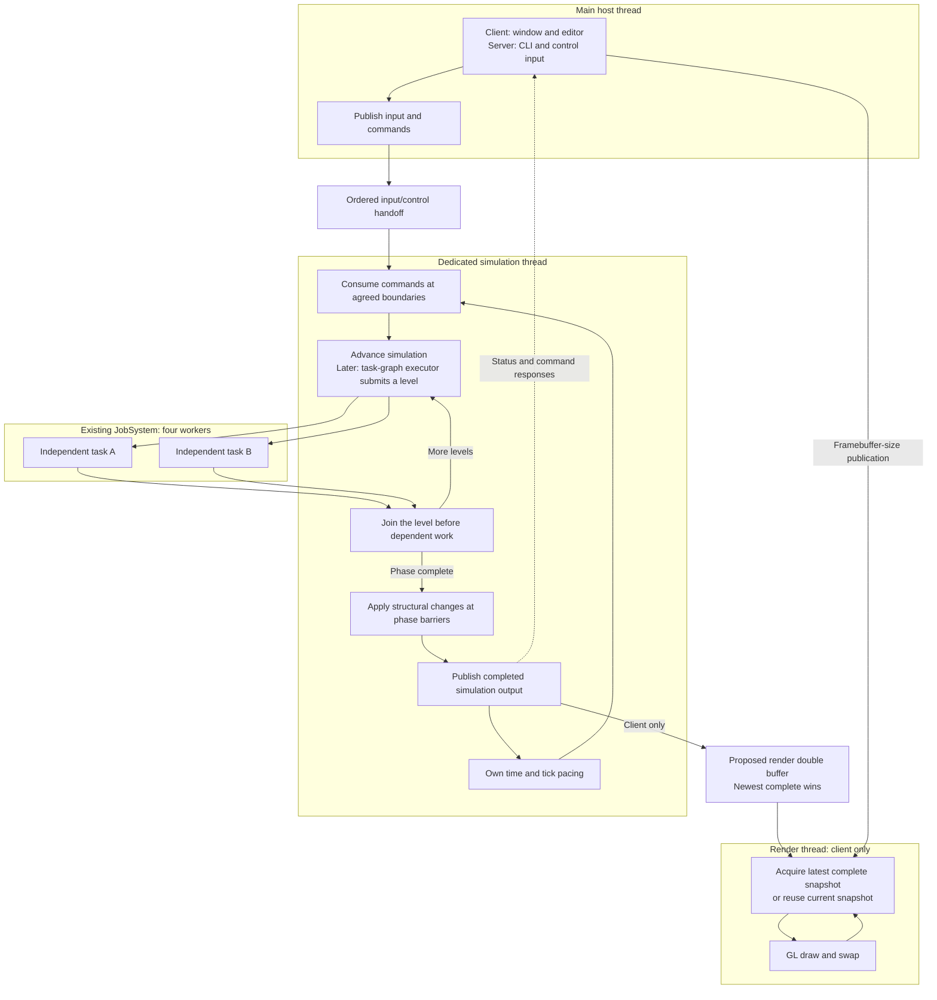

# Simulation Thread — Design

**Status:** ownership accepted; mechanism draft, S5-D3 in progress. **Decision:** [[ADR-018 — Host and simulation threads, render-owned GL]] (Accepted 2026-09-07).
**Module:** `app` coordinates; `platform` supplies OS input; `core` owns simulation work;
`client` owns rendering. This note describes the accepted target and draft mechanism; the
thread split is not implemented yet.

## Decided

| Accepted ownership and policy | Decision |
|---|---|
| Main hosts window/editor or server CLI/control interaction; simulation has a dedicated thread. | ADR-018 §1 |
| Editor edits and CLI commands enter simulation as data; published responses travel back. | ADR-018 §2 |
| Rendering takes the newest completed snapshot, or redraws its current one if none is ready; simulation never waits for presentation. | ADR-018 §2; Miguel's Sep 7 choices |
| `app` owns both loops and their lifecycle; only one driver advances simulation. | ADR-018 §3 |
| `JobSystem` provides dedicated-thread creation and registration alongside batch jobs; subsystem owners retain stop/join responsibility. | ADR-018 §4 |

Current accepted topology: [[Concurrency — Design]]. The fixed-step accumulator and four
JobSystem workers already exist. The task-graph executor remains planned for M5; moving the
simulation driver does not require implementing that executor now.

## Target ownership

Arrows crossing thread groups are transfers, not synchronous calls. Worker completion is
the explicit dependency wait. Window and console code never execute a simulation task.
The server omits the render branch, while preserving host, simulation and worker ownership.

## Thread creation and lifetime

The proposal incorporates the ownership distinction from
[Assess job system thread ownership](thread://01a07da8-c4d0-7ac1-be39-813f3324175d?hostId=local).
Miguel subsequently chose to place creation and registration in `JobSystem`, avoiding a
separate coordinator. Dedicated threads and finite pool jobs remain distinct execution roles.

| Execution role | Owner | JobSystem involvement |
|---|---|---|
| Main host | Process/application | Register the existing thread; never create or join it. |
| Simulation | App-owned simulation runner | Create a named dedicated thread and return its owning handle. |
| Render | `Client` / `RenderThread` | Create a named dedicated thread; renderer still owns GL and its stop/join. |
| Pool workers | `JobSystem` | Use the shared creation/registration mechanism for finite-job workers. |

The composition root creates `JobSystem` before dedicated-thread owners and keeps it alive
until their handles and registrations are released. Pass it through construction/startup
paths; thread creation belongs to those owners, not per-frame gameplay jobs. The existing
`EngineContext::jobs` reference remains; no extra service field or global accessor is added.
Only generic execution roles and thread mechanisms belong in `core`, never GLFW or GL types.

The common mechanism should support profiler names, stop-capable handles and role checks.
Startup/exception reporting must reach the owning subsystem; it must not silently terminate
a lane or leave a startup waiter blocked. Preserve the job pool's diagnostic contract.
Exact handle types, error channels and registration cleanup remain design work.

## Render double buffer: proposed mechanism

- Two CPU-side slots have distinct producer and consumer ownership. They are not the
  window's front/back framebuffer and do not represent GPU completion.
- The renderer retains its current complete slot while reading it. The producer builds a
  complete replacement and publishes into the other slot; intermediate pending snapshots
  may be replaced while rendering is behind.
- After finishing its reads from A, the renderer swaps to B only if B is complete,
  releasing A to the producer. If B is not ready, it keeps ownership of A and redraws A;
  simulation continues preparing B. Redraw still reads the latest framebuffer dimensions.
- A short transfer lock protects slot roles, readiness and publication. Neither side holds
  it during simulation, GL drawing or swap. The producer never writes the renderer-owned
  slot. Buffer exchange and write ownership must be tested together.
- For M4 the payload is a value-only `FrameCommand`. R1 must define lifetime for referenced
  resources and GPU uploads before a richer command list can reuse this mechanism.

This changes the single-slot storage described in [[Window — Design]], while retaining
its newest-complete-wins delivery policy. Final storage/API details remain draft.

## Input and control handoffs

Raw OS events cross through an ingress buffer, not concurrent calls into the current
simulation event streams. Simulation owns conversion to gameplay intent and applies edits
at its safe mutation boundaries. Results and metrics are copied back to the host.

Press/release edges and accepted CLI/editor commands preserve ordering. Pointer movement
may be combined only where the semantics allow it. No input is invented during a host
stall; the stale-held-state and focus-loss policy remains a decision for the next session.
The CLI is a real host consumer, but command grammar and console backend are separate work.

## Lifecycle outline to refine

1. Main initializes host resources and application services. A client starts its renderer
   and checks GL startup before simulation begins publishing to it.
2. The simulation thread starts with an explicit readiness/failure result. Main enters its
   host loop; simulation advances its own clock and reports metrics asynchronously.
3. Stop prevents further ingress and requests simulation cancellation. Outstanding jobs
   finish before simulation data is destroyed. Main continues servicing any required
   control work while waiting for the simulation owner to finish.
4. With simulation publication stopped, a client stops and joins rendering. GL teardown
   happens there before main destroys the window. The pool and shared services outlive
   all work using them. Failed startup unwinds only the stages that actually started.

Blocking console reads need a cancellation strategy; a join cannot require another line
of user input. The existing `Client::stop()` can remain the renderer-then-window teardown
operation once simulation has stopped publishing (`engine/client/src/Client.cpp:60` at `681ddf6b`).

## Next S5-D3 session

- Settle host/simulation lifecycle hooks and thread affinity against ADR-017; keep virtual
  dispatch as the engine entry path and avoid parallel callback registries.
- Specify JobSystem's dedicated-thread handle, registration and failure contracts alongside
  its batch API. It must not infer shutdown dependencies from role names or join dedicated
  threads as part of pool shutdown.
- Choose input consumption/tick assignment, sequence/timestamp fields, bounded-buffer
  overflow behavior, focus handling and stale held-input behavior.
- Specify independent simulation pacing and whether render extraction happens per tick or
  per simulation-loop iteration. Fixed-step semantics stay; no new real-time guarantee.
- Finalize double-buffer exchange and shutdown cancellation. Re-cut T9 and the simulation
  implementation into session-sized cards once the remaining mechanism is settled.

## Evidence required

Use a controlled host stall plus a native Windows resize session. Observe tick progress,
render progress and input age independently. Test press/release order, delayed focus loss,
overflow, startup failures, stop during work and CLI cancellation without another input line.
Exercise slot reuse with fast-producer/slow-consumer schedules under TSan. Also delay B's
publication: rendering must redraw A without waiting or allowing A to be overwritten, then
switch to B at a safe boundary once complete. Verify that a server composition needs no
graphical initialization and that synchronous loop tests remain.

## Grounding and limits

Read against engine `681ddf6b` (#77). `engine/app/src/App.cpp:15` owns the current driver;
`apps/editor/src/EditorApp.cpp:40` mixes host work and frame publication. The shared
`FrameLoop` and its TPS counters must belong to simulation after the split, so main cannot
keep reading them directly for the title.

The Dashboard stamp is still `01ed7a30`; this is a targeted design check, not reconciliation
of all older Game Loop/Concurrency notes. ADR-018 is accepted; no implementation is claimed.
