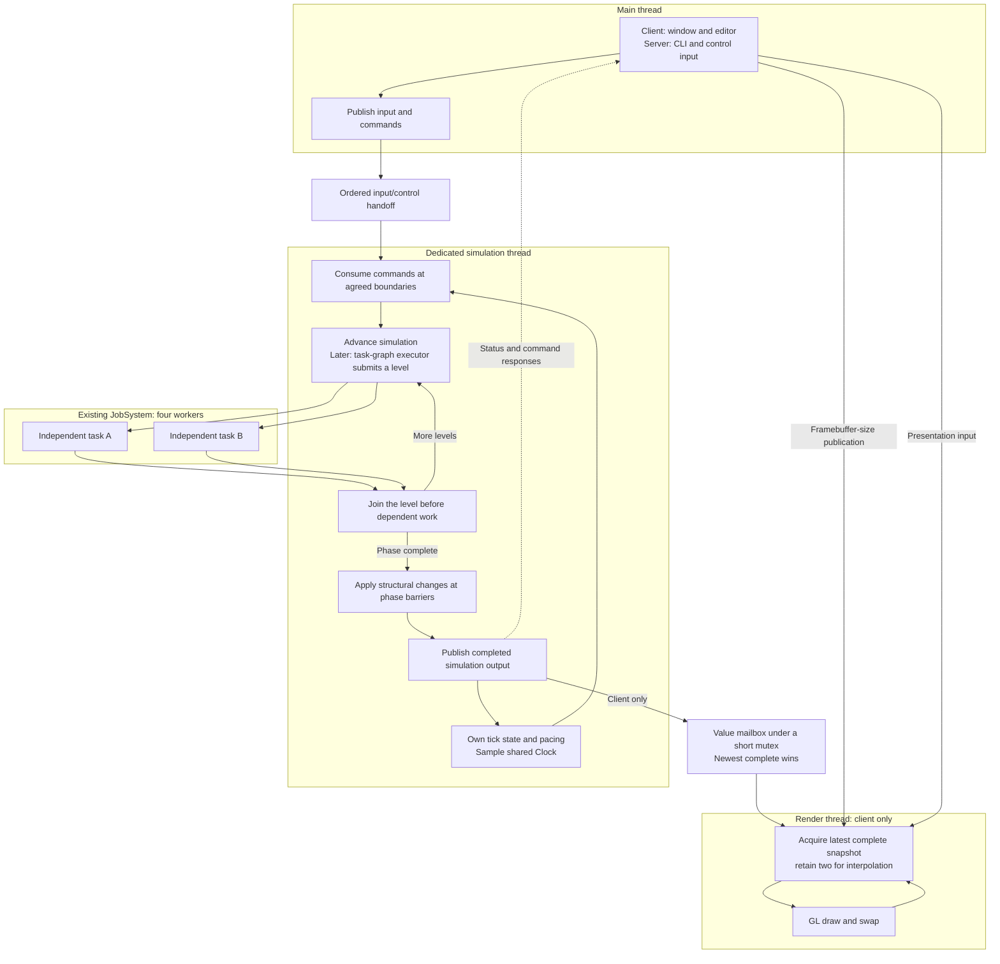

# Simulation Thread — Design

**Status:** implemented. S5-T12/T13 supplied and adopted the shared thread mechanism;
S5-T14/T15/T16/T9/T17 merged Sep 11 as `7d2546fc` (#81), completing the main/simulation split
and its integration proof. **Decision:** [[ADR-018 — Main and simulation threads, render-owned GL]]
(Accepted 2026-09-07) and [[ADR-019 — Fixed simulation ticks, render interpolation and shared clock]].
**Module:** `app` coordinates; `platform` supplies OS input; `core` owns simulation work;
`client` owns rendering. [[2026-09-11 Threaded Engine Validation]] records the merged revision,
automated evidence, PR CI and attended native Windows proof.

## Decided

**Sep 11 implementation:** [[ADR-019 — Fixed simulation ticks, render interpolation and shared clock]]
was Accepted during S5-T14 review and implemented by #81. ADR-018 ownership remains Accepted.

| Accepted ownership and policy | Decision |
|---|---|
| Main owns window/editor or server CLI/control interaction; simulation has a dedicated thread. | ADR-018 §1 |
| Editor edits and CLI commands enter simulation as data; published responses travel back. | ADR-018 §2 |
| Rendering takes the newest completed snapshot, or redraws its current one if none is ready; simulation never waits for presentation. | ADR-018 §2; Miguel's Sep 7 choices |
| `app` owns both loops and their lifecycle; only one driver advances simulation. | ADR-018 §3 |
| `JobSystem` provides dedicated-thread creation and registration alongside batch jobs; subsystem owners retain stop/join responsibility. | ADR-018 §4 |
| Input is consumed before each fixed tick; stalls retain held state, and overflow explicitly resynchronizes it. | Input and control handoffs below; Sep 8 |
| Keep the value mailbox and publish once after an iteration that advances ticks. | Render handoff and pacing below; Sep 8 |
| Main and simulation hooks have separate thread affinity and staged failure cleanup. | Lifecycle below; ADR-018 §3 |
| Simulation executes fixed ticks and a no-delta publication hook; render owns variable presentation work. | ADR-019 §1 §2, Accepted |
| One EngineContext Clock supplies all lanes; tick state stays per simulation. | ADR-019 §3, Accepted |
| Render keeps two received snapshots with tick boundary times; mailbox remains single-slot. | ADR-019 §3, Accepted |
| Main fans out presentation input and blocks on events; stop wakes it. | ADR-019 §4 §5, Accepted |

Current accepted topology: [[Concurrency — Design]]. The fixed-step accumulator and four
JobSystem workers already exist. The task-graph executor remains planned for M5; moving the
simulation driver does not require implementing that executor now.

## Target ownership

Arrows crossing thread groups are transfers, not synchronous calls. Worker completion is
the explicit dependency wait. Window and console code never execute a simulation task.
The server omits the render branch, while preserving main, simulation and worker ownership.

## Thread creation and lifetime

The proposal incorporates the ownership distinction from
[Assess job system thread ownership](thread://01a07da8-c4d0-7ac1-be39-813f3324175d?hostId=local).
Miguel subsequently chose to place creation and registration in `JobSystem`, avoiding a
separate coordinator. Dedicated threads and finite pool jobs remain distinct execution roles.

| Execution role | Owner | JobSystem involvement |
|---|---|---|
| Main | Process/application | Register the existing thread; never create or join it. |
| Simulation | App-owned simulation runner | Create a named dedicated thread and return its owning handle. |
| Render | `Client` / `RenderThread` | Create a named dedicated thread; renderer still owns GL and its stop/join. |
| Pool workers | `JobSystem` | Use the shared creation/registration mechanism for finite-job workers. |

The composition root creates `JobSystem` before dedicated-thread owners and keeps it alive
until their handles and registrations are released. Pass it through construction/startup
paths; thread creation belongs to those owners, not per-frame gameplay jobs. The existing
`EngineContext::jobs` reference remains; no extra service field or global accessor is added.
Only generic execution roles and thread mechanisms belong in `core`, never GLFW or GL types.

Use a move-only owning handle backed by `std::jthread`, with request-stop, join and a
published completion/failure result. Registration is scoped to the executing thread and
removed on every exit path. Main uses a scoped registration without an owning thread.
Names and roles are copied at startup; no callback borrows a temporary name or owner.

The owner waits for an explicit ready/failed startup result; every exit before readiness
completes that result as failed. The thread boundary captures an unexpected exception,
publishes failure and wakes its owner. App then requests coordinated shutdown and returns
failure after cleanup. Fatal diagnostics keep their existing contract; they are not
converted into recoverable exceptions. Dedicated failures never silently resume a lane.

Stop and join are owner operations, safe to repeat; joining from the owned thread is an
error. Destruction is a final stop/join safeguard, not the application's ordering mechanism.
No registry lock is held while running user work, waiting for startup or joining. Pool
shutdown still owns only its workers and preserves batch drain/wait semantics.

### Shipped at S5-T12

`JobSystem::createDedicatedThread` returns a move-only `DedicatedThread`; the callback gets
`DedicatedThreadContext` for its stop token and readiness signal. The handle owns stable
result storage and its `std::jthread`. Move assignment joins the old thread before replacing
that storage. Ownership remains with the subsystem under ADR-018 §4.

Readiness is permanent once signaled. A later exception marks completion failed without
changing the successful startup result. Returning before readiness marks both results failed,
even without an exception. Empty handles report failed startup and completed work.

`waitUntilComplete()` observes result publication, not full thread teardown; the owner must
still join. Registration is removed before completion is published. Main can use the
non-movable `ThreadRegistration` scope, and `registeredThreads()` returns copied metadata.
Duplicate registration is fatal; explicit self-join reports an ensure and leaves ownership intact.

The classes have separate header/source pairs; enums and result structs remain in
`DedicatedThread.hpp`. Source: `engine/core/src/jobs/JobSystem.cpp:107`,
`engine/core/src/jobs/DedicatedThread.cpp:16`, `engine/core/src/jobs/DedicatedThreadState.cpp:6`,
and `engine/core/src/jobs/ThreadRegistration.cpp:10` at `5c0764bd`.

### Adopted at S5-T13

PR #79 (`a60b64bd`) routes pool workers through the shared registration factory, changes
`RenderThread` to own a `DedicatedThread` created by `JobSystem`, and registers the existing
main thread as `TEMain` with the main role. `Client` passes the composition-root `JobSystem`
through renderer startup. Pool shutdown remains responsible only for pool workers; the
renderer retains its own stop/join order. The simulation runner still belongs to T14 and the
remaining main/simulation integration cards.

## Render handoff and pacing

Keep the single-slot mutex-protected `SnapshotMailbox` carrying `RenderSnapshot`. Simulation publishes
a complete value; rendering copies it under the lock and draws from its own copy after
unlocking. Neither side holds the transfer lock during callbacks, GL work or presentation.
Rendering redraws its current value when no newer one exists, using current framebuffer
dimensions. Publish an initial complete value before simulation reports ready.

The Sep 7 double-buffer proposal is deferred: the small value payload needs no slot-lifetime
protocol. ADR-018's delivery policy remains unchanged. R1 must settle resource lifetime
before commands contain references to world data or GPU uploads.

Under Accepted ADR-019, the app owns the shared Clock; simulation owns the accumulator,
tick-to-clock mapping and TPS accounting. Preserve the fixed step and delta clamp.
Wait interruptibly until the next tick deadline, calculated from
the accumulator remainder; measure elapsed time after waking rather than assuming the wait
was exact. Stop/failure wakes the wait. Input arrival alone does not force an early tick.
Late wakes use normal catch-up; no busy-spin or hard real-time guarantee is introduced.

Accepted ADR-019 replaces `update(frame)` with `publishSnapshot(simulation)` taking a fixed
SimulationContext and no variable delta time or
alpha, once after a catch-up batch that advances ticks. Publish tick, tick-boundary time
and complete presentation values. Render keeps two distinct acquired snapshots privately;
this does not require two transfer slots. [[Game Loop — Frame Flow]] owns timestamp,
interpolation, skipped-publication and discontinuity rules. Publish copied tick/rate metrics
to main, which must not inspect the live simulation context.

## Input and control handoffs

Accepted ADR-019 §4 adds an independent latest-state path from main to render for camera
and mouse-look. It does not replace or drain ordered simulation ingress. Cumulative motion,
focus generations and the consumed-input baseline are specified in [[Game Loop — Frame Flow]].

Raw OS events cross through an ingress buffer, not concurrent calls into the current
simulation event streams. Simulation owns conversion to gameplay intent and applies edits
at its safe mutation boundaries. Results and metrics are copied back to main.

Main thread callbacks append value events with a monotonic sequence and monotonic capture time.
The timestamp measures delivery age, not the original physical action during an OS stall.
Before each fixed tick, simulation detaches one bounded batch under a short mutex and
consumes it in sequence order outside the lock. Later arrivals belong to the next tick.
Delayed events apply to that tick without rollback; retain their original capture metadata.
This ingress step does not add or reorder the engine phases in [[Game Loop — Frame Flow]].

Preserve press/release edges, including both edges between two ticks. Start with no pointer
coalescing; later combining must preserve ordering around buttons and focus transitions.
During a main stall retain the last known held state; do not synthesize timeout releases.
Focus loss clears held keys/buttons when consumed. Focus regain starts neutral until fresh
events arrive. Gameplay commands are produced only on simulation, never inside callbacks.

Use preallocated bounded storage and a configurable capacity, including tiny capacities in
tests. Queue-full never blocks the main thread waiting for a tick. On raw-input overflow,
record an out-of-band recovery generation, lost sequence range and latest main held/focus state.
Discard the queued raw batch and keep updating that recovery state until the consumer
atomically takes it. The consumer reports the gap, replaces held state without inventing
edges, then resumes normal batches. This makes lost transitions explicit and prevents a
dropped release from sticking; a transient action can be lost during overload, visibly.

Editor/CLI commands use separate bounded admission: accepted commands preserve FIFO order;
full/closed rejects visibly and never evicts accepted commands. They apply at safe mutation
boundaries. On shutdown report accepted-but-unapplied commands as cancelled. There is no
promised total order between raw input and administrative commands. Real command grammar
and console backend remain outside this implementation; a fake cancellable main app proves
the headless lifecycle without adding a server product or blocking console reader.

## Lifecycle

`App::run()` remains the sole lifecycle coordinator. Virtual hooks remain the only app
dispatch; no parallel callback registry is added. Target hook names and affinity:

| Hook | Thread and responsibility |
|---|---|
| `init()` | Main; mounts/services and client window/render startup. Only mandatory initialization override. |
| `mainUpdate()` / `shouldClose()` | Main only; wait for events and read published status. No live simulation references. |
| `simulationInit()` | Simulation; initialize owned state and initial output before readiness. |
| `fixedUpdate(simulation)` | Simulation; ingress is consumed immediately before each invocation. |
| `publishSnapshot(simulation)` | Simulation; fixed context only, once after catch-up for extraction/publication; initial publication before readiness. |
| `simulationShutdown()` | Simulation; release simulation-owned state after outstanding jobs settle. |
| `shutdown()` | Main; stop/join rendering and destroy resources after simulation joins. |

Optional work hooks have empty defaults. A headless default main waits on stop/completion;
an interactive main blocks on `glfwWaitEvents` under Accepted ADR-019.
Stop/completion/failure wakes it with `glfwPostEmptyEvent()` while the main thread is alive;
the headless path keeps its cancellable control wait. A thread-safe `requestStop()` permits
simulation to finish a bounded runtime demo without main reading its counters.
`shouldClose()` reads main state only; a published worker failure independently requests
coordinated stop.

### Startup and shutdown sequence

1. Main initializes application services. A client starts its renderer and checks GL startup
   before simulation begins publishing to it.
2. The simulation thread starts with an explicit readiness/failure result. Main enters its
   event loop; simulation samples the shared Clock and reports metrics asynchronously.
3. Stop prevents further ingress and requests simulation cancellation. Outstanding jobs
   finish before simulation data is destroyed. Main continues servicing any required
   control work while waiting for the simulation owner to finish.
4. With simulation publication stopped, a client stops and joins rendering. GL teardown
   happens there before main destroys the window. The pool and shared services outlive
   all work using them. Failed startup unwinds only the stages that actually started.

Each initializer cleans up its own partial acquisition on failure. Shutdown hooks run only
for successfully initialized stages, including when later startup fails. Join happens before
the derived App or anything captured by its threads can be destroyed. Main services needed
by teardown stay alive, but simulation teardown must not require a new main callback.
Main waits and ingress waits are cancellable; finite jobs must finish before their data is
released. Cancellation does not forcibly kill an arbitrary running job or a native modal
event pump. Main performs final window teardown when that pump returns.

## Implementation breakdown

Epic M4, Story D completed Sep 11 in [[2026-08 Sprint 05 — M3 Project & M4 Window]].
T12 supplied the thread mechanism; T13 adopted it; T14–T15 integrated simulation and the
editor; T16–T9 supplied input; T17 recorded the integration proof. The five final cards
merged together as `7d2546fc` (#81).

T14 is the highest-risk card because initialization, failure and stop paths intersect.
Start it with a fake headless app and controlled startup failures before migrating the
editor in T15. Sep 10: ADR-019 is Accepted and settles the revised time model for T14/T15;
it does not reopen ADR-018's thread ownership. The research
index's Taskflow item concerns later scheduling and is not a dependency of this thread split.

## Evidence

Use a controlled main stall plus a native Windows resize session. Observe tick progress,
render progress and input age independently. Test press/release order, delayed focus loss,
overflow, startup failures, stop during work and CLI cancellation without another input line.
Exercise mailbox publication with fast-producer/slow-consumer schedules under TSan. Delay
publication: rendering must redraw its private copy without waiting, then acquire the next
complete value. Verify that a headless composition needs no
graphical initialization and that synchronous loop tests remain.

Closed Sep 11: the merged tests cover the controlled stall, delayed input, lifecycle,
overflow, mailbox schedules and headless cancellation. PR #81 CI passed Linux TSan.
Miguel's attended Windows demo showed render and simulation progress continuing while the
main thread remained in `Main.WaitEvents`; the focused profile test passed. See
[[2026-09-11 Threaded Engine Validation]].

## Grounding and limits

**Sep 11 merge:** `7d2546fc` (#81) implements the target and
[[2026-09-11 Threaded Engine Validation]] records its evidence. App owns Clock/InputBuffer;
EngineContext carries the
shared Clock; SimulationContext has fixed tick state and input only. Editor event waiting and
snapshot publication run on their separate owners. SnapshotHistory computes render alpha;
RateCounter and TimingMetrics replace the old frame/update rate paths. The publication
hook passes fixed context so extraction does not reach into runner internals; it carries
no variable delta or alpha. This is the implemented spelling of ADR-019's no-delta hook.

The fixed-phase/task-graph, Scene and command-result portions of the target remain future
consumers. The completed cards implement the triangle/raw-input stage. Native Windows and
Linux TSan evidence closed T17 on Sep 11.

**Sep 10 draft check:** fetched `origin/master` is `a60b64bd`; T14 checkout is `82ac7ed2`
plus working changes. The runner exists there, while the published baseline remains T13.
`engine/app/src/SimulationThread.cpp:97` still constructs a private Clock and line 113 calls
`update(context)` after catch-up. ADR-019 records Miguel's timing observations without
claiming a diagnosed cause. No build or timing experiment ran for this draft.

T12 was checked against merged engine `5c0764bd` (#78) at close on Sep 9. T13 was checked
against merged engine `a60b64bd` (#79) at close on Sep 10. The PR conversation had no review
comments or reviews, and GitHub reported 11 checks passed. No new build or demo ran during
this close.

T12's [final PR CI run](https://github.com/techattackteam/TechEngine/actions/runs/34285649246)
passed Windows/MSVC and Linux/Clang Debug/Release, Windows ASan, Linux UBSan/TSan,
formatting and diff coverage. The earlier local Windows Debug check passed all 15
dedicated-thread tests. No new build or demo ran during this close.

The Windows failure tests exposed Jolt's exported `_HAS_EXCEPTIONS=0` disagreeing with
Catch2's exception types. `cmake/deps.cmake` now enables `CPP_EXCEPTIONS_ENABLED`.
Compiler warnings and clang-tidy findings became advisory at Miguel's request; formatting
still gates CI. The accepted build-policy text needs reconciliation; see [[Backlog]].

The integration baseline is now `a60b64bd` (#79): `engine/app/src/App.cpp:15` still owns the current driver;
`apps/editor/src/EditorApp.cpp:40` mixes main work and frame publication. The shared
`FrameLoop` and its TPS counters must belong to simulation after the split, so main cannot
keep reading them directly for the title.

The Dashboard stamp is still `01ed7a30`; this is a targeted design check, not reconciliation
of all older Game Loop/Concurrency notes. T12's thread infrastructure and T13's shared-
mechanism adoption are implemented; main/simulation separation and its integrated move/resize
proof remain future cards.
