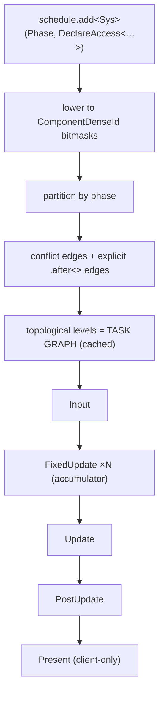

# Task Graph — Execution Flow

> Living design doc. **Status: draft**, not yet accepted.
>
> The ADR holds the decision, this doc holds the *how*. The decisions live in
> [[ADR-007 — v2 networking & ECS replication foundation]] §6. This note is the **execution
> view**, meaning one end-to-end sequence. It is not a restatement of the rules.

**Module:** `core` · **Kind:** system · **Status:** draft
**Runs inside:** [[Game Loop — Frame Flow]]. This doc covers one stage of one phase.
**ADRs:** [[ADR-006 — v2 core architecture & module layout]] §5 ·
[[ADR-007 — v2 networking & ECS replication foundation]] §6 ·
[[ADR-010 — User authoring model (Systems & Scripts)]] *(Proposed)*
**Roadmap:** [[Roadmap]]. **M2**'s threading ADR is **decided**:
[[ADR-015 — Threading (sim on main, render thread owns GL)]], hub [[Concurrency — Design]].
Next: **M5**'s task-graph ADR (the System interface, which is this doc), then the lanes:
**P1** turns real workers on, **P2** brings the work-stealing implementation

## Purpose

How a registered system becomes running work.

Three layers get conflated whenever people talk about this, so name them separately first.

| Layer | What it is |
|---|---|
| **`Schedule`** | The **input data**. Mutable entries, each carrying a phase, an enabled flag and an access declaration. |
| **Task graph** | The **derived structure**, built once from the schedule. Systems are the nodes. Conflict edges and explicit order edges are the task edges. |
| **Executor** | The **runner**. It walks the prebuilt graph once per frame. |

In one line: the `Schedule` is what you registered, the task graph is what got compiled from
it, and the executor is what runs it.

## Design

### Stage 1: compose time, once, at `app`'s composition root

```cpp
schedule.add<MovementSystem>(Phase::FixedUpdate,
                             DeclareAccess<Write<Transform>, Read<Velocity>>);
```

- An access declaration covers **components and resources**, not components alone.
- It is lowered to **`ComponentDenseId` bitmasks** at registration time. Conflict detection
  later is then a cheap set operation.
- Engine defaults are ordinary entries. There is no privileged path, so disabling or replacing
  one is an edit to a list.
- `.after<A>()` is the escape hatch for semantic ordering where there is **no** data conflict
  to derive an edge from. It is pairwise only.

### Stage 2: build the graph, once, on schedule mutation

1. Partition the entries **by phase**. A system belongs to exactly one.
2. Within a phase, two systems conflict when `A.writes ∩ B.touches ≠ ∅`. That covers
   write-write, write-read and read-write. **Two readers never conflict, so they run in
   parallel.**
3. Every conflict becomes a deterministic serializing edge. Explicit `.after<>` edges are
   added alongside them.
4. Topologically sort the result into **levels**. That cached structure *is* the task graph.

**This is built once, not per frame.** No allocation and no string work happen inside a frame,
which is F19's fix.

### Stage 3: per frame, the executor walks the prebuilt graph



**Within a phase**, the executor walks the levels from the top down. Systems on the same level
have disjoint writes by construction, so they are safe to run in parallel. Today that means
level by level. Later the same level structure feeds a job pool **unchanged**.

Systems perform value reads and writes only at this point. Nothing structural happens here.

**At each phase barrier**, the command buffer is applied **single-threaded, in a deterministic
order**, and `NetId`s are assigned. Every structural change lands here: spawn, despawn, add
and remove. That is what makes determinism hold even once the levels run in parallel.

**A debug safety net backs the declarations.** `Scene` asserts that the **actual** access is a
subset of the **declared** access, so touching an undeclared component fires `TE_ASSERT`. It
compiles out in release.

### Where scripts slot in (ADR-010, Proposed)

`ScriptSystem` is an ordinary entry, pinned to the **terminal slot** of both `FixedUpdate` and
`Update`.

```
[ level 0 ‖ level 1 ‖ … ]  →  [ ScriptSystem: all scripts ]  →  ‖ barrier: apply command buffer ‖
```

Scripts therefore run after every system in the phase. Their spawns queue into the **same**
command buffer as everything else, so there is no separate path to keep consistent.

## Open questions

Grouped by the ADR that owns them. The [[Roadmap]] rung is in brackets.

### Settled by ADR-015 (2026-08-22)

Topology, GL ownership and the pool shape are decided: sim on main, the render thread owns
the context, and the executor runs on the loop's thread against `JobSystem`'s batch submit
and wait. Current shape: [[Concurrency — Design]] § *Decided*.

### Owned by the task-graph ADR [M5]

- **The terminal slot.** ADR-010 §4 needs it, and `.after<A>()` cannot express it, because it
  is pairwise and this means "after everything". The mechanism is undecided.
- **Level granularity.** Whole-system nodes only, or intra-system chunking for wide parallel
  iteration?
- **Schedule mutation at runtime.** What a rebuild costs, and when a rebuild is legal. Is
  mid-frame allowed?

### Deferred to implementation [P1 → P2]

- **A work-stealing executor, plus Jolt pool integration.** This fixes F15. Levels walk
  serially until a measurement says otherwise (workers turn on at P1, tuning is P2). The
  level structure feeds a pool **unchanged**, so this changes no interface.

## References

- [[ADR-007 — v2 networking & ECS replication foundation]] §6: the decisions
- [[ADR-006 — v2 core architecture & module layout]] §5: the System and helper taxonomy
- [[Game Loop — Frame Flow]]: the frame this graph executes inside, including `FixedUpdate`
  running N times
- [[ADR-010 — User authoring model (Systems & Scripts)]]: the script terminal slot
- [[v1 Code Audit]]: F15 (three ad-hoc threading models) · F19 (per-frame allocation)
- Code: none yet, `core` is greenfield
