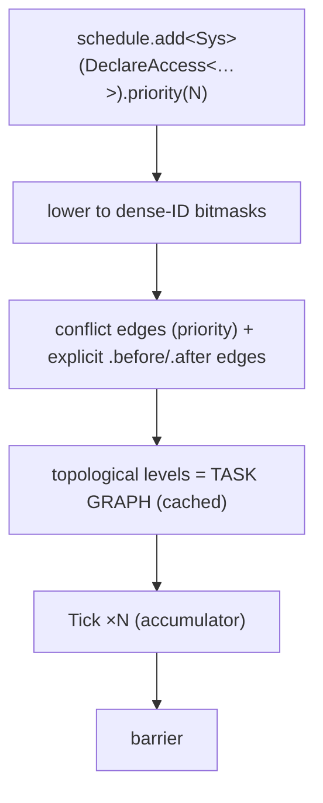

# Task Graph — Execution Flow

> Living design doc. **Status: draft**, updated 2026-09-12 against ADR-020 (Proposed).
>
> The ADR holds the decision, this doc holds the *how*. The scheduling decisions live in
> [[ADR-020 — System scheduling and task-graph execution]]. ADR-007 §6 defined the system
> interface and conflict DAG; ADR-020 settles the items §6 deferred. This note is the
> **execution view**: one end-to-end sequence, not a restatement of the rules.

**Module:** `core` · **Kind:** system · **Status:** draft
**Runs inside:** [[Game Loop — Frame Flow]]. This doc covers one stage of one phase.
**ADRs:** [[ADR-006 — v2 core architecture & module layout]] §5 ·
[[ADR-007 — v2 networking & ECS replication foundation]] §6 ·
[[ADR-020 — System scheduling and task-graph execution]] *(Proposed)* ·
[[ADR-010 — User authoring model (Systems & Scripts)]] *(Proposed)*
**Roadmap:** [[Roadmap]]. **M2**'s threading ADR is **decided**:
[[ADR-015 — Threading (sim on main, render thread owns GL)]], hub [[Concurrency — Design]].
**M5**'s task-graph ADR is [[ADR-020 — System scheduling and task-graph execution]] (Proposed).
**P1** turns real workers on, **P2** brings work-stealing tuning

## Purpose

How a registered system becomes running work.

Three layers get conflated whenever people talk about this, so name them separately first.

| Layer | What it is |
|---|---|
| **`Schedule`** | The **input data**. Entries registered at startup, each carrying a priority, an access declaration, and optional ordering overrides. Immutable after the graph is built (ADR-020 §7). |
| **Task graph** | The **derived structure**, built once at simulation start. Systems are nodes. Conflict edges and explicit order edges are the task edges. Sorted into levels. |
| **Executor** | The **runner**. Walks the levels once per tick. Serial first (ADR-020 §8); parallel at P1. |

In one line: the `Schedule` is what you registered, the task graph is what got compiled from
it, and the executor is what runs it.

## Design

### Stage 1: registration, once, at startup

```cpp
schedule.add<MovementSystem>(DeclareAccess<Write<Transform>, Read<Velocity>>)
        .priority(10);
```

- One phase: **Tick** (ADR-020 §1). No Input, Update, PostUpdate or Present phases.
- An access declaration covers **components and resources** in the same dense-ID bitmask
  space (ADR-020 §2). `Write<T>` implies read.
- Every system carries an integer **priority** (default 0). Lower runs first on conflict.
  Equal priority on a conflicting pair is a build error (ADR-020 §3).
- Engine systems ship with spaced priorities (10, 20, 30...) so user systems slot between
  them without renumbering.
- `.after<A>()` / `.before<A>()` override priority-derived direction between a specific pair.
- Engine defaults are ordinary entries. No privileged path.

### Stage 2: build the graph, once, at simulation start

1. Two systems conflict when `A.writes ∩ B.touches ≠ ∅`. Write-write, write-read and
   read-write. **Two readers never conflict.**
2. Each conflict produces a directed edge. The system with the lower priority runs first.
   Equal priority on a conflicting pair is a build error.
3. `.after<>()` / `.before<>()` edges override priority-derived direction between that pair.
4. Topologically sort the DAG into **levels**. That cached structure *is* the task graph.
5. A cycle (from any combination of edges) is a fatal build error. `TE_CHECK` names every
   system in the loop.

**Built once, never rebuilt.** The schedule is immutable after this point (ADR-020 §7).
No allocation and no string work happen inside a tick, which is F19's fix.

### Stage 3: per tick, the executor walks the prebuilt graph



**Within the Tick phase**, the executor walks the levels in order. Systems on the same level
have disjoint writes, so they are safe to run in parallel. The serial executor (ADR-020 §8)
runs them one at a time. The parallel executor at P1 dispatches each level to workers.

Systems perform value reads and writes only. Nothing structural happens here.

**At the barrier**, the command buffer is applied **single-threaded, in deterministic order**,
and `NetId`s are assigned. Structural changes land here: spawn, despawn, add, remove.
Hierarchy constraints are validated at commit time. That is what makes determinism hold even
once levels run in parallel.

**Debug validation.** `Scene` asserts that the **actual** access is a subset of the
**declared** access, so touching an undeclared component fires `TE_ASSERT`. Column
write-stamping (`changeTick` per system/archetype/component) happens as each system runs.
Both compile out or become no-ops in release.

### Where scripts slot in (ADR-010, Proposed)

`ScriptSystem` is an ordinary entry pinned to the **terminal slot** of the Tick phase
(ADR-020 §4). `Slot::Terminal` means "after all regular levels, before the barrier."

```
[ level 0 ‖ level 1 ‖ … ]  →  [ ScriptSystem: terminal slot ]  →  ‖ barrier ‖
```

One terminal entry per phase; a second is a build error. A terminal entry may omit its
access declaration (ADR-010 §5). Scripts run after every system in the phase. Their spawns
queue into the **same** command buffer, so there is no separate path to keep consistent.

## Settled questions

Grouped by the ADR that settled them.

### Settled by ADR-015 (2026-08-22)

ADR-018 (Accepted Sep 7) supersedes simulation-on-main: the executor will run on the
dedicated simulation thread against `JobSystem`'s batch submit/wait. GL ownership and
level/barrier semantics remain. Current target: [[Simulation Thread — Design]].

### Settled by ADR-020 (2026-09, Proposed)

- **Terminal slot.** `Slot::Terminal` pins an entry after all regular levels, before the
  barrier. One per phase. ADR-020 §4.
- **Level granularity.** Whole-system nodes. Intra-system chunking deferred to P1/P2 with
  measurement. ADR-020 §6.
- **Schedule mutation.** The schedule is immutable after the graph is built at simulation
  start. No enable/disable, no mid-tick mutation. A system that should sometimes skip work
  checks its own flag and early-outs. Required for deterministic prediction and rollback.
  ADR-020 §7.

### Deferred to implementation [P1 → P2]

- **A parallel executor, plus Jolt pool integration.** This fixes F15. P1 is a near-term
  follow-up to M5. The level structure feeds a pool **unchanged**, so this changes no
  interface. Work-stealing tuning is P2.

## References

- [[ADR-020 — System scheduling and task-graph execution]]: the scheduling decisions
- [[ADR-007 — v2 networking & ECS replication foundation]] §6: system interface and conflict DAG
- [[ADR-006 — v2 core architecture & module layout]] §5: the System and helper taxonomy
- [[Game Loop — Frame Flow]]: the frame this graph executes inside, including Tick running N times
- [[ADR-010 — User authoring model (Systems & Scripts)]]: the script terminal slot
- [[v1 Code Audit]]: F15 (three ad-hoc threading models) · F19 (per-frame allocation)
- Code: none yet, `core` is greenfield
