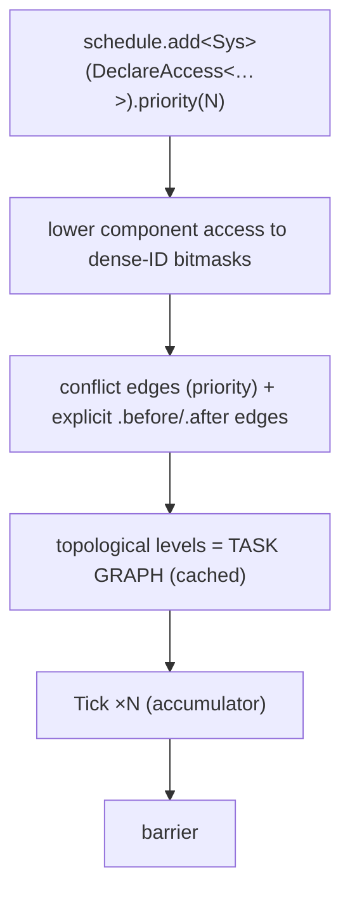
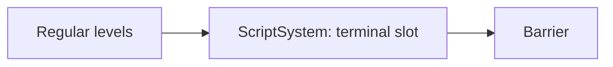

# Task Graph — Execution Flow

> Living design doc. **Status: implementing; Schedule, graph and serial executor shipped**, updated
> 2026-09-19 against ADR-020 (Accepted).
>
> The ADR holds the decision, this doc holds the *how*. The scheduling decisions live in
> [[ADR-020 — System scheduling and task-graph execution]]. ADR-007 §6 defined the system
> interface and conflict DAG; ADR-020 settles the items §6 deferred. This note is the
> **execution view**: one end-to-end sequence, not a restatement of the rules.

**Module:** `core` · **Kind:** system · **Status:** implementing (S6-T9 integration remains)
**Runs inside:** [[Game Loop — Frame Flow]]. This doc covers one Tick and its barrier.
**ADRs:** [[ADR-006 — v2 core architecture & module layout]] §5 ·
[[ADR-007 — v2 networking & ECS replication foundation]] §6 ·
[[ADR-020 — System scheduling and task-graph execution]] *(Accepted)* ·
[[ADR-021 — Immediate Scene transform propagation]] *(Accepted)* ·
[[ADR-010 — User authoring model (Systems & Scripts)]] *(Proposed)*
**Roadmap:** [[Roadmap]]. ADR-018 owns the simulation thread; [[Concurrency — Design]]
shows the topology. **P1** turns parallel graph execution on; **P2** considers
work-stealing tuning.

## Purpose

How a registered system becomes running work.

Three layers get conflated whenever people talk about this, so name them separately first.

| Layer | What it is |
|---|---|
| **`Schedule`** | The **input data**. Entries registered at startup, each carrying a priority, an access declaration, and optional ordering overrides. Immutable after the graph is built (ADR-020 §7). |
| **Task graph** | The **derived structure**, built once at simulation start. Systems are nodes. Conflict edges and explicit order edges are the task edges. Sorted into levels. |
| **Executor** | The **runner**. Walks the levels once per tick. Serial first (ADR-020 §8); parallel at P1. |

In one line: the `Schedule` is what you registered, the task graph is what got compiled from
it, and the executor is what runs it.

## Design

### Stage 1: registration, once, at startup

```cpp
schedule.add<MovementSystem>(DeclareAccess<Write<Transform>, Read<Velocity>>)
        .priority(10);
```

Register each system for the single Tick phase with component-access declarations, a priority
and any pairwise ordering. ADR-020 §1–4 owns the exact rules. Registration closes
before the first tick.

S6-T6 shipped this stage in PR #89 (`9be7a8be`). Each entry carries a
default-constructible system factory, component access masks, numeric priority, pairwise
type constraints and terminal-slot metadata. Duplicate registration, post-freeze
mutation, a second terminal entry and unregistered component access are fatal
`TE_CHECK`s in every configuration.

### Stage 2: build the graph, once, at simulation start

Lower the component declarations to dense-ID masks, derive conflict and explicit-order edges,
then sort the resulting DAG into levels. ADR-020 §3 owns edge direction and cycle
diagnostics. The cached levels are the task graph consumed by the executor.

S6-T6–T9 track components only. Shared-resource access is deferred until a concrete
scheduled resource conflict needs graph ordering or debug validation (ADR-020's
Sep 19 amendment).

S6-T7 shipped this stage in PR #90 (`ea5d0c9c`). `TaskGraph` stores immutable levels
of factory, system-type and access nodes. Construction rejects equal-priority conflicts
and named cycles with `TE_CHECK`, and freezes the schedule only after a successful build.

**Built once, never rebuilt.** The schedule is immutable after this point (ADR-020 §7).
Graph construction adds no allocation or string work inside a tick, which is F19's fix.

### Stage 3: per tick, the executor walks the prebuilt graph



**Within the Tick phase**, the executor walks the levels in order. Systems on the same level
have disjoint writes, so they are safe to run in parallel. The serial executor (ADR-020 §8)
runs them one at a time. The parallel executor at P1 dispatches each level to workers.

S6-T8 shipped the serial path in PR #91 (`4da771af`). `SerialExecutor` owns persistent
system instances, one reusable command buffer per graph node and the barrier's spawned-
entity output. It consumes the graph's immutable cached levels, runs nodes serially, then
merges their buffers in graph order. Keeping runtime state outside `TaskGraph` preserves
the same graph and per-node buffer boundary for the later parallel executor.

Systems perform value reads and writes only. Nothing structural happens here.
Transform setters refresh their affected subtrees within the calling system, so
world reads later in that system see current values. No separate transform
propagation entry is scheduled (ADR-021).

**At the barrier**, per-system command buffers are merged in graph order and applied
**single-threaded, in deterministic order**, then `NetId`s are assigned and event streams
are flushed through injected barrier services. Structural changes land here: spawn,
despawn, add and remove. Pending-entity tokens are local to the buffer that created them.
Hierarchy constraints are validated at commit time. That is what makes determinism hold
even once levels run in parallel.

**Debug validation.** `Scene` asserts that the **actual** access is a subset of the
**declared** access, so touching an undeclared component fires `TE_ASSERT`. Column
write-stamping (`changeTick` per system/archetype/component) marks every matching declared
writable column once before that system runs. The access assertion is debug-only; change
stamps remain part of runtime state in every configuration.

### Where scripts slot in (ADR-010, Proposed)

`ScriptSystem` is an ordinary entry pinned to the **terminal slot** of the Tick phase
(ADR-020 §4). `Slot::Terminal` means "after all regular levels, before the barrier."



One terminal entry is allowed in Tick; a second is a build error. A terminal entry may
omit its access declaration (ADR-010 §5). Scripts run after every regular system. Their spawns
queue through the **same per-system command-buffer path**, so there is no separate structural
mutation path to keep consistent.

## Settled questions

Grouped by the ADR that settled them.

### Thread ownership

ADR-018 (Accepted Sep 7) supersedes simulation-on-main: the executor will run on the
dedicated simulation thread against `JobSystem`'s batch submit/wait. GL ownership and
level/barrier semantics remain. Current target: [[Simulation Thread — Design]].

### Settled by ADR-020 (Accepted Sep 12)

The terminal slot, whole-system node granularity and immutable schedule are now
decided in ADR-020 §4, §6 and §7. S6-T6–T8 implement schedule declarations, graph
construction and serial execution; S6-T9 connects them to fixed ticks.

### Deferred to implementation [P1 → P2]

- **A parallel executor, plus Jolt pool integration.** This fixes F15. P1 is a near-term
  follow-up to M5. The level structure feeds a pool **unchanged**, so this changes no
  interface. Work-stealing tuning is P2.

## References

- [[ADR-020 — System scheduling and task-graph execution]]: the scheduling decisions
- [[ADR-007 — v2 networking & ECS replication foundation]] §6: system interface and conflict DAG
- [[ADR-006 — v2 core architecture & module layout]] §5: the System and helper taxonomy
- [[Game Loop — Frame Flow]]: the frame this graph executes inside, including Tick running N times
- [[ADR-010 — User authoring model (Systems & Scripts)]]: the script terminal slot
- [[v1 Code Audit]]: F15 (three ad-hoc threading models) · F19 (per-frame allocation)
- Code: Schedule, graph and serial executor shipped in PRs #89–91 (`9be7a8be`, `ea5d0c9c`, `4da771af`); fixed-tick integration remains S6-T9 work
