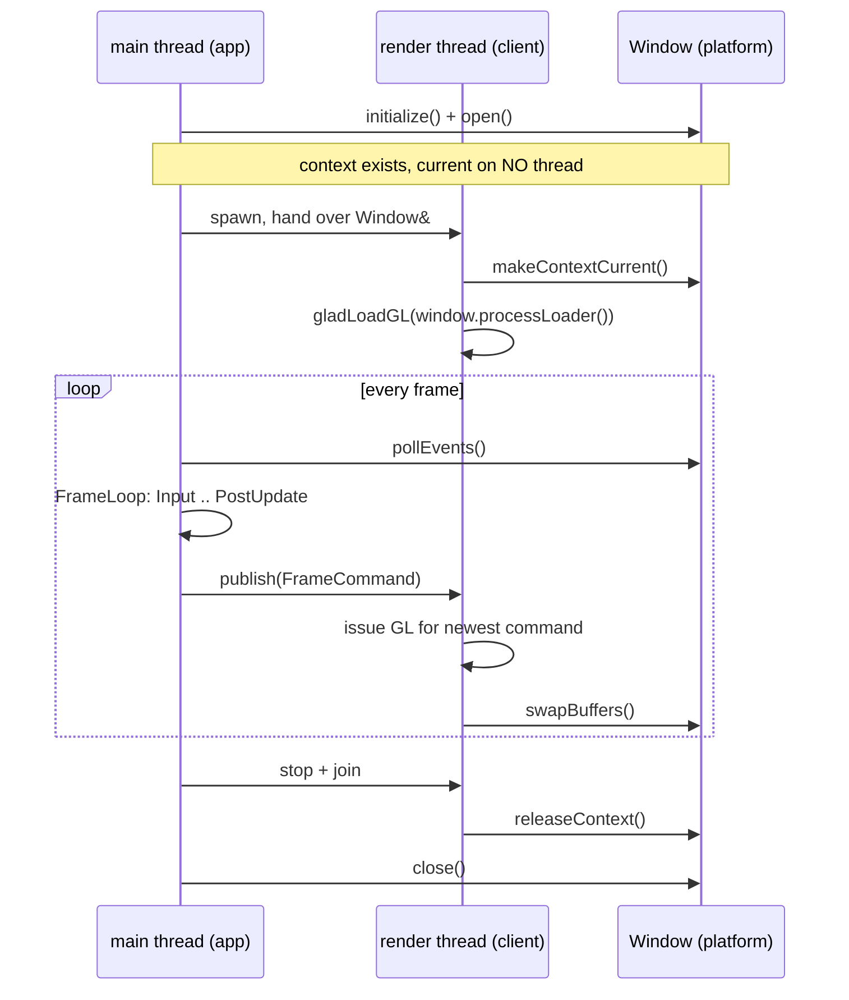

# Window — Design

> Living design doc. The decision that is hard to reverse is [[ADR-015 — Threading (sim on main, render thread owns GL)]] §2. This doc holds the *how*.

**Module:** `platform` (the window and input) · `client` (the context, glad2, the render thread) · **Kind:** system · **Status:** triangle and independent resize drawing shipped (S5-T8, #77); input pending, simulation topology revision at S5-D3
**ADRs:** [[ADR-015 — Threading (sim on main, render thread owns GL)]] §1 §2 ·
[[ADR-006 — v2 core architecture & module layout]] §1 ·
[[ADR-008 — v2 build & testing baseline]] §4 case 3 · §5 ·
[[ADR-005 — v2 tech stack & toolchain]] (GLFW, glad2, GL 4.5 core)
**v1:** [[v1 Code Audit]] F22 (the device seam) · **Backlog:** [[Backlog]] → `platform`, `client`

## Purpose

M4 opens the engine's first window and draws its first triangle. That is the visible goal, and
it is the smaller half of the job.

The real job is proving [[ADR-015 — Threading (sim on main, render thread owns GL)]] §2's seam
in code: **a GL context that is current on the render thread and nowhere else**, fed only by
complete per-frame data. Every renderer decision after this is written against that seam, and
retrofitting it across a written renderer is the rewrite M2 exists to prevent.

So M4's output is not a triangle. It is a triangle drawn on the correct thread.

## Decided

This table is the summary. Every row that needed an argument has one in *Design* below.

| What | Call | Ref |
|---|---|---|
| **Module split** | `platform` owns the window and raw input and issues **no GL call ever**. `client` owns the context, glad2 and every GL call. | See *The seam*, 2026-08-30 |
| **GLFW stays inside `platform`** | `client` never calls a `glfw*` function. Context and presentation operations are methods on `Window`. | See *The seam* |
| **glad2 lives in `client`** | Moved off `platform`'s dependency row. **This reverses ADR-006 §1** and is filed there as a dated `decision` amendment. | ADR-006 §1 amendment, 2026-08-30 |
| **glad2 is generated, committed, and never fetched** | GL 4.5 core, no extensions, `--reproducible`. Committed under `external/glad/`, wrapped in `cmake/deps.cmake`. The one vendored dep. | ADR-008 §4 case 3 |
| **Context handoff** | Main creates the window and never makes the context current. The render thread claims it once and holds it until shutdown. | See *Startup and shutdown order* |
| **`gladLoadGL` runs on the render thread** | It needs a current context, so it cannot run at startup on main. | See *Startup and shutdown order* |
| **Frame handoff at M4** | A single-slot **frame command buffer** carrying a `FrameCommand`. Newest complete wins; main may overwrite an unconsumed command, and the render thread may re-consume the last one. | See *The frame command buffer* |
| **The command's contents are M4's, not R1's** | Clear colour plus a draw flag. The real command-list format belongs to R1's renderer ADR. | ADR-015 §2 |
| **Framebuffer dimensions** | Main seeds pixel dimensions and publishes framebuffer callback updates; both writer and render-thread snapshot reader use the same mutex. | S5-T8, #77 |
| **Triangle resources** | Private `Buffer` and `VertexArray` wrappers use GL 4.5 DSA; `FrameRenderer` owns vertex/index buffers, VAO and checked shader startup. Cleanup precedes context release. | S5-T8, #77 |
| **CI opens a real window** | Linux uses Xvfb and Mesa llvmpipe; Windows uses pinned Mesa DLLs beside the binaries. | See *How CI proves this*, verified 2026-09-06 |
| **No `IWindow` interface** | One implementation, and no carded work needs a second. Same reasoning as [[File Access — Design]] § *Why there is no interface*. | 2026-08-30 |

## The seam

**Accepted Sep 7:** [[ADR-018 — Host and simulation threads, render-owned GL]] separates
host and simulation ownership. [[Simulation Thread — Design]] holds the draft double-buffer
mechanism; intermediate snapshots may be skipped and the current snapshot is redrawn when
none is ready. The split is not implemented; the shipped M4 description remains below.

ADR-006 §1 lists **window** and **input** under both `platform` and `client`, and lists glad2
under `platform`. That row cannot be followed as written, so this note resolves it.

| Concern | Owner | Why |
|---|---|---|
| GLFW init, window creation, `pollEvents`, destruction | `platform` | It is the OS seam. A dedicated server links `platform` for files and the timer and never creates a window. |
| Raw keyboard, mouse and gamepad events | `platform` | Same seam. Input is an OS fact before it is a presentation one, and ADR-007 §2 already turns it into command data a rung above. |
| The GL context, glad2, every `gl*` call | `client` | `client` **is** the presentation module and owns the GL 4.5 device seam (F22). |
| The render thread | `client` | `app` is the composition root and is explicitly presentation-agnostic (ADR-006 §1), so it cannot own a thread whose whole job is GL. |

## The `Window` surface

**`client` never calls a `glfw*` function.** The context operations it needs are methods on
`platform`'s `Window`, so GLFW's headers stay entirely inside one module:

```cpp
namespace TechEngine {
    class Window {                       // platform. Owns the GLFWwindow*.
    public:
        // --- main thread only (GLFW pins these) ---
        static bool  initialize();       // glfwInit + the 4.5 core hints
        static void  terminate();        // after every window closes
        bool         open(int width, int height, std::string_view title);
        void         pollEvents();
        void         setTitle(std::string_view title);
        void         close();

        bool         shouldClose() const;

        // --- callable from the render thread ---
        void         makeContextCurrent() const;
        void         releaseContext();
        void         swapBuffers();
        void         setVSync(bool vsync);
        FramebufferSize framebufferSize() const; // cached pixel dimensions, safe to copy
        GlProcLoader  processLoader() const;    // feeds gladLoadGL, never a GL call itself
    };
}
```

`processLoader()` returns `glfwGetProcAddress` behind a typedef. That is the one place the two
modules touch, and it moves a function pointer rather than a GL call.

## Why glad2 moved out of `platform`

ADR-006 §1 put it there because `platform` owns the window. But a loader is only useful to
whoever holds a current context, and ADR-015 §2 puts that on the render thread inside `client`.

Leaving it in `platform` would put a GL loader on the link line of a dedicated server that
links no GL at all (ADR-006 §2).

The amendment is filed on ADR-006 §1 rather than left implicit, because a reader following that
row would wire it the other way and only find out at link time, or not at all.

## glad2: generation and vendoring

Generated with the `glad2` **2.0.8** Python package and shipped **2026-09-06** at
`f71b128d` ([#74](https://github.com/techattackteam/TechEngine/pull/74)). The version and
command are recorded above the target in `cmake/deps.cmake`:

```bash
glad --api gl:core=4.5 --extensions= --out-path external/glad --reproducible c
```

| Choice | Call | Why |
|---|---|---|
| Profile | `gl:core=4.5` | ADR-005's row. DSA is core in 4.5, so the renderer never needs the ARB spelling. |
| Extensions | **none** | 4.5 core already contains DSA and `glDebugMessageCallback` (`KHR_debug` became core at 4.3). An empty list keeps the generated file small and the loader honest. |
| `--reproducible` | on | Uses the generator's bundled specifications; keep the generator version pinned when regenerating the same output. |
| Output | committed | ADR-008 §4 case 3. It is not a fetchable CMake project, so it is the one vendored dep. |

The committed output is `external/glad/include/glad/gl.h`, `include/KHR/khrplatform.h`
under the same root, and `external/glad/src/gl.c`. `TechEngine::glad` aliases the static
`TechEngineGlad` target; `client` links it privately and `platform` does not link it
(ADR-006 §1 amendment). The root project enables C for `gl.c`.

**Two gotchas that will bite.** `gl.c` is third-party, so the target must **not** link
`te_warnings` and must declare its include directory `SYSTEM`. Otherwise `-Werror` fails the
build on code we do not own (ADR-008 §5). And the generator command belongs in a comment above
the target, because a vendored file with no recorded provenance cannot be regenerated when GL
4.6 or a new extension is wanted.

## Startup and shutdown order

**Shipped Sep 6, `a053486c` (#76):** `EditorApp` owns `Client`, whose private state owns
`Window` before `RenderThread`. The temporary `ClientSession` type was folded into `Client`.
`start()` opens the window and waits for the worker's startup promise; failure joins before
returning false. `stop()` requests cancellation and joins the `std::jthread`, then closes
the window and calls `Window::terminate()`. The current client owns one GLFW lifetime.

**S5-T8 shipped Sep 7, `681ddf6b` (#77):** startup also initializes triangle resources
before reporting success. The worker copies the latest command and framebuffer size, releases
both locks, draws and swaps until its stop token is requested. Window closure is handled on
main; the worker does not read GLFW's unsynchronized close flag. GL resources are deleted
on the worker before it releases the context.

Rendering continues while main is inside native move/resize processing. Simulation still
pauses there in the shipped implementation. ADR-018 replaces that topology; **S5-D3** still
needs to settle the input/lifecycle mechanism before T9 is re-cut.

This is the part that is easy to get backwards, because GLFW pins some calls to the main thread
and the context to exactly one thread, and those two rules point in opposite directions.



## The rules that are easy to get backwards

| Rule | Consequence if broken |
|---|---|
| `glfwInit`, `open`, `pollEvents` and `close` are **main thread only**. | GLFW's own contract. Calling them elsewhere is undefined and fails differently per platform. |
| `open()` does **not** make the context current. GLFW does not do this for you. | The render thread would find the context owned by main, and `makeContextCurrent` on a second thread is an error while it is current on the first. |
| `gladLoadGL` runs **after** `makeContextCurrent`, on the render thread. | Every loaded pointer is null and the first GL call segfaults. |
| The render thread is **joined before** `close()`. | The window is destroyed under a thread still issuing GL against it. |
| `swapBuffers` blocks on vsync, **on the render thread**. | This is the one frame of present latency ADR-015 §2 accepts. If it ran on main, the sim would be pinned to the display's refresh rate, which is the coupling the render thread exists to break. |

**Input callbacks fire inside `pollEvents`, on main.** They write into `platform`'s input
buffer and must never touch the render thread's data or issue a GL call.

## The frame command buffer

ADR-015 §2 says the render thread "consumes the most recent complete list". At M4 that is a
single-slot frame command buffer rather than a queue, and the command is deliberately trivial:

```cpp
struct FrameCommand {
    std::array<float, 4> clearColor = {};
    bool                 drawTriangle = false;
    std::uint64_t        frameIndex = 0;
};
```

| Behaviour | Call | Why |
|---|---|---|
| Main publishes a command each frame. | Overwrites whatever is in the slot. | A slow render thread must never stall the sim. Dropping a frame of *presentation* is correct; blocking the sim is not. |
| The render thread takes the newest command. | If none is new, it re-draws the last one. | It must not block waiting for the sim either. |
| Synchronisation | A mutex around the slot at M4. | It is one small struct per frame. A lock-free triple buffer is a P-lane optimization with no measurement behind it, which CLAUDE.md § *Performance* rules out. |

`frameIndex` exists so the render thread can tell a re-consumed command from a new one, and so a
Tracy zone can be matched across the two threads.

**The command's contents are throwaway and its shape is not.** R1's renderer ADR replaces
`clearColor` and `drawTriangle` with a real command list. The frame command buffer, the newest-wins rule and
the ownership boundary all survive that, which is why M4 is worth building against them now.

## How CI proves this

**S5-T8 verification, Sep 7:** [PR #77](https://github.com/techattackteam/TechEngine/pull/77)
merged as `681ddf6b`. The final [CI run](https://github.com/techattackteam/TechEngine/actions/runs/34155066607)
at head `c5bb116c` passed all applicable checks, including Linux TSan and diff coverage.
The tests cover complete command snapshots, framebuffer publication, worker-owned clear and
indexed-triangle output, redraw with unchanged frame index, viewport changes and shader-failure retry.
Miguel confirmed the Tracy thread-ownership check and continued drawing during native resize
in session. No capture file was supplied; the demo evidence is his confirmation and the
triangle screenshot, not an agent-run launch.

**Decided 2026-08-30: the Linux legs open a real window under `xvfb-run`.**

The alternative considered was compile-only verification with a demo capture on Windows, which
is what CLAUDE.md § *Testing* prescribes for rendering. It was rejected here for one reason:
**the required `diff coverage` gate**. No CI job runs the `runtime` exe, so a window and GL
diff is uncoverable by construction and would land near the same 55% that forced `App.cpp`'s
exclusion at S4-T7. Excluding all of `client` to get M4 merged would hollow out the gate on the
largest module still to be written.

Running the code is the option that keeps both the gate and the Linux window path honest.

| Piece | Change |
|---|---|
| Packages | Add `xvfb` and `libgl1-mesa-dri` to the existing Linux install step in `ci.yml`. `libgl1-mesa-dev` is already there but is headers plus `libGL`, not the llvmpipe driver. |
| Invocation | `xvfb-run -a ctest --preset <leg>` on the Linux legs only. Windows runners have a real desktop session. |
| Forcing software GL | `LIBGL_ALWAYS_SOFTWARE=1` in the test step's environment, so a runner never silently picks a different driver. |

**Verified Sep 6:** S5-P4 merged as `1482e927` (#75). Miguel changed the verification gate
to T7's real window tests, rather than a separate master run. The final
[PR #76 CI run](https://github.com/techattackteam/TechEngine/actions/runs/34063333725)
reports llvmpipe **GL 4.5 core**, 250 passing Linux tests and 94% diff coverage. Linux TSan
and UBSan and all Windows checks succeeded.

**Windows needed software GL too.** The initial run could not create the requested context;
the desktop-session assumption was insufficient. #76 deploys pinned, hash-verified Mesa
26.2.0 DLLs beside the binaries and selects llvmpipe. GLFW failures now log their description.
Tests have 60-second limits, test steps five minutes, and build jobs twenty minutes.
Workflow-only pushes are also filtered; manual dispatch remains available.

If llvmpipe turns out to cap below 4.5, the fallback is to keep the window test and drop the
context to whatever llvmpipe offers for the CI leg only, since the window and thread seam is
what the test is really proving.

## Open questions

- **Does the editor's ImGui share this window or open its own?** Owner: **T1**. ADR-015
  § *Consequences* already names the ImGui thread as a T1 question, and this note does not
  pre-empt it.
- **Frame pacing beyond the triangle.** Owner: **R1**. S5-T8 calls `Window::setVSync(true)`
  on the render thread. The production pacing policy remains open.
- **Multiple windows.** No consumer. `Window` is a type rather than a singleton, so nothing
  here forbids a second one.
- **Gamepad and text input.** M4 carries keyboard and mouse only. Text input needs
  `glfwSetCharCallback` and an IME story that no consumer wants yet.
- **Does `Window` outlive a project reload?** Owner: M6, when the project can be swapped at
  runtime.

## References

- [[ADR-015 — Threading (sim on main, render thread owns GL)]] §1 (topology) · §2 (context
  ownership, and the clear-plus-triangle proof this note implements)
- [[ADR-006 — v2 core architecture & module layout]] §1 (the module rows, and the
  2026-08-30 amendment moving glad2) · §2 (why a dedicated server links no `client`)
- [[ADR-008 — v2 build & testing baseline]] §4 case 3 (glad2 is the one vendored dep) ·
  §5 (`te_warnings` never reaches third-party code)
- [[Concurrency — Design]] § *Topology* (the thread picture this sits inside) ·
  § *Open questions* (the render-thread handoff detail is R1's)
- Shipped loader: `external/glad/` · `cmake/deps.cmake` · `engine/client/CMakeLists.txt`.
- Shipped window and render-thread lifecycle: `engine/platform/include/TechEngine/platform/window/` ·
  `engine/client/src/render/`.
- `engine/platform/CMakeLists.txt` links `glfw`; `.github/workflows/ci.yml` installs GLFW's
  Linux build dependencies and Xvfb. `.github/scripts/Setup-Mesa.ps1` supplies Windows software GL.
