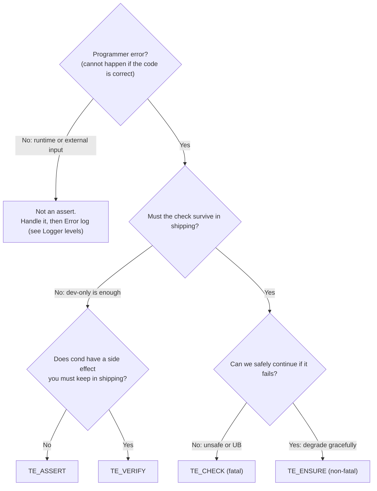
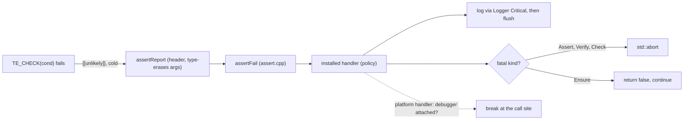

# Assert — Design

> Living design doc. The ADR holds the decision that is hard to reverse. This doc holds the
> *how*.

**Module:** `base` (a dependency-free leaf) · **Kind:** utility · **Status:** decided, implementing (S2-T4 and T5)
**ADRs:** **[[ADR-011 — Diagnostics (Logger & Assert)]] holds the decisions**, combined with
[[Logger — Design]]. It **supersedes ADR-006 §6's assert-tier clause**. ·
[[ADR-006 — v2 core architecture & module layout]] §6 (the two-tier seed, now superseded) ·
[[ADR-005 — v2 tech stack & toolchain]]
**Sprint:** [[2026-08 Sprint 02 — Base Foundation]], S2-T4 and S2-T5

## Purpose

One assert strategy for the whole engine.

This fixes v1's **F10**. v1 had `assert` and `cout` calls scattered around with no strategy
behind them, plus a silent `__debugbreak` that survived into release builds.

It pairs with the Logger as a single diagnostics strategy (ADR-005, ADR-006).

**No external library.** Just macros, `std::source_location` and compiler intrinsics. It
depends on the Logger, because a failure logs, and on a thin platform hook that knows whether
a debugger is attached.

## Decided

Every row below is frozen in [[ADR-011 — Diagnostics (Logger & Assert)]]. The section
reference is given and the rationale is not copied. Go to the ADR for the *why*.

| Decision | Where |
|---|---|
| **Four tiers**, in the table below, plus **one hookable handler**. | ADR-011 §5 |
| `TE_VERIFY` always **evaluates** its condition, and aborts in dev builds only. This **supersedes ADR-006 §6's tier clause**. | ADR-011 §5 |
| `TE_ASSERT` is **on** in RelWithDebInfo. | ADR-011 §5 |
| `TE_ENSURE`'s report-once is **per call site**, through a function-local static. | ADR-011 §5 |
| `setAssertHandler` **returns the previous handler**, so tests can scope-swap it. Install at composition-root time. | ADR-011 §5 |
| **No external assert library.** Macros, `source_location` and intrinsics. | ADR-011 §5 |
| The fatal path logs Critical, flushes, then aborts in a controlled way. **Never a silent `__debugbreak` in release** (F10). The failure branch is `[[unlikely]]` and cold. | ADR-011 §6 |
| `base` ships the default handler, which does not break. **`platform` or `app` installs** the debugger-aware one, with the OS include confined to a platform `.cpp`. Linux needs an equivalent **or an explicit no-op**. | ADR-011 §6 |
| **Assert calls the Logger, never the reverse.** A `thread_local` guard blocks recursion. Before init, output goes to **stderr**. | ADR-011 §7 |
| It shares the Logger's seam for formatted messages: **`std::format`** with positional `{0}` arguments. | ADR-011 §1 |
| `TE_ASSUME` is **out**. A wrong assume is UB, and there is no measured need. It is never auto-derived from a compiled-out `TE_ASSERT`. | ADR-011 §11 |
| SDK exposure is **deferred** to the scripting ADR. | ADR-011 §10 |

## Tiers and usage rules

There are two axes. First, is the condition evaluated at all in a shipping build? Second,
does a failure abort in a shipping build? The four tiers are the combinations worth having.

| Macro | Evaluated when shipping | Aborts when shipping | Use when | Example |
|---|---|---|---|---|
| `TE_ASSERT` | ❌ | ❌ | A dev-only correctness check that can be dropped, including on a hot path. "This cannot happen if the code is correct." | An internal index is in bounds. An internal pointer is non-null. An enum is in range. |
| `TE_VERIFY` | ✅ | ❌ (dev builds only) | Like `TE_ASSERT`, but the condition has a **side effect you must keep**, or you branch on the result. | `if (!TE_VERIFY(stream.write(x))) return;` |
| `TE_CHECK` | ✅ | ✅ **fatal** | Continuing would be unsafe or UB in **any** build. | The allocator is intact. The GPU device exists before use. Required config is present. |
| `TE_ENSURE` | ✅ | ❌ **non-fatal.** Logs, continues, reports once, returns `bool`. | Wrong but recoverable. You want to degrade gracefully. | A missing asset falls back to a placeholder. An odd but handleable packet. A soft budget is exceeded. |

### Which tier?



**Rules of thumb**

- **Start at "is this a programmer error?"** If the cause is runtime or external, meaning a
  bad file, a dropped packet or user input, it is **never** an assert. Log it and handle it.
  The assert tiers are for "this is impossible if my code is correct".
- **Three questions separate the tiers.** `ASSERT` against `CHECK` asks whether the check is
  droppable in shipping. `CHECK` against `ENSURE` asks whether we can safely continue.
  `ASSERT` against `VERIFY` asks whether the condition has a side effect that must be kept.
- **Never put a side effect inside `TE_ASSERT`.** It vanishes in a shipping build.
  `TE_VERIFY` exists for exactly that case.
- **Prefer `ENSURE` over `CHECK` for anything survivable.** A hard abort in a player's session
  is a last resort. Reserve `CHECK` for genuinely unrecoverable state, such as a corrupt
  allocator or a lost device.
- **An assert is not an Error log.** An assert says "this is impossible, it is a programmer
  bug". An Error says "the world did something bad, and we handled it". See
  [[Logger — Design]]'s level rules. These rules may move to the root `CONVENTIONS.md` when B4
  lands.

## Design

### From macro to handler

This mirrors the Logger's seam.

The header exposes the macros, plus a small template that type-erases the message arguments.
That template calls a non-template `assertFail(...)` in `assert.cpp`. `assertFail` calls the
**installed handler**, and the handler is what decides whether to log, abort or break.



### Config mapping

| Build | ASSERT | VERIFY | CHECK | ENSURE |
|---|---|---|---|---|
| Debug | on | on | on | on |
| RelWithDebInfo (dev runtime) | **on** | on | on | on |
| Release / Shipping | **off**, condition not evaluated | condition evaluated, no abort | on, fatal | on, non-fatal |

`TE_ASSERT` stays **on** in RelWithDebInfo (ADR-011 §5). That is the dev-runtime config, and
debuggability is its whole point.

The knob is `TE_ASSERT_DEV`, a **PUBLIC** compile definition set in
`engine/base/CMakeLists.txt`. It is 1 for Debug and RelWithDebInfo, and 0 for Release.

**PUBLIC matters here.** If it were PRIVATE, a consumer's translation unit would not see the
definition. It would fall back to the header's `#if !defined` default of 1, while the library
itself had compiled with 0. The macro and the library would then disagree about what ships.

That split is what `AssertTests.cpp`'s "kind fatality matches the config table" case catches.
It compares the library's compiled-in view against the macro as the *test* translation unit
sees it.

**Verification is asymmetric, on purpose.** The two halves of the mapping are proved by
different things.

| Claim | Proved by | Runs |
|---|---|---|
| The macro honours the knob. On, it evaluates and reports. Off, the condition is **not** evaluated. | `AssertTests.cpp`, through `#if TE_ASSERT_DEV` / `#else` | Every leg, Debug and Release |
| The config sets the knob, so RelWithDebInfo gives 1. | Building and running that config | **Local only** |

The second row is a build property, not a runtime one. No unit test inside a Debug binary can
observe what a RelWithDebInfo compile emitted. And a `static_assert` against a CMake-supplied
expectation proves nothing, because both sides of the comparison come from the same generator
expression.

So RelWithDebInfo gets its own **test presets**, `windows-relwithdebinfo` and
`linux-relwithdebinfo`, added at S2-T4. They run **by hand before a PR** rather than as a CI
leg. ADR-008 §9's minute budget is a live constraint, and this config's required-check status
is unchanged.

```bash
ctest --preset windows-relwithdebinfo
```

### `base` stays a leaf

Breaking into the debugger is easy. Knowing whether a debugger is attached is not.

`__debugbreak()` and `__builtin_trap()` are **compiler intrinsics**. They call no OS function,
so they are fine in `base`.

`IsDebuggerPresent()` is an **OS call**, and `base` is not allowed to make one.

The resolution: `base` ships the **default handler**, which logs and aborts without breaking.
`platform` or `app` installs the debugger-aware handler through the hookable seam, which is
the same seam the tests use. No OS call enters `base`, and the dependency graph stays intact.

## Open questions

**Everything this note once asked is closed by [[ADR-011 — Diagnostics (Logger & Assert)]].**

- The ADR-006 §6 supersession, stated in ADR-011's header and in [[ADR Index]] under *Partial
  supersessions*.
- SDK exposure, deferred by §10.
- `TE_ASSERT` in RelWithDebInfo, on, by §5.
- `TE_ENSURE`'s report-once scope, per call site, by §5.
- `TE_ASSUME`, dropped, by §11.
- The handler signature and its install mechanism, §5.
- Bootstrap, recursion and the stderr fallback, §7.

### The debugger-aware handler still has no implementation

This one is live, and it is owned by the ADR's exit triggers rather than by this note.

Neither leg has an implementation. ADR-011 §6 requires either a Linux equivalent or an
explicit no-op, so that the required Linux check stays green. It lands with `platform`. S2-T5
left it as a documented hook.

**S3-B1 checked, and installed nothing** (2026-08-08). That card read "move the assert-handler
install into `app`", but there was never a copy to move. No executable installs a handler, and
`Assert.cpp` seeds `defaultAssertHandler` as the static initial value. The composition-root
scope covers logging only.

**Re-parked, not closed.** The install point is still `setAssertHandler` at the top of
`run()`, whenever `platform` gives it something to install.

## References

- **[[ADR-011 — Diagnostics (Logger & Assert)]]**: the decisions
- [[ADR-006 — v2 core architecture & module layout]] §6 (the superseded tier clause) ·
  [[ADR-005 — v2 tech stack & toolchain]]
- [[Logger — Design]]: shares the `std::format` seam and the fail-to-log path. Both are
  covered by the combined Diagnostics ADR.
- [[v1 Code Audit]]: F10
