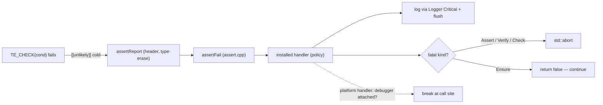

# Assert — Design

> Living design doc. Terse (CLAUDE.md token economy). ADR = the irreversible decision; this doc = the _how_.

**Module:** `base` (helper/utility — dependency-free leaf) · **Kind:** utility · **Status:** decided — implementing (S2-T4/T5)
**ADRs:** **[[ADR-011 — Diagnostics (Logger & Assert)]] — the decisions** (combined with
[[Logger — Design]]; **supersedes ADR-006 §6's assert-tier clause**) ·
[[ADR-006 — v2 core architecture & module layout]] §6 (two-tier seed — tier clause now superseded) ·
[[ADR-005 — v2 tech stack & toolchain]]
**Sprint:** [[2026-08 Sprint 02 — Base Foundation]] — S2-T4 / S2-T5

## Purpose
One assert strategy for the whole engine — fixes v1 **F10** (scattered `assert`/`cout`, no strategy,
silent `__debugbreak` in release). Paired with the Logger as the single "diagnostics" strategy
(ADR-005/006). **No external lib** — pure macros + `std::source_location` + compiler intrinsics;
depends only on the Logger (fail → log) and a thin platform hook (debugger-awareness).

## Decided

Every row below is frozen in [[ADR-011 — Diagnostics (Logger & Assert)]] — **§ref, no copied
rationale.** Go to the ADR for *why*.

| Decision | Where |
|---|---|
| **Four tiers** (table below) + **one hookable handler** | ADR-011 §5 |
| `TE_VERIFY` = always-**evaluate**, **dev-only abort** — **supersedes ADR-006 §6's tier clause** | ADR-011 §5 |
| `TE_ASSERT` is **on** in RelWithDebInfo | ADR-011 §5 |
| `TE_ENSURE` report-once is **per call-site** (function-local static) | ADR-011 §5 |
| `setAssertHandler` **returns the previous** handler (tests scope-swap); install at composition-root time | ADR-011 §5 |
| **No external assert lib** — macros + `source_location` + intrinsics | ADR-011 §5 |
| Fatal path: log Critical → flush → controlled abort · **never a silent `__debugbreak` in release** (F10) · failure branch `[[unlikely]]`/cold | ADR-011 §6 |
| `base` ships the default handler (no break); **platform/app install** the debugger-aware one — OS include in a platform `.cpp`, **Linux equivalent or explicit no-op** | ADR-011 §6 |
| **Assert → Logger, never the reverse**; `thread_local` no-recursion guard; pre-init → **stderr** | ADR-011 §7 |
| Shares the Logger's seam for formatted messages (**`std::format`**, positional `{0}` args) | ADR-011 §1 |
| `TE_ASSUME` — **out** (wrong assume = UB, no measured need); never auto-derived from a compiled-out `TE_ASSERT` | ADR-011 §11 |
| SDK exposure **deferred** to the scripting ADR | ADR-011 §10 |

## Tiers & usage rules
Two axes: **(1)** is `cond` evaluated in shipping? · **(2)** does failure abort in shipping?

| Macro | Eval (ship) | Abort (ship) | Use when… | Example |
|---|---|---|---|---|
| `TE_ASSERT` | ❌ | ❌ | dev-only correctness check, droppable, hot path — "can't happen if the code is correct" | internal index in bounds; non-null internal ptr; enum in range |
| `TE_VERIFY` | ✅ | ❌ (dev-only abort) | like ASSERT but `cond` has a **side effect to keep**, or you branch on the result | `if (!TE_VERIFY(stream.write(x))) return;` |
| `TE_CHECK` | ✅ | ✅ **fatal** | continuing is unsafe / UB in **any** build | allocator intact; GPU device created before use; required config present |
| `TE_ENSURE` | ✅ | ❌ **non-fatal** — log + continue, **report-once**; returns `bool` | recoverable-but-wrong; degrade gracefully | missing asset → placeholder; odd-but-handleable packet; soft budget exceeded |

### Which tier? (decision flow)

**Rules of thumb**
- **Start at "is this a programmer error?"** If it's runtime/external (bad file, dropped packet, user
  input) it's **never** an assert — log it / handle it. ASSERT tiers are for *"this is impossible if my
  code is correct."*
- **ASSERT vs CHECK** = "droppable in shipping?" · **CHECK vs ENSURE** = "can we safely continue?" ·
  **ASSERT vs VERIFY** = "does the condition have a side effect I must keep?"
- **Never put a side effect in `TE_ASSERT`** — it vanishes in shipping. That's what `TE_VERIFY` is for.
- **Prefer `ENSURE` over `CHECK` for anything survivable** — a hard abort in a player's session is a last
  resort; reserve `CHECK` for genuinely unrecoverable state (corrupt allocator, device lost).
- **Assert/Check ≠ Error log.** Assert = "impossible, programmer bug"; Error = "world did something bad,
  handled" (see [[Logger — Design]] level rules). *(These rules may promote to root `CONVENTIONS.md` when
  B4 lands.)*

## Design

### Macro → handler (mirrors the Logger seam)
Header exposes the macros + a tiny template that type-erases the message args → non-template
`assertFail(...)` in `assert.cpp`, which calls the **installed handler**; the handler decides
log / abort / break.

### Config mapping
| Build | ASSERT | VERIFY | CHECK | ENSURE |
|---|---|---|---|---|
| Debug | on | on | on | on |
| RelWithDebInfo (dev runtime) | **on** | on | on | on |
| Release / Shipping | **off** (cond not eval) | cond eval, no abort | on (fatal) | on (non-fatal) |

RelWithDebInfo ASSERT = **on** (ADR-011 §5 — it's the dev-runtime config; debuggability is its point).

### `base` stays a leaf (the debugger-break subtlety)
`__debugbreak()` / `__builtin_trap()` are **compiler intrinsics** (no OS) → fine in `base`. But
"is a debugger attached?" (`IsDebuggerPresent`) is an **OS** call → *not* allowed in `base`. Resolution:
`base` ships the **default handler** (log + abort, no break); **platform/app install** the debugger-aware
handler through the hookable seam — the *same* seam the tests use. → no OS in `base`, DAG intact.

## Open questions

**All closed by [[ADR-011 — Diagnostics (Logger & Assert)]]** — the ADR-006 §6 supersession (stated in
ADR-011's header + [[ADR Index]] *Partial supersessions*), SDK exposure (§10, deferred), RelWithDebInfo
ASSERT (§5, on), ENSURE report-once scope (§5, per call-site), `TE_ASSUME` (§11, out), handler signature
+ install mechanism (§5), bootstrap/recursion/stderr fallback (§7).

Live, and owned by the ADR's exit triggers:
- **The Linux/Clang debugger-aware handler** has no implementation yet — ADR-011 §6 requires an
  equivalent **or an explicit no-op** so the required Linux check stays green. Lands with `platform`,
  not this sprint (S2-T5 leaves it a documented hook).

## References
- **[[ADR-011 — Diagnostics (Logger & Assert)]]** — the decisions
- [[ADR-006 — v2 core architecture & module layout]] §6 (tier clause superseded), [[ADR-005 — v2 tech stack & toolchain]]
- [[Logger — Design]] — shares the `std::format` seam + fail→log path; **combined Diagnostics ADR**
- [[v1 Code Audit]] — F10
- [[Backlog]] → base → utilities
