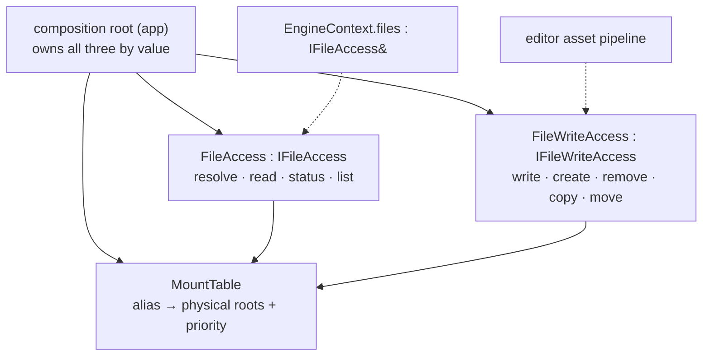

# File Access — Design

> Living design doc. **ADR = the irreversible decision; this doc = the _how_.**

**Module:** `platform` · **Kind:** utility (helper *service*) · **Status:** draft
**ADRs:** [[ADR-006 — v2 core architecture & module layout]] §1 §4 §5 ·
**v1:** [[v1 Code Audit]] F30 · F16 · **Backlog:** [[Backlog]] → `platform`

## Purpose

The engine's **virtual filesystem**: mount aliases onto physical roots, resolve
`alias://relative/path` into a real path, read bytes. Every asset, shader and config load
goes through it, so **nothing above `platform` ever holds a disk path**.

Fixes **F30** — v1 declared `IFileSystem` in `core` but its only implementation was
`editor`'s, so a shipped runtime could not load an asset. Also fixes **F16** *by name*:
v1's was `class FileSystem : public System, public IFileSystem`, a stateless-ish helper
modelled as a lifecycle System. In v2 "System" is a reserved word (ADR-006 §5 — ticks,
touches `Scene` state, ordering is load-bearing). This is none of those, so it is not
called one.

## Decided

| What | Call | Ref |
|---|---|---|
| **Name** | **`IFileAccess`** — the `…System` suffix is retired | ADR-006 §5's two-bucket test; F16 |
| **Module** | `platform`, interface *and* impl | ADR-006 §1 — platform's contents list *file I/O*. Resolves §5's "platform/core" with no judgement call; `core → platform`, so `EngineContext` still reaches it |
| **Kind** | helper **service** — owned + injected, never globally located | ADR-006 §5 |
| **Wiring** | composition root owns by value; `EngineContext` carries `IFileAccess& files` | ADR-006 §4 (F13: non-owning refs, no `shared_ptr`) |
| **Path scheme** | v1's `alias://relative/path`; `int` priority, highest first | v1 `FileSystem.cpp:8-17` — kept, it worked |
| **Case** | **case-sensitive everywhere; the resolver never case-folds** | Only rule that behaves identically on both CI legs — see *Design* |
| **Errors** | `FileResult` status enum returned, data via out-param. No exceptions | Below — v1 returned bare `bool` |
| **Async** | **none.** Sync-only | M2's threading ADR is unwritten; see *Open* |
| **Surface** | **split** read-side / mutating | Below |
| **Mount authority** | `MountTable`, mounted at the **composition root only** — on neither interface | v1 put `mount()` on the interface every consumer held |

## Design

Three types, each small. The split exists so the runtime's dependency manifest is honest:
`runtime` constructs the read half and links nothing else; the editor's asset pipeline
composes both.



`MountTable` is the shared state; the two halves resolve against it with **different
policies**, which is why it is its own type rather than a private member of either.

### Surface

```cpp
enum class FileResult { Ok, NoMount, NotFound, NotADirectory, AccessDenied, IoError };

struct FileStatus {
    std::filesystem::path physicalPath;
    bool     isDirectory  = false;
    uint64_t size         = 0;
    uint64_t lastModified = 0;
};

class IFileAccess {
public:
    virtual ~IFileAccess() = default;
    virtual FileResult read(std::string_view virtualPath, std::vector<std::byte>& out) = 0;
    virtual FileResult status(std::string_view virtualPath, FileStatus& out) = 0;
    virtual FileResult list(std::string_view virtualPath, bool recursive,
                            std::vector<std::string>& out) = 0;
    virtual FileResult resolve(std::string_view virtualPath,
                               std::filesystem::path& out) = 0;
};
```

`IFileWriteAccess` carries v1's mutating half — `write` · `createDirectory` ·
`remove` · `copy` · `move` · `rename`, over both files and directories — same
`FileResult` convention.

**It ships with [[Roadmap]] M3, not M1.** M3 creates the project root, writes
`project.toml` and lays out the asset dirs, so the consumer is one rung out — this is a
*sequencing* call, not a parking-lot deferral. Held back because the write surface should
be shaped by M3's actual writes rather than guessed a sprint early; M1 ships the read half
because that is what M1's own consumers need.

### Resolution

| | Read side | Write side |
|---|---|---|
| Split | `alias://rel` → (`alias`, `rel`) | same |
| Walk | every mount with that alias, **priority order**, first that **exists** wins | **highest-priority** mount with that alias, no existence probe |
| Miss | `NoMount` (alias unknown) vs `NotFound` (alias known, no candidate) — distinguished | `NoMount` only |
| Parents | — | `create_directories` on the parent |

Distinguishing `NoMount` from `NotFound` is the reason for the enum: v1's `bool` +
`TE_LOGGER_ERROR` meant a probe for an *optional* file logged an error on the normal path.

**Case:** `alias://Foo/Bar.png` and `alias://foo/bar.png` are different paths on both
legs. Windows' filesystem will happily resolve the wrong case and Linux CI will not — so
the resolver does no folding, and a Catch2 case pins that a wrong-case path returns
`NotFound` rather than opening the file.

### Threading

**None.** Mounts are established at the composition root and the table is frozen
afterwards, so no lock is needed — v1 took a `shared_mutex` on every single read.
That is a *consequence* of moving `mount()` off the interface, not an independent
decision, and it is re-opened by M2's threading ADR the moment a job thread reads.

### Buffer type

`std::vector<std::byte>` out-param for now. v1 read into a `Buffer` from
`serialization/buffer.hpp`; v2 has no serialization module yet.

**Short-lived on purpose.** Serialization moved to [[Roadmap]] **M2** on 2026-08-02, so its
`Buffer` arrives in Sprint 04 — one rung out, not at M6. Don't build a buffer abstraction
here to bridge the gap; the out-param signature is the whole bridge, and swapping the
parameter type is a mechanical edit at every call site.

## Consumers

| Rung | Uses |
|---|---|
| **M3** project | project root + `project.toml`; **owns the mount set** (v1's `editorAssets://`, `projectResources://`, `projectCache://` — `ProjectManager.cpp:263-271`); **first writer** → brings `IFileWriteAccess` |
| **M6** resources | every asset load, by virtual path |
| editor | asset pipeline import/bake → the write side |

## Open questions

- **File watching.** v1 had `IFileWatcher` (`core/fileSystem/IFileWatcher.hpp`) for editor
  hot-reload — callback subscriptions, so it also needs re-reading against
  [[ADR-014 — Events (buffered streams) & StringId]]'s no-callbacks rule. Out of M1.
- **Archive / pak mounts.** Mounting an archive rather than a directory. `MountTable`'s
  shape allows it; no consumer until shipping.
- **Threading** → M2's threading ADR (above).

## References

- [[ADR-006 — v2 core architecture & module layout]] §1 (module contents) · §4 (DI +
  `EngineContext`) · §5 (System/helper taxonomy)
- [[v1 Code Audit]] **F30** (impl editor-only) · **F16** (everything is a System)
- v1 prior art @ `v1-reference`: `engine/core/include/TechEngine/core/fileSystem/IFileSystem.hpp` ·
  `runtime/editor/src/fileSystem/FileSystem.cpp` · `runtime/editor/src/project/ProjectManager.cpp:263-271`
- Code: *(none yet — S3-T11…T13)*
