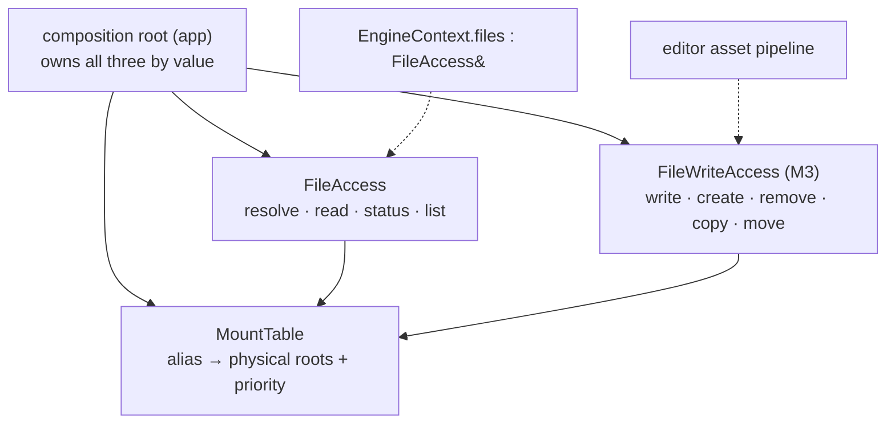

# File Access — Design

> Living design doc. **ADR = the irreversible decision; this doc = the _how_.**

**Module:** `platform` · **Kind:** utility (helper *service*) · **Status:** **read side shipped** (Story F, S3-T11…T13); write half is M3
**ADRs:** [[ADR-006 — v2 core architecture & module layout]] §1 §4 §5 ·
**v1:** [[v1 Code Audit]] F30 · F16 · **Backlog:** [[Backlog]] → `platform`

## Purpose

The engine's **virtual filesystem**: mount aliases onto physical roots, resolve
`alias://relative/path` into a real path, read bytes. Every asset, shader and config load
goes through it, so **nothing above `platform` ever holds a disk path**.

Fixes **F30** — v1 declared `IFileSystem` in `core` but its only implementation was
`editor`'s, so a shipped runtime could not load an asset. Also fixes **F16** *by name*:
v1's was `class FileSystem : public System, public IFileSystem`, a stateless-ish helper
modelled as a lifecycle System. In v2 "System" is a reserved word (ADR-006 §5 — ticks,
touches `Scene` state, ordering is load-bearing). This is none of those, so it is not
called one.

## Decided

| What | Call | Ref |
|---|---|---|
| **Name** | **`FileAccess`** — the `…System` suffix is retired | ADR-006 §5's two-bucket test; F16 |
| **Module** | `platform`, declaration *and* impl | ADR-006 §1 — platform's contents list *file I/O*. Resolves §5's "platform/core" with no judgement call; `core → platform`, so `EngineContext` still reaches it |
| **Kind** | helper **service** — owned + injected, never globally located | ADR-006 §5 |
| **No interface** | **concrete class, no `IFileAccess`** — revisit when a second impl is real | S3-T12 — below |
| **Wiring** | composition root owns by value; `EngineContext` carries `FileAccess& files` | ADR-006 §4 (F13: non-owning refs, no `shared_ptr`) |
| **Path scheme** | v1's `alias://relative/path`; `int` priority, highest first | v1 `FileSystem.cpp:8-17` — kept, it worked |
| **Case** | **case-sensitive everywhere; the resolver never case-folds** | Only rule that behaves identically on both CI legs — see *Design* |
| **Errors** | `FileResult` status enum returned, data via out-param. No exceptions | Below — v1 returned bare `bool` |
| **Path validation** | the splitter rejects a malformed path outright → `InvalidPath` | S3-T11 — below |
| **Async** | **none.** Sync-only | M2's threading ADR is unwritten; see *Open* |
| **Surface** | **split** read-side / mutating | Below |
| **Mount authority** | `MountTable`, mounted at the **composition root only** — on neither interface | v1 put `mount()` on the interface every consumer held |

## Design

Three types, each small. The split exists so the runtime's dependency manifest is honest:
`runtime` constructs the read half and links nothing else; the editor's asset pipeline
composes both.



`MountTable` is the shared state; the two halves resolve against it with **different
policies**, which is why it is its own type rather than a private member of either.

### Wiring

`run()` (`engine/app/src/App.cpp`) owns `MountTable` and `FileAccess` **by value**, builds
`EngineContext` over them, and mounts afterwards — services first, then mounts. The context
is a non-owning view, so a mount established later is visible through it; a Catch2 case pins
that, because it is the thing a future `FileAccess` that snapshots the table would break.

`EngineContext` (`core`) has **one field** today. `Clock` stays owned by `run()` and the
event streams stay driver-owned (S3-T10), so neither joined it just because ADR-006 §4's
sketch listed them. `FrameContext` carries `const EngineContext&`, which deletes its
copy-assignment — a frame is observed through the loop's `const&`, never reseated.

**The demo mount is throwaway.** `engine/app/assets/` reached through a configure-time
`TE_DEMO_ASSETS_DIR`, marked `TODO(S3-T13)` in both `App.cpp` and `engine/app/CMakeLists.txt`.
It bakes a source-tree path into the binary and resolves to nothing in an installed build —
acceptable only because M3 replaces it. The real answer is `platform::executablePath()`
([[Backlog]] → `platform`); v1 had it Windows-only and used `current_path()` everywhere else.

### Why no interface

Dropped at S3-T12, before it shipped. There is **one implementation and nothing carded
needs a second** — the archive-mount idea is a `MountTable` concern, and the suite runs
against real scratch directories rather than doubles.

**ADR-006 §4's `IFileSystem& fs` is a v1 artifact, not a decision.** Every other field in
that sketch is concrete — `JobSystem&`, `Clock&`, `FrameAllocator&`, `ResourceRegistry&`,
`EventBus&`. File access was the lone interface because in v1 `core` *declared* it and
`editor` *implemented* it, so the interface was the seam across a module boundary that
should not have existed. That is **F30**, and putting the impl in `platform` is what fixes
it — which removes the interface's reason to exist.

Reintroduce when a second implementation is real: an archive- or network-backed VFS, or a
null one for an asset-less dedicated server. Extraction is mechanical, and the call sites
are already written against the four methods that would become the interface.

### Surface

```cpp
enum class FileResult : std::uint8_t { Ok, InvalidPath, NoMount, NotFound,
                                       IsADirectory, NotADirectory, AccessDenied, IoError };

struct FileStatus {
    std::filesystem::path physicalPath;
    bool          isDirectory  = false;
    std::uint64_t size         = 0;
    std::uint64_t lastModified = 0;   // Seconds since the Unix epoch, on every platform
};

class FileAccess {                    // ctor takes const MountTable&, stores a non-owning ptr
public:
    FileResult read(std::string_view virtualPath, std::vector<std::byte>& out) const;
    FileResult status(std::string_view virtualPath, FileStatus& out) const;
    FileResult list(std::string_view virtualPath, bool recursive,
                    std::vector<std::string>& out) const;
    FileResult resolve(std::string_view virtualPath, std::filesystem::path& out) const;
};
```

**All four are `const`** — the table is the only state and `FileAccess` holds it by
`const MountTable*`. **`IsADirectory`** is `read`'s wrong-kind result, the mirror of
`list`'s `NotADirectory`; it is an explicit check because `ifstream` opens a directory
successfully on Linux and fails on Windows. **`lastModified` is Unix seconds** —
`file_time_type`'s epoch is unspecified (MSVC counts from 1601, libstdc++ from 1970) and an
implementation need only provide one of `file_clock::to_sys` / `::to_utc`, so `clock_cast`
is the only portable spelling.

`FileStatus` keeps four fields; v1's `alias` / `virtualPath` / `name` / `extension` are all
recoverable from the caller's own argument or from `physicalPath`, and its `exists` flag is
what `FileResult` is for.

**`list` does not union overlays.** It lists the mount that wins the existence walk, so a
file only a lower-priority mount holds is *readable but never listed*. The asymmetry is
deliberate — union costs a dedupe pass and a rule for a name that is a file in one mount and
a directory in another, and no consumer needs it. Revisit at M6 if a resource scan does.

`IFileWriteAccess` carries v1's mutating half — `write` · `createDirectory` ·
`remove` · `copy` · `move` · `rename`, over both files and directories — same
`FileResult` convention.

**It ships with [[Roadmap]] M3, not M1.** M3 creates the project root, writes
`project.toml` and lays out the asset dirs, so the consumer is one rung out — this is a
*sequencing* call, not a parking-lot deferral. Held back because the write surface should
be shaped by M3's actual writes rather than guessed a sprint early; M1 ships the read half
because that is what M1's own consumers need.

### Resolution

| | Read side | Write side |
|---|---|---|
| Split | `alias://rel` → (`alias`, `rel`) | same |
| Walk | every mount with that alias, **priority order**, first that **exists** wins | **highest-priority** mount with that alias, no existence probe |
| Miss | `NoMount` (alias unknown) vs `NotFound` (alias known, no candidate) — distinguished | `NoMount` only |
| Parents | — | `create_directories` on the parent |

Distinguishing `NoMount` from `NotFound` is the reason for the enum: v1's `bool` +
`TE_LOGGER_ERROR` meant a probe for an *optional* file logged an error on the normal path.

### Path validation

`splitVirtualPath` is the gate — a path that fails it never reaches a mount, and
`resolveExisting` returns `InvalidPath` without touching disk. Rejected:

| Rejected | Because |
|---|---|
| no `://`, or an empty alias | not a virtual path. v1's `find('://')` was a **multichar `char` literal** that truncated to `'/'`, so this check could never fire for anything containing a slash |
| `/` or `:` in the alias | the alias is a key, not a path |
| a relative starting `/`, or containing `:` | `root / "/etc/passwd"` and `root / "C:/Windows"` **discard `root`** — `operator/` replaces on an absolute or foreign-root RHS |
| a `..` **segment** (`..hidden` and `icon..png` stay legal) | escapes the mount root |
| a backslash anywhere | Windows treats it as a separator, which re-opens the two rows above |

**`..` is rejected outright, not normalised.** A virtual path is an *identity* — the resource
cache, the watcher map and asset manifests all key on the string, so two spellings of one file
means two cache entries. Nothing emits `..`: `list()` returns normalised paths and manifests
are tool-written. Relative references between assets resolve a rung up, at the loader, which
hands the VFS a composed path. Also mechanical: `VirtualPathParts` holds `string_view`s into
the input, and a normalised path is a substring of nothing.

**Case:** `alias://Foo/Bar.png` and `alias://foo/bar.png` are different paths on both
legs. Windows' filesystem will happily resolve the wrong case and Linux CI will not — so
the resolver does no folding, and a Catch2 case pins that a wrong-case path returns
`NotFound` rather than opening the file.

`std::filesystem` does **not** level this — it abstracts the API, not the filesystem's case
semantics, and `exists()` forwards straight to the OS. Nor is it one behaviour per platform:
APFS is case-insensitive by default and NTFS has had per-directory case sensitivity since
Win10 1803. So `exists()` is only the cheap reject; every surviving candidate then has to
prove its spelling. `path::operator==` *is* case-sensitive on MSVC (a lexical compare that
never touches disk) — the mechanism asks the OS for the real name via `canonical()` and
compares lexically. That has a live defect: **[[Known Issues]] D3** — `canonical()` resolves
symlinks, so a link *inside* a mount reports `NotFound` for a correctly-cased file.

`canonical(physicalRoot)` is cached on `MountEntry` at mount time, since resolution is the
asset-load path. It is empty when the root did not exist at mount time — a mount may legally
precede the directory — and resolution falls back to canonicalising on the spot.

### Threading

**None.** Mounts are established at the composition root and the table is frozen
afterwards, so no lock is needed — v1 took a `shared_mutex` on every single read.
That is a *consequence* of moving `mount()` off the interface, not an independent
decision, and it is re-opened by M2's threading ADR the moment a job thread reads.

### Buffer type

`std::vector<std::byte>` out-param for now. v1 read into a `Buffer` from
`serialization/buffer.hpp`; v2 has no serialization module yet.

**Short-lived on purpose.** Serialization moved to [[Roadmap]] **M2** on 2026-08-02, so its
`Buffer` arrives in Sprint 04 — one rung out, not at M6. Don't build a buffer abstraction
here to bridge the gap; the out-param signature is the whole bridge, and swapping the
parameter type is a mechanical edit at every call site.

## Consumers

| Rung | Uses |
|---|---|
| **M3** project | project root + `project.toml`; **owns the mount set** (v1's `editorAssets://`, `projectResources://`, `projectCache://` — `ProjectManager.cpp:263-271`); **first writer** → brings `IFileWriteAccess` |
| **M6** resources | every asset load, by virtual path |
| editor | asset pipeline import/bake → the write side |

## Open questions

- **File watching.** v1 had `IFileWatcher` (`core/fileSystem/IFileWatcher.hpp`) for editor
  hot-reload — callback subscriptions, so it also needs re-reading against
  [[ADR-014 — Events (buffered streams) & StringId]]'s no-callbacks rule. Out of M1.
- **Archive / pak mounts.** Mounting an archive rather than a directory. `MountTable`'s
  shape allows it; no consumer until shipping.
- **Threading** → M2's threading ADR (above).
- **Two live defects**, both from S3-T11's review, neither blocking T12: [[Known Issues]]
  **D2** (`mount()` validates nothing — fix before M3 ports v1's mount set) · **D3** (the
  case check and symlinks).

## References

- [[ADR-006 — v2 core architecture & module layout]] §1 (module contents) · §4 (DI +
  `EngineContext`) · §5 (System/helper taxonomy)
- [[v1 Code Audit]] **F30** (impl editor-only) · **F16** (everything is a System)
- v1 prior art @ `v1-reference`: `engine/core/include/TechEngine/core/fileSystem/IFileSystem.hpp` ·
  `runtime/editor/src/fileSystem/FileSystem.cpp` · `runtime/editor/src/project/ProjectManager.cpp:262-271`
- Code: `engine/platform/include/TechEngine/platform/files/` — `FileAccess.hpp` ·
  `MountTable.hpp` · `VirtualPath.hpp` · `FileResult.hpp`; impls under `src/files/`; Catch2
  in `tests/files/` (`TechEnginePlatformTests`, new at S3-T11). Wiring:
  `engine/core/include/TechEngine/core/EngineContext.hpp` + `engine/app/src/App.cpp`;
  F30's regression case is `engine/core/tests/EngineContextTests.cpp`.
