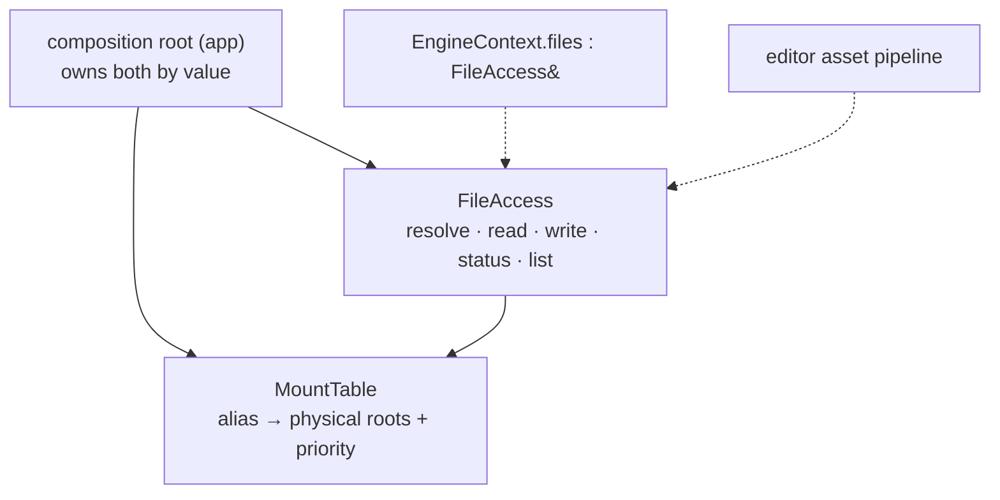

# File Access — Design

> Living design doc. The ADR holds the decision that is hard to reverse. This doc holds the *how*.

**Module:** `platform` · **Kind:** utility (helper *service*) · **Status:** read side shipped (Story F, S3-T11 to T13), `write` shipped at S4-T7 (2026-08-30), the rest of the mutating half is M3
**ADRs:** [[ADR-006 — v2 core architecture & module layout]] §1 §4 §5 ·
**v1:** [[v1 Code Audit]] F30 · F16 · **Backlog:** [[Backlog]] → `platform`

## Purpose

`FileAccess` is the engine's virtual filesystem. Code above `platform` asks for
`assets://textures/brick.png`. It never asks for
`C:/dev/TechEngine/engine/app/assets/textures/brick.png`. `FileAccess` turns the first into
the second and reads the bytes.

Every asset, shader and config load goes through it. That is the whole point: **no disk path
ever leaves `platform`.** A path anywhere higher would bake one machine's layout into the
engine.

### What this fixes from v1

**F30: the shipped runtime could not load an asset.**

v1 declared the `IFileSystem` interface in `core`, but wrote the only implementation in
`editor`. `runtime` links `core` and not `editor`. So a shipped game held an interface with
nothing behind it. The fix is to put both the header and the implementation in `platform`.
Every module links `platform`, so every module gets a working one.

**F16: it was modelled as a System, and it is not one.**

v1 wrote `class FileSystem : public System, public IFileSystem`. In v2, "System" means a
specific thing (ADR-006 §5). A System ticks every frame, touches `Scene` state, and the
order it runs in matters. File access does none of that. It is a helper you call. So it does
not inherit `System`, and it does not carry the `…System` suffix.

## Decided

This table is the summary. Every row that needed an argument has one in *Design* below.

| What | Call | Ref |
|---|---|---|
| **Name** | `FileAccess`. No `…System` suffix. | ADR-006 §5, F16 |
| **Module** | `platform`, both the header and the implementation. | ADR-006 §1 |
| **Kind** | A helper service. The composition root owns it and injects it. Never looked up globally. | ADR-006 §5 |
| **Interface** | None. One concrete class, no `IFileAccess`. | S3-T12 |
| **Wiring** | `EngineContext` carries `FileAccess& files`. | ADR-006 §4 (F13) |
| **Path scheme** | `alias://relative/path`, kept from v1. Mount priority is an `int`, highest first. | v1 `FileSystem.cpp:8-17` |
| **Case** | Case-sensitive on every platform. The resolver never case-folds. | See *Case sensitivity* |
| **Errors** | A `FileResult` enum is the return value. Data comes back through an out-param. No exceptions. | See *Resolution* |
| **Path validation** | A malformed path is rejected before it reaches a mount. | S3-T11 |
| **Alias validation** | `mount()` rejects an empty alias, a `/` and a `:` with fatal checks, so the two ends cannot disagree about what an alias is. The rules mirror `splitVirtualPath`'s. | S5-T2 |
| **Async** | None. Every call is synchronous. | See *Open questions* |
| **Surface** | One class. `read` and `write` both live on `FileAccess`. The other five mutating calls are M3. | See *The write surface* |
| **Mount authority** | Only the composition root mounts. `mount()` lives on `MountTable`. | See *Wiring* |

## Design

### The two types

`MountTable` holds the mounts. `FileAccess` reads and writes. There is no third type; see
*Why the write split was dropped*.

`MountTable` is its own type rather than a private member, because the two paths read it
under different rules. The read path walks every mount that matches. The write path takes
only the top one. See *Resolution*.



### Why the write split was dropped

**This was a three-type split until 2026-08-30.** A separate `FileWriteAccess` was to arrive
at M3, carrying the whole mutating half. S4-T7 dropped it and put `write` on `FileAccess`.

The split rested on binary size. `runtime` would build the read half and link nothing else,
so a shipped game would not carry write code it never calls. In a static library the linker
drops an uncalled function anyway, and nobody ever measured the difference. That is the
speculative optimization `CLAUDE.md` § *Performance* rules out.

**The cost is real and it is not binary size.** `EngineContext` carries `FileAccess& files`,
so every system holding the context can now write to disk. The script SDK inherits that the
day file access is exposed through it. The split would have made read-only access provable by
type. What replaces it is weaker: `write` is the class's one **non-const** method, so a
caller that must not write can hold a `const FileAccess&`. That is a convention the compiler
checks, not a boundary it enforces.

**Reversal trigger:** the first consumer that must be handed file access it provably cannot
write with. The SDK boundary (ADR-006 §3) is the likely one. Extraction stays mechanical,
because `FileAccess::write` and `MountTable::resolveForCreate` are the only two functions
that would move.

### Wiring

`run()` in `engine/app/src/App.cpp` is the composition root. It owns `MountTable` and
`FileAccess` **by value**, builds `EngineContext` over them, and mounts afterwards.

That order matters. `EngineContext` holds a reference, not a copy, so a mount added after
the context is built is still visible through it. A Catch2 case pins this. The case exists
because a future `FileAccess` that snapshotted the table in its constructor would pass every
other test and quietly break this one.

**`EngineContext` has one field today**, `FileAccess& files`.

ADR-006 §4 sketched a fuller context, with `Clock`, the event streams and others beside it.
That sketch is a shape, not a checklist. A service earns a field when something actually
needs to reach it *through the context*, and nothing does yet. So `Clock` stays owned by
`run()`, and the event streams stay owned by their drivers (S3-T10).

`FrameContext` carries the per-frame values plus a `const EngineContext& engine`. A
reference member deletes the struct's copy-assignment, which is the intent. A system
observes a frame through the loop's `const&`. Nobody should be able to reseat one frame's
context onto another.

### The demo mount is throwaway

It mounts `engine/app/assets/` through `TE_DEMO_ASSETS_DIR`, a path baked in at configure
time. Both `App.cpp` and `engine/app/CMakeLists.txt` carry a `TODO(S3-T13)` on it.

The problem is that a source-tree path means nothing in an installed build. The mount
resolves to a directory that is not there. This is acceptable only because M3 replaces the
whole mount set anyway.

The real fix is `platform::executablePath()`, on [[Backlog]] under `platform`. Mount
relative to the binary, not to the source tree. v1 had that function on Windows only and
fell back to `current_path()` elsewhere, which breaks as soon as the game is launched from
a different working directory.

### Why there is no interface

There is one implementation, and no carded work needs a second. So there is no
`IFileAccess`.

Two things that look like they would need one do not. Archive mounts are a `MountTable`
concern, not a second `FileAccess`. And the tests need no fake, because they run against
real scratch directories.

**ADR-006 §4 does list `IFileSystem& fs`, and that is a v1 leftover rather than a decision.**
Look at the rest of that sketch: `JobSystem&`, `Clock&`, `FrameAllocator&`,
`ResourceRegistry&`, `EventBus&`. All concrete. File access was the only interface in the
list, and F30 is the reason. In v1 the declaration and the implementation lived in different
modules, so an interface was the only way to bridge them. Put the implementation in
`platform` and there is no gap left to bridge.

**It is still recorded as a `decision` amendment on ADR-006** (2026-08-20). "Leftover rather
than a decision" is about the ADR's *intent*; the amendment policy's gate is *effect*, and a
reader following §4 plus its 2026-08-02 amendment would have built an `IFileAccess`. That is
[[ADR Index]] § *What is not an amendment* → the mirror case: the ADR said it, this note now
says otherwise, so it gets declared rather than left to rot.

Bring the interface back when a second implementation is real. The candidates are an
archive-backed VFS, a network-backed one, or a null one for a dedicated server with no
assets. Extraction is mechanical. Every call site already goes through the four methods
that would become the interface.

### The read surface

```cpp
enum class FileResult : std::uint8_t { Ok, InvalidPath, NoMount, NotFound,
                                       IsADirectory, NotADirectory, AccessDenied, IoError };

struct FileStatus {
    std::filesystem::path physicalPath;
    bool          isDirectory  = false;
    std::uint64_t size         = 0;
    std::uint64_t lastModified = 0;   // Seconds since the Unix epoch, on every platform
};

class FileAccess {                    // ctor takes const MountTable&, stores a non-owning ptr
public:
    FileResult read(std::string_view virtualPath, std::vector<std::byte>& out) const;
    FileResult status(std::string_view virtualPath, FileStatus& out) const;
    FileResult list(std::string_view virtualPath, bool recursive,
                    std::vector<std::string>& out) const;
    FileResult resolve(std::string_view virtualPath, std::filesystem::path& out) const;
};
```

**All four read methods are `const`.** `FileAccess` owns no state of its own. It holds the
table as a `const MountTable*` and only reads it. The class has a fifth method, `write`, and
it is deliberately **not** const. The reason is in *The two types*, not const-correctness.

**`read` on a directory returns `IsADirectory`.** The check has to be explicit, because
`std::ifstream` opens a directory successfully on Linux and fails on Windows. Without it,
the same call gives an empty buffer on one CI leg and an error on the other. `list` has the
mirror result, `NotADirectory`.

**`lastModified` is seconds since the Unix epoch, on every platform.** It is deliberately
not a `file_time_type`, because that type's epoch is unspecified. MSVC counts from 1601 and
libstdc++ counts from 1970, so the raw number means different things on the two legs.
Converting is awkward too: an implementation only has to provide one of `file_clock::to_sys`
and `file_clock::to_utc`. `std::chrono::clock_cast` is the one spelling that works either
way.

**`FileStatus` keeps four fields.** v1's version also carried `alias`, `virtualPath`, `name`
and `extension`. The caller already passed the virtual path in, and the other three come out
of `physicalPath`. v1's `exists` flag is what `FileResult` replaced.

### `list` returns one mount, not the union

`list` returns the contents of whichever mount wins the existence walk. A file that only a
lower-priority mount holds is readable through `read`, but it never appears in `list`.

That is inconsistent, and it is deliberate. A union would need a dedupe pass, plus a rule
for the case where one name is a file in one mount and a directory in another. Nothing needs
that today. Revisit at M6 if the resource scan does.

### The write surface

```cpp
FileResult write(std::string_view virtualPath, std::span<const std::byte> bytes);
```

**`write` shipped at S4-T7 (2026-08-30)**, ahead of the M3 plan this section used to carry.
That card's demo round-trips a struct through disk, and reaching past `platform` to an
`ofstream` to do it would have been worse than shipping the one method.

Three calls it makes, each pinned by a Catch2 case:

| Question | Call |
|---|---|
| The mount root, `assets://` | `InvalidPath`. The read side accepts it, because listing a root is meaningful. Nothing can create a file over a directory. |
| A file that already exists | Truncated, never appended. Note the asymmetry with `Writer`, which appends to its buffer. |
| A missing parent directory | **Not created.** The open fails, so the caller gets the generic `IoError`. |

`close()` runs before the stream is checked, because a full disk fails on the flush rather
than on `write()`.

**The rest of the mutating half is still M3**: `createDirectory`, `remove`, `copy`, `move`
and `rename`, over both files and directories, on the same `FileResult` convention. M3 is the
rung that creates the project root, writes `project.toml` and lays out the asset directories,
so shaping those five around its real writes still beats guessing them now.

### Resolution

Both paths start by splitting `alias://rel` into an alias and a relative path. They differ
after that, and they are two functions on `MountTable`: `resolveExisting` serves the read
path, `resolveForCreate` the write path.

| | Read path | Write path |
|---|---|---|
| Which mount wins | Walks every mount with that alias, in priority order. The first one where the file **exists** wins. | Takes the highest-priority mount with that alias. It never probes for existence. |
| Nothing found | `NoMount` if the alias was never mounted. `NotFound` if it was, but no mount holds the file. | `NoMount` only. |
| `alias://` with no relative | Resolves to the mount root, which `list` and `status` both want. | `InvalidPath`. |
| Missing parent dirs | Not applicable. | **Not created**, as of 2026-08-30. See *The write surface*. |

The read path probes because mounts overlay. A higher-priority mount shadows a lower one,
and walking in priority order is what makes that work. The write path does not probe,
because a write goes to the top mount whether the file is already there or not.

**`resolveForCreate` reads the top mount off `m_entries[0]` for that alias**, and that is
correct only because `mount()` keeps the vector in descending priority order. Nothing in the
function itself checks that, so the invariant lives in `mount()` and the ordering case in
`MountTableTests.cpp` is what holds it up.

**Telling `NoMount` and `NotFound` apart is why `FileResult` is an enum at all.** v1 returned
a `bool` and logged through `TE_LOGGER_ERROR` on failure. Looking for an *optional* file
therefore printed an error every time it was absent, which is the normal path.

### What counts as a valid path

`splitVirtualPath` is the gate. A path that fails it never reaches a mount, and
`resolveExisting` returns `InvalidPath` without touching the disk. Five things are rejected.

| Rejected | Why |
|---|---|
| No `://`, or an empty alias before it | It is not a virtual path. v1 could not catch this: it wrote `find('://')`, which is a multi-character `char` literal rather than a string. It truncated to `'/'`, so the check passed for any path containing a slash. |
| A `/` or a `:` inside the alias | The alias is a key. It is not itself a path. |
| A relative part that starts with `/`, or contains `:` | This is the dangerous one. `root / "/etc/passwd"` and `root / "C:/Windows"` each evaluate to the right-hand side alone. `std::filesystem::operator/` discards the left side when the right side is absolute or names a different root. An unchecked path escapes the mount completely. |
| A `..` **segment** | It escapes the mount root. `..hidden` and `icon..png` stay legal, because the rule is about a whole segment. |
| A backslash anywhere | Windows reads it as a separator, which re-opens the two rows above. |

**`..` is rejected, not normalised away.** That is the less obvious choice, so here is the
reasoning.

A virtual path is an **identity**, not just a lookup key. The resource cache, the watcher
map and the asset manifests all key on the exact string. If `a://x/../y/f.png` and
`a://y/f.png` both resolved, one file would sit in the cache twice under two names.

Nothing in the engine produces `..` anyway. `list()` returns normalised paths, and manifests
are written by tools. When one asset references another relatively, the loader resolves that
a rung above the VFS and hands down a composed path.

There is a mechanical reason too. `VirtualPathParts` holds `string_view`s pointing into the
caller's string. A normalised path would be a new string, so the views would have nothing to
point at.

### Case sensitivity

**`alias://Foo/Bar.png` and `alias://foo/bar.png` are two different paths, on Windows as
well as on Linux.** The resolver never folds case. A Catch2 case pins that a wrong-case path
returns `NotFound` instead of quietly opening the file.

The reason is CI. Windows resolves the wrong case happily and Linux does not, so a
case-typo bug would pass locally and fail on one leg only. Case-sensitive everywhere is the
one rule that behaves identically on both.

**`std::filesystem` does not solve this for us.** It abstracts the API, not the filesystem's
behaviour. `exists()` forwards straight to the OS and inherits whatever that OS does.

It is not even one behaviour per platform. APFS on macOS is case-insensitive by default.
NTFS has supported per-directory case sensitivity since Windows 10 1803. The answer depends
on the volume, not only on the OS.

**So `exists()` is only the cheap first pass.** Every candidate that survives it still has to
prove its spelling. A plain lexical compare is not enough on its own, even though
`std::filesystem::path::operator==` *is* case-sensitive on MSVC. That operator never touches
the disk, so it only compares what the caller wrote against what the caller wrote.

The mechanism is to ask the OS for the file's real name through `canonical()`, then compare
that name lexically against the requested path.

**That has a live defect, [[Known Issues]] D3.** `canonical()` also resolves symlinks. A
symlink inside a mount canonicalises to its target's name, which does not match what was
asked for. A correctly-cased file then reports `NotFound`.

`canonical(physicalRoot)` is computed once at mount time and cached on `MountEntry`, because
resolution sits on the asset-load path and `canonical()` hits the disk. The cache is empty
when the root did not exist at mount time. That is legal, since a mount may precede its
directory. Resolution then canonicalises on the spot instead.

### Threading

**There is none, and none is needed.** All mounting happens at the composition root, before
the loop starts. The table is frozen after that, so concurrent readers see a constant.

This is worth stating because v1 took a `shared_mutex` on every single read. The difference
is not that v2 is braver. It follows from moving `mount()` off the interface that every
consumer held. When anyone can mount at any time, every read needs a lock.

M2's threading ADR re-opens this the moment a job thread reads a file.

### Buffer type

`read` fills a `std::vector<std::byte>` out-param, and that is the settled answer rather than
a bridge to something else.

**This section used to predict the opposite**, and S4-T6 settled it the other way
(2026-08-27). It said serialization would land a `Buffer` type in Sprint 04 and that the
out-param was temporary until it did. Serialization shipped with **no** buffer type at all:
v1's `Buffer` was an owner and a non-owning view in one class, with no destructor and a
shallow copy constructor, and the standard library already splits those two jobs into
`std::vector` and `std::span`. So nothing here changes and no call site needs editing.

The two halves compose with no conversion, because `Reader` takes a
`std::span<const std::byte>` and a vector converts to one. The worked example, including the
two failure surfaces a caller has to check, is in [[Serialization — Design]] §
*Composing with `FileAccess`*.

## Who uses it

| Rung | Uses |
|---|---|
| **M3** project | The project root and `project.toml`. It **owns the mount set**, which is v1's `editorAssets://`, `projectResources://` and `projectCache://` (`ProjectManager.cpp:263-271`). It brings the other five mutating calls with it; `write` itself shipped at S4-T7. |
| **M6** resources | Every asset load, by virtual path. |
| editor | The asset pipeline's import and bake steps, which write. |

## Open questions

- **File watching.** v1 had `IFileWatcher` for editor hot-reload. It is out of M1, and it
  needs more than a port. It was built on callback subscriptions, which
  [[ADR-014 — Events (buffered streams) & StringId]] rules out. Re-read it against that ADR
  before designing a v2 one.
- **Should `write` create missing parent directories?** Today it does not, and a missing one
  gives the generic `IoError` rather than saying what was wrong. Owner: M3, decided together
  with `createDirectory` rather than before it.
- **Archive mounts.** Mounting a `.pak` file instead of a directory. `MountTable`'s shape
  allows it. No consumer needs it before shipping.
- **Threading.** Goes to M2's threading ADR. See above.
- **One live defect.** [[Known Issues]] **D3**: `canonical()` and symlinks, described under
  *Case sensitivity*. It came out of S3-T11's review alongside the `mount()` validation gap,
  which S5-T2 closed on 2026-09-01.

## References

- [[ADR-006 — v2 core architecture & module layout]] §1 (module contents) · §4 (DI and
  `EngineContext`) · §5 (the System and helper taxonomy)
- [[v1 Code Audit]] **F30** (the implementation was editor-only) · **F16** (everything was a
  System)
- v1 prior art at the `v1-reference` tag:
  `engine/core/include/TechEngine/core/fileSystem/IFileSystem.hpp` ·
  `runtime/editor/src/fileSystem/FileSystem.cpp` ·
  `runtime/editor/src/project/ProjectManager.cpp:262-271`
- Code: headers in `engine/platform/include/TechEngine/platform/files/` are `FileAccess.hpp`
  · `MountTable.hpp` · `VirtualPath.hpp` · `FileResult.hpp`. Implementations are under
  `src/files/`. Catch2 cases are in `tests/files/` (`TechEnginePlatformTests`, new at
  S3-T11).
- Wiring: `engine/core/include/TechEngine/core/EngineContext.hpp` and
  `engine/app/src/App.cpp`. F30's regression case is
  `engine/core/tests/EngineContextTests.cpp`.
