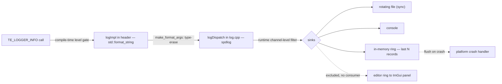

# Logger — Design

> Living design doc. Terse (CLAUDE.md token economy). ADR = the irreversible decision; this doc = the _how_.

**Module:** `base` (helper/utility — dependency-free leaf) · **Kind:** utility · **Status:** decided — implementing (S2-T2/T3)
**ADRs:** **[[ADR-011 — Diagnostics (Logger & Assert)]] — the decisions** ·
[[ADR-005 — v2 tech stack & toolchain]] (spdlog) · [[ADR-006 — v2 core architecture & module layout]] §5/§6
**Backlog:** [[Backlog]] → base → utilities

## Purpose
Structured, low-overhead logging for the whole engine, wrapping **spdlog** (don't rebuild infra).
Fixes v1: **F20** (no call-site info), **F10** (no log/assert strategy), **F16** (logger was a System),
**F4** (duplicated logger globals — gone under v2 static-link-once).

## Decided

Every row below is frozen in [[ADR-011 — Diagnostics (Logger & Assert)]] — **§ref, no copied
rationale.** Go to the ADR for *why*.

| Decision | Where |
|---|---|
| Seam: **`std::format` in the header, spdlog private in one `.cpp`**; no third-party in `base`'s public surface | ADR-011 §1 |
| `spdlog::spdlog` is `LIBS_PRIVATE` on `te_base`; `glm` stays PUBLIC | ADR-011 §1 |
| Compile-time-checked format strings (`std::format_string`) + **positional args** `{0} {1}`, never mixed with bare `{}` | ADR-011 §1 |
| Allocation-free happy path — `vformat_to` into a stack buffer, truncate + marker on overflow | ADR-011 §1 |
| Channels: **module-owned handles**, registered explicitly from the composition root; module tag is itself a handle (**no enum in `base`**) | ADR-011 §2 |
| Unknown channel → default channel; pre-init → **stderr** | ADR-011 §2 |
| `LogRecord` reaches sinks structured; console + rotating file + in-memory ring | ADR-011 §3 |
| File sink is **synchronous**; async is a later change behind the façade | ADR-011 §3 |
| Editor ring-buffer sink **excluded** — no consumer yet | ADR-011 §3 |
| Compile-time level gate per config (Trace off in RelWithDebInfo; Trace+Debug off in Release) | ADR-011 §4 |
| Frame stamp is **pushed by `app`**; `base` holds no `Clock` reference | ADR-011 §9 |
| Diagnostics state is process-global by design, and is **not** a service locator | ADR-011 §8 |
| SDK exposure **deferred** to the scripting ADR | ADR-011 §10 |

Still owned here (not ADR material): macros capture `std::source_location::current()` → file/func/line
free (F20) · every macro `do{…}while(0)` (F10 if/else break) · per-level macros
`TE_LOGGER_TRACE/DEBUG/INFO/WARN/ERROR/CRITICAL` · **math formatters live with math**, not here
(ADR-006 §6) · the level-usage table below.

## Design

### The seam (ADR-011 §1)
Public `base/log.hpp` exposes the macros, `Level`, `LogChannel` and **`std::format`** — *not* spdlog,
and no third-party header at all. The call site type-erases args into `std::format_args`; a
**non-template** `logDispatch(...)` in `log.cpp` (the only TU that sees spdlog) formats into a stack
buffer and routes. spdlog receives a **pre-formatted string** — it is a sink/router, not our formatter.

> **Superseded sketch.** This note previously described `fmt` in the header with spdlog private.
> That pair is **not buildable**: spdlog's bundled fmt (11.1.3) lives *inside* spdlog's include tree,
> so `fmt` in a public header forces `spdlog::spdlog` PUBLIC. See ADR-011 §1 + its Alternatives.

### Channels — module-owned handles (ADR-011 §2)
base owns the *mechanism*, not the channel list (a base enum of `render`/`net`/… would couple the leaf
upward — F3/F12). Each module registers its own and gets a `LogChannel` handle (small int) — no
per-call string hashing; per-channel **runtime** level = array index. The **module tag is also a
registered handle**, not an enum, and gives two-level filtering (module → channel).

**Registration is explicit, invoked from the composition root** — file-scope static initializers get
**stripped by the linker** in a static lib. Rationale: ADR-011 §2.

### Structured record — why editor filtering stays clean
Editor sink stores **records**, not strings — filter on fields, never re-parse:
`{ time, frame#, level, channel(+module), file, function, line, message }`.
File/console sinks flatten a record to a line; the editor keeps the struct.

### Sinks (ADR-011 §3)
- **console** + **rotating file** — `logs/…`, size/count capped, **synchronous**.
- **in-memory ring** of last N *records* → flushed by the crash path.
- **flush-on-crash hook** — the crash handler lives in `platform`, **not** a sink. *Minidumps +
  symbolication are not in scope*: ADR-008 §3 gives `runtime` Debug+Release only and pre-authorizes
  RelWithDebInfo for that later.
- **editor-console** — parked until an editor exists (ADR-011 §3); would be a lock-free ring → ImGui
  Log panel (twin of the [[Backlog|Profiler]] panel).

### Format (rendered — file/console)
`[14:32:07.412][f 1043][client · render][renderer.cpp:88:renderScene()][INFO] swapchain 1920x1080`

Call site is **`file:line:function()`** — `source_location::function_name()` is the whole
signature on MSVC (`void __cdecl renderScene(void)`), so the dispatcher trims it to the
identifier and the sink renders the `()`. ADR-011 §3's example predates the trim; the layout
there is illustrative, not a frozen decision.
Timestamp = wall-clock **+ engine frame #** (frame # correlates logs ↔ a Profiler capture of the same
frame; frame # from the base Clock).

## Level usage rules
Rule of thumb: **level = who needs it + can it ship + how often it fires.** Fires every frame ⇒
Trace/Debug, never Info+.

| Level | Use for | Freq | Shipping |
|---|---|---|---|
| **Trace** | per-frame / per-entity spam | very high | compiled out |
| **Debug** | dev diagnostics while building a system | high | compiled out |
| **Info** | lifecycle / state events (window created, level loaded, connected) | low | dev runtime |
| **Warn** | unexpected but *handled*; engine continued (missing texture → fallback, over-budget frame) | low | **kept** |
| **Error** | operation *failed*, subsystem degraded, process survives (shader compile fail, corrupt asset) | rare | **kept** |
| **Critical** | unrecoverable, about to abort / data loss (device lost, OOM) | very rare | **kept** → crash flush |

**Error/Critical ≠ assert.** Assert = "this is impossible, programmer bug" (the four tiers —
[[ADR-011 — Diagnostics (Logger & Assert)]] §5, [[Assert — Design]]); Error = "the world did something
bad and we handled it." Missing file → Error; null where null is impossible → assert. *(These rules may
promote to root `CONVENTIONS.md` when B4 lands.)*

## Open questions

All five prior open questions are **closed by [[ADR-011 — Diagnostics (Logger & Assert)]]** — seam
surface (§1), async vs sync file sink (§3), shipping min level (§4), channel/module id scheme (§2), SDK
exposure (§10, deliberately deferred to the scripting ADR).

Live, and owned by the ADR's exit triggers rather than this note:
- **Linux/Clang leg has not run `std::format` yet** — first CI run of S2-T2 is the test; fallback is
  standalone `fmt` + `SPDLOG_FMT_EXTERNAL` (ADR-011 *What would move this decision*).
- **`<format>` compile-time cost** in a header every TU includes — unmeasured; measure once `log.hpp`
  is included engine-wide.

## References
- **[[ADR-011 — Diagnostics (Logger & Assert)]]** — the decisions
- [[ADR-005 — v2 tech stack & toolchain]], [[ADR-006 — v2 core architecture & module layout]] §5/§6
- [[Assert — Design]] — shares the seam + the fail→log path
- [[Clock — Design]] — the `[f N]` stamp's source (pushed by `app`, ADR-011 §9)
- [[v1 Code Audit]] — F20, F10, F16, F4
- [[Backlog]] → base → utilities (Profiler is the sibling — shares the editor-panel + frame-# pattern)
