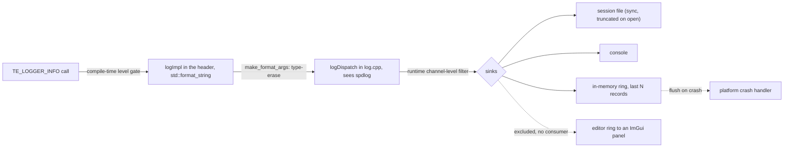

# Logger — Design

> Living design doc. The ADR holds the decision that is hard to reverse. This doc holds the
> *how*.

**Module:** `base` (a dependency-free leaf) · **Kind:** utility · **Status:** active
**ADRs:** **[[ADR-011 — Diagnostics (Logger & Assert)]] holds the decisions** ·
[[ADR-005 — v2 tech stack & toolchain]] (spdlog) ·
[[ADR-006 — v2 core architecture & module layout]] §5 §6
**Sprint:** [[2026-08 Sprint 02 — Base Foundation]], S2-T2 and S2-T3 ·
[[2026-08 Sprint 03 — M1 Enablers]], S3-B1 (bring-up) ·
[[2026-08 Sprint 04 — M2 Concurrency & Serialization]], S4-T3 (sink registration)

## Purpose

Structured, low-overhead logging for the whole engine. It wraps **spdlog**, because
rebuilding logging infrastructure is not a good use of this project's time.

It fixes four v1 findings:

- **F20**: log lines carried no call-site information.
- **F10**: there was no logging or assert strategy at all.
- **F16**: the logger was modelled as a System.
- **F4**: logger globals were duplicated across modules. v2's static-link-once layout removes
  that by construction.

## Decided

Every row below is frozen in [[ADR-011 — Diagnostics (Logger & Assert)]]. The section
reference is given and the rationale is not copied. Go to the ADR for the *why*.

| Decision | Where |
|---|---|
| The seam is **`std::format` in the header, with spdlog private to one `.cpp`**. No third-party header in `base`'s public surface. | ADR-011 §1 |
| `spdlog::spdlog` is `LIBS_PRIVATE` on `te_base`. `glm` stays PUBLIC. | ADR-011 §1 |
| Format strings are checked at compile time through `std::format_string`, with **positional arguments** `{0} {1}`. They are never mixed with bare `{}`. | ADR-011 §1 |
| The happy path allocates nothing. `vformat_to` writes into a stack buffer, and overflow truncates with a marker. | ADR-011 §1 |
| Channels are **module-owned handles**, registered explicitly from the composition root. The module tag is itself a handle, so there is **no enum in `base`**. | ADR-011 §2 |
| An unknown channel falls back to the default channel. Before init, output goes to **stderr**. | ADR-011 §2 |
| `LogRecord` reaches sinks structured. The sinks are console, a session file, and an in-memory ring. | ADR-011 §3 |
| The log file is **one file, truncated on open**. No rotation, and no stale runs. | ADR-011 §3 |
| The file sink is **synchronous**. Async is a later change behind the façade. | ADR-011 §3 |
| The editor ring-buffer sink is **excluded**, because there is no consumer yet. | ADR-011 §3 |
| Each config has a compile-time level gate. Trace is off in RelWithDebInfo. Trace and Debug are off in Release. | ADR-011 §4 |
| The frame stamp is **pushed by `app`**. `base` holds no `Clock` reference. | ADR-011 §9 |
| Diagnostics state is process-global by design, and it is **not** a service locator. | ADR-011 §8 |
| SDK exposure is **deferred** to the scripting ADR. | ADR-011 §10 |

**Still owned by this note, rather than by the ADR:**

- The macros capture `std::source_location::current()`, so file, function and line come free.
  That is F20's fix.
- Every macro is wrapped in `do { … } while(0)`, so it cannot break a surrounding `if`/`else`.
  That is part of F10.
- The per-level macros `TE_LOGGER_TRACE`, `DEBUG`, `INFO`, `WARN`, `ERROR` and `CRITICAL`.
- The header's fallback when `TE_LOG_ACTIVE_LEVEL` never arrives, which only a TU that includes
  `Log.hpp` without linking `base` sees: Info under `NDEBUG`, else Trace. RelWithDebInfo lands
  on Info there, one step quieter than the linked gate gives it. S5-P2, `0ac1a9b0` (#66).
- The per-TU `TE_LOG_CHANNEL`, and the `_CH` escape hatch. Both are below.
- Math formatters live with math, not here (ADR-006 §6).
- The level-usage table below.

## Design

### The seam (ADR-011 §1)

The public `base/log.hpp` exposes the macros, `Level`, `LogChannel` and **`std::format`**. It
does not expose spdlog, and it includes no third-party header at all.

The call site type-erases its arguments into `std::format_args`. Those go to a **non-template**
`logDispatch(...)` in `log.cpp`, which is the only translation unit that sees spdlog. It
formats into a stack buffer, then routes.

So spdlog only ever receives a **pre-formatted string**. It is our sink and router. It is not
our formatter.

> **Superseded sketch.** This note once described `fmt` in the header with spdlog kept
> private. That pair is **not buildable**. spdlog's bundled fmt (11.1.3) lives inside spdlog's
> own include tree, so putting `fmt` in a public header forces `spdlog::spdlog` to be PUBLIC.
> See ADR-011 §1 and its *Alternatives*.



### Channels are module-owned handles (ADR-011 §2)

`base` owns the *mechanism*. It does not own the channel list.

An enum in `base` listing `render`, `net` and the rest would make the bottom leaf know about
the modules above it. That is F3 and F12.

So each module registers its own channel and gets back a `LogChannel` handle, which is a small
integer. Nothing hashes a string per call, and the per-channel runtime level is an array
index.

The **module tag is a registered handle too**, not an enum. That gives two levels of
filtering: first by module, then by channel.

**Registration is explicit, and the composition root invokes it.** A file-scope static
initializer is the obvious alternative, and it does not work here. Everything is a static
library, so the linker strips a translation unit whose only purpose is an initializer.
Rationale in ADR-011 §2.

**Registered names are stored by pointer, never copied.** So pass a string literal or a
static. The table sizes are fixed and nothing allocates. On overflow, registration falls back
to the default channel and writes one line to stderr. It never resizes.

### Bring-up is one scope at the composition root (S3-B1)

`DiagnosticsScope` lives in `engine/app/src/diagnostics/Diagnostics.cpp`. Its constructor
calls `initLogging()` and its destructor calls `shutdownLogging()`. `run()` constructs it
first.

Both `main()` functions are just `return TechEngine::run();`, so no executable touches
diagnostics directly.

It is RAII over an init/shutdown pair because `run()` will grow early returns, and an early
return must not skip the shutdown.

**Nothing is registered yet.** No module tag and no channel. Nothing reads one, and the
editor's old `"editor"` handle was discarded at the call site. The first module that wants a
channel brings the tag with it. That is also when ADR-011 §2's per-module registration entry
point gets written.

> **The state is process-global, not scope-local.** Building a second `DiagnosticsScope` while
> the first is alive initializes nothing. But that second scope's destructor tears logging
> down for both of them.

**Coverage.** `TechEngineAppTests` is the only suite that calls `initLogging()`, so it is the
only one that exercises `spdlogSink` and the session file. That was S2-T3's residual, and it
closes here.

There is exactly **one** case, deliberately. `logs/techengine.log` is a fixed relative path,
so a second writer would race it under `ctest -j`.

That case builds a second scope on purpose. The file truncates on open, so a first line that
survives is the only observable proof that `shutdownLogging()` never fired.

> **That case rests on an unstated assumption.** It reads `logs/techengine.log` relative to
> whatever working directory ctest hands the executable. Today that is
> `catch_discover_tests`' default, the module's binary directory. It is green on all four
> legs, so the assumption holds.
>
> Adding a `WORKING_DIRECTORY` to `cmake/techengine_test.cmake` would break it. The failure
> would surface as a missing file, which reads like a dead sink rather than a moved path.

### The call site picks its channel (S2-T3)

A translation unit defines `TE_LOG_CHANNEL` **before** it includes `Log.hpp`. If it is unset,
the channel is `DEFAULT_CHANNEL`.

One channel per translation unit is the intended shape. That is why the plain macros carry no
channel argument at the call site. `TE_LOGGER_<LEVEL>_CH(channel, …)` is the escape hatch, for
the occasional cross-cutting line.

```cpp
#define TE_LOG_CHANNEL kRenderChannel
#include <TechEngine/base/diagnostics/Log.hpp>

TE_LOGGER_INFO("swapchain {0}x{1}", w, h);      // → render
TE_LOGGER_WARN_CH(kNetChannel, "peer {0}", id); // → net, by exception
```

> Defining `TE_LOG_CHANNEL` *after* the include is a redefinition. The header's fallback has
> already claimed the name. The ordering is the gotcha here, not the macro itself.

### The structured record keeps editor filtering clean

The editor sink stores **records**, not strings. A filter then reads a field, and nothing ever
re-parses a rendered line.

A record is `{ time, frame#, level, channel (plus module), file, function, line, message }`.

The file and console sinks flatten a record into a line. The editor keeps the struct.

The record carries **handles**, not names. Sinks resolve them through `logChannelName()` and
`logModuleName()`. An out-of-range handle resolves to `default` rather than indexing off the
end of the table.

### Sinks (ADR-011 §3)

- **Console and session file.** The file is `logs/techengine.log`, **truncated on open** and
  written **synchronously**. One spdlog logger covers both, with pattern `%^%v%$`, because our
  own line already carries the time and level. So a record is flattened exactly once. A log
  file that will not open degrades to console-only rather than failing the boot (S2-T3). There
  is **no rotation** (S2-T5): one run per file, and the previous run is discarded. That also
  means no size cap is needed, and the ring below is the thing that is bounded.
- **In-memory ring** of the last N *records*, flushed by the crash path. It **lands with
  S2-T5**, not T3, because the assert flush-on-fail path is its only consumer
  ([[Planning Workflow — Artifact Gate]]).
- **Flush-on-crash hook.** The crash handler lives in `platform`, and it is **not** a sink.
  Minidumps and symbolication are out of scope here. ADR-008 §3 gives `runtime` Debug and
  Release only, and pre-authorizes RelWithDebInfo for that work later.
- **Editor console.** Parked until an editor exists (ADR-011 §3). It would be a lock-free ring
  feeding an ImGui log panel, the twin of the [[Profiler — Design|Profiler]] panel.
- **Registration is fallible and the boot path says so** (S4-T3). The table is a fixed 8 slots,
  so `addLogSink` returns `false` on a full table or a null sink. `initLogging` checks it and
  prints to stderr, because a `false` there means the console and file sink never registered and
  nothing else would report it. `shutdownLogging` discards `removeLogSink`'s bool through an
  explicit `(void)`: a sink already gone is the end state it wanted. What that `bool` should
  have *been* is the open [[Backlog]] § *etc* entry on `CONVENTIONS.md`'s Error handling row.

### The rendered format (file and console)

```
[14:32:07.412][f 1043][client/render][renderer.cpp:88:renderScene()][INFO] swapchain 1920x1080
```

The format string lives in `Log.cpp` (S2-T3):
`[{0:02}:{1:02}:{2:02}.{3:03}][f {4}][{5}/{6}][{7}:{8}:{9}()][{10}] {11}`

**The field order is the contract**, because a grep reads positionally. The spacing is not.

**The rendered line is ASCII only**, including the truncation marker `...[truncated]`. Without
`/utf-8`, MSVC re-encodes a non-ASCII literal into the system codepage. Nothing in the suite
asserts on those bytes, so that corruption would go unnoticed.

The call site renders as **`file:line:function()`**. `source_location::function_name()`
returns the whole signature on MSVC, such as `void __cdecl renderScene(void)`. So the
dispatcher trims it down to the identifier, and the sink adds the `()` back. ADR-011 §3's
example predates that trim, so the layout shown there is illustrative rather than a frozen
decision.

The timestamp is wall-clock time plus the **engine frame number**. The frame number is what
lets a log line be lined up against a profiler capture of the same frame. It comes from the
`base` Clock.

## Level usage rules

Three questions pick the level: who needs to see it, can it ship, and how often does it fire.
Anything that fires every frame is Trace or Debug. It is never Info or above.

| Level | Use for | Frequency | Shipping |
|---|---|---|---|
| **Trace** | Per-frame or per-entity spam | Very high | Compiled out |
| **Debug** | Dev diagnostics while building a system | High | Compiled out |
| **Info** | Lifecycle and state events, such as a window created, a level loaded, a peer connected | Low | Dev runtime |
| **Warn** | Unexpected but *handled*, and the engine continued. A missing texture fell back, or a frame went over budget. | Low | **Kept** |
| **Error** | An operation *failed* and a subsystem degraded, but the process survives. A shader failed to compile, or an asset is corrupt. | Rare | **Kept** |
| **Critical** | Unrecoverable, about to abort, or data loss. The device was lost, or we are out of memory. | Very rare | **Kept**, and flushed by the crash path |

**Error and Critical are not asserts.** An assert says "this is impossible, it is a programmer
bug", and it has four tiers ([[ADR-011 — Diagnostics (Logger & Assert)]] §5,
[[Assert — Design]]). An Error says "the world did something bad, and we handled it".

A missing file is an Error. A null pointer where null is impossible is an assert.

These rules may move to the root `CONVENTIONS.md` when B4 lands.

## Open questions

**All five of this note's original open questions are closed** by
[[ADR-011 — Diagnostics (Logger & Assert)]]: the seam surface (§1), async against a
synchronous file sink (§3), the shipping minimum level (§4), the channel and module id scheme
(§2), and SDK exposure (§10, deliberately deferred to the scripting ADR).

**`std::format` on Linux/Clang is settled too, by evidence rather than by the ADR.**
`linux-clang Debug` and `linux-clang Release` are required CI legs
(`.github/workflows/ci.yml`), and they have compiled `<format>` on every PR since S2-T2. The
standalone `fmt` fallback that ADR-011's *What would move this decision* held in reserve was
never needed: nothing defines `SPDLOG_FMT_EXTERNAL`, and `cmake/deps.cmake` fetches no `fmt`.
The exit trigger stays written in the ADR, unfired.

**`<format>`'s compile-time cost is measured, and it is not the Logger's to carry.** Closed at
S4-T1 on 2026-08-29.

`Log.hpp` includes `<chrono>` for `LogRecord`'s timestamp, and `<chrono>` already contains the
whole of `<format>`. Adding `<format>` after `<chrono>` changes the preprocessed line count by
zero, on MSVC and on libstdc++ alike. So `FormatString.hpp` costs this header nothing that
`<chrono>` was not already spending. Numbers in [[B3 — Build & Testing Notes]] §
*`<format>` header weight*.

The result reversed the formatter-header split in [[Math — Design]] and [[StringId — Design]],
which had both been justified by this note's unmeasured question.

## References

- **[[ADR-011 — Diagnostics (Logger & Assert)]]**: the decisions
- [[ADR-005 — v2 tech stack & toolchain]] ·
  [[ADR-006 — v2 core architecture & module layout]] §5 §6
- [[Assert — Design]]: shares the seam and the fail-to-log path
- [[Clock — Design]]: the source of the `[f N]` stamp, pushed by `app` (ADR-011 §9)
- [[v1 Code Audit]]: F20, F10, F16, F4
- [[Profiler — Design]]: the sibling utility. It shares the editor-panel and frame-number
  patterns.
