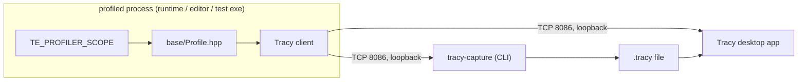

# Profiler — Design

> Living design doc. **Status: accepted** (2026-08-02) — the decision froze in
> [[ADR-013 — Profiler (Tracy-backed instrumentation)]] (S3-D1). Build to it.
> **ADR = the decision; this doc = the _how_.** *Decided* rows below are §refs — the
> rationale lives in the ADR and is not repeated here.

**Module:** `base` (CPU) · `client` (GPU) · **Kind:** utility (global macros) ·
**Status:** accepted — not yet implemented (Story D)
**ADRs:** [[ADR-013 — Profiler (Tracy-backed instrumentation)]] *(the decision)* ·
[[ADR-006 — v2 core architecture & module layout]] §5 — **its `Profiler` row is superseded
by ADR-013 §9**; the rest of §5 stands
**Consumers:** the app loop (frame marks) · the task-graph executor · render-graph passes
(GPU zones, R1+) · memory tracking (emits into it)
**Sprint:** [[2026-08 Sprint 03 — M1 Enablers]] — S3-D1 (the ADR) → Story D (the code)

## Purpose

Scoped CPU + GPU instrumentation: the **measurement CLAUDE.md requires before any
optimization**, so "correctness → clarity → performance" has an instrument instead of a
hunch. Fixes v1 **F19** (per-frame allocation + string work in the timing path). Gates
**M2's threading ADR** — landing a work-stealing pool without a profiler is optimizing
blind.

## Decided

| Fact | Where |
|---|---|
| Backend is **Tracy**, fetched + `GIT_TAG` pinned; no in-house profiler | ADR-013 §1 |
| The pin is a **wire-protocol lock** — engine tag and desktop-app build must match | ADR-013 §1 |
| The seam is the **macro set**, not a function boundary; Tracy is in the header under `TE_PROFILE_ENABLED` only | ADR-013 §2 |
| Client **in-process**, consumer **out-of-process** (Tracy desktop app / `tracy-capture`). No `TracyServer` in our build | ADR-013 §3 |
| In-editor panel **deferred to T1**, three routes still open | ADR-013 §3 |
| `TE_PROFILE` CMake option, **default OFF**; profiled builds are a preset | ADR-013 §4 |
| Shipping builds cannot ship the socket — the client is never compiled | ADR-013 §4 |
| Sanitizer legs stay `TE_PROFILE=OFF` | ADR-013 §4 |
| Tracy carries its own timer; the profiler never reads `Clock` | ADR-013 §5 |
| Overhead: **zero** compiled out; **< 5%** frame-time delta compiled in | ADR-013 §6 |
| **No runtime-named / transient zones on a per-frame path** — names are literals | ADR-013 §6 |
| Memory tracking rides the profiler: global `new`/`delete` replacement in `app`, plus each dep's allocator hook | ADR-013 §7 |
| GPU zones live in **`client`**, not `base`, and land with the render graph | ADR-013 §8 |
| The Profiler is a **utility** (global macros), not an injected service | ADR-013 §9 |

## Design

### Topology



### Surface

| Macro | Module | Wraps |
|---|---|---|
| `TE_PROFILER_SCOPE(name)` | `base` | `ZoneScopedN` |
| `TE_PROFILER_FUNCTION()` | `base` | `ZoneScoped` |
| `TE_PROFILER_FRAME()` | `base` | `FrameMark` |
| `TE_PROFILER_ALLOC(p, n)` / `TE_PROFILER_FREE(p)` | `base` | `TracyAlloc` / `TracyFree` |
| `TE_PROFILER_GPU_CONTEXT()` / `_GPU_ZONE(name)` / `_GPU_COLLECT()` | `client` | `TracyGpuContext` / `TracyGpuZone` / `TracyGpuCollect` |

Every macro expands to nothing without `TE_PROFILE_ENABLED`, and `base/Profile.hpp` then
includes no third-party header. Zone names are **string literals** — the macro's whole cost
model is the `static constexpr` source-location record it emits at the call site.

### Where the zones go

Instrumentation policy, not a frozen decision — Story D fills this in as each site lands:

| Site | Zone |
|---|---|
| `app`'s frame loop (`engine/app/src/App.cpp:20-42`) | `TE_PROFILER_FRAME()` once per iteration |
| Each phase (`Input → FixedUpdate → Update → PostUpdate → Present`) | one scope per phase — [[Game Loop — Frame Flow]] |
| Task-graph levels + each task | one scope per task, name from the task — [[Task Graph — Execution Flow]] |
| Render-graph passes | a GPU zone pair per pass, R1+ |

A system born with zones is free; adding them to twenty written systems is a sweep
([[Roadmap]] § *Why this shape*) — which is why this lands at M1 and not at the first perf
pass.

### Profiling workflow

```bash
cmake --preset windows-profile
cmake --build --preset windows-profile
```

Run the exe, then launch the Tracy desktop app **of the pinned release** and connect to
`localhost`. For a capture to keep, run `tracy-capture -o run.tracy` before starting the
exe. Both tools are downloads from the Tracy release — neither is built here.

## Open questions

- **The T1 panel** — embed `TracyServer`/`Worker`, a native panel fed by our own frame-time
  ring, or nothing beyond the desktop app. ADR-013 §3 keeps all three open and names the
  cost of the first; decide with T1's information, not now.
- **Transitive OS headers.** Five Tracy client headers were checked and pull no OS header
  (ADR-013 § Context); the rest of the set was not. The first `TE_PROFILE=ON` build settles
  it — a `min`/`max` breakage in an unrelated module is the tell.
- **Zone granularity per task.** One zone per task is the starting point; whether that is
  too fine once the executor runs thousands of small tasks is a measurement Story D takes,
  against §6's budget.

## References

- [[ADR-013 — Profiler (Tracy-backed instrumentation)]] — the decision, its alternatives,
  and what would move it
- [[ADR-011 — Diagnostics (Logger & Assert)]] §1 — the façade precedent this note **does
  not** copy, and ADR-013 §2 says why
- [[Clock — Design]] — unaffected; its profiler-resolution question is dissolved by §5
- [[Game Loop — Frame Flow]] · [[Task Graph — Execution Flow]] — the phases and levels the
  zones wrap
- [[v1 Code Audit]] — F19 (per-frame alloc / string work in timing)
- Code: *(none yet — Story D)*
