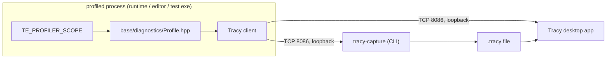

# Profiler — Design

> Living design doc. **Status: accepted** (2026-08-02). The decision froze in
> [[ADR-013 — Profiler (Tracy-backed instrumentation)]] at S3-D1. Build to it.
>
> The ADR holds the decision, this doc holds the *how*. The *Decided* rows below are section
> references. The rationale lives in the ADR and is not repeated here.

**Module:** `base` (CPU) · `client` (GPU) · **Kind:** utility (global macros) ·
**Status:** accepted. Build wiring (S3-T3), CPU macros (S3-T4), memory tracking (S3-T5) and
the overhead number (S3-T6) have landed. GPU zones are owed by R1.
**ADRs:** [[ADR-013 — Profiler (Tracy-backed instrumentation)]] *(the decision)* ·
[[ADR-006 — v2 core architecture & module layout]] §5, whose **`Profiler` row is superseded
by ADR-013 §9**. The rest of §5 stands.
**Consumers:** the app loop (frame marks) · the task-graph executor · render-graph passes
(GPU zones, R1 onwards) · memory tracking (emits into it)
**Sprint:** [[2026-08 Sprint 03 — M1 Enablers]], S3-D1 for the ADR, then Story D for the code

## Purpose

Scoped instrumentation for CPU and GPU work.

CLAUDE.md requires a measurement before any optimization. This is the instrument that makes
that possible, so "correctness, then clarity, then performance" rests on a number instead of a
hunch.

It fixes v1's **F19**, which was per-frame allocation and string work sitting in the timing
path itself.

It also **gates M2's threading ADR**. Landing a work-stealing pool without a profiler is
optimizing blind.

## Decided

| Fact | Where |
|---|---|
| The backend is **Tracy**, fetched with a pinned `GIT_TAG`. There is no in-house profiler. | ADR-013 §1 |
| The pin is a **wire-protocol lock**. The engine's tag and the desktop app's build must match. | ADR-013 §1 |
| The seam is the **macro set**, not a function boundary. Tracy is in the header only under `TE_PROFILE_ENABLED`. | ADR-013 §2 |
| The client runs **in-process**, the consumer **out-of-process**, as the Tracy desktop app or `tracy-capture`. No `TracyServer` in our build. | ADR-013 §3 |
| The in-editor panel is **deferred to T1**, with three routes still open. | ADR-013 §3 |
| `TE_PROFILE` is a CMake option, **default OFF**. A profiled build is a preset. | ADR-013 §4 |
| Shipping builds cannot ship the listening socket, because the client is never compiled. | ADR-013 §4 |
| Sanitizer legs stay `TE_PROFILE=OFF`. | ADR-013 §4 |
| Tracy carries its own timer. The profiler never reads `Clock`. | ADR-013 §5 |
| Overhead is **zero** when compiled out. Compiled in, the bar is the **absolute +0.1377 µs per frame**. | ADR-013 §6 *(amended 2026-08-20; was "under 5% frame-time delta")* |
| **No runtime-named or transient zones on a per-frame path.** Zone names are literals. | ADR-013 §6 |
| Memory tracking rides the profiler: a global `new`/`delete` replacement in `app`, plus each dependency's allocator hook. | ADR-013 §7 |
| GPU zones live in **`client`**, not `base`, and land with the render graph. | ADR-013 §8 |
| The Profiler is a **utility** of global macros, not an injected service. | ADR-013 §9 |
| The unnamed frame stream has one owner; simulation and main instrumentation cannot interleave into render frames. | [[ADR-019 — Fixed simulation ticks, render interpolation and shared clock]] §6, Accepted |

## Design

### Topology



### Surface

| Macro | Module | Wraps |
|---|---|---|
| `TE_PROFILER_SCOPE(name)` | `base` | `ZoneScopedN` |
| `TE_PROFILER_FUNCTION()` | `base` | `ZoneScoped` |
| `TE_PROFILER_FRAME()` | `base` | `FrameMark` |
| `TE_PROFILER_FRAME_NAMED(name)` | `base` | `FrameMarkNamed(name)` |
| `TE_PROFILER_ALLOC(p, n)` and `TE_PROFILER_FREE(p)` | `base` | `TracySecureAlloc` and `TracySecureFree` |
| `TE_PROFILER_GPU_CONTEXT()`, `_GPU_ZONE(name)`, `_GPU_COLLECT()` | `client` | `TracyGpuContext`, `TracyGpuZone`, `TracyGpuCollect` |

Without `TE_PROFILE_ENABLED`, every macro expands to nothing and the header includes no
third-party header at all.

Zone names are **string literals**, always. The macro's entire cost model is the
`static constexpr` source-location record it emits at the call site. A runtime name throws
that away.

**The header is at `engine/base/include/TechEngine/base/diagnostics/Profile.hpp`**, not at
ADR-013 §2's `base/Profile.hpp`.

It moved twice, with a reason each time. It landed in `base/profiler/` at S3-T4, under
`CONVENTIONS.md` → *Headers* as that rule then stood: one folder per design note. At S3-T5 the
rule relaxed to one folder per subject area, so it moved to `diagnostics/`. The profiler is
instrumentation, and instrumentation is what a reader opening `diagnostics/` is already looking
for.

The ADR keeps its original text either way. That is the same refinement precedent as `dt`
becoming `deltaTime`.

**The memory pair forwards to Tracy's *secure* variants**, not to ADR-013 §7's `TracyAlloc`
and `TracyFree`.

`TracySecureAlloc` and `TracySecureFree` pass `secure = true`, which gates the record on
`ProfilerAvailable()`. That check earns its place here. A global `operator new` replacement
fires during CRT static initialization, so it can run before Tracy's own profiler has been
constructed.

The cost is one branch. The non-secure pair has no check at all to fall back on.

This is mechanism rather than decision, so the ADR is not edited. Same precedent as the folder
move above.

### Memory tracking

Landed at S3-T5, in `engine/app/src/diagnostics/MemoryTracking.cpp`.

It replaces **all 20 replaceable forms**: throwing, nothrow, array, aligned and sized. The
`new_handler` loop is honoured, frees are null-guarded, and aligned traffic goes through
`_aligned_malloc` and `_aligned_free` under MSVC, or `std::aligned_alloc` elsewhere.

The ADR left three mechanics open. Here is how each was settled.

| Piece | How |
|---|---|
| **Pull-in** | `app` is a static library, so a translation unit holding only definitions is never linked in. `memoryTrackingAnchor()` is a no-op called from `run()`, and calling it forces the TU to link. ADR-013 §7 named the hazard, and this is the fix. |
| **Sanitizers** | The TU detects ASan and TSan itself, through `__has_feature` and `__SANITIZE_*`, and compiles the replacements out. ADR-013 §4's "OFF on sanitizer legs" is CI policy. This is mechanical, so it holds for any combination of presets. **The cost is that the memory plot is silently absent under a sanitizer.** |
| **Symmetry** | Every `new` form has its matching `delete`, and aligned frees stay on the aligned path. This is what stops §7's asymmetric-delete disconnect from firing. |

**Verified on 2026-08-07.** A `windows-profile` capture shows a live Memory-usage plot, with
the session still intact at frame 120.

The link is clean too. There is **no LNK2005** against `msvcprt.lib`'s own `operator new`,
which was the open question going in.

The witness was a deliberate 12-byte `new` in the loop, since removed. So the capture proves
that the pipe works end to end. It does not prove that any particular library's allocations
are attributed.

### Threaded frame streams (Accepted ADR-019)

**Shipped Sep 11 in `7d2546fc` (#81):** render emits the default frame mark after swap; simulation
emits SimulationTicks when presentation is active and the default mark when headless.
Main emits work/wait zones. Miguel's attended Tracy capture showed render and simulation
progress continuing across `Main.WaitEvents`; the profile preset and focused tests passed.
See [[2026-09-11 Threaded Engine Validation]].
The duplicate-marker findings below describe the pre-migration state.

Checked in the S5-T14 working tree Sep 10: `engine/app/src/App.cpp:56` and
`engine/app/src/SimulationThread.cpp:116` both call `TE_PROFILER_FRAME()`.
`engine/base/include/TechEngine/base/diagnostics/Profile.hpp:12` maps it to unnamed FrameMark.
They therefore contribute boundaries to the same frame set, not one set per thread.
Those intervals mix main and simulation completion spacing; they cannot represent render FPS.

| Composition/lane | Frame boundary and instrumentation |
|---|---|
| Graphical process: render | Sole unnamed FrameMark owner, immediately after each completed swap. Includes work and pacing between swaps, with vsync on or off. |
| Graphical process: primary simulation | Named continuous `SimulationTicks` frame set, marked after each completed tick; a zone surrounds the actual tick work. |
| Headless process: primary simulation | Sole unnamed FrameMark owner, after each completed tick; work zones separate execution cost from idle time. |
| Main thread | Separate zones for event/control work and waiting. No unnamed frame marks. |
| Additional simulations | Per-instance work zones/identity; do not emit into another simulation's frame set. A distinct named set needs a stable name per instance. |

Completion-to-completion intervals measure observed cadence, not simulated fixedDeltaTime.
Catch-up yields several close tick boundaries; the work zones measure each tick's cost.
A render mark after swap does not prove GPU work or physical scanout completed. GPU timing
still needs ADR-013 §8's GPU zones. Clock's diagnostic counter does not drive Tracy numbering.

Add the named marker through the existing TE macro façade, with a no-op OFF path. Keep
frame names stable and pooled; do not allocate/format them per tick. Tracy supports named
secondary sets separately from its default set; see the [Tracy manual, Marking frames](https://github.com/wolfpld/tracy/blob/master/manual/tracy.tex).
Do not mix continuous and discontinuous markers for one named set. Start with continuous
completion markers plus ordinary zones; no start/end frame API is needed for tick costs.

The render-active capture is complete. A headless capture and a forced catch-up capture remain
future profiler verification; neither blocks S5-T17 because its headless and catch-up behavior
is covered by deterministic tests. Check that frame counts match each owner's completions and
main wakes add no default frames when those captures are made.

### Where the zones go

This is instrumentation policy, not a frozen decision. Story D fills it in as each site lands.

| Site | Zone |
|---|---|
| Main and simulation drivers | Current duplicate unnamed markers are documented above; accepted ownership replaces the old single-loop policy. |
| `SimulationThread::advance` | Function and catch-up-batch zones exist. Add a work zone per fixed tick so catch-up cost is visible separately. |
| Simulation input/fixed work and renderer preparation/draw/presentation | Separate scopes on their owning threads; suggested renderer names live in [[Game Loop — Frame Flow]]. |
| Task-graph levels, and each task | One scope per task, named from the task. See [[Task Graph — Execution Flow]]. |
| Render-graph passes | A GPU zone pair per pass, from R1 onwards. |

A system born with zones costs nothing extra. Adding zones to twenty already-written systems
is a sweep ([[Roadmap]] → *Why this shape*). That is why this lands at M1 rather than at the
first performance pass.

### Build wiring

Landed at S3-T3. `TE_PROFILE=OFF` is the default, and it fetches nothing.

| Piece | Where |
|---|---|
| `option(TE_PROFILE … OFF)` | `CMakeLists.txt:16` |
| Tracy `v0.13.1`, with the fetch guarded by `if(TE_PROFILE)` | `cmake/deps.cmake:91` |
| `Tracy::TracyClient` PUBLIC, plus `TE_PROFILE_ENABLED`, on `TechEngineBase` | `engine/base/CMakeLists.txt:36-37` |
| The `windows-profile` and `linux-profile` presets (RelWithDebInfo) | `CMakePresets.json` |

The S3-T3 card expected two pieces of work that the build did not need.

Tracy declares its own include directory as `SYSTEM`, so there is **no manual re-export** to
write, and no CMake 3.25 problem to work around.

CMake emits `-external:W0` alongside `-external:I` on MSVC, so `/W4 /WX` needs **no change**
to `te_warnings`.

### Coverage, said out loud because the automation does not say it

**CI never compiles `TE_PROFILE=ON`.** Not on either leg, not in any config, not on the
sanitizer trio. Everything below follows from that one fact.

| Claim | How it is actually held |
|---|---|
| The macros expand to nothing when OFF. | `App.cpp` and `FrameLoop.hpp` compile the OFF path on all four legs. That much is real. |
| They also do not evaluate their arguments. | One Catch2 case in `engine/base/tests/diagnostics/ProfileTests.cpp`. **That is its whole value.** It is guarded by `#if !defined(TE_PROFILE_ENABLED)`, so it never runs on the ON path. |
| Every call site spells `TE_PROFILER_*` rather than a Tracy name. | A **grep**, not a test. `.github/workflows/ci.yml`'s `check` line bans `ZoneScoped\|ZoneTransient\|FrameMark\|Tracy(Secure)?(Alloc\|Free)\|tracy/` outside `base/diagnostics/`. |
| No transient or runtime-named zones sit on a per-frame path. | The same grep. This is what makes ADR-013 §6's rule structural instead of review-only, and it is **the only** gate on it. |
| The ON path works at all. | A **demo capture at S3-T4 and S3-T5, not a test.** One `windows-profile` run, on one machine, MSVC only. |
| `linux-profile` works. | **Nothing.** It has never been configured and never been built. |

The grep is the honest half. It catches the failure mode that actually matters, which is F19's
runtime-named zone reappearing on a per-frame path, and it does that without compiling Tracy
anywhere. It catches nothing about whether the ON build still links.

**The antidote stays deferred.** It would be one profile leg on ADR-008 §9's nightly schedule,
per ADR-013's *Consequences*.

Its trigger is named here rather than left implicit: **a profile build found broken by someone
trying to use it.** By the time that happens, the cost of the nightly leg has already been
paid once, in a worse currency.

### The overhead number

It lives in [[B3 — Build & Testing Notes]] → *Overhead*, measured at S3-T6 on 2026-08-08.

With Tracy attached, the cost is +0.14 µs per frame. That is **0.0008%** of a 16.6 ms frame.

**That absolute figure is now ADR-013 §6's bar.** §6 originally stated a *ratio*, "under 5%
frame-time delta", and a ratio is not evaluable while the headless loop has almost no per-frame
content: against a 0.02 µs baseline the same measurement reads **+669%**, which describes the
empty loop rather than the profiler. §6 was amended on 2026-08-20 (S3-P1) to the absolute
**+0.1377 µs**, and it stays absolute until M2's task graph and R1's renderer give the ratio a
real denominator.

### Profiling workflow

```bash
cmake --preset windows-profile
cmake --build --preset windows-profile
```

Run the executable. Then launch the Tracy desktop app **of the pinned release** and connect to
`localhost`.

To keep a capture instead, run `tracy-capture -o run.tracy` before starting the executable.

Both tools are downloads from the Tracy release. Neither is built here.

## Open questions

### The T1 panel

Three routes are open: embed `TracyServer` and `Worker`, build a native panel fed by our own
frame-time ring, or add nothing beyond the desktop app.

ADR-013 §3 keeps all three open and names the cost of the first. Decide it with T1's
information, not now.

### Transitive OS headers

**Answered on MSVC, still open on Clang.**

S3-T3's first `TE_PROFILE=ON` build was `windows-profile`, across all 311 targets, with Tracy
included into a `base` `.cpp`. It fired none of the tells: no `min`/`max` breakage in any
module, no warning, and `ctest` came back 73 of 73.

So ADR-013's *Context* caveat, "five headers checked, not the whole set", is discharged for
Windows.

`linux-profile` has **never been configured**, and CI does not build it. The Linux answer is
owed by whoever runs it first. ADR-013's *Consequences* warned about "a second config that can
rot silently", and that risk is live from now on.

### Zone granularity per task

One zone per task is the starting point. Whether that is too fine once the executor runs
thousands of small tasks is a measurement, and Story D takes it against §6's budget.

## References

- [[ADR-013 — Profiler (Tracy-backed instrumentation)]]: the decision, its alternatives, and
  what would move it
- [[ADR-011 — Diagnostics (Logger & Assert)]] §1: the façade precedent this note deliberately
  does **not** copy. ADR-013 §2 says why.
- [[Clock — Design]]: unaffected. Its profiler-resolution question is dissolved by §5.
- [[Game Loop — Frame Flow]] · [[Task Graph — Execution Flow]]: the phases and levels the
  zones wrap
- [[v1 Code Audit]]: F19, per-frame allocation and string work in the timing path
- Code: `engine/base/include/TechEngine/base/diagnostics/Profile.hpp` (the macros) ·
  `engine/app/src/App.cpp` and `engine/app/src/FrameLoop.cpp` (the zones) ·
  `engine/app/src/diagnostics/MemoryTracking.cpp` and `.hpp` (the allocator replacement) ·
  `.github/workflows/ci.yml` (the Tracy-spelling grep) ·
  `engine/base/tests/diagnostics/ProfileTests.cpp` (the OFF-path case) ·
  `cmake/deps.cmake:91` · `engine/base/CMakeLists.txt:36-37` · `CMakeLists.txt:16` ·
  `CMakePresets.json` (build wiring)
