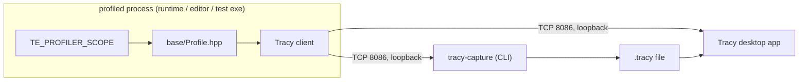

# Profiler — Design

> Living design doc. **Status: accepted** (2026-08-02) — the decision froze in
> [[ADR-013 — Profiler (Tracy-backed instrumentation)]] (S3-D1). Build to it.
> **ADR = the decision; this doc = the _how_.** *Decided* rows below are §refs — the
> rationale lives in the ADR and is not repeated here.

**Module:** `base` (CPU) · `client` (GPU) · **Kind:** utility (global macros) ·
**Status:** accepted — build wiring (S3-T3), CPU macros (S3-T4), memory tracking (S3-T5) and
the overhead number (S3-T6) landed; GPU zones owed by R1
**ADRs:** [[ADR-013 — Profiler (Tracy-backed instrumentation)]] *(the decision)* ·
[[ADR-006 — v2 core architecture & module layout]] §5 — **its `Profiler` row is superseded
by ADR-013 §9**; the rest of §5 stands
**Consumers:** the app loop (frame marks) · the task-graph executor · render-graph passes
(GPU zones, R1+) · memory tracking (emits into it)
**Sprint:** [[2026-08 Sprint 03 — M1 Enablers]] — S3-D1 (the ADR) → Story D (the code)

## Purpose

Scoped CPU + GPU instrumentation: the **measurement CLAUDE.md requires before any
optimization**, so "correctness → clarity → performance" has an instrument instead of a
hunch. Fixes v1 **F19** (per-frame allocation + string work in the timing path). Gates
**M2's threading ADR** — landing a work-stealing pool without a profiler is optimizing
blind.

## Decided

| Fact | Where |
|---|---|
| Backend is **Tracy**, fetched + `GIT_TAG` pinned; no in-house profiler | ADR-013 §1 |
| The pin is a **wire-protocol lock** — engine tag and desktop-app build must match | ADR-013 §1 |
| The seam is the **macro set**, not a function boundary; Tracy is in the header under `TE_PROFILE_ENABLED` only | ADR-013 §2 |
| Client **in-process**, consumer **out-of-process** (Tracy desktop app / `tracy-capture`). No `TracyServer` in our build | ADR-013 §3 |
| In-editor panel **deferred to T1**, three routes still open | ADR-013 §3 |
| `TE_PROFILE` CMake option, **default OFF**; profiled builds are a preset | ADR-013 §4 |
| Shipping builds cannot ship the socket — the client is never compiled | ADR-013 §4 |
| Sanitizer legs stay `TE_PROFILE=OFF` | ADR-013 §4 |
| Tracy carries its own timer; the profiler never reads `Clock` | ADR-013 §5 |
| Overhead: **zero** compiled out; **< 5%** frame-time delta compiled in | ADR-013 §6 |
| **No runtime-named / transient zones on a per-frame path** — names are literals | ADR-013 §6 |
| Memory tracking rides the profiler: global `new`/`delete` replacement in `app`, plus each dep's allocator hook | ADR-013 §7 |
| GPU zones live in **`client`**, not `base`, and land with the render graph | ADR-013 §8 |
| The Profiler is a **utility** (global macros), not an injected service | ADR-013 §9 |

## Design

### Topology



### Surface

| Macro | Module | Wraps |
|---|---|---|
| `TE_PROFILER_SCOPE(name)` | `base` | `ZoneScopedN` |
| `TE_PROFILER_FUNCTION()` | `base` | `ZoneScoped` |
| `TE_PROFILER_FRAME()` | `base` | `FrameMark` |
| `TE_PROFILER_ALLOC(p, n)` / `TE_PROFILER_FREE(p)` | `base` | `TracySecureAlloc` / `TracySecureFree` |
| `TE_PROFILER_GPU_CONTEXT()` / `_GPU_ZONE(name)` / `_GPU_COLLECT()` | `client` | `TracyGpuContext` / `TracyGpuZone` / `TracyGpuCollect` |

Every macro expands to nothing without `TE_PROFILE_ENABLED`, and the header then includes no
third-party header. Zone names are **string literals** — the macro's whole cost model is the
`static constexpr` source-location record it emits at the call site.

**The header is `engine/base/include/TechEngine/base/diagnostics/Profile.hpp`**, not ADR-013
§2's `base/Profile.hpp`. It landed in `base/profiler/` at S3-T4 under `CONVENTIONS.md` →
*Headers*' then-current one-folder-per-**design-note** rule, and moved to `diagnostics/` at
S3-T5 when that rule was **relaxed to one folder per subject area** — the profiler is
instrumentation, which is what a reader opening `diagnostics/` is already looking for. The ADR
keeps its text either way, the same refinement precedent as `dt` → `deltaTime`.

**The memory pair forwards to Tracy's *secure* variants**, not ADR-013 §7's `TracyAlloc`/
`TracyFree`. `TracySecureAlloc`/`TracySecureFree` pass `secure = true`, which gates the record
on `ProfilerAvailable()`; a global `operator new` replacement fires during CRT static init, so
it can run before Tracy's profiler is constructed. One branch, and the non-secure pair has no
check to fall back on. Mechanism, not decision — no ADR edit, same precedent as the folder
move above.

### Memory tracking

Landed S3-T5 in `engine/app/src/diagnostics/MemoryTracking.cpp` — **all 20 replaceable forms**
(throwing · nothrow · array · aligned · sized), `new_handler` loop honoured, null-guarded
frees, aligned traffic on `_aligned_malloc`/`_aligned_free` under MSVC and `std::aligned_alloc`
elsewhere. Three mechanics the ADR left open:

| Piece | How |
|---|---|
| **Pull-in** | `app` is a static lib, so a definitions-only TU is never linked in. `memoryTrackingAnchor()` — a no-op called from `run()` — forces it. ADR-013 §7 named the hazard; this is the fix |
| **Sanitizers** | The TU detects ASan/TSan itself (`__has_feature` / `__SANITIZE_*`) and compiles the replacements out. ADR-013 §4's OFF-on-sanitizer-legs is CI policy; this is mechanical, so it holds for any preset combination. **Cost: the memory plot is silently absent under a sanitizer** |
| **Symmetry** | Every `new` form has its `delete` counterpart, aligned frees kept on the aligned path. This is what keeps §7's asymmetric-delete disconnect from firing |

**Verified 2026-08-07**: a `windows-profile` capture holds a live Memory-usage plot with the
session intact at frame 120, and the link is clean — **no LNK2005** against `msvcprt.lib`'s own
`operator new`, which was the open question. The witness was a deliberate 12-byte `new` in the
loop, since removed: what the capture proves is that the pipe works end to end, not that any
particular library's allocations are attributed.

### Where the zones go

Instrumentation policy, not a frozen decision — Story D fills this in as each site lands:

| Site | Zone |
|---|---|
| `app`'s frame loop (`engine/app/src/App.cpp`) | **landed S3-T4** — `TE_PROFILER_FRAME()` as the loop body's **last** statement, after the pacer, so the mark closes a whole frame instead of splitting one |
| `FrameLoop::advance` (`engine/app/src/FrameLoop.cpp`) | **landed S3-T4** — `TE_PROFILER_FUNCTION()`, plus `TE_PROFILER_SCOPE("FixedSteps")` around the accumulator loop, in **its own nested block** (the two macros declare a fixed-name object; see the header's `GOTCHA`) |
| Each phase (`Input → FixedUpdate → Update → PostUpdate → Present`) | one scope per phase — [[Game Loop — Frame Flow]]; the phases do not exist yet |
| Task-graph levels + each task | one scope per task, name from the task — [[Task Graph — Execution Flow]] |
| Render-graph passes | a GPU zone pair per pass, R1+ |

A system born with zones is free; adding them to twenty written systems is a sweep
([[Roadmap]] § *Why this shape*) — which is why this lands at M1 and not at the first perf
pass.

### Build wiring

Landed S3-T3. `TE_PROFILE=OFF` is the default and fetches nothing.

| Piece | Where |
|---|---|
| `option(TE_PROFILE … OFF)` | `CMakeLists.txt:16` |
| Tracy `v0.13.1`, fetch guarded by `if(TE_PROFILE)` | `cmake/deps.cmake:91` |
| `Tracy::TracyClient` PUBLIC + `TE_PROFILE_ENABLED` on `TechEngineBase` | `engine/base/CMakeLists.txt:32` |
| `windows-profile` · `linux-profile` (RelWithDebInfo) | `CMakePresets.json` |

Two things the S3-T3 card expected and the build did not need: Tracy declares its own
include dir `SYSTEM`, so there is **no manual re-export** (and no CMake-3.25 problem), and
CMake emits `-external:W0` beside `-external:I` on MSVC, so `/W4 /WX` needs **no change** to
`te_warnings`.

### Coverage — said out loud, because the automation does not say it

**CI never compiles `TE_PROFILE=ON`.** Not on either leg, not in any config, not on the
sanitizer trio. Everything below follows from that.

| Claim | How it is actually held |
|---|---|
| The macros expand to nothing when OFF | `App.cpp` / `FrameLoop.hpp` compile the OFF path on all four legs — that much is real |
| …and do not evaluate their arguments | one Catch2 case, `engine/base/tests/diagnostics/ProfileTests.cpp`. **That is its whole value** — it is `#if !defined(TE_PROFILE_ENABLED)`-guarded, so it never runs on the ON path |
| Every call site spells `TE_PROFILER_*`, not Tracy | a **grep**, not a test: `.github/workflows/ci.yml`'s `check` line bans `ZoneScoped\|ZoneTransient\|FrameMark\|Tracy(Secure)?(Alloc\|Free)\|tracy/` outside `base/diagnostics/` |
| No transient / runtime-named zones on a per-frame path | the same grep. This is what makes ADR-013 §6's rule structural instead of review-only, and it is **the only** gate on it |
| The ON path works at all | **demo capture, S3-T4 and S3-T5 — not a test.** One `windows-profile` run, one machine, MSVC only |
| `linux-profile` works | **nothing.** Never configured, never built |

The grep is the honest half: it catches the failure mode that actually matters (F19's
runtime-named zone reappearing in a per-frame path) without compiling Tracy anywhere. It
catches nothing about whether the ON build still *links*.

**The antidote stays deferred** — one profile leg on ADR-008 §9's nightly schedule, per
ADR-013 § *Consequences*. Its trigger, named here rather than left implicit: **a profile
build found broken by someone trying to use it.** When that happens the cost of the nightly
leg has already been paid once, in a worse currency.

**The overhead number lives in [[B3 — Build & Testing Notes]] § *Overhead*** (S3-T6,
2026-08-08): +0.14 µs/frame with Tracy attached — **0.0008%** of a 16.6 ms frame against
ADR-013 §6's < 5%. The finding worth carrying forward is that §6's *ratio* form is not
evaluable while the headless loop has no per-frame content; the absolute figure is what is
checkable until M2's task graph and R1's renderer give it a real denominator.

### Profiling workflow

```bash
cmake --preset windows-profile
cmake --build --preset windows-profile
```

Run the exe, then launch the Tracy desktop app **of the pinned release** and connect to
`localhost`. For a capture to keep, run `tracy-capture -o run.tracy` before starting the
exe. Both tools are downloads from the Tracy release — neither is built here.

## Open questions

- **The T1 panel** — embed `TracyServer`/`Worker`, a native panel fed by our own frame-time
  ring, or nothing beyond the desktop app. ADR-013 §3 keeps all three open and names the
  cost of the first; decide with T1's information, not now.
- **Transitive OS headers — answered on MSVC, still open on Clang.** S3-T3's first
  `TE_PROFILE=ON` build (`windows-profile`, all 311 targets, Tracy included into a `base`
  `.cpp`) fired **none** of the tells: no `min`/`max` breakage in any module, no warning, and
  `ctest` 73/73. ADR-013 § Context's "five headers checked, not the whole set" is discharged
  for Windows. `linux-profile` has **never been configured** and CI does not build it — the
  Linux answer is owed by whoever runs it first, and ADR-013 § Consequences' "second config
  that can rot silently" is live from now.
- **Zone granularity per task.** One zone per task is the starting point; whether that is
  too fine once the executor runs thousands of small tasks is a measurement Story D takes,
  against §6's budget.

## References

- [[ADR-013 — Profiler (Tracy-backed instrumentation)]] — the decision, its alternatives,
  and what would move it
- [[ADR-011 — Diagnostics (Logger & Assert)]] §1 — the façade precedent this note **does
  not** copy, and ADR-013 §2 says why
- [[Clock — Design]] — unaffected; its profiler-resolution question is dissolved by §5
- [[Game Loop — Frame Flow]] · [[Task Graph — Execution Flow]] — the phases and levels the
  zones wrap
- [[v1 Code Audit]] — F19 (per-frame alloc / string work in timing)
- Code: `engine/base/include/TechEngine/base/diagnostics/Profile.hpp` (the macros) ·
  `engine/app/src/App.cpp` + `engine/app/src/FrameLoop.cpp` (the zones) ·
  `engine/app/src/diagnostics/MemoryTracking.cpp` + `.hpp` (the allocator replacement) ·
  `.github/workflows/ci.yml` (the Tracy-spelling grep) ·
  `engine/base/tests/diagnostics/ProfileTests.cpp` (the OFF-path case) ·
  `cmake/deps.cmake:91` · `engine/base/CMakeLists.txt:32` · `CMakeLists.txt:16` ·
  `CMakePresets.json` (build wiring)
