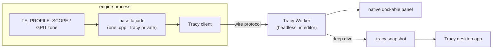

# Profiler — Design

> Living design doc. **Status: draft, pre-ADR** — promoted out of [[Backlog]] 2026-07-27
> (entry-budget tripwire: it had acquired a decided direction + dropped alternatives).
> **ADR = the decision; this doc = the _how_.** No Profiler ADR exists yet, so the
> *Direction* table below is the **interim decision home** — when the ADR lands those rows
> collapse to §refs and the rationale moves there. Same shape as
> [[Task Graph — Execution Flow]].

**Module:** `base` · **Kind:** utility (helper — **service**: stateful, lifecycle) ·
**Status:** draft, pre-ADR
**ADRs:** [[ADR-006 — v2 core architecture & module layout]] §5 *(taxonomy)* — **owes its own ADR**
**Consumers:** memory tracking (emits into it) · renderer / render-graph passes (GPU zones) ·
the ECS scheduler (RAII scopes wrap it, not bolted in)
**Sprint:** **not scheduled** — trigger below

## Purpose

Scoped CPU + GPU instrumentation: the **measurement CLAUDE.md requires before any
optimization**, so "correctness → clarity → performance" has an instrument instead of a
hunch. Fixes v1 **F19** (per-frame allocation + string work in the timing path) by making
zones RAII scopes over `string_view` names with **no `shared_ptr` registry**, ~free when
compiled out. Also **gates the Job-system ADR** — landing a work-stealing pool without a
profiler is optimizing blind ([[Backlog]] → `core` → Job-system / task-graph).

## Direction *(decided, not yet frozen — owed to the Profiler ADR)*

| Call | Why |
|---|---|
| Thin **`base` façade → Tracy backend** | Same shape ADR-011 §1 uses for spdlog: third-party hidden behind a façade in one `.cpp`, no vendor type in a public header. Tracy is best-in-class for frame/zone profiling; writing one is a project, not a task |
| Editor embeds Tracy **`Worker` headless** — **no** Tracy ImGui | Tracy's own UI brings a second ImGui context; ours already exists → context clash. `Worker` is the data layer without the UI |
| Editor draws a **native, simple, dockable panel** over `Worker`'s data | Keeps the editor's look/dock model; we only need frame times + zone tree in-app |
| "Deep dive" = dump a **`.tracy` snapshot** + launch the **Tracy desktop app** | The full analysis UI is native and already written; reimplementing flame graphs is not our project. Not a browser tool |
| **GPU zones** = GL 4.5 timestamp queries, one pair per **render-graph pass** | The graph already has pass boundaries with declared deps, so the seam is free (absorbs the old `client → per-pass GPU timing + overlay` backlog item) |
| **Memory tracking routes through it** | Tracy has first-class memory events/plots, so the panel doubles as the memory dashboard — no second surface ([[Backlog]] → `base` → Memory tracking) |

Dropped: an in-house profiler backend (a project, not a task) · Tracy's bundled ImGui UI
(context clash above).

## Design

### Topology

- **One live consumer** — the `Worker` in the editor. A deep dive is a *snapshot to file*,
  never a second live feed off the same client.
- **Compiled out** ⇒ the macros expand to nothing; no zone objects, no registry, no strings.
- The socket is **off in shipping builds** (see open questions — it is a shipped listening
  socket otherwise).

### Shape (not a spec — impl decides)

RAII scope objects taking `string_view` literals; a GPU zone pair issued by the render
graph around a pass; a frame-mark call from the loop. Nothing returns a Tracy type, and
nothing outside the façade `.cpp` includes a Tracy header — the F11/SDK acid test applies
(`TechEngineSDKSmoke`, [[ADR-008 — v2 build & testing baseline]] §7).

## Open questions (→ Profiler ADR)

- **In-proc vs separate runtime process** — where the profiled sim runs relative to the
  editor's `Worker`; a loopback topology is an ADR-006 §4 composition question, not a
  detail.
- **Tracy version pin** — client and `Worker` share a wire protocol, so the version is a
  lock, not a dependency bump.
- **Socket off in shipping builds** — the mechanism (build option vs config) and what the
  default is.
- **Clock resolution** — whether `steady_clock` is profiler-grade or a raw `platform` timer
  is needed. Inherited from [[Clock — Design]]; measure, don't assume.
- **Overhead budget** — what "~free when compiled out" must measure as when compiled *in*,
  and on which leg it's checked.

## Trigger

**Not Sprint 02** — there is no hot path to measure yet, and building it now fails the
sprint's own pressure test (nothing without a consumer). Lands **just-in-time before the
first perf pass** (renderer / ECS, Sprint 03+); CLAUDE.md's "profiling hook before
optimization" presupposes an optimization pass, which does not exist until then. Also gates
the Job-system ADR — that dependency is a *sequence*, not a schedule.

## References

- [[ADR-006 — v2 core architecture & module layout]] §5 — `Profiler` = helper (**service**),
  RAII scopes wrap the scheduler (fixes F19)
- [[ADR-011 — Diagnostics (Logger & Assert)]] §1 — the façade precedent this copies
- [[Clock — Design]] — time source + the profiler-grade-resolution question
- [[Task Graph — Execution Flow]] — the Job-system ADR this gates
- [[v1 Code Audit]] — F19 (per-frame alloc / string work in timing)
- Code: *(none yet)*
