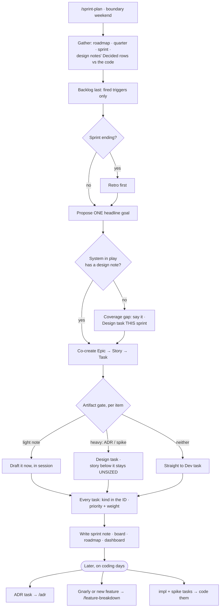

# 🚦 Planning Workflow — Artifact Gate

Where a sprint's work comes from, how an item earns paperwork, and how its tasks get sized
and typed.

Read this at **grooming** and at **sprint planning**. Every call in it is meant to be
deliberate rather than reflex. It is wired into `/feature-breakdown` and `/sprint-plan`.

**These artifacts have two readers: you and Claude.**

An artifact is not just planning paperwork. It is the spec Claude consults before advising
mid-implementation, so that it anchors to the intended end state instead of improvising
(CLAUDE.md rule 2).

That is the gate's real cost and benefit. An artifact chosen here means grounded answers
later. An artifact skipped where one was warranted means Claude guessing the goal on the spot.

So pick deliberately, with both readers in mind.

## Where plans come from

**From design notes. Not from ADRs, and not from the [[Backlog]].**

The note is the entry point at planning. An ADR is opened only when a decision's *rationale*
carries the argument (CLAUDE.md rule 2).

This is not a style preference. An Accepted ADR can hold a clause that has since been
partially superseded, and [[ADR Index]] currently tracks two of them.

The ADR body is frozen and never edited. The design note's *Decided* rows are the reconciled
view. Plan straight off the ADR and you can size a card against a dead clause.

Two sources, in priority order.

| # | Source | Produces |
|---|---|---|
| 1 | **Decided, unbuilt, and it has a consumer now.** That is the delta between a note's *Decided* rows and the code. | Ordinary **Dev** tasks, sized normally |
| 2 | **An open question that blocks source 1** this sprint. | A **Design** task, either an ADR or a note. The story under it stays *unsized*, per the section below. |

`Accepted` already means "build to it" ([[ADR Index]] → *Statuses*), so source 1 is just
reading that delta.

**The consumer clause is load-bearing.** Decided and unbuilt does not automatically mean
wanted. ADR-011 §3's editor ring sink is decided *and* deliberately unbuilt, because nothing
consumes it. That is the same pressure test Sprint 02's Definition of Done used.

An open question with nothing waiting on it earns **no card**. Minting an ADR nobody is
building against is the reflex this stops.

**[[Backlog]] is read last, and only to ask one question: has a trigger fired?** It is a
parking lot, not a menu. It holds wants and never decisions, so nothing can be planned from
it.

### Coverage check: an ADR with no design note

At planning, ask this of every **system** in play: does it have a design note?

If it does not, **that gap is a finding, and it gets said out loud.** Drafting the note is a
Design task *in this sprint*, ordered before the dev work it grounds.

Planning a load-bearing system with no hub is the gate failing. It is not a detail to work
around.

**This applies to systems only.** Process and meta ADRs have no system to design, so they
never trigger it. ADR-004 (fresh start), ADR-009 (branching) and ADR-012 (vault split) are all
in that category.

Today the check fires on ADR-007. The ECS and replication have no note.
[[Game Loop — Frame Flow]] and [[Task Graph — Execution Flow]] cover only the loop and the
scheduler.

## The trap this prevents

There is **no** fixed pipeline running `backlog → ADR → design doc → impl → docs`.

Treating those as five stages that every item marches through is the overkill. They are a
**menu**, picked per item by reversibility and blast radius.

Most items pick none of them, or one.

## Two axes, and they do not merge

- **Breakdown** is Epic → Story → Task, sized to a session. That means 2 to 6 hours, with an
  explicit done-condition.
- **Artifacts** are the ADR, the design note and the docs. They are the paperwork a task
  needs.

The artifacts **are tasks** on the breakdown tree. "Write the Diagnostics ADR" is a task like
any other. They are not a parallel process running beside it.

So type the task first, then apply the gate below.

## The gate

For each item, ask three things. Is there a decision here? How reversible is it? How wide does
it reach?

| Item smell | ADR? | Design note? | Then |
|---|---|---|---|
| Hard to reverse **and** cross-module | ✅ | Maybe | The ADR task comes first, and the **breakdown stops there**. See the section below. |
| Load-bearing but cohesive | ✅, combining related decisions | Fold it into the ADR | One ADR, no separate note. Same stop rule. |
| Non-trivial shape, decision already settled, one module | ❌ | ✅ | Design note, then implementation |
| Reversible, local or obvious | ❌ | ❌ | Straight to an implementation task |

**The bottom row is the default.** Forcing an ADR onto an item that belongs there is the drift
this table guards against.

## Don't size past an open decision

When the gate says **heavy**, meaning an ADR or a note gated on a spike, the breakdown **stops
at that artifact's task**.

The work below it stays a named, roughly-counted story. It looks like
`Story B — Logger impl · ~2–3 tasks · size after ADR-011`. It never becomes tasks with
done-conditions.

Cutting those tasks is part of the artifact task's **own** done-condition.

**Why: a card with a precise done-condition reads as decided.**

S2-T2 was written at planning around an `fmt`-in-header seam. S2-T1 then found that seam
unbuildable, which pushed the design to `std::format` and flipped the frame stamp to a push.
The result was two cards describing work that could not be done as written.

Board cards get read as ground truth mid-session (CLAUDE.md rule 2). So sizing early
*manufactures* the exact stale artifact that `/sprint-plan`'s drift check exists to catch.

An unsized story cannot lie.

**This applies only where the *decision* is open.** Row 3 of the gate, a design note whose
decision is settled, sizes normally. S2-T6 and the Clock were drafted at planning and held,
because the call had already been made. Light artifacts are drafted in session, so the
decision exists before any task gets tagged.

This buys card **accuracy**, not capacity accuracy. The task *count* under a heavy-gated story
is usually about right anyway. So estimate what the story costs. Just do not pretend to know
its cards.

## An ADR **or** a design note, rarely both

An ADR's *Decision* and *Consequences* sections already **are** the design. Split a separate
[[Design Doc Template|design note]] off only in two cases.

- The ADR would **balloon** past its job, which is the decision plus its rationale. Then peel
  the detail out into a note.
- The shape will **churn during implementation**. An ADR only ever gains dated amendments
  ([[ADR Index]] § *Amending an Accepted ADR*), and routine churn is not what that mechanism
  is for. Design notes are living, so the churn belongs there.

So there is exactly one legitimate split. The ADR holds the frozen decision and the why. The
design note holds the mutable working shape.

If a mid-tier item sprouts two *decision* artifacts, that is the alarm.

**Once a system enters implementation, a design note becomes the default.** It serves as the
hub, not as a second home for decisions.

The rule above governs where decisions get *authored*. Recall is a different problem.
Mid-implementation questions need **one entry point per system**, not a hunt across several
ADRs.

So the note's **Decided** section, already in [[Design Doc Template]], is an index. It carries
one-line decision statements plus ADR and section references. It **never** carries copied
rationale, because one fact needs one home or the copies drift.

The lookup flow is: read the design note first, and follow the ADR link only for the why.
[[Task Graph — Execution Flow]] is the reference example.

## Artifact timing: light drafts happen in planning, heavy is a task

When the gate says an item needs an artifact and none exists, decide **when** it gets made.

| Decision weight | When | Becomes |
|---|---|---|
| **Light.** A short note, the call is essentially clear, and no spike or research is needed. | **Drafted in the planning session**, on the boundary weekend | Part of the ceremony, *not* a sprint task |
| **Heavy.** An ADR, or a note gated on a spike or on research. | A **task in the sprint** | Deep or Moderate weight, ordered *before* the story it unblocks. That story stays **unsized**, per *Don't size past an open decision*. |

At planning, **flag every item the gate wants an artifact for and that does not have one.**
Draft the light ones on the spot. Schedule the heavy ones.

Never let implementation start on an item that warranted an artifact and has none
(CLAUDE.md rule 2).

## "Documentation" is not a stage

It is a **Definition of Done checkbox**. Capture the retro, and touch the affected system doc
in place.

There is no separate task and no pipeline stage. Update in place, and prune what has gone
stale, per vault hygiene.

## Task attributes: kind, priority and weight

### Kind, carried in the card ID rather than a tag

There are four kinds. They exist as separate kinds because each behaves differently when
capacity tightens.

| Kind | ID | Blocks | At planning |
|---|---|---|---|
| **Dev** | `S3-T4` | Nothing | Sized normally |
| **Design**, meaning an ADR or a design note | `S3-D1` | The story under it | Ordered **first**, and that story stays *unsized* |
| **Bug**, meaning something misbehaves **now** | `S3-B1` | Nothing | **Taken this sprint.** Either planned in at the boundary, or it *displaces* something if it arrives mid-sprint. |
| **Process**, meaning vault, tooling or CI work | `S3-P2` | Nothing | **First thing cut** when capacity tightens |

**Design and Process look alike and are opposites.** Both read as "🟡 Light docs work" on the
board. But a Design task is on the critical path, and a Process task is the one you sacrifice.
S2-T11 was cut for exactly that reason. An ECS design note never could be.

**Bug is the one kind that must be taken whether or not it was planned.** That is the exact
inverse of Process. There are two entry paths.

- **Known at planning.** It is an ordinary card, sized in with everything else. It displaces
  nothing, because the sprint is being sized fresh around it. The sources are an unfixed `B`
  card carried from the closing sprint, the retro's stale-artifact check, or a
  [[Known Issues]] promotion.
- **Arriving mid-sprint.** It is still taken, but it **displaces** something, and the
  displaced card is **named**. Take the lowest-priority Process card first. Adding it on top
  instead is the refill reflex that the Sprint 01 retro identified as the live burnout risk.

Either way, this is the capacity risk worth counting. A sprint that absorbed three bug cards
did not under-deliver its goal. It silently paid for unplanned work.

**An unfixed `B` card never evaporates at a sprint boundary.** It is either re-planned, or
demoted to a `D<n>` if it turns out to be latent after all.

### Bug against Known Issue

| | **Bug** | **Known Issue** |
|---|---|---|
| Test | It misbehaves **now** | It is latent **and** it would fail **silently** |
| Lives in | A card, because it *is* work | [[Known Issues]], as a `D<n>` |
| Timing | This sprint | No schedule. It rides along, or it blocks planned work. |

**The traffic is one-directional.** A Known Issue **promotes** to a bug card the day its
condition fires, and it is deleted from the list.

Nothing travels the other way. A bug is never "recorded instead of fixed".

A latent defect that would fail *loudly* belongs in neither list. Fix it, or forget it.

The ID is also the branch name, per CLAUDE.md rule 9 and its `<card ID>/<slug>` form. So for a
**Dev** card the kind lands in git history for free. Design and Process cards are vault
commits and take no branch.

**The board carries no kind column.** Kinds live in the ID. A column would be a second home
for the same fact, and it would hide that a Design card is sprint-bound critical-path work.

### Priority + weight

Every task carries **both**, so that the pick matches the day rather than just the sprint.

**Priority** scores value to the sprint goal.

- **P1** is critical path, or goal-blocking.
- **P2** is important, and wanted this sprint.
- **P3** is opportunistic, or nice to have.

**Weight** is the energy it needs, which decides the day type it fits (see the [[Dashboard]]
cadence).

- 🟢 **Deep** is hard design or long focus. It goes on Mon, Thu, or one weekend day.
- 🟠 **Moderate** is solid but bounded work. It goes on Fri.
- 🟡 **Light** is small and low cognitive load, such as docs, config or mechanical work. It
  goes on Tue or Wed.

**The pick rule has an order.** Weight fits the day *first*, so never a 🟢 Deep task on a light
Tuesday. Then take the highest **priority** among what fits.

Every task line carries the tag format `· P1 · 🟢 Deep`.

## Lean model this collapses to

1. **Source the work**, from a design note's *Decided* rows against the code (see *Where plans
   come from*). Read the [[Backlog]] last, and only for fired triggers.
2. **One decision artifact**, where one is owed. An ADR *or* a design note, rarely both, per
   the gate above. Often neither. A light one is drafted in planning. A heavy one becomes a
   **Design** task, and the breakdown stops there.
3. **Implementation.** Always, and Miguel writes it.
4. **Docs.** A Definition of Done line, not a stage.

Every task in steps 2 and 3 carries a **kind** in its ID, plus **priority and weight** as
`· P1 · 🟢 Deep`.

## Running a planning session

`/sprint-plan` is the umbrella ceremony. It **contains** the breakdown and the gate.

The other commands are **triggered out of it**. They are not run in sequence after it.

**Which command when:**

| Situation | Command | Timing |
|---|---|---|
| The gate flagged an **ADR**, which is always heavy and always its own task | `/adr <decision>` | Later, on a deep or moderate day. *Not* inside the ceremony. |
| A **light design note** | None. Use the Design Doc template. | Drafted **with Claude during planning** |
| A **spike** task | None. Just code it. | Its scheduled day. It feeds the artifact afterwards. |
| A story **too big to decompose** inside the ceremony | `/feature-breakdown <feature>` | A dedicated pass, or pre-groom it the week before |
| A **new feature appears mid-sprint** | `/feature-breakdown` | Decompose it in isolation, and park the tasks in the backlog |

**Mental model.** `/sprint-plan` is the whole board. `/feature-breakdown` zooms into one card.
`/adr` executes one decision the gate demanded.
