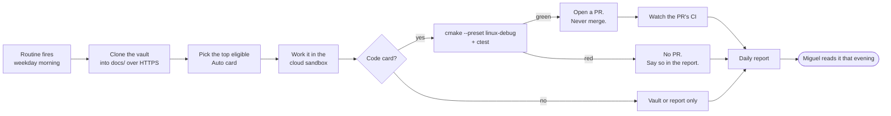

# 🤖 Autonomous Lane — Design

A second execution lane in every sprint. Claude runs eligible cards **unattended in a
claude.ai cloud routine**, on weekdays, while Miguel is at his day job and his PC is off.
Each run leaves a report he reads that evening.

**This note is the lane's only decision artifact. No ADR was cut** (2026-08-30). The lane is
process rather than a system, it is reversible by disabling one routine, and its boundary is a
list rather than an argument.

That puts weight on this note. § *Eligibility* and § *Hard stops* are **normative**, not
descriptive, and there is no second document to check them against.

The lane's interface: [[Autonomous Lane — Routine Prompt]] ·
[[Autonomous Run Report Template]]. Its gate: [[Planning Workflow — Artifact Gate]]
§ *The 🤖 Auto gate*.

Related: [[Technical Lead Charter]] · [[Working with Claude — Operating Guide]] ·
[[ADR-012 — Vault repository split]] · [[ADR-009 — Branching strategy & merge rules]]

## Why

Three sprints in a row closed with calendar left. Sprint 04 met its goal on **day 9 of 14**,
closing 13 cards in 7 working days against a model that sizes 6.5 per week. That is about
1.5x the sizing table.

**The 1.5x is not spare capacity.** The 2026-08-29 health check found the same overrun for
the third review running: two deep evenings each carried 1 🟢 + 1 🟠 + 1 🟡, and Fri Aug 28
closed four PRs on a 🟠 day. Refilling a sprint to 1.5x would make that overrun the plan.

**The finding underneath it is what this lane acts on.** Every overrun was *process* work,
not engine work. Sprint 04 ran **4 Process cards out of 13**, 31% of the sprint. Moving that
class of card off Miguel's days grows the sprint to roughly 17 cards while the attended half
stays at 13.

So the fix is a second lane, not a bigger per-day number. The [[Dashboard]] § *Rhythm*
capacity table does **not** change.

## Decided

| # | Question | Decision | Date |
|---|---|---|---|
| 1 | How far into code does the lane reach? | **Up to and including small bug fixes.** Mechanical work, plus real logic fixes that are small and well scoped. Not design, and not a card the artifact gate routes to an ADR or a note. | 2026-08-30 |
| 2 | Does a cloud run build before it opens a PR? | **Yes. Linux presets plus `ctest`, and a red build opens no PR.** CLAUDE.md's "Miguel compiles" rule is about his ownership of the toolchain, and he is not present in this lane, so the rule has no referent here. | 2026-08-30 |
| 3 | Where does the daily report land? | **A vault note in `docs/07 Journal/`**, falling back to a rolling GitHub issue in the engine repo if a cloud session cannot reach the vault repo. | 2026-08-30 |
| 4 | Does the run get the vault? | **Yes, and it does not clone it.** The routine checks it out as a second `sources` repo, and the session symlinks it to `docs/` as its first act. Proven by the probe; no credential of any kind is involved. | 2026-08-30 |
| 5 | Does the run watch its own PR? | **Yes. It reports whether its PR is failing CI**, not just that it opened one. Mechanism is unsettled, see § *Watching the PR*. | 2026-08-30 |
| 6 | Does the lane inherit the attended entry prompt? | **No. It gets its own.** The attended one assumes a human is present to compile, to decide and to answer a question mid-run. | 2026-08-30 |

**Decision 2 is the one to watch.** It is the first carve-out from a CLAUDE.md rule rather
than an application of one, and it is what makes decision 1 safe. A small logic fix that
nobody compiled is negative value, because Miguel debugs it in the evening he was meant to
spend building.

## Mechanism

**claude.ai routines**, created with `/schedule` (the `RemoteTrigger` API). They execute in
Anthropic's cloud on a cron schedule, so the PC being off is irrelevant.

**Ruled out: `CronCreate` and `/loop`.** Both are session-only and in-memory, and jobs fire
only while the local REPL is idle. The `durable` flag has no effect. Neither survives the PC
going to sleep, which is the whole requirement.

**State as of 2026-08-30: zero routines configured.** The entire cloud path is unproven, so
nothing below has been observed working.



## Watching the PR

Decision 5 says the run reports its PR's CI result. **How is not settled**, and the three
shapes are a real trade rather than a detail.

| Shape | Cost | Report quality |
|---|---|---|
| **Wait in-session**, polling until the checks settle | ~16 min of wall clock the run sits idle | Same-day and complete |
| **Next-day pickup**: open the PR, end the run, and let tomorrow's run read yesterday's result | Free | Lags a day, and a red PR sits unreported overnight |
| **A webhook trigger** on the PR's check failure, firing a second routine that diagnoses it | Free, and it is the shape `RemoteTrigger` already supports | Same-day, and it reacts instead of polling |

**Decided 2026-08-30: none of the three as written. Push early, check late.** The run opens
its PR as soon as the work is green locally, then continues with the rest of its card list,
then reads the PR's checks as its last act before writing the report. CI runs during work the
session was doing anyway, so the wait costs nothing and the report is same-day.

**Floor:** if the checks have not settled by then, the report says so, and the next day's run
reads the result as its first act. A red PR is therefore reported within one day at worst.

The webhook stays the upgrade path if that floor ever gets hit often. It is not worth a second
routine before the first one has run.

## Getting the vault into the sandbox

**A routine's `job_config.ccr.session_context.sources` is an array**, so it checks out more
than one repository. The vault rides the same GitHub authorization the engine repo does, and
no token, PAT or deploy key is involved.

```json
"sources": [
  {"git_repository": {"url": "https://github.com/techattackteam/TechEngine"}},
  {"git_repository": {"url": "https://github.com/techattackteam/TechEngine-vault"}}
]
```

**Proven by the 2026-08-30 probe run.** Both repos land as siblings under `/home/user`, the
engine one arrives with no `docs/`, and `ln -s /home/user/TechEngine-vault docs` makes the
whole vault readable at the path every rule assumes. Auth needed no token: the clones are
https, and a global `url.https://github.com/.insteadOf git@github.com:` rewrite is configured,
so even the ssh-form URL in `CLAUDE.md` resolves. The authorization question is closed.

**The symlink was not safe in the engine tree, and now is.** `.gitignore` held `/docs/`, and a
pattern with a trailing slash matches a directory only. The mount is a *symlink*, so git saw it
as untracked and an auto PR could have committed it. Confirmed by the probe: `git check-ignore`
found no match. The pattern is now `/docs`, and the routine prompt also forbids `git add -A`.

**Considered: make the vault public.** No longer needed, and it was always the weaker option.
It publishes the whole project brain, including the vision and the company intent, which is a
much larger decision than this lane. It also fixes reads only, since pushing the daily report
still needs a credential.

**Closed without a test.** The `workflow` token scope no longer matters, because workflow edits
are outside § *Eligibility*, so the lane never attempts the push that scope would block. A cold
`FetchContent` configure may be slow, but that is a cost to measure on the first runs rather
than a reason to reopen decision 2.

## Eligibility

Lane is **not a new kind**. A Process card run unattended is still a Process card, and the ID
keeps carrying the kind ([[Planning Workflow — Artifact Gate]] § *Task attributes*). Lane
rides the **weight** axis instead, because weight already answers "which slot does this run
in":

`· P2 · 🤖 Auto` joins `🟢 Deep` / `🟠 Moderate` / `🟡 Light`.

**Eligible.** Research and technique evaluation. Vault freshness and drift checks. Backlog
trigger sweeps. CI failure diagnosis. Mechanical code sweeps, of which S4-T2's `detail` to
`internal` rename across 15 files is the model case. Test scaffolding. Small, well-scoped bug
fixes with a green Linux build behind them.

**Not eligible.** Anything the artifact gate routes to an ADR or a design note, because
decisions are Miguel's. Anything touching `.github/workflows/`. Anything whose done-condition
needs a Windows leg, a demo capture or a visual check. Anything on the sprint's critical path,
since an unattended lane cannot be a dependency.

## Hard stops

- **It never merges.** A routine opens a PR and stops. This is not negotiable. #50 merged
  itself the moment its checks went green and carried half its change, because green checks
  cannot see an unstaged file.
- **It never commits to `master`**, in either repo, and it cuts branches as
  `<card ID>/<slug>` from a freshly fetched `origin/master` (CLAUDE.md rule 9).
- **No AI attribution in any commit or PR body** (CLAUDE.md rule 10). This lane is the
  obvious place for that rule to slip.
- **One PR-producing card per weekday, maximum.** See the cost model.

## Cost model

An Auto card costs zero of Miguel's day capacity and is **not free**.

| Cost | Amount | Notes |
|---|---|---|
| PR review | ~15 min each | Real capacity. Budget it on a 🟡 day, not on top of a 🟢 evening. |
| CI, code card | 16.1 billed min | Measured, ADR-008 §9. At one per weekday that is ~320 min/month against the ~2k budget, so about 16%. |
| CI, vault or report card | 0 | Vault commits take no PR, and a docs-only or `.claude/**` PR draws no CI since #54. |

The one-PR-per-day cap exists for the CI row. Prefer report-only and vault cards, which cost
nothing and are also the lowest-risk half of the eligibility list.

## State

**Written, 2026-08-30.** `CLAUDE.md` carries the build carve-out and the HTTPS clone command.
[[Planning Workflow — Artifact Gate]] carries 🤖 Auto on the weight axis and § *The 🤖 Auto
gate*. `/sprint-plan` fills the two lanes separately and adds no board column.
[[Technical Lead Charter]] § *The autonomous lane* carries the exception, and
[[Working with Claude — Operating Guide]] points at it. The interface exists as
[[Autonomous Lane — Routine Prompt]] and [[Autonomous Run Report Template]].

**Probed 2026-08-30**, one-shot, `trig_01LDrC66Jkra1mDkgav4Pevr`, read-only and no CI. The
two-source checkout, the symlink, vault reads and the toolchain are all confirmed. Measured
environment in [[Autonomous Lane — Routine Prompt]] § *The environment, as measured*.

**Four things the probe broke that reasoning had gotten wrong**, all now fixed in the prompt:

| Found | Consequence |
|---|---|
| **There is no `linux` configure preset.** Each config has its own (`linux-debug`, `linux-release`, …), unlike the Windows leg where one covers both. | The prompt's build line was simply invalid. |
| **Both checkouts arrive shallow (50 commits) and on a detached HEAD**, with a stale local `master`. The vault's sat 16 commits behind its real tip. | A naive push is rejected non-fast-forward, and the error reads like an auth failure. Step 2 now re-anchors both repos first. |
| **`.gitignore`'s `/docs/` does not match a symlink.** A trailing slash matches directories only. | An auto PR could have committed the vault mount. Pattern is now `/docs`. |
| **The one-shot fired twice**, 58 seconds apart. | Harmless for a probe. For a PR-opening lane it is two PRs per card. Step 3 is now an idempotency check. |

**Probe 2, same day**, `trig_01Gp38qRCui3rwoNHaXR6DK1`. It confirmed the `.gitignore` fix, and
it closed the two remaining questions with real numbers.

- **The vault push works.** After the re-anchor, `git push --dry-run origin master` returns
  *Everything up-to-date*. Probe 1's rejection was a stale ref, never auth, as suspected.
- **The engine builds and its tests pass**, in **85 seconds** cold: configure 20 s, build 64 s,
  `ctest` 1 s. Build tree 479 MB. The lane's build carve-out costs about a minute and a half,
  not the many minutes `FetchContent` had me worried about.
- **But a cold sandbox cannot build at all until five apt packages are installed.** Configure
  dies at 8 seconds on GLFW's X11 and Wayland headers, and the error names none of them. The
  runner logs `No setup script configured`, so the environment supports a setup script and that
  is the right home for it. The prompt does it meanwhile.
- **`allowed_tools` is not a sandbox.** Probe 2 was created with four read-only tools and used
  `Write`, `ToolSearch`, GitHub MCP tools and `PushNotification` regardless. The lane's safety
  rests on the prompt and on branch protection, never on that field.

**It also found a vault bug that has nothing to do with this lane.** The [[Dashboard]]'s
`Reconciled against` sha, `50ca9360`, does not exist in the current history. The same commit is
now `875991e2`, so `master` was rewritten after the Aug 29 check. The stamp is repointed with
its date unchanged, because repointing is not re-earning. Every engine sha the vault records
from before that rewrite is suspect.

Two things left.

1. **The real routine**, with `clear_mcp_connections: true`. The server attaches Google Drive
   and Claude Code Remote by default, and the lane needs neither.
2. **Sprint 05 fills the Auto lane** at its `/sprint-plan`. The [[Backlog]] is the obvious first
   population: the ccache key, the `App.cpp` coverage exclusion, the
   `FETCHCONTENT_UPDATES_DISCONNECTED` comment and the `<chrono>` measurement all pass the four
   questions.
