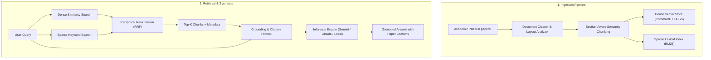

# 🛠️ Version 1 Implementation Plan: Theoretical Research Chatbot (Guidelines)

This document provides architectural, methodological, and practical guidelines for building **Version 1** in Python. Rather than prescribing pre-baked code, it outlines the architectural decisions, document processing strategies, retrieval techniques, and quality gates you will need to implement yourself.

---

## 🎯 Version 1 Objectives & Principles

*   **Primary Objective:** Build a local Python application capable of answering deep theoretical questions about game engine algorithms using the research papers curated in [`05 Research/Research.md`](file:///c:/Users/henry/Documents/Vaults/TechEngine-vault/05%20Research/Research.md).
*   **Guiding Principles:**
    1.  **Zero Hallucination:** The model must state *"I cannot find sufficient evidence in the papers"* rather than improvising mathematical formulas or engine algorithms.
    2.  **Strict Attribution:** Every theoretical assertion must cite the exact paper, section, and page number.
    3.  **Local-First Indexing:** Keep your document parsing, vector indexing, and keyword caching local on disk so you can iterate rapidly without incurring external API latency or costs for storage.

---

## 🏗️ Architectural Flow



---

## Step 0: Environment & Technology Selection Guidelines

### Project Setup
*   **Python Version:** Use Python 3.11 or newer for performance improvements in asynchronous I/O and dictionary operations.
*   **Virtual Environment:** Keep dependencies isolated using `venv` or `uv` to avoid polluting global toolchains.

### Core Libraries & Recommended Stack

Rather than using an oversized all-in-one framework (which obscures retrieval internals), assemble a modular pipeline using targeted, high-performance libraries across each functional layer:

| Layer | Library | Purpose & Trade-Offs |
| :--- | :--- | :--- |
| **PDF Extraction** | **`pymupdf` (fitz)** | High-speed C-backed parsing. Extracts text blocks with bounding-box coordinates (`x0, y0, x1, y1`), enabling column-ordered reading of two-column academic layouts without merging paragraphs. |
| | *Alternative:* `pypdf` | Pure Python fallback; easier to install on restricted environments, but struggles with multi-column flows. |
| **Token Budgeting** | **`tiktoken`** or **`tokenizers`** | Byte-pair encoding tokenizers. Never measure chunks by raw character count; use exact token counters to prevent context window overflow and truncation. |
| | **`regex`** | Advanced Unicode pattern matching for detecting complex academic section headers (`I. INTRODUCTION`, `2.1.3 XPBD Formulation`). |
| **Vector Storage** | **`chromadb`** | Embedded, serverless local vector store backed by DuckDB/SQLite and HNSW. Stores embeddings and metadata with zero network overhead. |
| | *Alternative:* `faiss-cpu` | Meta's dense vector index. Extremely fast for vector search, but requires managing metadata and document mapping manually in a companion file. |
| **Sparse Lexical Search** | **`rank-bm25`** | Clean Python implementation of BM25Okapi. Essential for scoring exact academic terminology (*Chase-Lev*, *PBD*, *XPBD*, *Triton*, *LCRQ*) where semantic embeddings lack precision. |
| **Embeddings** | **`sentence-transformers`** | Runs dense bi-encoders locally on CPU/GPU (`all-MiniLM-L6-v2`, `BAAI/bge-small-en-v1.5`). Free, private, and sub-10ms inference per chunk. |
| **Re-ranking (Optional)** | **`sentence-transformers` (`CrossEncoder`)** | Uses cross-encoders (`cross-encoder/ms-marco-MiniLM-L-6-v2` or `bge-reranker-small`) to jointly score query and candidate chunks after RRF, filtering out borderline false positives. |
| **LLM Inference** | **`google-genai`** | Official modern SDK for Google Gemini models (`gemini-2.5-flash`, `gemini-2.5-pro`). Native support for system instructions, low-temperature sampling, and structured output. |
| | *Alternative:* **`litellm`** | Universal wrapper that provides a unified API across 100+ LLMs (Gemini, Claude, OpenAI, local Ollama), making provider swapping a one-line config change. |
| **Schema & Config** | **`pydantic`** & **`pydantic-settings`** | Validates metadata schemas (`title`, `authors`, `section`, `page`, `domain`) and parses configuration from `.env` files with strict type enforcement. |
| | **`python-dotenv`** | Automatically loads API keys and paths from local `.env` files into environment variables. |
| **CLI & Telemetry** | **`rich`** | Renders live streaming markdown, colored panels, and progress bars directly in the terminal REPL. |
| | **`tqdm`** | Lightweight progress visualization when batch-extracting and embedding hundreds of paper pages. |
| **UI & Evaluation** | **`streamlit`** | Fast web UI for interactive chat with expandable panels to inspect retrieved source chunks and similarity scores. |
| | **`pytest`** | Automated testing framework to execute benchmark questions against the chatbot and assert citation presence. |

### Proposed File Structure (Version 1 Only)

Keep it lean and direct. No micro-packages or premature abstractions—just 4 core files in `src/` to handle ingestion, retrieval, LLM generation, and terminal chat:

```text
techengine-agent/
├── .env                     # API key (GEMINI_API_KEY=...)
├── requirements.txt         # Minimal dependencies (pymupdf, chromadb, rank-bm25, google-genai, rich)
├── README.md                # Quickstart and execution commands
│
├── papers/                  # Your research paper PDFs
│   ├── audio/               # e.g., project_triton_2018.pdf
│   ├── ecs/                 # e.g., essence_of_ecs_2026.pdf
│   ├── multithreading/      # e.g., chase_lev_2005.pdf
│   ├── physics/             # e.g., macklin_xpbd_2016.pdf
│   └── rendering/           # e.g., restir_2020.pdf
│
├── data/                    # Generated by ingest.py (git-ignored)
│   ├── chroma_db/           # Local SQLite + vector embedding store
│   └── bm25_index.pkl       # Pickled BM25 keyword index + chunk metadata
│
├── src/
│   ├── __init__.py
│   ├── ingest.py            # Extracts text from PDFs, chunks by section, and saves to data/
│   ├── retriever.py         # Hybrid search: queries ChromaDB + BM25 and combines with RRF
│   ├── engine.py            # Assembles prompt with citations and calls the LLM
│   └── cli.py               # Interactive terminal chat loop with Rich formatting
│
└── test_queries.py          # Benchmark runner testing the 5 golden verification questions
```

#### Responsibilities per File (v1)
*   **`papers/`:** Raw PDF storage, organized into topic subfolders.
*   **`data/`:** Persistent local artifact directory created when you run `ingest.py`. Contains your vector database and keyword cache.
*   **`src/ingest.py`:** Run once (or whenever you add new papers). Walks through `papers/`, parses pages with PyMuPDF, chunks text by section headers, builds the ChromaDB embeddings, and serializes the BM25 index.
*   **`src/retriever.py`:** Contains your hybrid search class. Given a query string, it asks ChromaDB for semantic neighbors, asks BM25 for keyword matches, merges ranks with Reciprocal Rank Fusion (RRF), and returns the top 4–6 chunks.
*   **`src/engine.py`:** Contains the system prompt, formats retrieved chunks with `[Paper, Section, Page]` headers, and sends the payload to the LLM (Gemini/OpenAI) with temperature set near 0.
*   **`src/cli.py`:** Terminal entry point. A clean loop prompting user input, calling `engine.py`, and rendering the response in markdown with syntax highlighting.
*   **`test_queries.py`:** Verification script with the 5 golden evaluation questions to test accuracy before considering v1 done.

---

## Step 1: Corpus Collection & Organization Guidelines

*   **Folder Structure:** Organize PDFs by technical discipline inside a dedicated `papers/` directory:
    *   `papers/multithreading/` (Ubisoft Euro-Par 2022, Chase-Lev 2005, Blumofe-Leiserson, Taskflow)
    *   `papers/ecs/` (Essence of ECS 2026, Core ECS Concurrency 2025, Chilimbi Cache Layout 1999)
    *   `papers/audio/` (Project Triton 2018, Precomputed Wave 2010, GSound 2011, Rigid Sound 2002)
    *   `papers/physics/` (Müller PBD 2007, SmallSteps XPBD, Rigid body collision)
    *   `papers/rendering/` (Clustered Shading, ReSTIR 2020, Temporal AA)
*   **Filename Convention:** Rename PDFs systematically to make citation tracking effortless:  
    `[primary-author]_[year]_[short-slug].pdf`  
    *(Example: `chase_2005_circular_work_stealing.pdf`, `raghuvanshi_2018_project_triton.pdf`)*.

---

## Step 2: Scientific Document Ingestion & Chunking Guidelines

Academic papers present specific challenges that break standard generic RAG loaders:
1.  **Multi-column text:** Naive line reading merges text from column 1 into column 2.
2.  **Headers and Footers:** Page numbers, journal footers, and copyright notices pollute chunk embeddings.
3.  **Math & Equations:** Splitting chunks blindly mid-equation turns mathematical formulations into nonsense.

### Ingestion Guidelines
*   **Reading Blocks:** Use block-level extraction (e.g. `page.get_text("blocks")` in PyMuPDF) rather than raw text streams. Sort blocks vertically by column (sorting by `x0`, then `y0`) to read columns sequentially.
*   **Filter Artifacts:** Discard blocks that match recurring headers/footers (e.g., matching page numbers, "ACM Transactions on Graphics", "IEEE Conference").
*   **Section-Aware Splitting:** 
    *   Identify section headers (e.g., regex pattern matching `1. Introduction`, `IV. METHODS`, `3.1 Algorithm`).
    *   Attach the current section name as metadata to all subsequent paragraphs.
*   **Chunk Sizing Strategy:**
    *   Target **500 to 700 tokens** (approx. 300–450 words) per chunk.
    *   Use an overlap of **10% to 15%** (approx. 50–75 words) so that context spanning boundary sentences is preserved.
    *   Discard the bibliography / reference section at the end of papers; otherwise, keyword search will heavily retrieve citation lists instead of actual technical explanations.
*   **Metadata Schema:** For every indexed chunk, store:
    *   `paper_title`: Clean title or file slug.
    *   `section`: Current section or heading (e.g., `Section 3.2: Lock-Free Deque Operations`).
    *   `page`: Page number in the PDF.
    *   `domain`: Subfield (`multithreading`, `ecs`, `audio`, etc.).

---

## Step 3: Dual-Index Search Strategy (Dense + Sparse)

Do not rely solely on vector search for low-level systems engineering queries. When a user asks about *"Chase-Lev deque push operation"*, vector embeddings look for semantic equivalents (which might retrieve general thread synchronization), while BM25 will pinpoint the exact paragraph naming *Chase-Lev* and *push*.

### Indexing Guidelines
*   **Dense Store (ChromaDB):**
    *   Use cosine similarity or inner product distance (`hnsw:space: "cosine"`).
    *   Store chunk text and the complete metadata dictionary.
    *   Persist the database to disk (avoid in-memory collections so re-indexing isn't needed on every run).
*   **Sparse Store (BM25):**
    *   Tokenize the extracted chunk texts (lowercase, remove basic punctuation).
    *   Build a BM25 index over the tokens using `rank_bm25.BM25Okapi`.
    *   Serialize the BM25 index and chunk references to disk using `pickle`.

---

## Step 4: Hybrid Retrieval & Ranking (Reciprocal Rank Fusion)

Combine results from dense and sparse search using **Reciprocal Rank Fusion (RRF)**:

### Fusion Formula
For each candidate chunk $d$:

$$RRF(d) = \sum_{m \in \{\text{Dense}, \text{BM25}\}} \frac{1}{k + \text{rank}_m(d)}$$

*   Set the smoothing constant $k = 60$ (standard robust constant in IR literature).
*   Query both indices for top $2 \times N$ candidates (e.g., top 10 from vector, top 10 from BM25).
*   Sum the reciprocals of their ranks.
*   Sort by combined score and take the top $N$ (typically $N = 4$ to $6$).

### Context Assembly Guidelines
*   **Deduplication:** Multiple chunks may come from consecutive paragraphs of the same section. If two chunks are adjacent, merge them or choose the higher-scoring one to maximize diversity of context.
*   **Token Budgeting:** Keep total retrieved context under 3,000–4,000 tokens to ensure the model focuses sharply on the retrieved text without drowning in context.

---

## Step 5: System Prompt Engineering & Grounding Guidelines

Your system prompt dictates the persona, mathematical precision, and hallucination resistance.

### Prompt Construction Principles
1.  **Explicit Authority Boundary:** Instruct the model that its knowledge is restricted *strictly* to the excerpts provided in the context block.
2.  **Mandatory Citation Format:** Instruct the model to cite sources directly after making technical claims:  
    `[Paper: <title>, Section: <section>, Page: <page>]`
3.  **Strict Fallback Behavior:** If the papers do not cover the user's specific question, require the model to state clearly:  
    *"The provided research corpus does not contain enough information to answer this question."*  
    *Rule:* Never allow it to guess or draw from general internet knowledge unless explicitly asked for general intuition.
4.  **Mathematical Integrity:** Mandate that equations be written in standard LaTeX (`$...$` for inline, `$$...$$` for block math).
5.  **Low Temperature:** Set model temperature between `0.0` and `0.2` to eliminate creative divergence.

---

## Step 6: Interface & Developer Experience Guidelines

### CLI Interface Principles (Terminal REPL)
*   **Streaming Output:** Stream tokens as they arrive from the LLM for a responsive feel.
*   **Source Inspection Flag:** Provide an interactive toggle or command-line flag (e.g., `--show-sources` or typing `/sources`) to let the user inspect the exact raw chunks passed to the LLM.
*   **Session History:** Maintain a rolling conversational memory of the last 2–3 turns so users can ask follow-up questions (e.g., *"How does this affect the pop operation instead?"*), but prune older turns to avoid prompt drift.

### Alternative: Lightweight Web Interface
*   If you build a web UI using `streamlit`:
    *   Create a side panel displaying the indexed papers and categories.
    *   Use expandable accordions (`st.expander`) under each chat message to show the retrieved source excerpts and similarity scores.

---

## Step 7: Verification & Quality Gates (Definition of Done)

Before moving on to **Version 2 (C++ Code Generation)**, test your Version 1 implementation against these five verification criteria:

### 1. The Multi-threading Test
*   **Query:** *"Explain the concurrency safety mechanism in the Chase-Lev circular work-stealing deque during concurrent pop and steal operations."*
*   **Expected Pass Criteria:** Explains how the owner thread decrements `bottom` while thieves read `top`, and how a `compare_and_swap` on `top` resolves the single-item race condition. Cites the 2005 SPAA paper.

### 2. The Task Graph Test
*   **Query:** *"What did the Euro-Par 2022 Ubisoft case study conclude regarding static vs dynamic task graph scheduling in game engines?"*
*   **Expected Pass Criteria:** Notes that the frame-to-frame task graph structure remains largely constant across frames, making static or cached scheduling advantageous over pure dynamic overhead. Cites the Euro-Par 2022 paper.

### 3. The ECS Cache Locality Test
*   **Query:** *"Why does an archetype ECS layout yield better cache hit rates during system iteration than sparse-set or OOP hierarchies?"*
*   **Expected Pass Criteria:** Mentions contiguous column packing of component arrays, spatial prefetching, and avoidance of pointer-chasing. Cites Chilimbi 1999 and/or Tasnim 2026.

### 4. The Audio Simulation Test
*   **Query:** *"How does Project Triton achieve real-time wave-based acoustics in complex scenes?"*
*   **Expected Pass Criteria:** Explains offline numerical wave simulation, precomputing acoustic impulse responses, and parametric directional encoding to compress 9D wavefields to ~100MB runtime tables. Cites Raghuvanshi & Snyder 2018.

### 5. The Hallucination / Negative Test
*   **Query:** *"What does the research corpus say about neural network skinning for skeletal meshes?"*
*   **Expected Pass Criteria:** The model **refuses** to invent an answer and confirms that neural skeletal skinning is not present in the ingested research papers.
