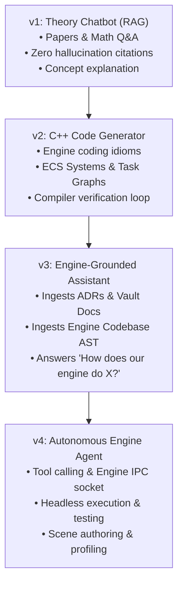
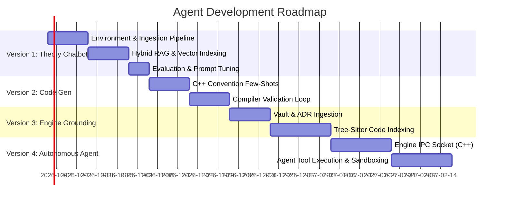

# 🤖 AI Agent Roadmap: From Theory Chatbot to Autonomous Engine Co-Pilot

This roadmap outlines the path from a theoretical research assistant to a fully integrated, autonomous co-pilot for the game engine.

---

## High-Level Vision & Evolution



---

## Phase Matrix

| Version | Focus | Core Capability | Tech Stack (Core) | Input Context | Primary Output |
| :--- | :--- | :--- | :--- | :--- | :--- |
| **v1** | **Theoretical Q&A** | Deep RAG over research papers (Physics, Rendering, ECS, Task Graphs, Audio) | Python 3.11+, ChromaDB, BM25, Gemini / Claude / Local LLM | Research paper PDFs & metadata | Cited academic answers, formulas, trade-off comparisons |
| **v2** | **C++ Code Gen** | Generates engine-compliant, cache-conscious, modern C++20 code | Python, AST parsers, Clang-Format, Tree-sitter | Paper algorithms + Engine code conventions (`B4`) | Compilable C++ structs, ECS systems, task jobs |
| **v3** | **Engine Grounding** | Understands the entire engine architecture, ADRs, scene model, and codebase | Python, Codebase Graph Index (LlamaIndex / LangChain), AST | Vault docs (`03 Architecture`, `04 Design Docs`) + engine `src/` | Contextual architectural advice, navigation, PR reviews |
| **v4** | **Autonomous Agent** | Operates the engine directly via tools, CLI, and editor IPC | Python Agent, JSON-RPC / WebSocket, Engine C++ CLI/Plugin | Live engine state, logs, Tracy profiler traces | Action execution: scene changes, running tests, profiling |

---

## Detailed Version Breakdowns

### Version 1: Theoretical Research Chatbot (The Foundation)
> **Goal:** Create an authoritative, highly technical chatbot that can explain complex game engine algorithms and mathematical formulations based exclusively on the papers in `05 Research/Research.md`.

*   **Capabilities:**
    *   Explain algorithms from foundational papers (e.g., Chase-Lev work-stealing deques, Project Triton wave acoustics, archetype ECS memory layout, PBD/XPBD physics).
    *   Answer theoretical trade-off questions (e.g., *"Why use archetype-based ECS over sparse-set for cache locality according to Chilimbi 1999 and Tasnim 2026?"*).
    *   Provide strict academic citations (Author, Year, Section, Equation numbers).
*   **Architecture:**
    *   **Document Ingestion:** PDF parser extracting text, headers, and KaTeX mathematical notation.
    *   **Hybrid Retrieval:** Dense semantic embeddings (Vector Search) + Sparse keyword search (BM25) with Reciprocal Rank Fusion (RRF).
    *   **Context Grounding:** Re-ranking top chunks, system prompts tuned against hallucination, returning source quotes.
*   **Deliverables:**
    *   CLI Chat interface (Rich terminal) and optional lightweight Web UI (Streamlit).
    *   Ingestion script for papers in `05 Research/Research.md`.
    *   Persistent vector index in `ChromaDB` or `FAISS`.
*   **Quality Gate:**
    *   Passes 15 benchmark questions across Physics, Rendering, Task Graphs, ECS, and Audio with 100% citation accuracy and zero hallucinated math.

---

### Version 2: Engine-Compliant C++20 Code Generator
> **Goal:** Extend the chatbot to translate mathematical paper formulations into production-grade C++20 code conforming to TechEngine standards.

*   **Capabilities:**
    *   Generate ECS systems conforming to `ADR-020` access declarations:
        ```cpp
        // Generates explicit access declarations
        DeclareAccess<Write<Transform>, Read<Velocity>>
        ```
    *   Generate lock-free task graph nodes, work-stealing job structures, and audio DSP loops.
    *   Strict adherence to `03 Architecture/B4 — Code Conventions.md` (no raw pointers for ownership, value semantics, `FixedTick`, cache-friendly struct packing).
*   **Architecture:**
    *   **Few-Shot Prompt Engineering:** Library of canonical engine code examples injected into prompt context.
    *   **Compiler-in-the-Loop Validation:** Agent triggers local `clang` / MSVC syntax check on generated code and feeds compiler errors back to self-correct before presenting to the user.
    *   **Linter & Formatter:** Auto-format with engine `.clang-format`.
*   **Deliverables:**
    *   Code generation prompt templates with AST extraction.
    *   Feedback loop utility (`compile_test.py`) that tests generated snippets in isolation.
*   **Quality Gate:**
    *   10 generated sample systems compile cleanly without warnings under `/W4` or `-Wall -Wextra`.

---

### Version 3: Engine-Grounded Knowledge Assistant
> **Goal:** Connect the chatbot directly to the engine's living codebase and design documentation (Obsidian Vault + Git repository).

*   **Capabilities:**
    *   Answer questions about the specific engine implementation (e.g., *"How does our current Scene graph handle transform propagation across ticks?"*).
    *   Explain design rationale by citing relevant ADRs (e.g., citing `ADR-019` for fixed ticks and snapshot mailboxes).
    *   Identify discrepancies between research paper ideals and current codebase implementation.
    *   Assist in feature design by cross-referencing papers against existing engine modules.
*   **Architecture:**
    *   **Multi-Index RAG System:**
        *   *Index A (Theory):* Academic Papers.
        *   *Index B (Architecture):* Vault Markdown files (`01 Vision`, `02 Roadmap`, `03 Architecture`, `04 Design Docs`).
        *   *Index C (Codebase):* Engine C++ source code (`.hpp`, `.cpp`, `.inl`) indexed with symbol graphs (classes, functions, namespaces).
    *   **Router / Query Decomposer:** Agent detects whether a query is asking about theory, engine specifics, or both, and routes to the right indices.
*   **Deliverables:**
    *   Codebase crawler and AST symbol extractor using `tree-sitter-cpp`.
    *   Vault sync pipeline that detects note changes.
    *   Integrated Chatbot CLI / VS Code extension or web panel.
*   **Quality Gate:**
    *   Accurately answers 20 questions regarding engine subsystems with exact links to source lines and ADR files.

---

### Version 4: Autonomous Engine Agent (Action & Interaction)
> **Goal:** Transform the chatbot into an active co-pilot agent capable of taking actions inside the engine environment.

*   **Capabilities:**
    *   **Scene Authoring:** Spawn entities, assemble archetypes, attach components, and configure hierarchies.
    *   **Test Runner:** Run engine unit test suites (`ctest` / engine test runner) and diagnose failures.
    *   **Profiler Insight:** Connect to Tracy profiler output, parse frame spikes, and suggest optimization passes.
    *   **Git Automation:** Create feature branches, write new components, run tests, and stage clean commits.
*   **Architecture:**
    *   **Agentic Loop:** ReAct (Reason + Act) or OpenAI/Anthropic/Gemini Tool-Calling framework.
    *   **Engine IPC Bridge:** 
        *   Engine exposes a local WebSocket / JSON-RPC server (enabled in debug/editor builds).
        *   Agent sends structured commands (`spawn_entity`, `set_component`, `reload_script`, `pause_sim`).
    *   **Safety Sandboxing:** User approval gates for filesystem mutations and destructive engine actions.
*   **Deliverables:**
    *   Engine C++ remote-control plugin/subsystem (`AgentBridge`).
    *   Python Agent runtime with comprehensive tool schemas.
    *   Interactive CLI & Editor dockable UI panel.
*   **Quality Gate:**
    *   Agent can autonomously create a playable scene with 10 physics entities and 1 movement system from a natural language prompt, execute it, and verify frame budget.

---

## Milestone Timeline & Next Steps



> **Immediate Action:** See [[Implementation plan]] for the exact, step-by-step technical tutorial to build **Version 1** in Python.
